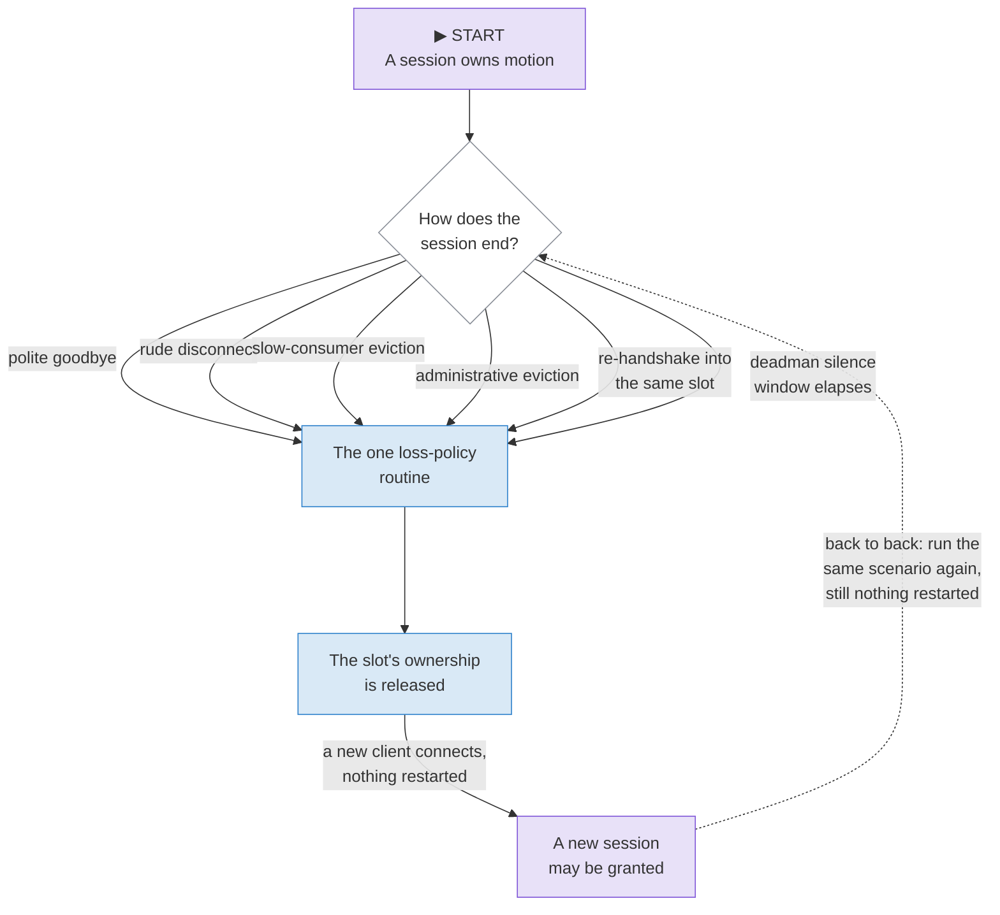

# Local testing

You can test a Valence client or a Valence hub with no machine on the bench.
This page covers the four instruments, and then the one manual pattern that
catches a class of bug none of them reach.

Read the last section even if you skip the rest.

| Instrument | Answers |
|---|---|
| [The simulator](#the-simulator) | Does my client work against a real hub, with no hardware? |
| [The probe](#the-probe) | Does my hub answer a full scripted session correctly? |
| [Golden vectors and the suites](#golden-vectors-and-the-native-suites) | Do my bytes match everyone else's, exactly? |
| [The fuzz harnesses](#the-fuzz-harnesses) | Does any byte string crash my parser? |
| [Back-to-back sessions](#the-pattern-that-is-mandatory) | Does session state actually die with its session? |

## The simulator

`hub/bench` (Valence Bench) is a desktop binary that behaves like a hub.

It is not a mock. It embeds the **real** hub library behind a **real**
WebSocket server speaking the same subprotocol as any conforming hardware
hub. Point a client at it and the client cannot tell the difference: a bug
you find against Valence Bench is a bug in the same code a real hub runs.
Unlike a single machine's own simulator, Valence Bench has no fixed catalog and
no motion engine of its own -- it serves whatever catalog a `.bench` config
file describes, which is what makes it useful for testing a client against
catalog shapes no single hub happens to produce (extra archetypes, alien
channel domains, deliberately slow echoes).

Everything a client can reach goes through the protocol. There is no HTTP
plane at all.

### Build it

```bash
# Any C++20 host toolchain plus CMake and Ninja. On Windows this project
# uses WinLibs GCC; put your compiler on PATH first.
cmake -S hub/bench -B hub/bench/build -G Ninja -DCMAKE_BUILD_TYPE=Release
cmake --build hub/bench/build
```

Dependencies are pinned and fetched by CMake. The binary is statically linked,
so you can copy it anywhere.

### Run it

```bash
bench hub/bench/configs/tiny-axis.bench                 # interactive terminal UI
bench hub/bench/configs/kitchen-sink.bench --headless --duration 30   # scripted, for CI
```

Useful flags: `--port` for the protocol socket, `--headless` for no
terminal UI, and `--duration` to exit after a fixed time. See
`hub/bench/README.md` for the config file grammar and the three
example configs.

### A real device's own simulator

A specific hub implementation may also ship its own device-fidelity
simulator, embedding that machine's real motion engine and real device
catalog behind the same wire protocol. Nucleus's `sim/valencesim` is that
project's own instrument (its own repository, not this one) -- reach for it
when you need to test against one exact machine's behavior rather than the
protocol in general.

### The question only a wire-level simulator answers

A trace tells you whether a hub rendered your motion well. A simulator with
recording (Valence Bench's session log, or a device-fidelity simulator's own
trace) also records **what actually arrived on the wire**, raw values beside
decoded values, at the point of decoding.

That is the other half of the question, and it is the half that finds client
bugs. When a client produces motion that is nothing like what its author
intended while the hub renders faithfully, only the wire content proves
where the fault is. Export the recorded stream and compare it against what
your client believed it sent.

> DEMO-CANDIDATE: an embedded Valence Bench terminal a reader can drive from the
> page, with the raw wire trace scrolling beside it.

## The probe

`tools/valence_probe.py` is a standalone Python client. It runs a scripted
session against a live hub and prints a narrated pass-or-fail transcript.

It is the fastest conformance smoke test for a hub you are writing. It hand
rolls its own encoder against the registry rather than importing the library,
so a hub that passes the probe has agreed with an independent implementation.

```bash
python tools/valence_probe.py --ip <hub-ip> --port <port>
python tools/valence_probe.py --ip <hub-ip> --no-motion      # observe only
python tools/valence_probe.py --ip <hub-ip> --pair           # pairing scenario
```

| Flag | What it does |
|---|---|
| `--ip`, `--port` | Where the hub is |
| `--timeout` | Per-step reply timeout, in seconds |
| `--no-motion`, `--listen-only` | Skip every step that commands motion |
| `--stream <seconds>` | Stream samples on the motion-input channel |
| `--segments <seconds>` | Stream timed segments instead of bare samples |
| `--estop` | Assert a client-side emergency stop, then clear it |
| `--bench-home` | Exercise the bench homing operations |
| `--pair` | Run the pairing and trust scenario instead of the motion session |
| `--pair-state <file>` | Keep the administrator's identity, so a second run reconnects as the same device |

Two practical notes. Motion steps are dropped by the hub's homed gate on an
unhomed machine, which is correct behavior and still proves the whole wire
path — use `--no-motion` when you only want the protocol checked. And point it
at the simulator before you point it at hardware; the transcript is identical.

## Golden vectors and the native suites

A [golden vector](../reference/dictionary.md#golden-vector) is a byte-exact
recorded frame. Every implementation must produce those bytes and decode them
to the same model. There is no room for a variation, because the deterministic
encoding profile means each message has exactly one valid encoding.

**This is why time and randomness are injected.** A conforming library takes
its clock and its random source as parameters, rather than reading the
platform.

Determinism is a conformance requirement, not a testing convenience. Session
ids, boot ids, nonces and timestamps all appear in vector bytes. An
implementation that reads the system clock cannot reproduce a vector, and
therefore cannot prove it agrees with anybody.

The same requirement gives you the
[in-process binding](../reference/dictionary.md#in-process-binding). It
connects a hub and a client inside one process, with injected loss, reorder,
duplication, latency and jitter, plus a seeded mode where a run reproduces bit
for bit.

Behavioral checks run against it: reconnect and reconcile, newest-wins under
reordering, the ready gate, duplicate-intent re-echo, shedding order, deadman
policy per source type, takeover, and emergency stop repeated under heavy
loss.

```bash
# The host suites. Your host C++ toolchain must be on PATH.
pio test -e native
```

<div class="ss-facts" markdown>

| | |
|---|---|
| **Known trap** | The test runner misreports the framework's output. It prints "0 test cases" and can invent a phantom interrupt on failure. |
| **What to trust** | The exit code. Or run the built test binary directly for the real summary. |

</div>

## The fuzz harnesses

`test/fuzz/` holds seven libFuzzer targets, one per parser surface. They prove
[parser totality](../reference/dictionary.md#parser-totality): any byte string
maps to accept-or-reject, with no out-of-bounds read, no unbounded allocation
or recursion, and no undefined behavior.

Both directions are in scope. A client that auto-connects to a discovered
machine parses whatever that machine sends, so a hostile hub must not be able
to crash a conforming client.

### Building and running

The Windows toolchain here has no clang and no libFuzzer, so this gate runs
under WSL2. Build into a Linux-local directory and compile against the repo
over the mount; building on the mount is slow enough to matter.

```bash
# inside WSL, with $R pointing at the repository
mkdir -p ~/fuzz && cd ~/fuzz

for t in fuzz_cbor fuzz_catalog fuzz_frame fuzz_packed \
         fuzz_bundle fuzz_blob fuzz_messages; do
  clang++ -std=c++2b -O1 -g -fno-omit-frame-pointer -Wall -Wextra \
    -Wno-unused-private-field \
    -I $R/lib/valence/include -I $R/test/fuzz \
    -fsanitize=fuzzer,address,undefined -fno-sanitize-recover=undefined \
    $R/test/fuzz/$t.cc -o build/$t
done

# regenerate the seed corpus using the library's own encoders
clang++ -std=c++2b -O1 -g -I $R/lib/valence/include -I $R/test/fuzz \
  -fsanitize=address,undefined -fno-sanitize-recover=undefined \
  $R/test/fuzz/gen_seeds.cc -o build/gen_seeds
./build/gen_seeds corpus

# soak: 600 seconds per target
export ASAN_SYMBOLIZER_PATH=/usr/bin/llvm-symbolizer
export UBSAN_OPTIONS=print_stacktrace=1:halt_on_error=1
bash $R/test/fuzz/run.sh 600 ~/fuzz/build ~/fuzz/corpus ~/fuzz/work
```

**The cheap check, after any change to a decoder** — replay the committed
corpus and mutate nothing:

```bash
./build/fuzz_catalog $R/test/fuzz/corpus/catalog -runs=0
```

Reproducing and shrinking one crash file:

```bash
ASAN_SYMBOLIZER_PATH=/usr/bin/llvm-symbolizer ./build/fuzz_cbor ./crash-<hash>
./build/fuzz_cbor -minimize_crash=1 -runs=100000 ./crash-<hash>
```

### Three rules that are load-bearing

1. **Never assert on decoder semantics.** A decoder rejecting something a
   human thinks is valid is a golden-vector question, not a fuzz finding. Only
   totality invariants are worth asserting, because those are memory-safety
   statements in disguise.
2. **Touch every zero-copy view a decoder returns.** A view that escaped its
   input buffer is only a finding if something reads it. That is how the worst
   bug in the first campaign was caught.
3. **Bound fuzzer-derived indices in the harness, not the library.** Otherwise
   a harness bug and a library finding look identical.

Do not lower the maximum input length in CI. It is large because an
intra-object overflow — a write that stays inside the enclosing struct — is
invisible to AddressSanitizer, and only a long write escapes the object and
gets reported.

The results of the first campaign, and the bugs it found, are on
[Security model and the audit](../understand/security.md).

## The pattern that is mandatory

!!! danger "Two sessions, back to back, with no restart between them"

    Run your scenario. Then run it **again**, against the same running hub,
    without rebooting, reflashing or restarting anything in between.

    This is not optional advice for anything that touches session lifecycle.
    It is the difference between a test that passes and a test that means
    something.

<p class="ss-cap" markdown>Six ways a session can end, one routine that must run every time, and the loop this pattern actually tests.</p>



<p class="ss-point" markdown>**The point.** All six exits share one routine on purpose. A hub that gives even one of them its own shortcut is one exit away from the leaked-ownership bug below. The dashed loop back to the top is the back-to-back-sessions pattern itself: a single pass through this diagram proves nothing, because a reboot between runs would have cleared the leak too.</p>

Here is why it exists.

A hub tracks which session currently owns motion. Ownership was released by
the deadman pump — the code that watches an occupied session slot for silence.
Every other way a session can end resets that slot **first**: a polite
goodbye, a rude disconnect, both kinds of eviction, and a re-handshake into the
same slot.

So the pump had nothing left to watch, and the departed session's id owned
motion **forever**. Every later client was silently refused as a conflict,
until the machine was rebooted.

That bug was invisible to every test run for months. Not because the tests
were weak, but because **each deployment rebooted the device between runs**.
The reboot cleared the leaked ownership before the next test could see it. The
verification method hid the defect it was supposed to find.

The fix was to funnel all six teardown paths through one routine that runs the
full loss policy, identical to the deadman's. The regression test is three
sessions in one process with no restart.

**Apply this to anything session-scoped:** ownership, pending pairing knocks,
idempotency rings, subscriptions, rate-limit buckets, deadman timers. If state
is born with a session, prove it dies with the session, twice in a row, with
nothing restarted in between.

### Three more patterns worth keeping

**Connect while the machine is in a latched state.** Latch an emergency stop,
then connect a fresh client. It must adopt the latch before it can act on user
input. This proves the retained snapshot is seeded at startup rather than only
on the first change — a hub that seeds nothing looks perfect until the first
client connects after a fresh boot.

**Disconnect rudely, not politely.** Kill the socket. Pull the cable. Half of
the teardown paths in a hub are reachable no other way, and transports die
rudely far more often than they say goodbye.

**Run against a mismatched catalog.** Point a client compiled against one
catalog at a hub serving a different one. A conforming client either degrades
with its unverifiable controls suppressed, or refuses and says so. Silent full
operation is non-conformant, and it is the failure mode nobody notices.

## Where to go next

- [Capabilities and custom hardware](../understand/capabilities.md) — the
  checklist your hub is being tested against.
- [Security model and the audit](../understand/security.md) — what the fuzz
  campaign found, and what it does not cover.
- [The Dictionary](../reference/dictionary.md) — every term used here, with
  exactly one definition each.
