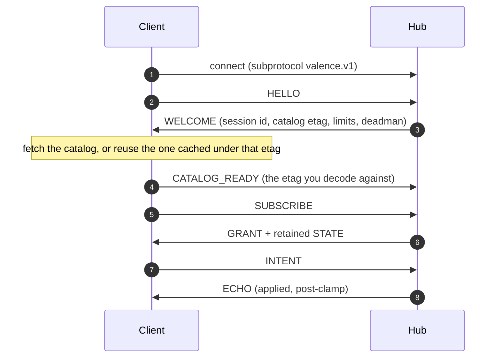

# Quickstart

This page gets you one connected client. It reads live machine state and sends
one command.

Develop against [the simulator](local-testing.md#the-simulator). It embeds the
real hub, the real motion engine and the real catalog, so a client that works
there works on hardware. Nobody's machine has to be in the room.

```bash
valencesim machine --homed --headless --duration 120
```

## The session, in seven steps

Every Valence client does this, in this order.



Steps 1 to 3 identify both parties. Step 4 is the
[ready gate](#the-ready-gate), and it is the one people miss. Steps 5 to 7 are
the working session.

## Python

The [probe](cli.md#the-probe) is import-safe: everything with a side effect
lives under its `main()`. So the shortest honest client imports it as the wire
library and writes only the session.

```python
import os, sys, time, websocket

sys.path.insert(0, "tools")            # the probe is import-safe: use it as the wire library
import valence_probe as ss

ws = websocket.create_connection("ws://127.0.0.1:82/",
                                 subprotocols=[ss.WS_SUBPROTOCOL], timeout=5)


def wait_for(*types, timeout=5.0):
    """Return the next frame of any of `types`."""
    deadline = time.time() + timeout
    while time.time() < deadline:
        got = ss.recv_frame(ws, deadline)
        if got is None:
            break
        hdr, payload = got
        if hdr["type"] in types:
            return hdr, payload
    raise TimeoutError("no %s within %.1fs" % (types, timeout))


# 1. HELLO -> WELCOME
ss.send_frame(ws, ss.FRAME["HELLO"], 0,
              ss.build_hello("demo", "quickstart.py", os.urandom(8)))
_, payload = wait_for(ss.FRAME["WELCOME"])
w = ss.cb_decode_full(payload)
etag = w[ss.K["catalog_etag"]]
print("WELCOME  session=%d  etag=%s  deadman=%dms"
      % (w[ss.K["session_id"]], etag.hex(), w[ss.K["deadman_ms"]]))

# 2. CATALOG_READY: declare the catalog you decode against. Nothing flows before this.
ss.send_frame(ws, ss.FRAME["CATALOG_READY"], 0, etag)
print("CATALOG_READY sent")

# 3. SUBSCRIBE: safety on-change, motion at 20 Hz
ss.send_frame(ws, ss.FRAME["SUBSCRIBE"], 0, ss.build_subscribe([
    (ss.CH_SAFETY, 0.0, ss.PRIORITY["critical"]),
    (ss.CH_MOTION, 20.0, ss.PRIORITY["elevated"]),
]))

# 4. Retained STATE arrives immediately: adopt it, never assume a default.
hdr, payload = wait_for(ss.FRAME["STATE"])
while hdr["channel"] != ss.CH_MOTION:
    hdr, payload = wait_for(ss.FRAME["STATE"])
pos = ss.decode_motion_state(payload)["pos_mm"]
print("STATE    motion pos=%.2fmm" % pos)

# 5. One INTENT, then read the post-clamp ECHO the hub applied.
target = pos + 5.0
ss.send_frame(ws, ss.FRAME["INTENT"], ss.CH_MOVE_INTENT,
              ss.build_intent(ss.CH_MOVE_INTENT, 1,
                              [(1, ss.cb_f32(target)), (2, ss.cb_bool(False))]))
kind, payload = wait_for(ss.FRAME["ECHO"], ss.FRAME["NACK"])
body = ss.cb_decode_full(payload)
if kind["type"] == ss.FRAME["ECHO"]:
    print("ECHO     asked %.2fmm -> applied %s" % (target, body.get(ss.K["applied"])))
else:
    print("NACK     %s" % ss.nack_name(body.get(ss.K["code"])))

ss.send_frame(ws, ss.FRAME["GOODBYE"], 0, ss.build_goodbye(0))
ws.close()
```

Run it from the repository root, against a simulator that is already up:

```text
WELCOME  session=3497637577  etag=0458eec408a43692  deadman=600ms
CATALOG_READY sent
STATE    motion pos=0.00mm
ECHO     asked 5.00mm -> applied {1: 5.0, 2: False}
```

The last line is the whole point. `5.0` is what the hub **applied**, after its
own [clamp](../reference/dictionary.md#clamp). Render that number, never the
one you sent.

> DEMO-CANDIDATE: run this exact script live against an in-browser simulator,
> and highlight each line of output as its frame arrives.

## JavaScript

`clients/js/` is the browser client, and it is a v1.0 reference
implementation. It hides the handshake, including the ready gate, and hands you
events.

```javascript
import { createSession, CH, PRIORITY } from './clients/js/index.js';

const s = createSession({
  host: location.hostname,
  clientKind: 'webui',
  clientName: 'My Valence Client',
  subscriptions: [                     // [channelId, rateHz, priority]
    [CH.SAFETY, 0, PRIORITY.critical],     // on-change, never shed
    [CH.MOTION, 20, PRIORITY.elevated],    // live carriage feed
    [CH.HUB_STATUS, 1, PRIORITY.background],
  ],
});

s.on('welcome', (w) => { /* w.sessionId, w.roles, w.deadmanMs, w.cfgGen */ });
s.on('catalog', (entries) => { /* build UI from the catalog, not from constants */ });
s.on('state', (channelId, sample) => {
  if (channelId === CH.MOTION) render(sample.pos_10um, sample.tgt_10um, sample.flags_bits);
});
s.on('nack', (n) => console.warn('NACK', n.name, n.detail));
s.connect();
```

Field names come from the catalog verbatim, already scaled to millimeters.
Writing is the same shape, and it also resolves on the applied value:

```javascript
const { applied } = await s.sendConfigSet({ 1: windowMinMm, 2: windowMaxMm });
// applied[1] / applied[2] are the DEVICE's clamped values — render those.
await s.sendMove(targetMm);
```

Prove your build against a real hub before you trust it, running the full
read-only session **twice back to back** -- the
[mandatory pattern](local-testing.md#the-pattern-that-is-mandatory) for
anything touching session lifecycle. `clients/js/test/valence-wire.test.mjs`
in this repo proves the wire codec byte-for-byte; a live two-connection
session walkthrough against a real hub is a small script away using the same
`clients/js/` primitives, or reach for `tools/valence_probe.py`.

## The ready gate

!!! danger "Send CATALOG_READY, or nothing works and the reason is invisible"

    The hub gates **both** planes until your session declares which catalog it
    operates against. Before that declaration you get no STATE, no stream, and
    every intent is refused `NOT_READY`.

This is the single thing a client written against an older draft gets wrong.
Here is the same script with one line removed:

```text
WELCOME  session=2929602731  etag=0458eec408a43692  deadman=600ms
CATALOG_READY deliberately NOT sent
STATE    nothing arrived in 2.0s
NACK     NOT_READY
```

No error at connect. No error at subscribe. Just silence, and then a refusal
with a name you have to know to interpret.

The rule exists for safety, not for bookkeeping. A client that has not adopted
the retained [safety latch](../reference/dictionary.md#latch) must not be able
to act. Gating the control plane on the same declaration makes that
impossible rather than merely unlikely.

**What to declare.** Send the [etag](../reference/dictionary.md#etag) of the
catalog you actually decode against.

- If you fetched the catalog, verify its bytes hash to the etag WELCOME
  advertised, then declare that etag.
- If you already had that etag cached, skip the fetch and declare it.
- If you hardcode layouts, like the probe does, declare the hub's etag only
  because it matches what you compiled against. Anything else is a lie the hub
  will believe.

## The rules that come with it

**Adopt, never assume.** Retained STATE arrives on grant. Your first render
comes from the machine. A client that paints defaults on page load, then
corrects itself, has already lied once.

**Render the echo, not the request.** The ECHO carries applied, post-clamp
values. See [ground truth](../reference/dictionary.md#ground-truth).

**Keep talking.** [Liveness](../reference/dictionary.md#liveness-ping) is silence-based, and it is measured on what you
**send**. A pure subscriber is the trap: telemetry pours in, your receive path
never idles, and the hub reaps you for silence anyway. Send PING on your own
clock, well inside the advertised `deadman_ms`.

**Expect a NACK to be normal.** `NOT_HOMED` on an unhomed machine is the
system working. Show it; do not retry it in a loop.

## Where to go next

- [Client guides](clients/python.md) — the same session, per language, in
  depth.
- [CLI guide](cli.md) — watch what your client actually did to the motion.
- [How it works](../understand/how-it-works.md) — the mental model, if the
  above felt like magic.
- [§6 Session layer](../spec/session.md#s6) — the normative rules for
  everything on this page.
