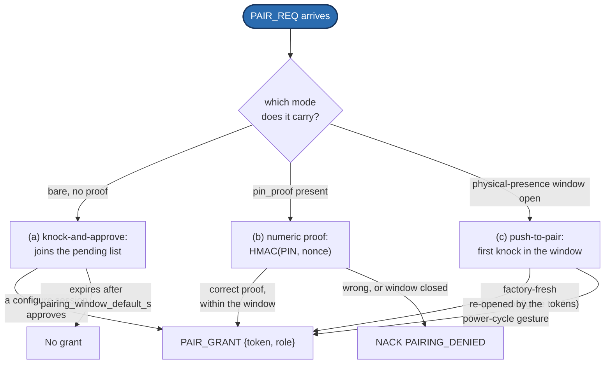

<!-- ==========================================================
     GENERATED FILE — DO NOT EDIT.
     Source of truth: spec/SPEC.md
     Generator:       docs-site/tools/gen_spec_pages.py
     Regenerate:      python docs-site/tools/gen_spec_pages.py
     CI gate:         python docs-site/tools/gen_spec_pages.py --check
     Normative text is copied verbatim. Hand edits are overwritten
     and fail the docs build. Edit the specification instead.
     ========================================================== -->

# 12. Security and Trust *(normative except §12.10)* {#s12}

## 12.1 Threat model {#s12-1}

On this product category, **unauthorized control is a physical-safety issue**, and privacy of presence and telemetry is a real secondary concern. Additionally, a protocol that becomes ubiquitous across many machines becomes a worthwhile malicious target in **both** directions: a hub parses HELLO, INTENT and bundles from untrusted clients, and a **client** parses WELCOME, catalog and STATE from a possibly-untrusted hub.

**In scope:** an untrusted device on the same LAN or radio range attempting control; a well-meaning but wrong client (a stale app) issuing bad intents; accidental cross-machine control (two hubs in range); a malicious peer in either role attempting to crash the other through malformed bytes ([§5.8](wire-format.md#s5-8)); mass-automatable browser-borne attacks against a machine-hosted UI ([§12.8](#s12-8)).

**Out of scope for v1:**

- **HONESTY CLAUSE (H5):** an active LAN MITM with packet-injection tooling. This explicitly includes clone-page attacks that proxy a PIN to the real hub.
- **HONESTY CLAUSE (H4):** a passive LAN observer capturing cleartext. v1 transports are cleartext; the plugs this document does provide (proof presentation, [§12.4](#s12-4); hub signature designed to work without secrecy, [§12.5](#s12-5)) narrow the consequences but do not move the boundary.
- Physical access to the machine.
- **HONESTY CLAUSE (H12):** denial of service. A LAN attacker can jam the radio regardless of anything specified here.
- Individually-targeted attacks by a native process already resident on the LAN ([§12.8](#s12-8)).

The ruling that shapes every choice below: **optimize against automatable mass vectors; accept the ceiling on individually-targeted LAN-resident attackers.**

**Deployment commandment (normative):** the Valence port MUST NOT be exposed to the wider internet. LAN-first is a security property of this design, not an accident of it.

## 12.2 Access tiers {#s12-2}

Three tiers, wire values `0/1/2`:

| Value | Name | Grants |
|---|---|---|
| 0 | **watch** | connect, browse the catalog, subscribe to `watch`-access channels. Open by default: watching requires no ceremony |
| 1 | **control** | everything watch does, plus intents on `control` channels and **STREAM publishing** — a motion producer is a controller |
| 2 | **configure** | everything control does, plus configuration and the administration surface ([§12.7](#s12-7)) |

Composition rules that hold across the whole document:

- **Safety `stop` and `estop` are role-EXEMPT** ([§11.2](safety.md#s11-2)): any session including `watch` may send them. Watch-tier stop spam is a **named, bounded, accepted** risk — exempt ops are still [§9.3](channels.md#s9-3) rate-limited, and the person standing in the room being able to stop the machine outranks the nuisance.
- **OTA rights are NEVER derivable from any tier.** Firmware update lives on its own credential plane; a `configure`-tier compromise cannot flash firmware.
- **Serial and in-process transports are implicitly `configure`** — possession of the cable or the process is the credential ([§12.9](#s12-9)).
- Hubs MAY offer a lock-down setting in which even `watch` requires a token, for shared-space deployments.

A tier shortfall is answered with NACK `NOT_CONTROLLER` where `control` was required and `ACCESS_DENIED` otherwise.

## 12.3 Pairing: one ceremony, three association modes {#s12-3}

Everything above `watch` requires a **token** bound to the client's `instance_id`. There is **zero or one PIN** on a hub, never per-tier secrets, and **role is an attribute of the GRANT, never of the ceremony** — all three modes end in PAIR_GRANT `{token, role}`.

A hub advertises the modes it currently offers as a bitmask in WELCOME `trust.pairing_modes` (8), **re-evaluated per session**, so a transient window is advertised only while it is genuinely open. The field is omitted when no mode is on offer.

**(a) Knock-and-approve — PRIMARY and capability-agnostic.**
A bare PAIR_REQ carrying no proof joins a **bounded pending list** (`pairing_pending_max`, 4 — bounded because it is the one unauthenticated queue a stranger can fill). The list is exposed as ordinary protocol state: a `pending-pairing` STATE channel with an EVENT twin. Any **`configure` session** — a phone, a CLI, another machine, a web UI — approves `{instance_id, role}` or denies it, via the administration channel ([§12.7](#s12-7)). Unanswered knocks expire after `pairing_window_default_s` (120).
The joiner needs **one button and no display**. The trusted surface is *a tier, not an app*: nothing anywhere may special-case "the web UI approves". This mode is RECOMMENDED partly because its approval surface shows the knocker's identity on hardware the attacker does not control.
The hub does not answer the knocker with any frame; the answer is the grant, when and if it comes.

**(b) Numeric proof — self-service, for keyboard-bearing joiners when no `configure` session exists.**
The operator puts the hub in pairing mode, which opens a `pairing_window_default_s` window and displays a `pairing_pin_digits` (4) PIN on a trusted surface. The joiner sends PAIR_REQ carrying `pin_proof` (28) = HMAC-SHA256(key = the PIN as ASCII, message = the 8-byte `nonce` from its WELCOME), truncated to 16 bytes. A correct proof within the window yields PAIR_GRANT; a wrong proof or a closed window yields NACK `PAIRING_DENIED`, and `auth_attempts_max` (3, RFC-049g — the same registry constant [§12.4](#s12-4)'s AUTH frame uses, deliberately not a second invented number) consecutive failures close the window. Proof comparison MUST be constant-time ([§5.8-7](wire-format.md#s5-8)).
The PIN itself never crosses the wire and the nonce binds the proof to this session, so it cannot be replayed across sessions.
**HONESTY CLAUSE (H3):** four digits is 10⁴ offline HMACs. A passive observer of the exchange can brute-force the PIN. This robustly prevents casual and drive-by pairing — the v1 bar — and it is **not** a cryptographic access control. A PAKE (SPAKE2-class) is the reserved v2 upgrade; it is not in v1 because browser crypto APIs have no PAKE and mandating one would exile the browser client.

**(c) Push-to-pair — bootstrap and potato fallback.**
A **physical-presence proof** opens a short **single-grant** window: the first knock is granted without approval, and the window then closes. The specification requires the *proof*, not a GPIO — **the minimum hardware is none, because the power cord is the button:**

- *Factory-fresh* (zero `configure` tokens exist): no gesture is needed. The hub boots claimable and the first knock gets **`configure`**. Whoever unboxed and powered it possesses it.
- *Re-opening later:* the **power-cycle gesture** — `pairing_gesture_boot_count` (3, RFC-049g) consecutive boots each with uptime below `pairing_gesture_max_uptime_ms` (10000) arms the window on the next boot. A boot counter in non-volatile storage is the whole mechanism, and it cannot collide with a live session, because any power loss has already stopped motion and forced a re-home.
- A hub with a real button MAY bind it as the pairing control: a UX upgrade, never a requirement. A hub with indicator hardware SHOULD show a pairing state on it; window state is in any case observable in-band by any `watch` session.
- **Factory reset (wiping the token store) MUST be a deliberately harder gesture** than opening pairing — a longer sequence, or the physically-attached console, which is implicitly `configure` anyway.

**Grant rule: if zero `configure` tokens exist, the window grants `configure` — physical possession is root.** Thereafter it grants the hub's configured default (`control`), and knock-and-approve does the rest.

*Only one ceremony exists; the three boxes at the top are association
**modes** into it, not three protocols. Every path converges on the same
PAIR_GRANT shape — role is an attribute of the grant, never of the mode that
produced it.*

**Token use.** The token is presented in every HELLO (key 5, or as a proof — [§12.4](#s12-4)); the hub validates it against its store (`instance_id ↔ token ↔ role`) and sets `roles` in WELCOME. Tokens survive hub reboots and firmware updates.

**`configure` is obtainable by ceremony.** The v1-draft sentence "admin is granted only via the hub's own UI" is **struck**. It was circular (it made the web UI the root of trust because it was the web UI) and it left no bootstrap story for a headless machine. The consequence is deliberate and must be understood: the administration surface, including session eviction and pairing approval, is **reachable through pairing**. A `configure` session may grant up to its own tier, `configure` included — conventional administrator behavior; the audit trail is the paired-device roster ([§12.6](#s12-6)), not a hard ceiling that would make the first administrator unable to make a second.

## 12.4 Token presentation modes {#s12-4}

**HONESTY CLAUSE (H4):** v1 transports are cleartext, so a raw bearer token in HELLO is sniffable by a passive LAN observer. [§12.1](#s12-1) excludes that attacker, but the plug is near-free, so both modes exist and the hub accepts both.

| Mode | Mechanism | Cost | Status |
|---|---|---|---|
| **bearer** (0) | the raw 16-byte token in HELLO | one memcpy, zero crypto, one round trip | **LEGAL, DEFAULT, and the floor.** A coin-cell client does exactly this |
| **proof** (1) | `HMAC-SHA256(key = token, message = the WELCOME nonce)` truncated to 16 bytes, presented in an **AUTH** frame (`0x1C`) after WELCOME | one extra round trip per connect | **RECOMMENDED** for anything that already has SHA-256 — browsers, C#, every modern MCU; i.e. everyone but coin cells |

In proof mode the token itself never crosses the wire: a sniffer captures a one-time proof, not the credential. The session sits at `watch` between WELCOME and a successful AUTH, which is the correct posture for a client that has not yet proved anything; the hub re-issues `roles` (23) on success and NACKs `UNAUTHORIZED` on failure. A session may present at most `auth_attempts_max` (3) failed proofs before the hub stops answering and closes it — mirroring the PIN window's three-strike rule rather than inventing a second number. The proof is 16 bytes, so this limit is not what makes guessing infeasible; it is what stops an unauthenticated peer spending the hub's HMAC budget in a loop.

**AUTH exists because the session grammar has no other way to raise a role mid-session.** A second HELLO would self-evict the client via [§6.3](session.md#s6-3)'s duplicate-instance rule. AUTH is deliberately **not** gated on readiness ([§6.4](session.md#s6-4)) — a client must be able to authenticate before it has finished adopting a catalog.

The roster records which mode a device uses, so security posture is visible: posture an operator cannot see is posture an operator cannot fix.

*Rejected, recorded so it is not re-proposed:* "reuse the previous session's nonce to skip the round trip" is replay-unsafe. The rotation point is undefined, honest retransmits are indistinguishable from replays on lossy bindings, and [§6.3](session.md#s6-3) makes a successful replay **evict the real client**. Proof mode costs one extra round trip. That is the honest price.

## 12.5 Hub authenticity {#s12-5}

A token store trusts a *device identity* forever regardless of the code behind it, and nothing in a cleartext protocol distinguishes the real hub from an evil twin replaying its identity strings. The primitive that fixes this:

- A hub MAY generate a **P-256 keypair at first boot** and persist it. The public key's fingerprint is the machine's durable identity. P-256 is chosen because browser crypto can verify it — the browser participates.
- **PAIR_GRANT delivers the public key** (`trust.hub_pubkey` (4), SEC1-compressed, 33 bytes). Trust is anchored **at the pairing ceremony**, the moment physical presence or operator approval was established: trust-on-first-use at a verified moment, not at an arbitrary one.
- **Signature material (exactly these 16 bytes, in this order):** `client_nonce` (8 bytes, verbatim from HELLO `trust.client_nonce`) ‖ `session_id` (u32, **little-endian**) ‖ `boot_id` (u32, **little-endian**). The signature is deterministic ECDSA-P256 (RFC 6979), carried in `trust.welcome_sig` (5).
  The **client nonce is load-bearing**: without client entropy the signature would be replayable from a single captured handshake and an evil twin would pass verification. A hub MUST NOT sign a session that supplied no `client_nonce`.
- **Signing is on request.** A client asks with `trust.sig_request` (3). Absent or false means no signature and no cost, which is what keeps constrained handshakes instant.
- **Two delivery points, one meaning.** A hub that can sign without stalling puts `welcome_sig` **inline in WELCOME**. A hub that cannot sends **HUB_SIG** (`0x1D`, h2c) once its low-priority worker has produced the signature; the payload is the `trust` sub-map carrying `welcome_sig` and nothing else, so the decode surface is one already-covered sub-map. The signed material and the client handling are identical either way; a client accepts whichever arrives first and ignores a second.
  *Why deferral exists (informative):* software ECDSA on a controller without an ECC accelerator is roughly 30–80 ms in one uninterruptible call. A hub signing inline would stall its own tick for many periods — starving state pacing, deadman detection, and any motion drain sharing that task — **for every connecting client**.
- **A clone machine copies every identity string and fails the signature.** A client that verifies and gets a mismatch MUST surface "not your machine" and MUST withhold intents.
- **HONESTY CLAUSE (H9).** A hub with no keypair sends no signature, and **silence is a conformant answer**. Only a client that has **pinned** a key — which it can only have received from that machine's own PAIR_GRANT — is entitled to read silence as failure, and only after `hub_sig_timeout_ms` (3 s; generous on purpose, because the hub is allowed to be busy). A client with no pinned key never applies the timeout: it has nothing to verify against. Clients paired by physical ceremony MAY skip verification entirely. And note what the signature proves: **which machine**, not that the machine is uncompromised.

## 12.6 The trust ledger and the change tripwire {#s12-6}

The hub's record of who is paired is a **blob store** ([§8.7](catalog.md#s8-7)) whose `kind` is `"trust.ledger"`, declared by a spec-core STORE entry with a companion roster STATE channel. It is a store rather than a packed roster because a ledger entry does not fit a 242-byte snapshot at useful capacity. Its `access` is `configure`: **the paired-device list is not open reading.**

Each item is a CBOR map from the registered `trust_ledger_keys` grammar ([§8.7](catalog.md#s8-7)'s one carve-out): `instance_id`, `kind`, `name`, `version`, `first_seen`, `last_seen`, `role`, `state`, `presentation_mode`, `pairing_mode`. The whole encoded ledger is bounded by `trust_ledger_max_bytes` (1900) and `paired_devices_max` (8) items.

- **Revocation is an absence, not a state.** A revoked device has no entry. Something on the authorization list that is not authorized is a footgun.
- **`first_seen` / `last_seen` are wall-clock seconds or zero.** Per [§7.2](time.md#s7-2) the protocol's only clock is boot-relative and wrapping; a hub can fill these only if the application has a real time source, and **SHOULD** when one is available (RFC-049d) — an operator's "when did this device pair" question deserves a real answer wherever the hub can give one. **Zero is the honest default where no clock exists and will be common.** The protocol never invents a timestamp, and neither field is audit-grade even when populated (H7): a `configure` client rendering the trust ledger SHOULD show a populated timestamp distinctly from zero, rather than rendering zero as an epoch date that reads as a real event.
- **`pairing_mode` records which ceremony granted the role**, so a `configure` grant issued through a push-to-pair window is visible as exactly that. That audit trail is what this design uses *instead of* a hard tier ceiling.

**The client-change tripwire.** HELLO may carry `trust.client_ver` (1), a version string bounded by `client_ver_max_bytes` (24). When the observed version differs from the version recorded at the last approval, the ledger entry's `state` drops from `trusted` to **`recognized_pending`**: the session is admitted at **`watch`**, its granted tier is **suspended (not revoked)**, and a re-approval is surfaced to `configure` sessions through the pending-pairing surface. Re-approval and knock approval are deliberately the **same op** — both are the decision "this identity may do this" — so they cannot drift apart. Default policy: `watch` auto-re-keeps; `control` and `configure` require re-approval; hub-configurable.

- **HONESTY CLAUSE (H6):** the version is **self-reported**. This is a **tripwire, not attestation**: it catches an honest update and nothing else. A deliberately malicious update lies about its version and keeps its token. The real bounds on a hostile client are tier scoping, instant revocation, roster visibility, and the role-exempt safety ops. **A UI MUST NOT imply this is attestation.**
- **HONESTY CLAUSE (H7):** a device that reports **no** version can never trip the wire. This is a real gap, stated rather than hidden.

**The symmetric signal.** A change in the hub's own `fw_version` ([§6.3](session.md#s6-3)) SHOULD be surfaced by clients ("this machine updated to X.Y.Z"), and clients MAY gate `configure`-tier actions on user acknowledgment afterwards. Hub code changes only through the OTA plane, which is outside Valence trust by [§12.2](#s12-2) — so a `configure`-tier compromise cannot flash firmware. A hostile hub's ceiling against a conforming client is **well-formed lies**, which is exactly the bound [§5.8-5](wire-format.md#s5-8) sets and the reason it is symmetric.

## 12.7 The administration surface {#s12-7}

Eviction, pairing approval, re-approval and revocation are **one channel, not three**: they are all "an authorized operator changing who may do what", so they share one access floor (`configure`), one rate limiter, one idempotency ring, and one place a generic renderer looks. Ops: `evict`, `pair_approve`, `pair_deny`, `revoke` (registry `session_admin_ops`).

- **`evict`** GOODBYEs the named session with `SESSION_EVICTED` and runs the **full [§6.9](session.md#s6-9) teardown** (a genuine ending — `evict` is never a staleness transition, even against a session that happens to be `STALE` already) — the evicted session's source ownership is released exactly as if it had crashed ([§11.3](safety.md#s11-3): unconditional release, no forced stop for a command-driven source, the `source.background_run` setting for an autonomous one), because "no unmonitored path to motion" does not get an exception for administrative actions. Evicting one's own session is legal and is just a rude GOODBYE to oneself.
- **`pair_deny`** on a `recognized_pending` device is a **revoke** in effect: deny means no, and leaving a suspended entry in the ledger after an operator said no would be a lie the roster tells forever.
- **`revoke`** takes effect at the next HELLO. An already-live session keeps the tier it was admitted with until it reconnects; use `evict` to end it now. This is stated because "revoke" reading as "and also kick" is a reasonable assumption and a wrong one.

There is also a **session roster** STATE channel: a generation, a count, and fixed-size slots `{session_id, role, flags, name}` with `name` as `str16`. Roster names are truncated to 16 bytes; the full name rides the session-events channel while the session lives. The roster exists partly *because* join events are never replayed ([§9.4](channels.md#s9-4)) — without it, a late joiner could never learn the names of sessions that joined before it did.

Note a representation detail that surprises implementers: packed layouts have no 64-bit integer type, so an 8-byte `instance_id` in a packed slot is carried as **two `u32` fields** (low half, high half), not one field. Where a document says "instance_id u64" in a packed context, this is what it means.

## 12.8 The served-page token sideband *(optional)* {#s12-8}

A machine that serves its own web UI over HTTP may treat that page as trusted by default, through a **browser-enforced one-time token** rather than a forgeable header:

- The served page performs a **same-origin** request to a token endpoint. The hub mints a single-use token (short TTL, rate-limited, **minted on request — never templated into a static asset**), and the page presents it in HELLO for the **`control`** tier. **Never `configure`.**
- **The boundary is the browser's same-origin policy.** The endpoint sets no cross-origin headers, so any cross-origin page — a clone UI, a malvertising LAN scan, the mass-automatable vector — can *send* the request but cannot *read* the answer. Manufactured tokens fail the single-use server mint. A token stolen in the gap makes the real page's HELLO fail **loudly** (a visible race, never a silent compromise). Where an `Origin` header is present it MAY be used as a second independent filter — it is free.
- **This is a sideband, not a second plane, and NOT a connection prerequisite.** With the endpoint absent, disabled, or failed, the page is an **ordinary client**: `watch` by default and `control`/`configure` through any [§12.3](#s12-3) association mode, with its token persisted against its `instance_id` like anyone else's. Since `configure` **always** pairs, a web UI exercises the normal ceremony regardless. The sideband removes ceremony for one tier on the machine's **own** page; it grants no capability that pairing cannot, and **clients MUST implement the pairing path irrespective of it.** A hub with no web UI never implements it and loses nothing; no non-web client ever needs it to connect.
- **HONESTY CLAUSE (H8):** a **native** process already on the LAN can request the endpoint directly. That attacker class already defeats the cleartext ceiling (H4), so nothing is newly lost — but nothing is protected from it either. The mechanism fully closes the browser-borne class and is capped at `control`, toggleable off for shared spaces.
- **HONESTY CLAUSE (H5) restated here because this is where users assume otherwise:** a clone page that proxies a PIN to the real hub is active MITM and is out of scope. Knock-and-approve ([§12.3a](#s12-3)) is the recommended ceremony partly because its approval surface shows the knocker's identity on hardware the attacker does not control.

## 12.9 Per-transport mapping {#s12-9}

- **WebSocket:** plain `ws://` on LAN by default. Hubs MAY offer `wss://` with a self-signed certificate; browser trust UX for self-signed LAN certificates is hostile, which is why TLS is optional rather than baseline.
- **BLE:** transports SHOULD use LE Secure Connections pairing/bonding where the client stack allows; the token layer applies identically above it.
- **ESP-NOW:** the pairing ceremony doubles as key distribution — PAIR_GRANT MAY carry segment keys enabling the radio's native encryption, and relays store them as clients store tokens. Unencrypted operation remains permitted for `watch`-class traffic.
- **Serial / in-process:** physically-attached transports are implicitly `configure`-capable, because possession of the cable or the process **is** the credential. Hubs MAY still require pairing on serial.

## 12.10 Future work *(informative)* {#s12-10}

Hooks already present for v2+: `token` is a `bstr` with room for signed or expiring tokens; PAIR_* and the `trust` sub-map are extensible CBOR with room for a PAKE replacing the HMAC-PIN and for per-session channel encryption keys; the NACK auth range has space. Nothing anticipated for v2 security should require a wire-grammar break. The named residual holes, chosen with eyes open, are H3, H4, H5 and H8.
