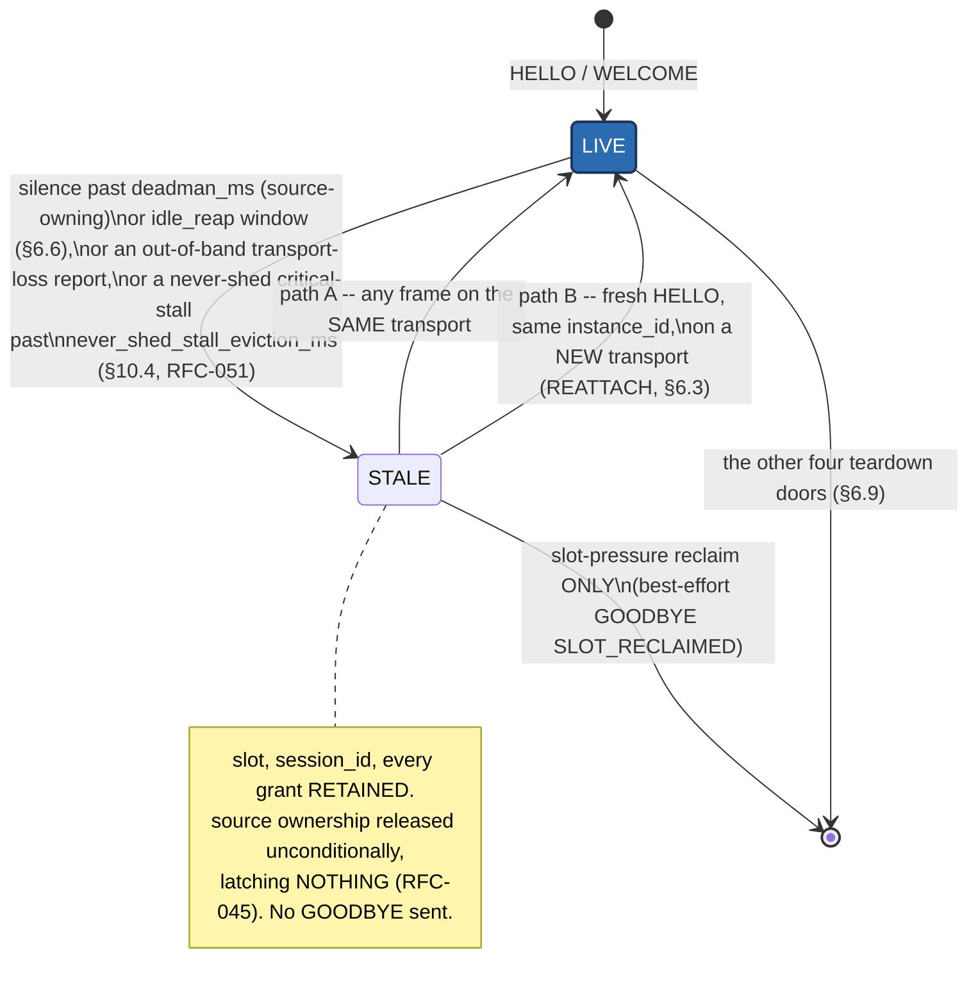

<!-- ==========================================================
     GENERATED FILE — DO NOT EDIT.
     Source of truth: spec/SPEC.md
     Generator:       docs-site/tools/gen_spec_pages.py
     Regenerate:      python docs-site/tools/gen_spec_pages.py
     CI gate:         python docs-site/tools/gen_spec_pages.py --check
     Normative text is copied verbatim. Hand edits are overwritten
     and fail the docs build. Edit the specification instead.
     ========================================================== -->

# 6. Session Layer *(normative)* {#s6}

## 6.1 Identity: three numbers, three jobs {#s6-1}

- **`instance_id`** (8 bytes, client-generated once and persisted) — *who this client durably is.* Distinguishes "the same phone reconnecting" from "a second phone". Generated randomly at first run; a client that cannot persist (incognito browser) generates per-load and simply enjoys weaker reconnect and pairing semantics.
- **`session_id`** (u32, hub-assigned, random non-zero, unique within a hub boot) — *this particular association.* Not a secret; authorization lives in tokens ([§12](security.md#s12)).
- **`boot_id`** (u32, hub-generated randomly at every boot) — *which incarnation of the hub.* All hub timestamps, seqs, session ids, and idempotency state are scoped to a `boot_id`; observing a new one invalidates every cached assumption except the catalog etag, pairing tokens, and a pinned hub public key.

**A fourth, orthogonal identity primitive:** `hub_instance_id` (u64, WELCOME `identity` key 5, [§6.3](#s6-3)) is the hub's *durable* cross-boot identity — generated once and NVS-persisted, unchanged by every reboot and firmware update — as opposed to `boot_id`, which is fresh every boot by design. It carries none of `boot_id`'s fencing role (no timestamp, seq, or idempotency state is scoped to it); it exists purely so a client, or a DISCOVER_REPLY recipient ([§13.8](transports.md#s13-8)), can recognize "this exact physical hub" across time. RFC-048.

## 6.2 HELLO (client → hub) {#s6-2}

CBOR map. Required: `proto_ver` (1), `client_kind` (2), `client_name` (3), `instance_id` (4). Optional: `token` (5), `catalog_etag` (8) — the etag the client has cached — `subscriptions` (10) and `publishes` (11) wish-lists so simple clients complete setup in one round trip, `trust` (39), and `deadman_wish_ms` (44) — the requested deadman window ([§11.3](safety.md#s11-3)).

- `subscriptions` entries are `{channel_id, rate_hz, priority}`.
- `publishes` entries are `{channel_id, rate_hz, burst?, curve_family?}`. A c2h STREAM producer has no subscription priority; `burst` is the token-bucket capacity in samples ([§10.5](qos.md#s10-5)); `curve_family` (45) declares a segment stream's smoothness class ([§9.6](channels.md#s9-6)).
- `trust` (39) is the optional identity/authenticity sub-map. In HELLO it may carry `client_ver` (1), `client_nonce` (2, 8 bytes of client entropy), and `sig_request` (3). **A client that omits `trust` entirely is on the supported floor**: bearer token, zero crypto, the v1-draft handshake cost unchanged.

**Publication wish validation.** The hub validates each `publishes` wish against the catalog: the channel MUST exist, be class STREAM, be direction c2h, and its effective `access` MUST NOT exceed the session's granted tier. A wish that fails any check is **silently omitted** from the grants — no NACK, because an unwanted publish wish is not an error. A passing wish is granted at `min(wished rate, catalog max_rate_hz)`; a channel whose granted rate resolves to ≤ 0 is not a rate-bearing publish and is omitted. Grants are echoed in WELCOME under `granted_publishes` (36). **A session may send STREAM bundles only on channels granted here or by a later PUBLISH ([§6.7](#s6-7)).**

**Subscription wishes** are answered as grants embedded in WELCOME under `grants` (35), using the same structure GRANT uses ([§10.2](qos.md#s10-2)).

## 6.3 WELCOME (hub → client) {#s6-3}

CBOR map: `proto_ver` (the served version), `session_id`, `boot_id`, `catalog_etag`, `cfg_gen`, `roles` (23 — the granted access tier: `watch` unless a valid token raises it), `limits` (22), `deadman_ms` (24) and `deadman_policy` (25) as applied to this session, `nonce` (29 — 8 bytes, used by a subsequent PAIR_REQ *and* by token-proof presentation), `grants` (35), optionally `granted_publishes` (36), `identity` (37), optionally `trust` (39), and optionally `ws_port` (46) and `ipv4` (47).

- `limits` (22) carries at minimum `max_frame` (1), `max_subscriptions` (2), and `retained_pending` (3) — the count of retained STATE pushes that will follow — plus `max_subscriptions_per_frame` (4), the most wishes one SUBSCRIBE or HELLO frame may carry ([§6.7](#s6-7)).
- `identity` (37) carries `product` (1), `fw_version` (2), `hub_name` (3), an optional `hub_instance_id` (5, u64, RFC-048) — the hub's durable cross-boot identity ([§6.1](#s6-1)), distinct from the per-boot `boot_id` — and an optional device-defined `info` map (4) whose keys the protocol never interprets. **This is the only wire home for hub identity.** A hub SHOULD carry it; clients MUST tolerate its absence per [§4.3](foundations.md#s4-3), and MUST NOT make connection or operation conditional on it. Reference-implementation status: [§18-16](limitations.md#s18).
- `trust` (39) in WELCOME may carry `pairing_modes` (8, a bitmask of the association modes this hub offers **right now**, re-evaluated per session so a transient window is advertised only while open) and `welcome_sig` (5) where the hub can sign without stalling ([§12.5](security.md#s12-5)).
- **`ws_port` (46) and `ipv4` (47)** (RFC-046 item 3) are the hub's own WebSocket port and IPv4 address, present on every binding — including WS itself, closing the same "what does the hub believe its own endpoint is" gap for a WS client — but load-bearing specifically over BLE: a BLE-connected client reads them to perform the [§13.1](transports.md#s13-1)/[§13.4](transports.md#s13-4) upgrade hop to WebSocket without any out-of-band discovery. **`0` means absent** for either key (no WS listener, or no IPv4 address) — a client MUST treat `0` as "not offered right now," never as a literal port or address.
- `granted_publishes` is omitted entirely when no publish wish was granted.

WELCOME is the moment grants become truth; anything not granted here needs SUBSCRIBE or PUBLISH.

*A worked, frame-by-frame HELLO → WELCOME → readiness-gate trace, with a
diagram, lives in [examples/session-traces.md](traces.md) E1.*

**Capability discovery is catalog introspection.** There is no capability list in WELCOME and there will not be one. A feature exists **iff its channels exist**: a hub with a current sensor advertises the power channel and a hub without one does not, and that absence *is* the answer. Ceilings and geometry are discovered by `field_roles` ([§8.8](catalog.md#s8-8)), not by a parallel enumeration that can drift.

**Duplicate identity:** if a HELLO arrives bearing the `instance_id` of a live session, the hub MUST evict the old session (GOODBYE `DUPLICATE_INSTANCE` if its transport still functions) and honor the new HELLO. Half-open zombies die here. Because a successful duplicate HELLO **evicts** the incumbent, a second HELLO is never a legal way to change one's own role mid-session — that is what AUTH ([§12.4](security.md#s12-4)) exists for.

**Transport migration (RFC-046 item 4).** The duplicate-identity rule above is written for a genuine second claimant; it is silent on a client that legitimately hops transports — the case that matters is a BLE-connected client upgrading to WebSocket per [§13.1](transports.md#s13-1)/[§13.4](transports.md#s13-4). Where a hub can identify an incoming HELLO's `instance_id` as belonging to a session it already holds, **arriving on a transport binding other than the one that session currently uses**, it SHOULD treat the new connection as a **migration** of the same session identity rather than a competing claimant: grants, `cfg_gen`, and the catalog etag are reconciled by the ordinary WELCOME flow exactly as any reconnect ([§6.8](#s6-8)) — an etag match skips catalog transfer — and the prior transport binding is simply closed, without `DUPLICATE_INSTANCE` and without running [§6.9](#s6-9) teardown's ownership-release consequence on it. **A migration is not a session loss.** Role is re-derived from the presented token exactly as any HELLO does, so a revoked credential still downgrades correctly. This is additive, not a relaxation: a hub unable to distinguish a migration from a genuine second claimant MAY simply apply the duplicate-identity rule above, which remains fully conformant — a client that migrated and got evicted anyway just reconnects ([§6.8](#s6-8)). Where a hub implements session staleness (RFC-042, [§6.6](#s6-6)), a `STALE` session's cross-transport HELLO uses this identical reattach path back to `LIVE`. Clients SHOULD keep a BLE binding known/bonded and migrate to WS whenever WELCOME's `ws_port`/`ipv4` (above) and the BLE `ws_available` advertising flag ([§13.4](transports.md#s13-4)) say a WS endpoint is reachable.

**Admission:** a hub at its client limit answers HELLO with NACK `BUSY` carrying `retry_after_ms` (31). A hub's transport-tracking capacity MUST exceed its session capacity by at least one, so that the peer which loses the admission race is still reachable to *receive* its BUSY. Advertised defaults and the conformance floor (≥ `conformance_min_clients`) are in [Appendix G](appendices.md#appendix-g).

## 6.4 Readiness: the dual-plane gate *(CATALOG_READY)* {#s6-4}

A client cannot decode a packed STATE frame without the catalog that describes its layout, and a client MUST NOT act before it has adopted the retained safety latch ([§11.5-2](safety.md#s11-5)). Both problems have one answer.

**The rule.** Every session carries a `ready` flag, initially false. While a session is not ready:

1. the hub emits **no** STATE and **no** STREAM to it — including the retained push;
2. the hub **refuses** inbound INTENTs from it with NACK `NOT_READY`. Refused, not queued: a client acting before adopting the safety latch is exactly the failure [§11.5-2](safety.md#s11-5) forbids.

Nothing is buffered anywhere. Retained values already live once in the hub's channel table; the gate is one flag and costs no RAM, and it never blocks. Frames that are *not* gated: the session and safety planes — PING/PONG, CLOCK, GOODBYE, NACK, PAIR_*, AUTH, BLOB_*, ESTOP, and the safety-intent ops that [§11.2](safety.md#s11-2) makes role-exempt. **You may always stop the machine, ready or not.**

**Becoming ready.**

- **Etag match is proof of possession.** A HELLO whose `catalog_etag` equals the hub's makes the session ready immediately, on the WELCOME. The common reconnect case keeps its zero-latency retained push.
- **Otherwise:** WELCOME advertises the current etag; the client fetches the catalog over BLOB namespace 0 ([§8.4](catalog.md#s8-4)) — which gets the whole pipe, since no telemetry is competing — assembles it, and **verifies the SHA-256 locally**. The hash *is* the acknowledgment; there are no transfer round trips to negotiate. The client then sends **CATALOG_READY** (`0x19`, raw, c2h), payload = the 8-byte etag it now operates against. The hub sets `ready`, the retained push flows, the client reaches LIVE.
- **Loss-proofing:** CATALOG_READY is idempotent. A client re-sends it every `catalog_chunk_gap_timeout_ms` until the first retained STATE arrives. There is no handshake state machine and no hub timer for it.
- **Degraded static clients** ([§8.5](catalog.md#s8-5)) send CATALOG_READY carrying their **stale** etag. Append-only layouts make their prefix-parse safe; the hub serves them and MAY record the session as degraded.

**Timeout.** A session that has not become ready within `catalog_ready_timeout_ms` (15 s) MUST be closed with GOODBYE `READY_TIMEOUT`. This exists because liveness reaping ([§6.6](#s6-6)) never fires on a client that PINGs happily forever: without this rule a half-adopted session would hold a slot indefinitely with both planes gated shut.

*Rationale (informative):* the alternatives were tried and are worse. A hub-side "defer until I have sent the whole catalog" is ambiguous — the hub knows it *sent* chunks, not that they *arrived*, which is true on TCP and false on ESP-NOW. Client-side "discard what I cannot decode" spends airtime shipping frames into a bin. The gate means undecodable state is never transmitted at all.

## 6.5 Network probe (optional, post-READY) {#s6-5}

Grants at WELCOME are deliberately conservative defaults — a controller reconnecting mid-motion must not wait on a bandwidth measurement. A client wanting refinement runs the probe *after* going LIVE:

1. Client sends PROBE (raw, empty payload) → hub replies with a timed burst of PROBE frames (raw payload: `probe_index:u16` + padding) totaling `probe_default_bytes` over at most `probe_max_duration_ms`.
2. Client measures received bytes/span/loss and reports PROBE_REPORT (CBOR: `probe_result` (26), sub-keys `bytes_received`, `span_ms`, `loss_pct_x100`, `rtt_ms`).
3. Hub MAY raise grants accordingly, announced via unsolicited GRANT ([§10.2](qos.md#s10-2)).

The probe measures the hub→client direction. Runtime congestion adaptation ([§10.3](qos.md#s10-3)) continues regardless — the probe sets a better starting point, nothing more.

## 6.6 Liveness, deadman, and idle reaping {#s6-6}

**Any received frame is proof of life.** A dedicated PING (raw, empty; answered by PONG echoing the payload) is sent only when a side has been otherwise silent for its interval: `ping_interval_holding_control_ms` (200 ms) while the session owns an active motion source, `ping_interval_idle_ms` (1 s) otherwise. A 240 Hz streamer therefore never sends PING and never idles out while streaming.

There are **two liveness regimes, deliberately different**:

| Regime | Applies to | Trigger | Consequence |
|---|---|---|---|
| **Deadman** ([§11.3](safety.md#s11-3)) | a session that **owns an active motion source** | silence beyond `deadman_ms` (default 600, clamp 250–5000, negotiated at WELCOME) | session marked `STALE` (RFC-042 — see below), **not** torn down; ownership of the source released **unconditionally**, latching nothing (RFC-045) — a command-driven source has nothing left to execute and settles on its own ([§11.3](safety.md#s11-3)); a hub-autonomous source's `source.background_run` setting governs, default `false` (stops) |
| **Idle reaping** | every other session | silence beyond `idle_reap_multiplier` × `ping_interval_idle_ms` | session marked `STALE` (RFC-042), **not** torn down. **No motion consequence** — it owned nothing |

**RFC-042: staleness, not termination.** Both regimes above used to tear the session down outright (GOODBYE `DEADMAN_TIMEOUT`/`IDLE_REAPED`); a hub conforming to this document instead marks the session `STALE` — a library-internal state, never itself wire-visible — and RETAINS its slot, `session_id`, subscriptions, publish grants, intent-idempotency ring, ingress rate-limiter state, and catalog readiness exactly as they were. **No GOODBYE is sent**: staleness is not an ending, and the client may never even notice. A `STALE` session resumes two ways, neither a full HELLO renegotiation:

- **Same-transport revival (path A, the dominant case):** the backgrounded-tab/locked-screen scenario this exists for does not close the underlying socket — the OS only throttles JS timers — so the very next frame the hub observes on that transport (a PING is enough) flips the session straight back to `LIVE`.
- **Transport re-establishment (path B):** if the socket genuinely died, the client opens a new one and sends a fresh HELLO. Where `handleHello`'s duplicate-`instance_id` branch ([§6.3](#s6-3)) finds the existing session for that `instance_id` is `STALE` rather than `LIVE`, the hub REATTACHES the new transport to it instead of evicting-and-recreating: same `session_id`, same grants (retained, not renegotiated from the reattaching HELLO's own wishes — resumption re-arms each subscription's first-push-after-grant treatment only, so the client's first frames back are a full resync), role re-derived from the presented token exactly as any HELLO (a revoked credential still downgrades correctly). No `BUSY` pressure is spent — this is not new capacity. A duplicate HELLO against a `LIVE` session is unchanged: that is a genuine identity conflict, not a resumption, and still evicts the incumbent.

An out-of-band transport-loss report (the transport layer telling the hub a connection is confirmed gone, e.g. a socket close callback) is a **third** staleness trigger, immediate rather than timed — the case that matters most for a genuine network blip. Unlike the two silence triggers, the transport is confirmed absent here, so the per-slot state RFC-042 otherwise keeps "while the transport is still attached" (a pending pairing knock, an in-flight AUTH proof, a resumable blob-transfer cursor) is reset rather than retained — it was mid-flight against a socket that no longer exists.

**RFC-051 adds a fourth staleness trigger, converging with the third.** [§10.4](qos.md#s10-4) step 4's never-shed queue stall (`never_shed_stall_eviction_ms`, 2 s) closes and detaches the transport and runs the identical park: same reset of transport-scoped state, same slot retention. Rationale: a vanished client's link looks *congested* before it looks *gone*, so this clock used to race the transport-loss report above and always lose, tearing the session down via [§6.9](#s6-9) before the transport layer had a chance to report the loss itself. Both triggers now produce one outcome.

**Slot pressure is the only thing that ever reclaims a `STALE` session.** A HELLO that would otherwise be refused with NACK `BUSY` ([§6.3](#s6-3), `kHubMaxSessions` sessions already occupied — a `STALE` session still occupies its slot, at full cost) instead evicts the lowest-access-tier `STALE` session first (tie-break: longest continuously stale), sending it a best-effort GOODBYE `SLOT_RECLAIMED` before freeing its slot for real. A `LIVE` session is **never** evicted for pressure — only a genuine duplicate-`instance_id` claim ever displaces one. Staleness itself has **no independent time limit**: a hub MAY run indefinitely with slots parked `STALE`, by design (any fixed cap is just a slower deadman with the identical browser-throttling failure mode this exists to remove).

A hub SHOULD implement idle reaping (into `STALE`, per the above). Without it a watch-tier session that goes dark holds a slot until reboot, and there is no other pressure to release it.

Note the sparse-sender case this design serves on purpose: a client that emits a few timed segments per second ([§9.6](channels.md#s9-6)) holds its session open with [§6.6](#s6-6) PINGs and never needs a protocol change to do it. Pausing playback means the segments stop while the PINGs continue: the session survives, the machine settles, and nothing about the deadman needed special-casing.

*A worked example of both reattach paths, with wire-level detail, lives in
[examples/session-traces.md](traces.md) E2.*

## 6.7 Mid-session subscription and publication management {#s6-7}

- **SUBSCRIBE** (`0x06`, c2h): CBOR `subscriptions` array as in HELLO; answered by GRANT per entry, or NACK carrying the offending `channel_id`. Rate or priority changes are a re-SUBSCRIBE of the same channel — the new grant replaces the old one. Subscriptions are capped per session (`max_subscriptions_per_session`, NACK `SUB_LIMIT`).

  **An unacceptable SUBSCRIBE is answered, never dropped** ([§4.5](foundations.md#s4-5)). A hub that cannot process a SUBSCRIBE frame **as a whole** — undecodable, or carrying more wishes than `max_subscriptions_per_frame` (16) — MUST answer NACK `SUBSCRIBE_REJECTED` (0x0204) with the reason in `detail`; silence is non-conformant. Per-channel refusals are unchanged: an individually unacceptable wish keeps its per-wish code (`UNKNOWN_CHANNEL`, `ACCESS_DENIED`, `SUB_LIMIT`, …) while the remaining wishes grant normally. The per-frame bound is advertised in WELCOME `limits` key 4, so a client sizes its batches from the wire rather than by binary-searching a live machine. **Ruling, recorded:** mixing STATE and EVENT subscriptions in one SUBSCRIBE is **legal** and always was — the wholesale drop that motivated this rule was the then-undeclared 16-wish cap, not the mix. *Conformance:* a negative vector (17 wishes → assert the NACK) exists as test SI-21. Silence here is uniquely expensive: the session completes HELLO/WELCOME, reaches LIVE, looks healthy, and zero STATE ever arrives — it presents as a client rendering bug.
- **UNSUBSCRIBE** (`0x07`, c2h): array of `channel_id`.
- **PUBLISH** (`0x18`, c2h): CBOR `publishes` array, the c2h counterpart of SUBSCRIBE. Adds, changes or (with rate 0) drops a publication wish mid-session, validated and clamped exactly as in [§6.2](#s6-2) and answered with `granted_publishes` results. Without it, adding one publication required a full reconnect.

This is how a UI opens a 240 Hz scope view for thirty seconds without reconnecting, and how a streaming client switches from dense samples to timed segments without dropping its session.

## 6.8 Reconnect {#s6-8}

On transport restoration a client sends a fresh HELLO (same `instance_id`, same `token`, cached `catalog_etag`, its standing wish-lists). Then:

- **Etag matches** → ready immediately ([§6.4](#s6-4)), no catalog bytes on the wire. **Etag differs or `boot_id` changed** → full SYNCING including catalog transfer.
- **Snapshot adoption is mandatory:** the retained-STATE push *is* the resync; the client MUST discard its shadow and rebuild from it. No client-side state survives a reconnect on its own authority.
- **Idempotency reset:** intent ids are session-scoped ([§9.3](channels.md#s9-3)). Pending unacknowledged intents from the dead session are *gone* — the client MUST NOT blind-retransmit them. It reconciles by comparing its intended value against the adopted snapshot and re-issues only if still wanted and still different. This is why relative intents are forbidden ([§9.3](channels.md#s9-3)): "increment by 5" cannot be reconciled against a snapshot; "set to 405" can.
- **Grant reacquisition is not control reacquisition.** Subscriptions and publications re-grant freely. But if the disconnect triggered the deadman, the source's ownership was released ([§11.3](safety.md#s11-3)) — the returning session does NOT silently resume as active source, whether or not anything latched in the meantime; it must issue a fresh control-taking intent ([§11.4](safety.md#s11-4)). **Motion never restarts because a socket reopened.**
- **Trust is re-evaluated.** A token presented after a `client_ver` change may be admitted at `watch` with its granted tier suspended ([§12.6](security.md#s12-6)).

## 6.9 Teardown: one path, five doors {#s6-9}

GOODBYE (`0x11`, either direction; CBOR `code` from `nack_codes`, optional `detail`) is a courtesy, not a requirement — transports die rudely and every rule above already tolerates it.

**RFC-042 narrowed which endings this section covers, and RFC-051 narrowed it again.** Silence (deadman on a source-owning session, idle reaping otherwise, [§6.6](#s6-6)/[§11.3](safety.md#s11-3)), an out-of-band transport loss, and — since RFC-051 — a never-shed critical-stall past `never_shed_stall_eviction_ms` ([§10.4](qos.md#s10-4) step 4) are **not** teardown at all: all four mark the session `STALE` (library-internal state; [§6.3](#s6-3)'s reattach path) and RETAIN its slot, `session_id`, and every grant. A stale session is not gone: it is resumed by any frame on its still-attached transport, or by a fresh HELLO on a new one ([§6.3](#s6-3)). Genuine teardown remains exactly five doors: voluntary GOODBYE, administrative eviction ([§12.7](security.md#s12-7)), reuse of a session slot by a duplicate `instance_id` **belonging to a LIVE session** ([§6.3](#s6-3) — excluding both a transport **migration** and an RFC-042 reattach, neither of which is an ending), readiness timeout ([§6.4](#s6-4)), and RFC-042 item 5's **slot-pressure reclaim of a `STALE` session** (best-effort GOODBYE `SLOT_RECLAIMED`, evicted only under admission pressure, lowest access tier first).

**Normative equivalence rule, restated for the current model.** Every one of the five teardown doors above, AND every RFC-042 staleness transition, MUST be **behaviorally identical with respect to source ownership and safety latching**: the hub releases every source the departing (or newly-stale) session owned, **unconditionally**, and (RFC-045) latches nothing by virtue of that release alone — a command-driven source simply has no owner and settles per [§11.3](safety.md#s11-3); a hub-autonomous source's continuation is governed entirely by its own `source.background_run` setting, never by an inference from the ending or staleness. An explicit `stop`/`estop` is a command, never an inference from a departed or stale session ([§11.2](safety.md#s11-2)).

**RFC-045 retired the `cause` distinction this paragraph used to describe.** Neither staleness nor teardown latches anything any more, so there is no `deadman`/`session_loss` safety-word edge left to tell apart on a source-loss path; `safety_causes::deadman` (1) and `session_loss` (4) remain registered (a hub whose application-level `sourcePolicy()` genuinely needs a stop-on-silence edge may still produce them) but the reference hub emits neither for source loss. A hub MUST NOT report a closed browser tab, or any other departure, as a safety edge it did not actually have.

*Why this is a numbered rule (informative):* the reference implementation originally released ownership only from the deadman pump, which requires an occupied slot. GOODBYE, rude detach, both evictions and same-slot re-HELLO all reset the slot first — so a departed streamer's dead `session_id` owned the motion source **forever**, silently conflict-dropping every later client's intents and bundles until reboot. It was invisible to every test that rebooted between runs. Back-to-back sessions with no reboot in between is therefore a mandatory verification pattern for any session-lifecycle change — RFC-042's own staleness/reattach machinery is verified the identical way (`test_valence_staleness`'s STALE-04).

Codes of note: `NORMAL_CLOSURE` (clean voluntary teardown, either direction), `SESSION_EVICTED`, `DUPLICATE_INSTANCE`, `READY_TIMEOUT`, `SLOT_RECLAIMED` (RFC-042, [§6.6](#s6-6)), `BLOB_REFUSED` ([§4.5](foundations.md#s4-5), client-sent), `REBOOTING` ([§9.3](channels.md#s9-3)). `DEADMAN_TIMEOUT` and `IDLE_REAPED` remain registered GOODBYE codes but the reference hub no longer emits either — silence produces no GOODBYE at all (staleness is not an ending).
