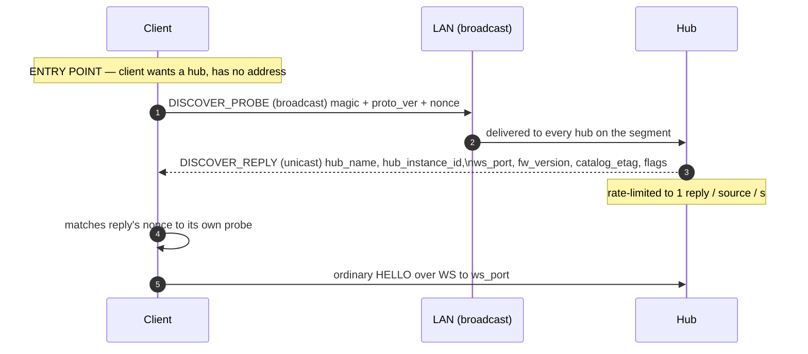

<!-- ==========================================================
     GENERATED FILE — DO NOT EDIT.
     Source of truth: spec/SPEC.md
     Generator:       docs-site/tools/gen_spec_pages.py
     Regenerate:      python docs-site/tools/gen_spec_pages.py
     CI gate:         python docs-site/tools/gen_spec_pages.py --check
     Normative text is copied verbatim. Hand edits are overwritten
     and fail the docs build. Edit the specification instead.
     ========================================================== -->

# Transport bindings and the relay role

## 13. Transport Bindings *(normative)* {#s13}

### 13.1 The binding contract {#s13-1}

A binding implements four operations — `open`, `close`, `write(frame)`, `read → frame` — and declares its properties. Valence above the binding line is transport-blind. The matrix every implementation codes against:

| Binding | `max_frame` (header-incl.) | Payload MTU | Ordered | Reliable | Congestion signal | ESTOP preempt point | Worst-case added ESTOP delay* |
|---|---|---|---|---|---|---|---|
| WebSocket | 512 | 504 | yes | yes (TCP) | egress queue watermark | front of egress queue | in-flight TCP bytes |
| ESP-NOW | **250** | **242** | **no** | **no** | ACK-bitmask loss % | front of radio queue | one airtime slot (~1 ms) |
| BLE GATT | 244 (ATT_MTU 247 − 3) | 236 | notifications: yes | no (notify) / yes (write-rsp) | notify queue depth | front of notify queue | one connection interval |
| Serial (COBS) | 512 | 504 | yes | yes† | TX buffer watermark | byte-level injection | one frame length |
| In-process | configurable (default 250) | configurable | configurable | configurable | simulated | simulated | simulated |

\* added by the binding, beyond queue-front admission — see [§11.2](safety.md#s11-2)'s honesty clause H2. † USB CDC; raw UART is reliable in practice, CRC-carrying frames (ESTOP) self-protect, and the STATE/STREAM classes tolerate loss by design.

The ESP-NOW line is the **normative floor**: `min_transport_payload` = 242 comes directly from it, every mandatory control message and every STATE payload MUST fit it ([§9.1](channels.md#s9-1)), and anything relying on more is a per-binding luxury. A hub MAY advertise a smaller `max_frame` than its binding permits; it MUST NOT advertise a larger one.

**Conformance profiles (RFC-043).** Which bindings a hub MUST offer depends on what it is:

- **Base profile** (simulators, hosted hubs, relays, in-process test hubs): any **single** binding conforms. A hub with no radio at all — a desktop simulator talking only in-process, a hub behind an existing gateway — is a fully legitimate Valence citizen.
- **Hardware hub profile** (an embedded hub on radio-bearing silicon — every known target is ESP32-class WiFi+BLE): **BLE GATT is MUST**, the conformance floor, because it is the infrastructure-free path — no router, no credentials, phone-direct control and discovery, and the future WiFi-provisioning admin channel all want it. **WebSocket is SHOULD**, the preferred high-throughput path (dense streams, fat catalogs, multiple clients) and expected on all ESP32-class hardware. **ESP-NOW** is the supported ESP32-peer/remote binding: deliberately trivial to enable, not itself conformance-relevant.
- **Serving a UI is a capability, never a conformance requirement.** A hub with no web assets to serve is fully conformant, and a client MUST NOT assume the hub it is talking to serves one.
- **Clients SHOULD auto-upgrade BLE→WS** whenever both ends can: BLE is how a client *finds and provisions* a machine, WS is how it *streams* to one ([§6.3](session.md#s6-3)'s transport migration carries the session across the hop).

All of the above is availability policy, stated so a client knows what to expect from an arbitrary hardware hub — it changes no wire format.

### 13.2 WebSocket {#s13-2}

Subprotocol **`valence.v1`** in the upgrade handshake — this is version negotiation for free, and it lets a legacy protocol coexist on a different path or subprotocol during migration. **The server MUST perform RFC 6455 subprotocol selection and echo `valence.v1` in the upgrade response.** Strict clients hard-fail without the echo — two independent WS server libraries had to be patched to comply, which is why this is a sentence rather than an assumption. One Valence frame = one WS **binary** message; no batching at the WS layer, since bundles already amortize. Text messages on a `valence.v1` socket are a protocol error (close 1002). The server is the hub. RECOMMENDED endpoint: `/valence` on the primary HTTP port.

### 13.3 ESP-NOW {#s13-3}

Datagram binding: 250-byte payload − 8-byte header = 242. Unicast per peer where peers are few; broadcast segments follow [§10.6](qos.md#s10-6).

Reliability layer: every data frame carries its header seq; receivers emit a batched **ACKMASK** frame (`0x16`, raw, channel 0) every 10 ms — payload `base_seq:u16, mask:u32` — acknowledging seqs `base..base+31`. Senders use the resulting loss rate as the [§10.3](qos.md#s10-3) congestion signal. There is **no retransmission of STATE or STREAM** (those classes do not need it); control-plane frames use stop-and-wait retransmit (3×, 100 ms) keyed on the ACK mask. Discovery and pairing broadcast: [§13.7](#s13-7).

### 13.4 BLE GATT {#s13-4}

A NUS-shaped service (one write characteristic c→h, one notify characteristic h→c) carrying Valence frames as characteristic values, each ≤ ATT_MTU − 3.

**Identity is pinned, not per-implementation (RFC-046 item 1).** Every conformant BLE hub advertises the **same** GATT service, so a client scans for exactly one thing: service UUID `56414C45-4E43-4531-8000-000000000001` (`ble_identity.service_uuid`; the first three groups spell `VALE`/`NC`/`E1` in ASCII, deliberately, so the UUID is greppable and mnemonic rather than an opaque v4), write characteristic (c2h) `...-8000-000000000002`, notify characteristic (h2c) `...-8000-000000000003`. This is the phone-facing twin of the ESP-NOW `BEACON` frame's own per-binding discovery ([§13.7](#s13-7)).

**Advertising payload (RFC-046 item 2).** Within the legacy ≤ 31-byte advertising budget: the service UUID and a shortened hub name. The fuller name and one flags byte (`ble_adv_flags`) ride the **scan response** instead (active scan required to read it) — the advertisement's own budget (service UUID + shortened name = 27 B) has no room left for a 5 B Manufacturer-Specific-Data record alongside them: bit0 `pairing_window_open` (a [§12.3](security.md#s12-3) association window is open right now — same meaning as the BEACON frame's pairing-open flag), bit1 `ws_available` (the hub currently has a live IP and a listening WebSocket port — RFC-043's signal that a connected client SHOULD auto-upgrade to WS, [§6.3](session.md#s6-3)). Bits 2–7 are reserved and MUST be zero. The endpoint itself — which port, which address — is not squeezed into this byte; it rides WELCOME's `ws_port`/`ipv4` ([§6.3](session.md#s6-3)) once the client has connected and can spend CBOR map keys on it.

Clients SHOULD negotiate MTU ≥ 250 and enable data-length extension **before catalog transfer**; below that the binding declares its real MTU and the 242-byte STATE-fit rule still governs catalog *design*, while control frames fragment per [§5.6](wire-format.md#s5-6) and data frames are sized to the declared MTU at grant time by bundling less. A client stuck at the legacy 23-byte MTU cannot carry a full STATE frame at all and pays a long one-time catalog transfer (visibly SYNCING) or ships the [§8.5](catalog.md#s8-5) static profile. Static-profile clients are the expected BLE norm.

### 13.5 Serial {#s13-5}

Byte pipe → **COBS** framing, delimiter `0x00`: encode each Valence frame with COBS and append `0x00`.

ESTOP scanning: the [§5.5](wire-format.md#s5-5) magic is matched on the **decoded** stream; additionally, because COBS never produces `0x00` inside a frame and re-synchronizes at every delimiter, a receiver in an unsynced or corrupt state MUST still run the four-`0xE5` scanner on **raw** bytes between delimiters. `0xE5` survives COBS encoding unchanged when no zero bytes occur in the window, and the CRC validates any candidate either way.

### 13.6 In-process (the conformance binding) {#s13-6}

The in-process binding connects hub and client roles inside one process (desktop simulator, unit tests). It is a **first-class conformance instrument** and therefore MUST support: configurable MTU (down to 242 and below), injected loss/reorder/duplication rates, injected latency and jitter, and a **deterministic mode** (seeded fault schedule plus injected clock) in which a run is bit-reproducible. The behavioral tests of [§17.3](conformance.md#s17-3) run against it; an implementation without fault injection cannot claim conformance testing.

### 13.7 Discovery {#s13-7}

- **mDNS/DNS-SD (WS clients):** service `_valence._tcp`; TXT records `v=1`, `name=<hub name>`, `etag=<hex>`, `pairing=<open|closed>`. Browsers cannot mDNS-browse; a hub-served web UI connects to its own origin, so mDNS serves native applications and simulators. A manually-entered address MUST always work — discovery is a convenience, never a requirement. **Discovery doctrine (RFC-046 item 6): mDNS is a free SHOULD for the one audience that can use nothing else** (browsers resolving a `.local` name) — it is not the primary WS-side path; [§13.8](#s13-8)'s UDP probe is.
- **BLE:** advertising payload and identity are pinned in [§13.4](#s13-4). BLE advertisement is the **primary** discovery path in general: it is physically present, needs no network, and works before the hub is even provisioned onto a WiFi network at all.
- **ESP-NOW:** the hub or its relay broadcasts a **BEACON** frame (`0x17`, raw, channel 0; payload: `boot_id`, catalog etag, pairing-open flag) every 500 ms **only while a pairing window is open**. New peers respond to beacons, then run PAIR_REQ over unicast. Outside the window, peers must already know the segment from a previous pairing.

**Discovery is an untrusted input.** A client that auto-connects to a discovered service is one malicious hub away from parsing hostile bytes; [§5.8-5](wire-format.md#s5-8) and [§12.5](security.md#s12-5) are what bound the consequences.

### 13.8 UDP discovery *(RFC-046 item 5)* {#s13-8}

A minimal broadcast probe/reply pair, and the **canonical WS-side discovery path for a LAN client without BLE** (a desktop shell, a streaming-application plugin, Intiface) — plain UDP sockets both ends, immune to the multicast/mesh-AP/Android failure modes that make mDNS unreliable in real homes, and simple enough to retire a hand-rolled DNS-SD query.

- **Port and magic** are registry-pinned (`udp_discovery`): port `22096` (`0x5650`, ASCII `VP` for "Valence Probe"), magic bytes `56 4C 4E 43` (ASCII `VLNC`) opening every probe and reply, mirroring the ESTOP frame's own magic-byte convention ([§5.5](wire-format.md#s5-5)).
- **DISCOVER_PROBE** (`0x1E`, raw, c2h): a client **broadcasts** `magic(4B) + proto_ver:u8 + nonce:u32` (client entropy, echoed in the reply so a client running several probes at once can match them).
- **DISCOVER_REPLY** (`0x1F`, raw, h2c): the hub **unicasts** back to the probe's source address: `magic(4B) + nonce:u32` (echoed) `+ hub_name:str32 + hub_instance_id:u64` (the hub's durable cross-boot identity, [§6.1](session.md#s6-1)/[§6.3](session.md#s6-3) — distinguishing two hubs sharing a name **across reboots**, which a per-boot value cannot do) `+ proto_ver:u8 + ws_port:u16 + fw_version:str16 + catalog_etag:8B + flags:u8` (bit0 `pairing_window_open`, the same philosophy as the ESP-NOW BEACON payload, plus the endpoint a BEACON has no room for). `str16`/`str32` are the fixed-width zero-padded field types of [§5.4](wire-format.md#s5-4)/RFC-026. **RFC-048 correction (operator veto of an RFC-046 decision, at landing):** this field originally carried the hub's `boot_id` (u32); RFC-046's own entry flagged that choice for veto because a boot-scoped id cannot deduplicate two hubs sharing a name across a reboot, which is this field's entire job. The reply's total payload grows from 72 to 76 bytes (the four-byte `u32`→`u64` widening); no other field moves. This layout landed with zero implementations, so the correction is free.
- **Read-only identity, no control surface.** A probe cannot command anything, and a reply discloses nothing a passive observer of a normal WELCOME could not already learn. Replies are rate-limited to `udp_discovery.reply_rate_limit_per_source_s` (1) **per source address**, so a probe storm cannot load the hub — the same posture as the BEACON frame's own broadcast cadence.
- A manually-entered address MUST still always work; this, like every discovery mechanism, is a convenience.

*A probe storm from one source only ever gets one reply per second — the
loop that would otherwise exist (retry until an answer arrives) is a client
policy, not a protocol requirement, because a manually-entered address is
always an equally valid entry point.*

**Discovery doctrine, restated for this binding:** BLE advertisement remains primary where BLE is available at all ([§13.7](#s13-7)); the UDP probe is the WS-side discovery a LAN client without BLE should use in preference to mDNS.

## 14. Relay Role *(normative)* {#s14}

### 14.1 Forwarding {#s14-1}

A relay bridges the hub's reachable transports to segments it cannot reach. Rules:

- A relay forwards **frames, not sessions**: it does not parse control-plane CBOR, does not hold grants, and is invisible to the session layer except as specified here. Clients behind a relay hold ordinary sessions with the hub.
- **Priority-aware buffering:** a relay MUST maintain at least two queues per direction — critical (the never-shed set plus the ESTOP fast path) and everything else — and MUST apply [§10.4](qos.md#s10-4)-style shedding when its downstream is slower than its upstream, **including the segment exception**: it decimates `samples`-kind streams and conflates STATE by replacing queued frames for the same channel with newer ones, but it MUST NOT decimate a `segments`-kind stream. A relay that blindly FIFOs is non-conformant: it converts congestion into latency, which for motion data is the worst outcome ([§9.2](channels.md#s9-2)).
- A relay MAY further decimate below granted rates when its segment demands it; the hub's congestion machinery observes the resulting loss and re-grants honestly ([§10.3](qos.md#s10-3)), so the system converges without the relay speaking the grant protocol.

### 14.2 ACK aggregation and the ESTOP fast path {#s14-2}

- **Reliability is hop-by-hop.** The relay acknowledges what it receives from its segment and takes responsibility for upstream delivery, and vice versa. There are no end-to-end transport acknowledgments across a relay.
  **HONESTY CLAUSE (H10), stated plainly:** the hub knowing a frame reached the relay does **not** mean the client got it. This is safe because no protocol correctness depends on transport delivery — STATE re-pushes, STREAM tolerates loss, and the only end-to-end confirmations that exist are protocol-level: **INTENT ⇒ ECHO** and **ESTOP ⇒ observed latch**.
- **ESTOP fast path:** on matching the four-`0xE5` magic with a raw scanner — no deframing, no queueing — a relay MUST transmit the frame onward on **all** attached segments ahead of every queued frame, then resume normal operation. CRC validation MAY be deferred to endpoints when the relay's budget is tight: forwarding a corrupt candidate costs 12 bytes; dropping a real one costs much more.

### 14.3 Timestamp correction and limits {#s14-3}

A relay that buffers — adds more than 1 ms of asymmetric delay — MUST satisfy **exactly one** of:

**(a) correct** — stamp arrival and, on transmit, rewrite STREAM `t_base` by its holding time;
**(b) be CLOCK-transparent** — forward CLOCK frames with strict priority, under 1 ms of added delay;
**(c) drop CLOCK frames entirely** ([§7.1](time.md#s7-1)), degrading its clients to WELCOME-bootstrap accuracy.

Silent uncorrected buffering of CLOCK is non-conformant. Note that (a) matters doubly for `segments`-kind streams, where `t_base` is a **schedule**, not an observation ([§5.4](wire-format.md#s5-4)): an uncorrected relay does not merely blur a graph, it moves commands in time.

**The relay ESTOP latency budget (RFC-049f).** A relay MUST forward an ESTOP-class frame ahead of every buffered frame on all attached segments ([§14.2](#s14-2)) and MUST add no more than **one binding-native frame-transmission time** in doing so. Composed with H2's per-hop accounting, the end-to-end ESTOP guarantee across a single relay is the binding's own worst-case added latency ([§13.1](#s13-1)) **plus exactly one relay-hop budget** — never an unbounded function of the relay's queue depth. This is the same H2/[§13.1](#s13-1)-style worst-case accounting the transport matrix already states, extended one hop further.

**Relays MUST NOT chain — one relay hop maximum in v1 — and the reason is architectural, not arbitrary (RFC-049f).** The ESTOP budget above and [§13.1](#s13-1)'s worst-case-added-latency accounting are bounded specifically *because* there is exactly one hop to bound: a chain of relays would compound that worst case with no ceiling the spec states — two 250 ms buffering relays in series could turn a binding's 50 ms guarantee into 550+ ms and nothing here would call it non-conformant. v1 also defines no routing or loop-protection protocol a relay could use to discover, bound, or refuse a chain it finds itself part of; chaining without that missing machinery is unsafe, not merely unspecified. Multi-hop is a v2 problem nobody currently has, and it gets its own RFC precisely when a real topology needs the routing and multi-hop latency accounting this one lacks — not because chaining is conceptually forbidden.
