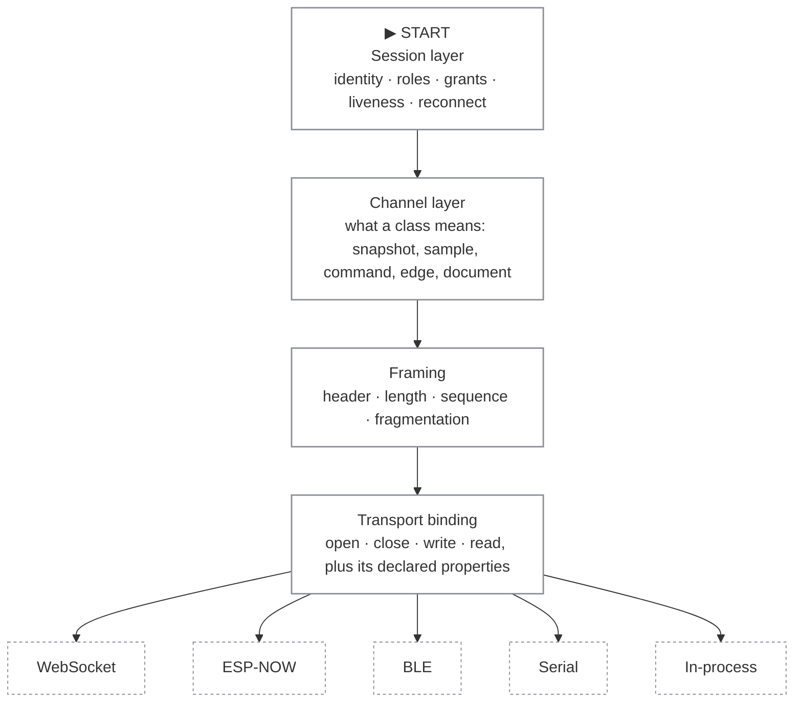

# Anatomy of a frame

Everything Valence sends is a [frame](../reference/dictionary.md#frame). A
frame is an eight-byte header followed by a payload.

This is the only page in this section that shows bytes. Read
[How it works](how-it-works.md) first; this page explains the envelope that
carries everything on it. The same colors apply: blue is measured truth,
purple is a request, amber and red are safety.

## 1. Four layers, four jobs

What each layer is responsible for, and what it deliberately knows nothing about.

**The point.** Everything above the binding line is transport-blind. A binding is four operations plus an honest declaration of what it can do, so adding a transport never changes the protocol above it.

| Layer | Owns | Knows nothing about |
|---|---|---|
| Session | Who this client is, what it may do, what it was granted, how silence is detected | How bytes travel |
| Channel | What a class promises: a snapshot supersedes, a sample is one instant, a command is confirmed | Which transport carries it |
| Framing | Where a frame starts and ends, which channel it belongs to, its sequence number | What the payload means |
| Transport binding | Moving one frame, and declaring its own size limit, ordering and reliability | Anything about sessions or channels |

**The weakest transport writes the rules.** Every guarantee is stated against
unordered, lossy, 242-byte datagrams. Anything correct there is correct
everywhere, and a reliable transport simply gets stronger behavior for free.

## 2. Every frame starts the same way

The eight-byte header, byte by byte, and the payload that follows it.

012345678910+

<b>type</b>u8

<b>flags</b>u8

<b>channel</b>u16

<b>seq</b>u16

<b>len</b>u16

<b>payload</b>len bytes

**The point.** The header is the same eight bytes on every transport and for every frame type. A receiver can therefore skip a frame it does not understand instead of disconnecting, because the length is always in a place it can read.

| Field | Size | Its job |
|---|---|---|
| `type` | 1 byte | Which kind of frame this is. The [frame type table](../reference/registry/frames.md) lists every one. |
| `flags` | 1 byte | Fragmentation marks. Unlisted bits are sent as zero and ignored on receipt. |
| `channel` | 2 bytes | Which catalog channel this belongs to. Session-scoped frames use zero. |
| `seq` | 2 bytes | The [sequence number](../reference/dictionary.md#sequence-number), per channel and per direction. Classes that do not need it send zero. |
| `len` | 2 bytes | Payload length. This is what makes a frame self-delimiting on a transport that is a byte pipe rather than a message queue. |

> DEMO-CANDIDATE: a live frame trace — capture real bytes off a running hub
> and highlight this eight-byte header, field by field, against the table
> above.

Three rules hang off this header, and together they are why an old client keeps
working against a new machine.

**Unknown means ignore.** An unknown frame type, an unknown channel, an unknown
key: skip it and carry on. No endpoint may disconnect or flood a log over
novelty. The sender of something new carries the burden of making it ignorable.

**One frame is one message** wherever the transport allows it. Fragmentation
exists only for large control frames on small-datagram transports. Data frames
never fragment.

**Emergency stop is deliberately different.** The stop frame is twelve bytes,
starts with a four-byte magic pattern, and carries a CRC. A receiver can
recognize it in a raw byte stream without decoding anything, which is what lets
every queue on the path admit it at the front. Its bytes are specified in
[the safety codes reference](../reference/registry/safety.md).

## 3. Two encodings, and why there are two

The header never changes. The payload is encoded one of two ways, and the
choice follows how often the frame is sent.

The same two numbers, encoded for the data plane and for the control plane.

**Packed, on the [data plane](../reference/dictionary.md#data-plane).** One
motion sample: a target position and a velocity. No keys, no type tags, nothing
but values in the order the catalog declared.

0123

<b>target</b>u16

<b>velocity</b>i16

**CBOR, on the [control plane](../reference/dictionary.md#control-plane).** The
same two numbers as a map. Each key is an integer from one registry, and each
value carries its own type.

01234567

<b>map(2)</b>1 byte

<b>key</b>target

<b>value</b>uint

<b>key</b>velocity

<b>value</b>negative int

**The point.** Self-description costs bytes. A frame sent hundreds of times a second does not pay that cost, and a frame sent when somebody presses a button gladly does. Same numbers here: four bytes packed, eight as a map.

| | Packed layout | CBOR map |
|---|---|---|
| Used by | STATE and STREAM — the data plane | Everything that negotiates, commands or confirms |
| Sent | Continuously, up to hundreds of times a second | Occasionally |
| Self-describing | No. The catalog's [layout](../reference/dictionary.md#layout) is the only reader | Yes. Every value carries its type, every key means one thing everywhere |
| Decoding cost | A field read at a known offset | A small parser, or a canned template on a device too small for one |
| Evolution | Append at the tail only. Old readers parse the prefix they know | Add a key. Old readers ignore what they do not recognize |

Both halves of that last row are the same promise made twice, which is the
reason for the split.

**A layout may only grow at the tail.** Fields are never reordered, resized or
removed. A client compiled a year ago still reads every field it knows from a
machine whose catalog has grown since. Changing a field means allocating a new
channel and retiring the old one, which keeps its number forever.

**A map may only gain keys.** A client that meets a key it has never seen skips
the pair. This is the same tolerance rule as the header's, applied one level
down.

One more restriction earns its keep. Valence uses a deterministic
[CBOR](../reference/dictionary.md#cbor) profile: definite lengths,
shortest-form integers, sorted keys, no tags. Any message therefore has exactly
one valid encoding. That is what lets test vectors compare byte for byte, and
what lets a client too small for an encoder ship a canned template and patch
values into it, knowing the bytes are what a real encoder would have produced.

## Where to go next

- [How it works](how-it-works.md) — the mental model these frames serve.
- [Frame types](../reference/registry/frames.md) — every type, generated from
  the registry.
- [CBOR keys](../reference/registry/cbor-keys.md) — every key, generated from
  the registry.
