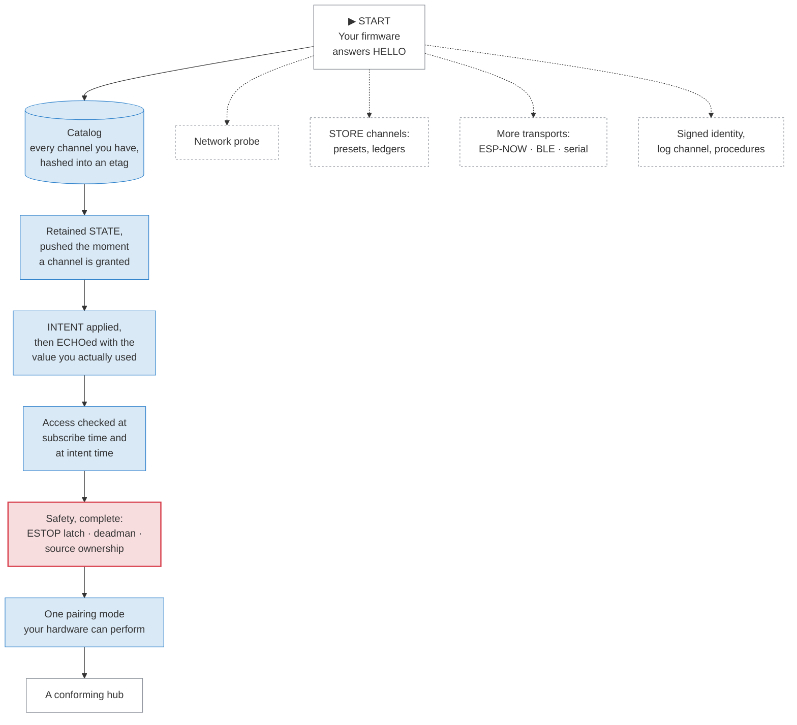

# Capabilities and what they mean for custom hardware

"Can my board do this?" is the first question a builder asks. This page
answers it with a checklist rather than a promise.

The floor is low on purpose. A hub with no screen, no LED and no buttons
supports the full protocol, including pairing. The rest of this page says what
that costs.

## 1. A feature exists if its channels exist

Valence has no feature list. It has a
[catalog](../reference/dictionary.md#catalog), and
[capability discovery](../reference/dictionary.md#capability-discovery) is
reading it.

A machine with a current sensor declares a power channel. A machine without
one does not, and that absence **is** the answer to "does it measure
current?". A client finds out by looking, never by asking.

**The point.** A second list is a second truth, and a second truth drifts from the first one. Your firmware already declares what it has, once, in the place clients already read. Adding a capability is adding its channels.

The same rule covers ceilings and units. A client that needs your speed limit
does not hardcode a number for your board. It finds the field carrying the
[field role](../reference/dictionary.md#field-role) it wants, and reads the
limit your catalog declares.

> DEMO-CANDIDATE: a live catalog browse — point it at a real hub (or the
> simulator) and watch channels, units and limits populate from nothing but
> the connection, no driver installed.

## 2. The hub floor

What every conforming hub owes, and what it may skip. The spine is mandatory; the dashed branches are not.

**The point.** Every mandatory item is something your firmware already does internally. The protocol asks you to expose it honestly. It does not ask you to invent new machinery.

### The checklist

| A conforming hub | Why it is mandatory |
|---|---|
| Answers the handshake, then serves its catalog and [etag](../reference/dictionary.md#etag) | Without it a client cannot know what you are |
| Declares every channel it has, with type, unit, limits and access level | This is the whole self-description. Nothing else advertises a feature |
| Keeps the [retained value](../reference/dictionary.md#retained-value) of every STATE channel and pushes it on grant | This is the device-shadow primitive. "Page load adopts device state" compiles to this |
| Sends full snapshots, never deltas, and fits each one in a single frame | One lost frame has to stay harmless |
| Applies an [intent](../reference/dictionary.md#intent), then [echoes](../reference/dictionary.md#echo) the post-[clamp](../reference/dictionary.md#clamp) value | Echoing the request instead of the result is the ground-truth defect |
| Enforces access when a client subscribes and when it sends | The catalog is the same for everyone. The gate is at use |
| Implements safety completely: the stop levels, the ESTOP [latch](../reference/dictionary.md#latch), the [deadman](../reference/dictionary.md#deadman), [source ownership](../reference/dictionary.md#source-ownership) | There is no unmonitored path to motion |
| Accepts `stop` and `estop` from any session, including a `watch` one | The person in the room may always stop the machine |
| Serves at least four concurrent sessions | Below that, a phone plus a web page plus a bridge already fails |
| Offers at least one [pairing](../reference/dictionary.md#pairing) mode | Otherwise `control` means nothing |
| Meets [parser totality](../reference/dictionary.md#parser-totality) | Your hub parses bytes sent by strangers |

Every size, timeout and floor quoted here lives in the generated
[limits table](../reference/registry/limits.md). The named
[conformance profiles](../reference/dictionary.md#conformance-profile) live in
[the specification](../spec/index.md).

### What is genuinely optional, and what each one costs

| Optional | What it costs you | What you give up |
|---|---|---|
| The network probe | A timed burst, and a small reply to parse | Grants start conservative and adapt at runtime instead |
| [STORE](../reference/dictionary.md#store) channels | Somewhere to keep documents. The transfer verb is one you already have | No presets, and no enumerable paired-device list |
| Procedures | Progress state for one long operation | A long operation looks like a frozen intent |
| The log channel | A bounded ring and a drop counter | Clients that are not browsers cannot see your logs |
| More transports | One binding each: open, close, write, read | Only the transports you did implement |
| Signed hub identity | A keypair, and one signature per session | A clone machine cannot be told apart from yours |
| The [served-page token](../reference/dictionary.md#served-page-token) | An HTTP endpoint, and only if you serve a web page | Your own page pairs like any other client |
| The relay role | Two queues per direction, plus an ESTOP fast path | No bridging to a transport the hub cannot reach |
| Encrypted transport | Certificate handling, and the memory it wants | Nothing the v1 threat model already claims |

Skipping an optional feature is not a degraded mode. A hub that does not
declare a channel simply does not have it, and clients learn that the same way
they learn everything else.

## 3. The client floor

The client floor is smaller than the hub floor on purpose. Clients are where
the tiny hardware lives.

| | |
|---|---|
| **Parser** | One. There is no second wire grammar to implement. |
| **Cryptography** | None required. A raw token is a legal way to present credentials. |
| **Stored identity** | 24 bytes: an 8-byte [instance id](../reference/dictionary.md#instance-id) and a 16-byte [token](../reference/dictionary.md#token). |
| **Frame budget** | Every mandatory message fits the 242-byte floor, which is the smallest transport's payload. |
| **Clock** | None. All timestamps are hub time, and a client converts with an offset it learns. |
| **Heap** | None in steady state. The reference library allocates nothing once it is running. |

A [constrained client](../reference/dictionary.md#constrained-client) goes
further and ships no CBOR parser at all. It compiles in the catalog it was
built against. It ships canned message templates and patches values into them
at runtime. The deterministic encoding is what makes that safe: those bytes
are exactly what a real encoder would have produced.

That profile carries one obligation, and it is the interesting one. The client
sends its compiled-in etag in the handshake. If the hub's etag differs, the
client must take a declared behavior. It may run degraded, with every control
function it cannot re-verify suppressed. It may refuse, and show an "update
me" indication. Silent full operation on a mismatched etag is non-conformant.

**The point.** The append-only layout rule means a mismatched etag rarely breaks *parsing* — the known prefix of every layout still reads. So the etag check decides **policy**, not parseability. An old remote keeps showing what it understands, and stops offering what it can no longer verify.

## 4. Pairing with no screen, no LED and no buttons

Pairing is usually where low-capability hardware gets excluded. A ceremony
needing a keypad on the joiner and a display on the hub rules out most devices
in this ecosystem.

Valence has one ceremony and three association modes. All three end in the
same grant. The role is an attribute of the grant, never of the ceremony, and
a hub has zero or one PIN rather than one secret per tier.

| Mode | The joiner needs | The hub needs |
|---|---|---|
| [Knock-and-approve](../reference/dictionary.md#knock-and-approve) | One button | Nothing. Any `configure` session approves |
| PIN proof | A keypad, and an HMAC | A surface that can show four digits |
| [Push-to-pair](../reference/dictionary.md#push-to-pair) | One button | Nothing. Physical presence is the proof |

Read the first and third rows again. **A hub with no display, no LED and no
button still pairs devices.** The trusted surface is any `configure` client,
and the presence proof is the power cord.

On a bare board it goes like this:

1. A factory-fresh hub holds no `configure` token, so it boots claimable.
2. The first client that knocks is granted `configure`. Whoever unboxed the
   machine and powered it possesses it.
3. To re-open pairing later, power-cycle three times. Each of those boots
   lasts under about ten seconds. The next boot opens a short window that
   grants once.
4. That `configure` client now approves everyone else. It renders the pending
   list, because the pending list is ordinary protocol state.

The window is visible in band, which matters when there is no lamp to look at.
Any `watch` session sees that pairing is open, in state and in events, while
being trusted with nothing.

A hub with a real button may bind it as the pairing control. A hub with
addressable lighting should show a pairing state. Both are usability upgrades.
Neither is required, and neither is what makes the ceremony work.

**The point.** Factory reset must be a deliberately harder gesture than opening pairing. If wiping the token store were the same gesture, the safest recovery path would also be the cheapest attack.

## 5. A worked example: a two-button remote

Take a battery remote with two buttons, a small radio and no display. Walk it
from nothing to conforming.

**It is a constrained client.** It compiles in the catalog of the machine it
ships beside, plus that catalog's etag. It carries canned templates for the
three messages it sends.

**It stores 24 bytes.** Its instance id, generated once, and its token after
pairing.

**It pairs by knocking.** One press of both buttons sends a bare pairing
request. The owner approves it from a phone or a web page. Or the remote is
the very first client, and the machine is factory-fresh.

**It subscribes to two channels** and renders them: a position stream and the
safety word. It shows itself as unready until its first snapshots arrive,
because showing stale data as fresh is the failure this whole design prevents.

**It sends one intent per press**, absolute and never relative. It renders
what the echo reports, not what it asked for.

**It stops the machine** with a role-exempt safety operation, and repeats
until it observes the latch. It needs no permission for that. The
repeat-until-latched rule is what makes a lossy radio acceptable here.

That is a conforming controller client. Nothing on that list needs a
filesystem, a heap, a clock or a cryptographic library.

## 6. What the floor deliberately leaves out

- **No required cryptography.** It is recommended and never mandatory,
  because mandating it exiles the smallest hardware.
- **No wall clock.** The hub is the timebase, so a client without a real-time
  clock loses nothing.
- **No allocator in steady state.** Sizes are known up front, which is what
  makes a fixed-capacity implementation possible.
- **No required transport.** A binding is four operations plus an honest
  declaration of what it can do.
- **No mandated interface.** The catalog says what a value **is**. It never
  says how a value should look.

## Where to go next

- [How it works](how-it-works.md) — the mental model behind this checklist.
- [Anatomy of a frame](anatomy.md) — what your binding actually moves.
- [Local testing](../build/local-testing.md) — prove your hub against the
  probe and the simulator before you trust it.
- [Limits and defaults](../reference/registry/limits.md) — every number quoted
  here, generated from the registry.
