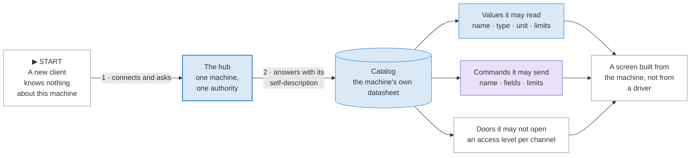
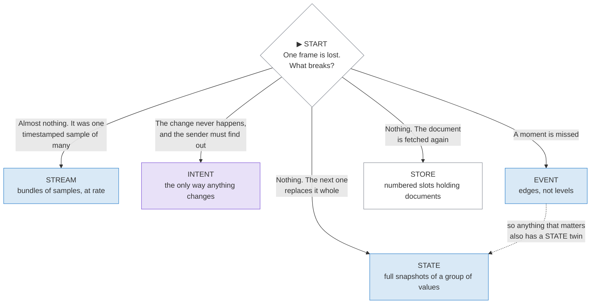
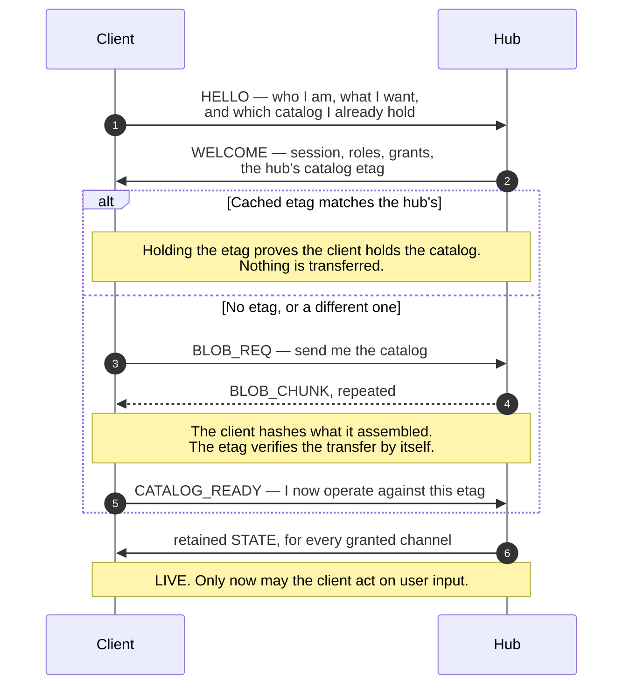
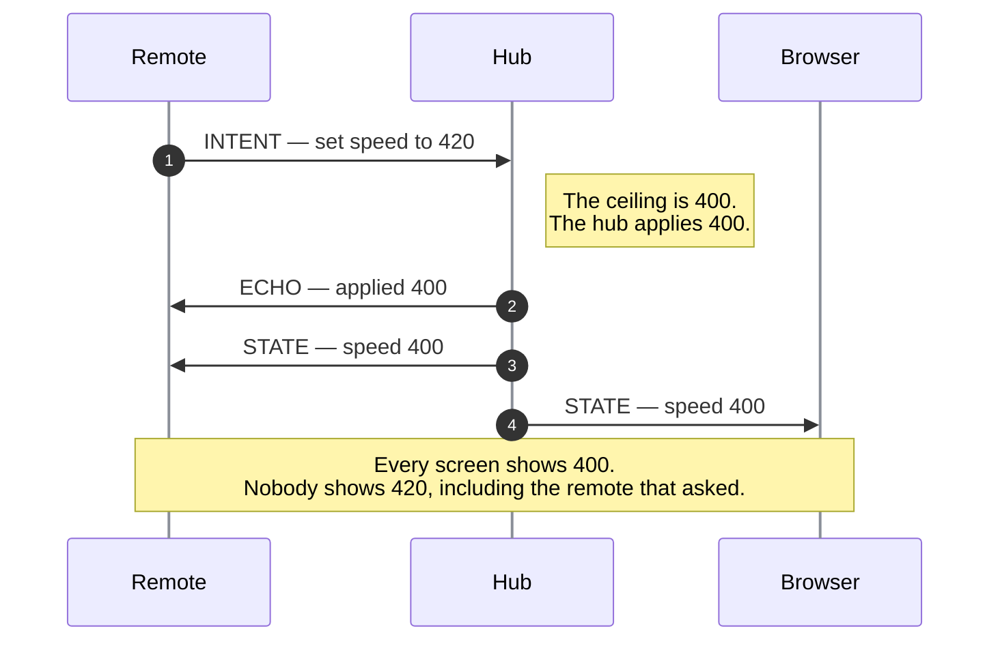
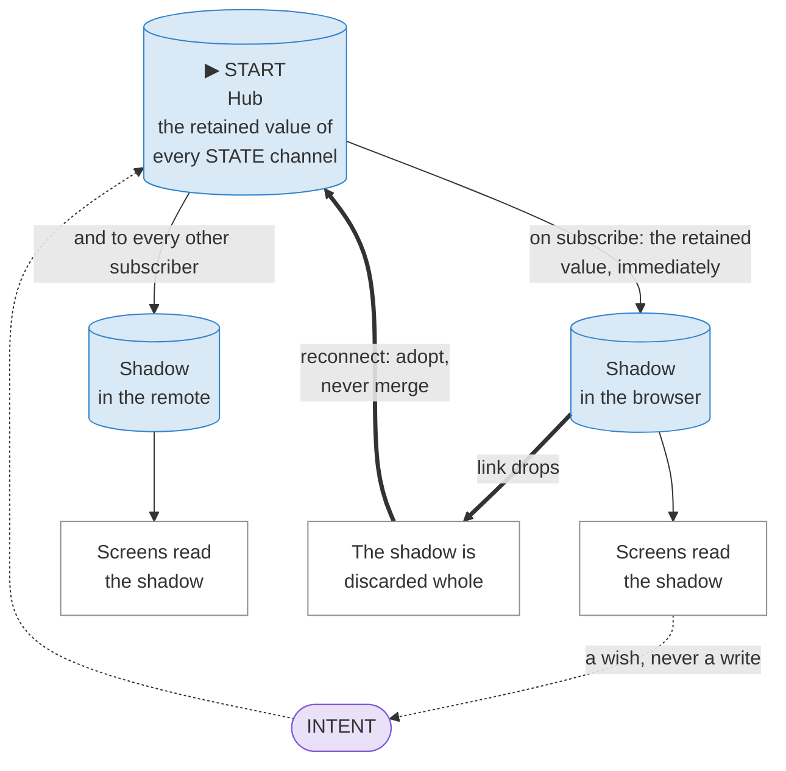
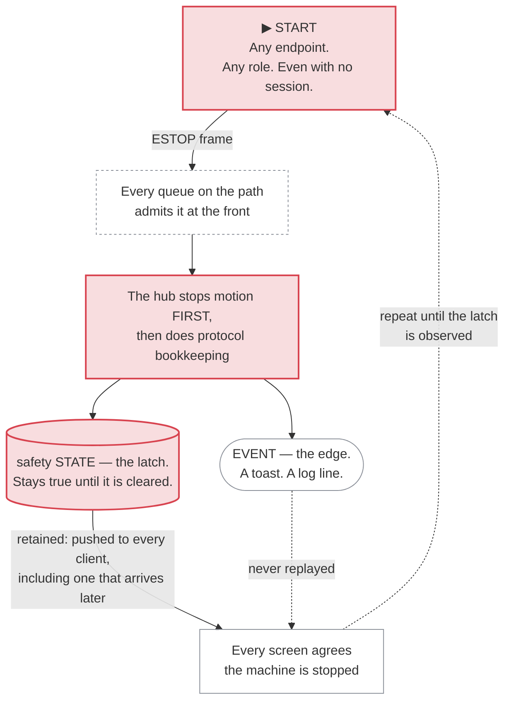
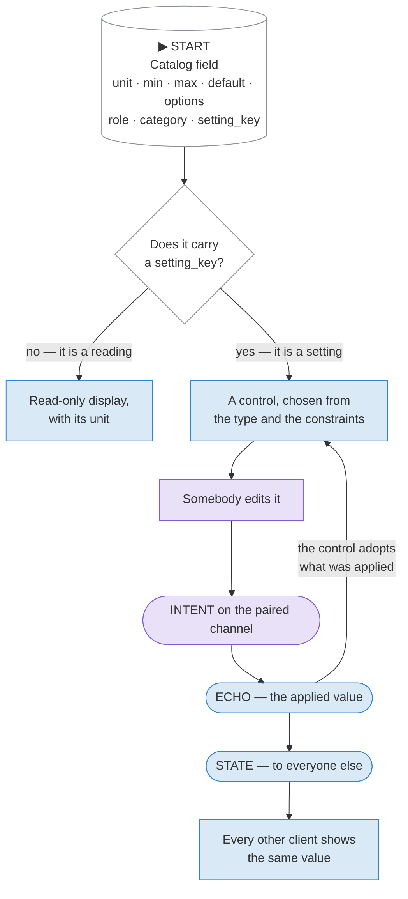

# How it works

A Valence machine describes itself. A client reads that description and builds
its interface from it. Everything on this page follows from those two
sentences.

This page is mostly pictures. Read them in order. You need no prior knowledge
of this protocol, of CBOR, or of motion control.

## How to read these diagrams

Every diagram on this site uses one visual language. Learn it once here.

<b>reality</b>Measured truth. What the machine actually did, applied, or is reporting now.
<b>intent</b>A wish. What somebody asked for, before the machine confirms anything.
<b>safety</b>Stops and latches. This color never carries a second meaning.
<b>rectangle</b>A party or a step: a hub, a client, a decision.
<b>cylinder</b>Something that persists somewhere.
<b>rounded</b>One frame, in flight on the wire.
<b>▶ START</b>Where a flowchart begins. Every flowchart on this site marks it.

The two colors are not decoration. They are the two colors the Nucleus
machine paints on its own screen: blue for what the machine measured or
applied, purple for what a person asked for. They mean the same thing in a
diagram, in a table and on the machine. Amber and red are safety, in the
documentation and on the machine alike, and neither may restyle them.

The distinction those two colors carry is the whole product. Hold on to it and
the rest of this page is straightforward.

## 1. The machine hands you its datasheet

A client that knows nothing connects, reads the machine's self-description, and from that alone knows everything it may read, everything it may send, and everything it may not touch.

**The point.** There is no device driver. The client is not compiled against this machine, and the machine is not compiled against this client. A control added in firmware appears on every client at its next connection, with the label, the unit and the limits supplied by the machine.

A [catalog](../reference/dictionary.md#catalog) entry describes one
**channel**. Each entry carries an id, a name, a class, a direction, an access
level, a maximum rate, and a field-by-field description of its payload. The
whole catalog is hashed into an [etag](../reference/dictionary.md#etag), which
names exactly which catalog a hub exposes. A client that already holds that
etag has nothing to download.

## 2. Five channel classes, chosen by one question

Ask what breaks if a single frame never arrives. The answer picks the class.

The loss question, and the five answers that are the five channel classes.

**The point.** Loss tolerance is designed in per class, not bolted on afterwards. Only intents demand an end-to-end confirmation, and only intents get one.

| Class | Carries | If a frame is lost |
|---|---|---|
| [STATE](../reference/dictionary.md#state) | A full snapshot of a group of values | Harmless. The next snapshot supersedes it. There are no deltas, ever. |
| [STREAM](../reference/dictionary.md#stream) | Timestamped [bundles](../reference/dictionary.md#bundle) of samples | Recoverable. Samples carry time, so a consumer interpolates across the hole. |
| [INTENT](../reference/dictionary.md#intent) | One absolute command | The change does not happen. The hub answers every intent with an [ECHO](../reference/dictionary.md#echo) or an error, so the sender finds out. |
| [EVENT](../reference/dictionary.md#event) | One occurrence, at one moment | A moment is missed. Events are never replayed, so no safety behavior may depend on one. |
| [STORE](../reference/dictionary.md#store) | Numbered slots holding opaque documents | Harmless. The client asks for the document again. |

Two rules follow from that table, and both are load-bearing.

**Every STATE frame is a full snapshot.** A delta would make one lost frame
corrupt everything after it. Full snapshots are also what make
[conflation](../reference/dictionary.md#conflation) safe: when a link is slow
the hub replaces the queued snapshot with the newer one, so a subscriber sees
the freshest truth its link can carry and never a backlog.

**Every event that matters has a STATE twin.** The event says *this just
happened*. The state says *this is still true*. A client that arrives after the
event adopts the state and needs no history.

## 3. Connecting: two paths, one gate

A cold client fetches the catalog; a returning client whose cached etag matches skips straight through. Both reach the same gate.

**The point.** The hub sends no state at all until the client has confirmed which catalog it decodes against. This is the [ready gate](../reference/dictionary.md#ready-gate). Without it a client would receive packed bytes it cannot interpret, and the only way to read them anyway would be a hardcoded copy of this machine's layouts — the exact coupling a catalog exists to remove.

Two other things happen in that handshake, and both matter later.

**Grants are truth; requests are wishes.** A client asks to receive a channel
at some rate. The hub answers with the rate it will actually deliver, and that
answer is a [grant](../reference/dictionary.md#grant). An interface showing a
rate it was never granted is lying about itself.

**A client stays visibly unready until it is LIVE.** The specification requires
the difference to be visible. Stale data displayed as fresh is the failure this
whole design exists to prevent.

## 4. Ground truth: 420 goes in, 400 comes out everywhere

A remote asks for a value above the machine's ceiling. Watch which number every screen ends up showing.

**The point.** The echo reports what the machine applied, never what the client requested. A client's [shadow](../reference/dictionary.md#shadow) updates from the hub's answer, never from its own request. This is why optimistic interface state is prohibited rather than discouraged: on a machine that moves, a screen that lies about state is a safety defect.

A control therefore does not jump to 420 while it waits. It shows the request
as **pending** and adopts the applied value when the echo arrives. Limits are
ceilings, never targets, and a [clamp](../reference/dictionary.md#clamp) is not
an error: 400 is simply the answer.

> DEMO-CANDIDATE: a live slider that lets a reader ask a real simulated hub
> for a value past its ceiling, and watch pending, echo and clamp happen in
> real time.

Two more rules let this survive a bad network.

**Intents are absolute, never relative.** "Set speed to 405" survives a
reconnect, because a client can compare it against the snapshot it adopts. "Add
20" cannot be reconciled against anything.

**A duplicate intent is harmless.** Each intent carries an id. The hub keeps a
small ring of recent ids and re-sends the stored echo for a repeat, instead of
applying it twice.

## 5. Where the data lives

The hub owns the only copy that counts. What a client holds is a shadow of it, and a shadow never survives a reconnect.

**The point.** No client state survives a reconnect on its own authority. The hub keeps the [retained value](../reference/dictionary.md#retained-value) of every STATE channel and pushes it the moment a client is granted the channel, so re-adoption is the ordinary connect path rather than a special recovery path.

A reconnecting client re-sends nothing blindly. It compares what it still wants
against the snapshot it just adopted, and issues an intent only if the two
still differ.

**Reconnecting is not re-taking control.** Subscriptions come back freely. If
the disconnection stopped motion, the returning session must ask for control
again with a fresh intent. Motion never restarts because a socket reopened.

## 6. Safety: the latch is the truth

An emergency stop from any endpoint, and why the latched state — not the event — is what every client obeys.

**The point.** There is no acknowledgment frame for an emergency stop. The initiator repeats the frame until it observes the [latch](../reference/dictionary.md#latch) in state. An observable latch is the only acknowledgment worth anything, because it is the same latch every other client is reading.

Safety outranks authorization by design. Anyone may stop the machine; not
everyone may start it. Clearing the latch needs the `control` tier, needs the
cause to be resolved, and re-arms motion rather than resuming it.

A machine also notices when nobody is watching it.
[Deadman](../reference/dictionary.md#deadman) binds to the source currently
driving motion. If that source goes silent for its window, the hub releases
its ownership — bookkeeping, not a command. Nothing broadcasts a forced stop:
a vanished streaming client was already the reason no fresh commands were
arriving, so motion settles by physics rather than by a safety action. A
pattern running on the hub keeps running by default, because a locked phone
screen was never what drove it; whether a given source keeps going or stops
when its owner disappears is that source's own declared policy, not a
universal deadman reflex.

## 7. A settings screen that builds itself

This is the payoff of everything above. A machine describes not only its values
but what they mean, so a client renders a complete settings surface it was
never written for.

One annotated catalog field becomes one control, and the loop from edit back to displayed value never shortcuts through the client's own guess.

**The point.** A field with a [setting_key](../reference/dictionary.md#setting_key) is a setting, and the key names the command that writes it. A field without one is a reading. That single annotation replaces the hand-written table every client used to keep, pairing each display to its control — the table that goes stale the day the firmware changes.

The catalog says what a value **is**. It never says how a value should
**look**. There is no widget field, deliberately. A phone renders a range as a
slider, a small remote as a click wheel, a desktop plugin as a numeric box:
same bytes, three honest interfaces.

| The annotation | What a client does with it |
|---|---|
| [`setting_key`](../reference/dictionary.md#setting_key) | Writable, and here is the command key that writes it. Absent means read-only. |
| `min`, `max`, `step`, `unit`, `default` | Choose and bound the control. The hub still validates; these are for display. |
| `options` | Name the choices of a single-select, instead of showing raw numbers. |
| [`role`](../reference/dictionary.md#field-role) | Say what the value *is* semantically, so a client that recognizes it **may** upgrade to a purpose-built control. Fallback is mandatory; upgrades are optional. |
| [`category`](../reference/dictionary.md#setting-category) | Which tab it belongs in, from a registered list, so placement stays consistent across different machines. |
| `flags` | `advanced` hides it behind an affordance, never removes it. `secret` means the value never appears in state at all — only whether it is set. |

A setting the machine cannot accept right now is grayed, never hidden. The
machine says so in its own state, and every client grays from that one truth.

The registered vocabularies — every category, role, flag and field type — are
in the [catalog vocabulary reference](../reference/registry/catalog-vocabulary.md),
generated from the registry.

## Where to go next

- [Anatomy of a frame](anatomy.md) — the eight bytes every frame starts with,
  and why there are two payload encodings.
- [Capabilities and custom hardware](capabilities.md) — what your device must
  provide to be a hub.
- [The Dictionary](../reference/dictionary.md) — every term on this page, with
  exactly one definition each.
