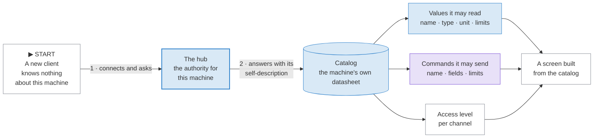
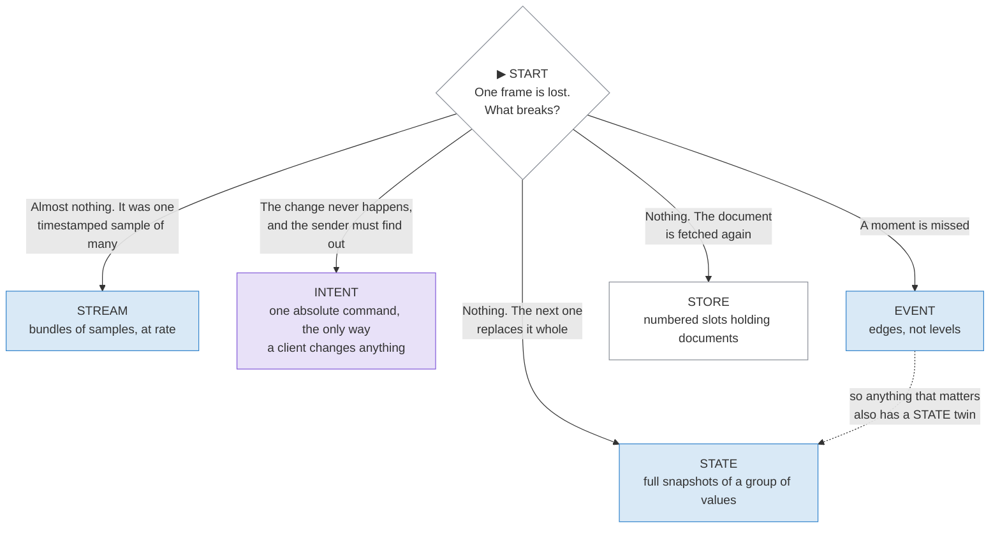
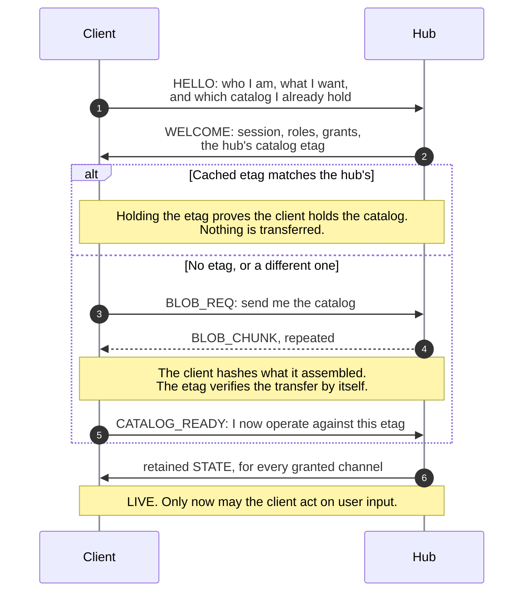
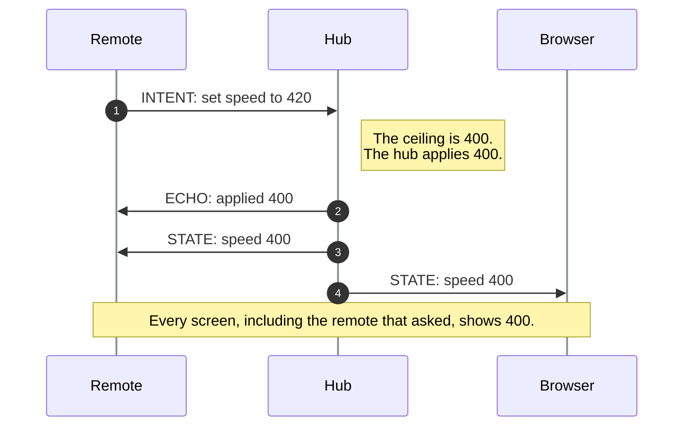
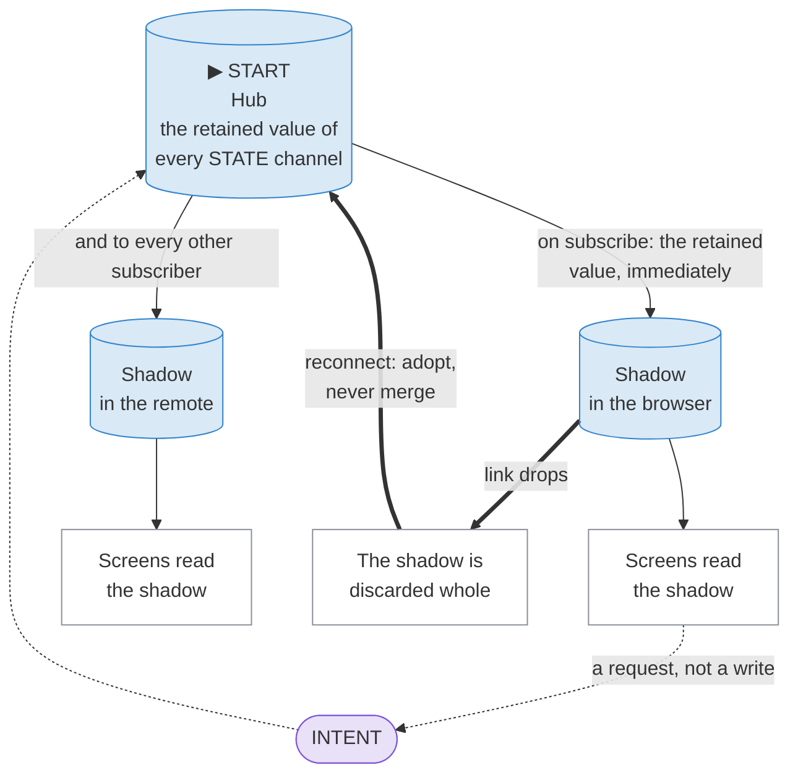
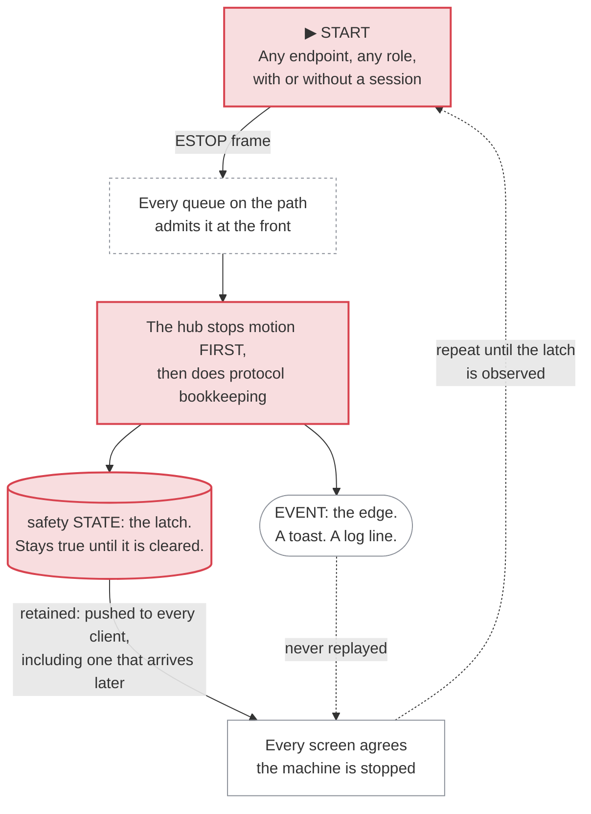
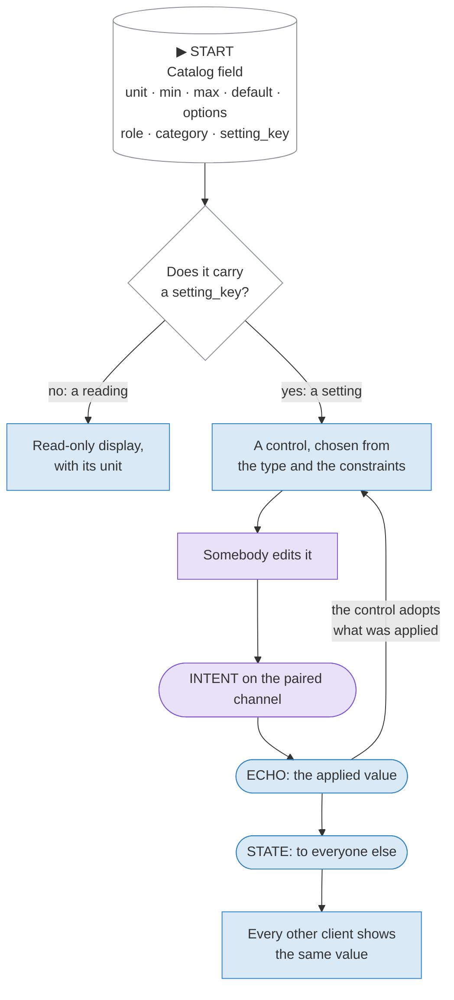

# How it works

A Valence machine describes itself. A client reads that description and builds
its interface from it.

This page covers the catalog, the five channel classes, connecting, ground
truth, where data lives, safety, and settings rendering.

## Diagram legend

Every diagram on this site uses one visual language.

<b>reality</b>Measured truth. What the machine did, applied, or is reporting now.
<b>intent</b>A request. What somebody asked for, before the machine confirms anything.
<b>safety</b>Stops and latches. This color never carries a second meaning.
<b>rectangle</b>A party or a step: a hub, a client, a decision.
<b>cylinder</b>Something that persists somewhere.
<b>rounded</b>One frame, in flight on the wire.
<b>▶ START</b>Where a flowchart begins. Every flowchart on this site marks it.

Blue and purple are the colors Nucleus paints on its own screen: blue marks measured or
applied values, purple marks requests. They mean the same in a diagram, a table and on the
machine. Amber and red mark safety in the documentation and on the machine, and a theme must not restyle them.

## 1. The catalog

A new client connects, reads the catalog, and learns which channels it may read, which commands it may send, and the access level of each.

```mermaid
flowchart LR
    C["▶ START<br/>A new client<br/>knows nothing<br/>about this machine"]:::party
    H["The hub<br/>the authority for<br/>this machine"]:::hub
    CAT[("Catalog<br/>the machine's own datasheet")]:::store
    R["Values it may read<br/>name · type · unit · limits"]:::truth
    W["Commands it may send<br/>name · fields · limits"]:::wish
    A["Access level<br/>per channel"]:::party
    UI["A screen built<br/>from the catalog"]:::party

    C -->|"1 · connects and asks"| H
    H -->|"2 · answers with its<br/>self-description"| CAT
    CAT --> R
    CAT --> W
    CAT --> A
    R --> UI
    W --> UI
    A --> UI

    classDef hub fill:#3183cc2e,stroke:#3183cc,stroke-width:2px
    classDef truth fill:#3183cc2e,stroke:#3183cc
    classDef store fill:#3183cc2e,stroke:#3183cc
    classDef wish fill:#8158d82e,stroke:#8158d8
    classDef party fill:none,stroke:#8a8f98
```

**The point.** A client carries no per-machine driver. Neither the client nor the firmware is compiled against the other. A control added in firmware appears on every client at its next connection, with the label, the unit and the limits supplied by the machine.

A [catalog](../reference/dictionary.md#catalog) entry describes one
**channel**. Each entry carries an id, a name, a class, a direction, an access
level, a maximum rate, and a field-by-field description of its payload. The
whole catalog is hashed into an [etag](../reference/dictionary.md#etag), which
identifies the catalog a hub exposes. A client that already holds that
etag does not download the catalog again.

## 2. Channel classes

The five classes differ in what a lost frame costs.

What a lost frame costs in each of the five channel classes.

```mermaid
flowchart TD
    Q{"▶ START<br/>One frame is lost.<br/>What breaks?"}:::party

    Q -->|"Nothing. The next one<br/>replaces it whole"| S["STATE<br/>full snapshots of a group of values"]:::truth
    Q -->|"Almost nothing. It was one<br/>timestamped sample of many"| ST["STREAM<br/>bundles of samples, at rate"]:::truth
    Q -->|"The change never happens,<br/>and the sender must find out"| I["INTENT<br/>one absolute command, the only way<br/>a client changes anything"]:::wish
    Q -->|"A moment is missed"| E["EVENT<br/>edges, not levels"]:::truth
    Q -->|"Nothing. The document<br/>is fetched again"| B["STORE<br/>numbered slots holding documents"]:::store

    E -.->|"so anything that matters<br/>also has a STATE twin"| S

    classDef truth fill:#3183cc2e,stroke:#3183cc
    classDef wish fill:#8158d82e,stroke:#8158d8
    classDef store fill:none,stroke:#8a8f98
    classDef party fill:none,stroke:#8a8f98
```

**The point.** Loss tolerance is designed in per class. Only INTENT has end-to-end confirmation: the hub answers each intent with an ECHO or an error.

| Class | Carries | If a frame is lost |
|---|---|---|
| [STATE](../reference/dictionary.md#state) | A full snapshot of a group of values | Harmless. The next snapshot supersedes it. There are no deltas. |
| [STREAM](../reference/dictionary.md#stream) | Timestamped [bundles](../reference/dictionary.md#bundle) of samples | Recoverable. Samples carry time, so a consumer interpolates across the hole. |
| [INTENT](../reference/dictionary.md#intent) | One absolute command | The change does not happen. The hub answers every intent with an [ECHO](../reference/dictionary.md#echo) or an error, so the sender finds out. |
| [EVENT](../reference/dictionary.md#event) | One occurrence, at one moment | A moment is missed. Events are never replayed, so no safety behavior may depend on one. |
| [STORE](../reference/dictionary.md#store) | Numbered slots holding opaque documents | Harmless. The client asks for the document again. |

Two rules follow from the table.

**Every STATE frame is a full snapshot.** A delta would make one lost frame
corrupt everything after it. Full snapshots are also what make
[conflation](../reference/dictionary.md#conflation) safe: when a link is slow
the hub replaces the queued snapshot with the newer one, so a subscriber on a
slow link receives the newest snapshot instead of a queue of old ones.

**Every event that matters has a STATE twin.** The event marks the moment of a
change; the STATE channel holds the condition for as long as it lasts. A client that arrives after the
event adopts the state and needs no history.

## 3. Connecting and the ready gate

A cold client fetches the catalog; a returning client whose cached etag matches skips the transfer; both then wait at the ready gate.

```mermaid
%%{init: {"themeVariables": {"actorLineColor": "#8a8f98"}} }%%
sequenceDiagram
    autonumber
    participant C as Client
    participant H as Hub

    C->>H: HELLO: who I am, what I want,<br/>and which catalog I already hold
    H->>C: WELCOME: session, roles, grants,<br/>the hub's catalog etag

    alt Cached etag matches the hub's
        Note over C,H: Holding the etag proves the client holds the catalog.<br/>Nothing is transferred.
    else No etag, or a different one
        C->>H: BLOB_REQ: send me the catalog
        H-->>C: BLOB_CHUNK, repeated
        Note over C,H: The client hashes what it assembled.<br/>The etag verifies the transfer by itself.
        C->>H: CATALOG_READY: I now operate against this etag
    end

    H->>C: retained STATE, for every granted channel
    Note over C,H: LIVE. Only now may the client act on user input.
```

**The point.** The hub sends no state at all until the client has confirmed which catalog it decodes against. This is the [ready gate](../reference/dictionary.md#ready-gate). Without it a client would receive packed bytes it cannot interpret, and the only way to read them anyway would be a hardcoded copy of this machine's layouts, which would tie the client to one firmware.

The handshake also sets two rules.

**A client displays the granted rate.** A client asks to receive a channel
at some rate. The hub answers with the rate it will deliver, and that
answer is a [grant](../reference/dictionary.md#grant). A client displays the granted
rate, never the requested one.

**A client stays visibly unready until it is LIVE.** The specification requires
the difference to be visible. A client never displays stale data as fresh.

## 4. Ground truth

A remote asks for a value above the machine's ceiling. Every screen shows the applied value.

```mermaid
%%{init: {"themeVariables": {"actorLineColor": "#8a8f98"}} }%%
sequenceDiagram
    autonumber
    participant R as Remote
    participant H as Hub
    participant B as Browser

    R->>H: INTENT: set speed to 420
    Note right of H: The ceiling is 400.<br/>The hub applies 400.
    H->>R: ECHO: applied 400
    H->>R: STATE: speed 400
    H->>B: STATE: speed 400
    Note over R,B: Every screen, including the remote that asked, shows 400.
```

**The point.** The echo reports what the machine applied, never what the client requested. A client's [shadow](../reference/dictionary.md#shadow) updates from the hub's answer, never from its own request. This is why optimistic interface state is prohibited rather than discouraged: on a motion machine, a display that shows a value the machine did not apply is a safety defect.

A control therefore does not jump to 420 while it waits. It shows the request
as **pending** and adopts the applied value when the echo arrives. A limit is a ceiling. A [clamp](../reference/dictionary.md#clamp) is a
successful result, and the echo carries 400.

> DEMO-CANDIDATE: a live slider that lets a reader ask a real simulated hub
> for a value past its ceiling, and watch pending, echo and clamp happen in
> real time.

Two rules cover unreliable links.

**Intents are absolute, never relative.** "Set speed to 405" survives a
reconnect, because a client can compare it against the snapshot it adopts. "Add
20" cannot be reconciled against anything.

**A duplicate intent is harmless.** Each intent carries an id. The hub keeps a
small ring of recent ids and re-sends the stored echo for a repeat, instead of
applying it twice.

## 5. Where the data lives

The hub holds the authoritative value. A client holds a shadow copy and discards it when the link drops.

```mermaid
flowchart TD
    H[("▶ START<br/>Hub<br/>the retained value of<br/>every STATE channel")]:::truth

    H -->|"on subscribe: the retained<br/>value, immediately"| S1[("Shadow<br/>in the browser")]:::truth
    H -->|"and to every other subscriber"| S2[("Shadow<br/>in the remote")]:::truth

    S1 --> V1["Screens read<br/>the shadow"]:::party
    S2 --> V2["Screens read<br/>the shadow"]:::party

    V1 -.->|"a request, not a write"| I(["INTENT"]):::wish
    I -.-> H

    S1 ==>|"link drops"| X["The shadow is<br/>discarded whole"]:::party
    X ==>|"reconnect: adopt,<br/>never merge"| H

    classDef truth fill:#3183cc2e,stroke:#3183cc
    classDef wish fill:#8158d82e,stroke:#8158d8
    classDef party fill:none,stroke:#8a8f98
```

**The point.** No client state survives a reconnect on its own authority. The hub keeps the [retained value](../reference/dictionary.md#retained-value) of every STATE channel and pushes it the moment a client is granted the channel, so re-adoption uses the ordinary connect path.

A reconnecting client does not re-send intents automatically. It compares what it still wants
against the snapshot it just adopted, and issues an intent only if the two
still differ.

**Reconnecting does not restore control.** Subscriptions come back freely. If
the disconnection stopped motion, the returning session must ask for control
again with a fresh intent. Reopening a connection does not restart motion.

## 6. Safety and the latch

An emergency stop from any endpoint; clients act on the latched safety STATE; the EVENT is informational.

```mermaid
flowchart TD
    A["▶ START<br/>Any endpoint, any role,<br/>with or without a session"]:::safety
    A -->|"ESTOP frame"| Q["Every queue on the path<br/>admits it at the front"]:::plumb
    Q --> H["The hub stops motion FIRST,<br/>then does protocol bookkeeping"]:::safety
    H --> L[("safety STATE: the latch.<br/>Stays true until it is cleared.")]:::safety
    H --> E(["EVENT: the edge.<br/>A toast. A log line."]):::party
    L -->|"retained: pushed to every client,<br/>including one that arrives later"| N["Every screen agrees<br/>the machine is stopped"]:::party
    E -.->|"never replayed"| N
    N -.->|"repeat until the latch<br/>is observed"| A

    classDef safety fill:#d8434f2e,stroke:#d8434f,stroke-width:2px
    classDef party fill:none,stroke:#8a8f98
    classDef plumb fill:none,stroke:#8a8f98,stroke-dasharray:3 3
```

**The point.** There is no acknowledgment frame for an emergency stop. The initiator repeats the frame until it observes the [latch](../reference/dictionary.md#latch) in state. An observable latch is the only acknowledgment, because it is the same latch every other client is reading.

`pause` and `estop` need no role. Clearing the latch needs the `control` tier, needs the
cause to be resolved, and re-arms motion rather than resuming it.

[Deadman](../reference/dictionary.md#deadman) binds to the source currently
driving motion. If that source goes silent for its window, the hub releases
its ownership. Releasing ownership sends no command. Nothing broadcasts a forced
stop: a vanished streaming client was already the reason no fresh commands
were arriving, so motion settles to rest.
A pattern running on the hub keeps running by default. Whether a given source
keeps going or stops when its owner disappears is that source's own declared
policy.

## 7. Settings rendering

A machine describes its values and what they mean, so a client can render the
settings of a machine it was not written for.

One annotated catalog field becomes one control, and the control shows the echoed value, not the value that was typed.

```mermaid
flowchart TD
    CAT[("▶ START<br/>Catalog field<br/>unit · min · max · default · options<br/>role · category · setting_key")]:::store
    CAT --> Q{"Does it carry<br/>a setting_key?"}:::party
    Q -->|"no: a reading"| RO["Read-only display,<br/>with its unit"]:::truth
    Q -->|"yes: a setting"| WID["A control, chosen from<br/>the type and the constraints"]:::truth
    WID --> U["Somebody edits it"]:::wish
    U --> I(["INTENT on the paired channel"]):::wish
    I --> EC(["ECHO: the applied value"]):::truth
    EC -->|"the control adopts<br/>what was applied"| WID
    EC --> ST(["STATE: to everyone else"]):::truth
    ST --> OTH["Every other client shows<br/>the same value"]:::truth

    classDef store fill:none,stroke:#8a8f98
    classDef party fill:none,stroke:#8a8f98
    classDef truth fill:#3183cc2e,stroke:#3183cc
    classDef wish fill:#8158d82e,stroke:#8158d8
```

**The point.** A field with a [setting_key](../reference/dictionary.md#setting_key) is a setting, and the key names the command that writes it. A field without one is a reading. A client needs no hand-written table pairing displays to controls.

The catalog describes a value's meaning and constraints and has no widget
field; each client chooses its own control. A phone renders a range as a
slider, a small remote as a click wheel, a desktop plugin as a numeric box.

| The annotation | What a client does with it |
|---|---|
| [`setting_key`](../reference/dictionary.md#setting_key) | Marks the field writable and names the command key that writes it. Absent means read-only. |
| `min`, `max`, `step`, `unit`, `default` | Choose and bound the control. The hub still validates; these are for display. |
| `options` | Name the choices of a single-select, instead of showing raw numbers. |
| [`role`](../reference/dictionary.md#field-role) | Say what the value *is* semantically, so a client that recognizes it **may** upgrade to a purpose-built control. A client must support the generic control and may use a purpose-built one. |
| [`category`](../reference/dictionary.md#setting-category) | Which tab it belongs in, from a registered list, so placement stays consistent across different machines. |
| `flags` | `advanced` hides it behind an affordance, never removes it. `secret` means the value never appears in state at all. Only whether it is set appears. |

A client grays out a setting the machine's state reports as unavailable, and
does not hide it.

The registered vocabularies (every category, role, flag and field type) are
in the [catalog vocabulary reference](../reference/registry/catalog-vocabulary.md),
generated from the registry.

## Where to go next

- [Anatomy of a frame](anatomy.md): the eight bytes every frame starts with,
  and why there are two payload encodings.
- [Capabilities and custom hardware](capabilities.md): what your device must
  provide to be a hub.
- [The Dictionary](../reference/dictionary.md): every term on this page, each
  with one definition.
