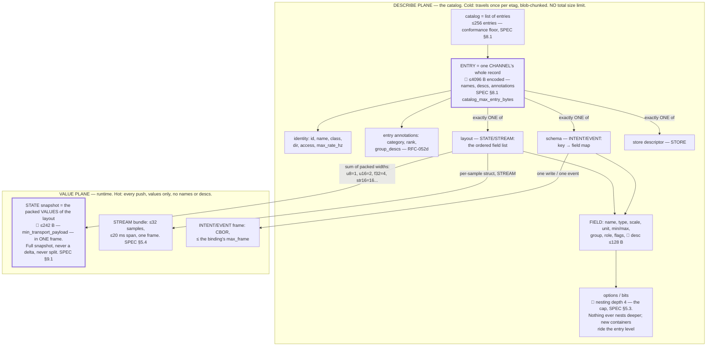

# Valence Authoring — you want X on screen, so you author Y

**Protocol:** `valence/1`
**Status:** Informative quickstart. Nothing here is new law — every row below
POINTS at the clause that owns the fact ([`RENDERING.md`](RENDERING.md),
[`SPEC.md`](SPEC.md), [`registry/registry.yaml`](registry/registry.yaml)).
On any disagreement, the pointed-at clause wins, always.
**Audience:** the hub author — the person editing a device catalog who wants
a control to appear, move, or change, and does not want to reverse-engineer
the rendering constitution to do it.
**Origin:** authoring-legibility campaign, Phase 0 (2026-07-29); the
authoring-table layer that makes these facts *look* editable is RFC-052.

---

## 1. The one idea

A hub never draws anything. It **declares facts** in its catalog, and every
conformant client derives the whole UI from them by walking one chain
(RENDERING.md §1):

**entry → category → rank → archetype → widget pattern → region → page**

This document is that chain read **backwards**: start from the thing you
want on screen, find the fact you author. Authoring order matters — the
catalog file *is* the page layout (SPEC §8.9 rule 4: presentation order is
authoring order, never re-sorted).

---

## 2. WHERE it appears

| You want | You author | Law |
|---|---|---|
| The entry under a specific tab | entry `category` = a `ui_categories` id | RENDERING §3 |
| Two channels sharing one tab | the same `category` on both entries | SPEC §8.8 "Categories" |
| A vendor tab of your own | `category` in `0x40`–`0x7E` + `category_label` | RENDERING §3 |
| A named card inside the tab | the same `group` string on each field | SPEC §8.8; RENDERING §11 |
| A specific on-page order | declare the fields in that order | SPEC §8.9 rule 4; RENDERING §11 |
| A setpoint next to its live readout | a `command.*`/`setting_key` field and its `telemetry.*`/live twin — clients co-locate the pair themselves | RENDERING §11 |
| One range control, not two sliders | tagged min/max pair | RENDERING §11 |

## 3. WHAT KIND of control

Widgets are **derived from type + constraints** — there is no widget field
(SPEC §8.9 rule 3). The full decision table is RENDERING §8.2; these are its
common rows, first match wins:

| You want | You author | §8.2 row |
|---|---|---|
| Any editable control at all | `setting_key` on the field (absent = read-only display) | SPEC §8.8 |
| A slider | writable numeric + `min` + `max`, drag-wide range | 9 |
| A stepper (precision entry) | writable numeric, narrow/discrete or `step`-dominant range | 10 |
| A toggle | writable `bool` | 7 |
| A select/segmented choice | writable u8 + `options` (wire value = array index) | 8 |
| A checkbox group | `bitfield8` + enumerated bits | SPEC §8.9 rule 3 |
| A text input | writable `str<N>` | 11 |
| A button | schema field, role `action.<name>`, no value payload | 6; registered verbs: RENDERING §7 |
| A confirm-gated button | the `destructive` flag on that trigger | RENDERING §8.4 row 6 |
| A bar/gauge readout | read-only numeric + `min`/`max` | 12 |
| A status lamp | read-only bool/bitfield | 14 |
| A chart | STREAM / `plan.*` time-series, or `aspect: rate` | 15 |
| The hero axis control | `command.position` + `telemetry.target`/`telemetry.position` roles | 3; RENDERING §8.4 row 7 |
| To overrule all of the above | explicit `archetype` annotation (always wins) | 1 |

## 4. HOW MUCH it matters

| You want | You author | Law |
|---|---|---|
| The machine's face, on every screen | `rank: hero` | RENDERING §4 |
| Everyday control, surfaced by default | `rank: control` | RENDERING §4 |
| Reachable but not surfaced | `rank: detail` (also the default when unranked) | RENDERING §4 |
| Folded behind an "advanced" affordance | `rank: advanced` | RENDERING §4 |
| Diagnostics-only material | `rank: diagnostic` | RENDERING §4 |
| Carried on the wire, never rendered | `rank: hidden` | RENDERING §4 |

## 5. The trimmings

| You want | You author | Law |
|---|---|---|
| A ⓘ tooltip / explanation | `desc` (≤128 bytes, travels once, etag-cached) | SPEC §8.8 |
| A unit chip, formatted values | `unit` string + numeric `unit_id` | SPEC §8.2; RENDERING §6 |
| A factory-reset value | `default` | SPEC §8.8 |
| "Takes effect after reboot" | `flags: restart_required` | SPEC §8.8 |
| A write-only secret (passwords) | `flags: secret` | SPEC §8.8 (normative rules there) |
| Grayed out when machine state forbids it | a `meta.enabled_mask` bitfield in the same STATE layout | SPEC §8.8 "Dynamic enablement" |
| A peak marker on a live gauge | a companion field, same role/unit, `aspect: peak` | RENDERING §5.1, §5.4 |
| A reset button beside the totals it clears | an intent declaring reset linkage (`meta.reset_gen` is the worked example) | RENDERING §5.4 |
| A client to *find* your field on any hub | a registered `role` (one per catalog; first-in-order wins on duplicates) | SPEC §8.8 "Field roles" |

---

## 6. What binds you (read before shipping)

- **Released layouts grow tail-only.** Reorder/resize/remove means a new
  channel id (SPEC §5.4). Pre-release evolution is free; the `released`
  marker that lets tooling tell the difference mechanically is RFC-052(b).
- **Any catalog change flips the etag** (SPEC §8.3) — clients re-fetch;
  static clients compare and apply policy (SPEC §8.5). Moving a control is
  an *annotation* edit (category, group, rank, order), never a byte-layout
  edit, by design.
- **Containers ride the entry level.** The depth-4 budget is already spent
  inside a field map — a new annotation needing a map or array must be an
  entry-level key (SPEC §8.1 "Depth budget").
- **One encoded entry ≤ 4096 bytes; no strings in STREAM samples**
  (SPEC §8.1, §5.4).
- **Advertised ranges are honest.** Applied values MUST lie inside declared
  `min`/`max`; the hub clamps and NACKs — `min`/`max`/`step` are UI hints,
  validation is hub-side (SPEC §8.8).
- **Vocabularies are frozen; unknowns degrade, never break** (RENDERING
  §14). You cannot invent a category or rank — you *can* use the vendor
  category range and unregistered `role`/`action.<name>` suffixes freely.

## 7. The containment model — what goes in what, and what runs out where

The vocabulary, smallest to largest: a **field** is one named value
(`window_min`, its type, min/max, annotations). A **channel** is a coherent
group of fields with an id and a class. An **entry** is one channel's whole
record in the catalog — ALL of its fields plus its identity and annotations.
The **catalog** is the list of entries. There is no per-field wire object:
fields exist only inside their entry's `layout`/`schema`.

The thing that trips everyone: **the same field list is summed against two
completely different budgets**, on two different planes.

**One field, two prices.** Everything you author about a field is billed to
one budget or the other, never both:

| Piece of a field | Describe plane (4096 B entry, once per etag) | Value plane (242 B snapshot, every push) |
|---|---|---|
| `name`, `min`/`max`, `options`, `group`, `role`, `flags` | billed | free |
| `desc` (≤128 B) | billed | **free — annotate generously** |
| the live value, by type width | free | billed — a `str64` value is 26% of every snapshot |

So a heavily-annotated channel and a heavyweight channel are different
failure modes: rich descriptions can only ever overflow the *entry* (caught
by lint at your desk); many/wide *fields* overflow the *snapshot* (also
statically known — conformance tooling flags it, SPEC §9.1).

**Where the numbers come from, and why they refuse to bend:**

- **242** is `min_transport_payload` (registry `limits`): ESP-NOW's 250-byte
  frame minus the 8-byte header — the smallest transport the protocol
  reserves the right to ride. A STATE snapshot MUST fit it *unfragmented*
  because of §9.1's full-snapshot rule: every STATE frame is the complete
  value (a delta would make frame loss corrupting) and conflation replaces
  whole queued snapshots (half a snapshot cannot be conflated). There is
  **no field-count limit** — the budget is bytes: ~58 f32 or ~115 u16
  values fit. A group of fields that outgrows it is split into two
  channels at design time, given the same `category`, and the tab merges
  them back into one surface (SPEC §8.8).
- **4096** is the per-entry decode atom (§6 above; SPEC §8.1): every
  client, down to a microcontroller remote, preallocates one 4 KB scratch
  buffer and can decode any conformant hub without touching the heap.
- **Depth 4** bounds decoder state: fixed nesting means a recursion-free,
  fixed-memory parser (SPEC §5.3, §5.8).
- **The catalog total has no limit on purpose** — it costs the hub's own
  flash and one blob-chunked transfer (SPEC §8.4), and nothing anywhere
  allocates proportional to it.

## 8. Verify your work

- [`tools/valence_lint.py`](../tools/valence_lint.py) — spec/registry
  consistency (this repo).
- [`tools/gen_registry_header.py`](../tools/gen_registry_header.py)
  `--check` — generated vocabularies in sync with the registry.
- `tools/catalog_lint.py` (machine repo, Nucleus) — the shipped
  catalog's annotation coverage.
- The reference hub pins its catalog etag in a native test; an unintended
  wire change fails the build before it ships.
