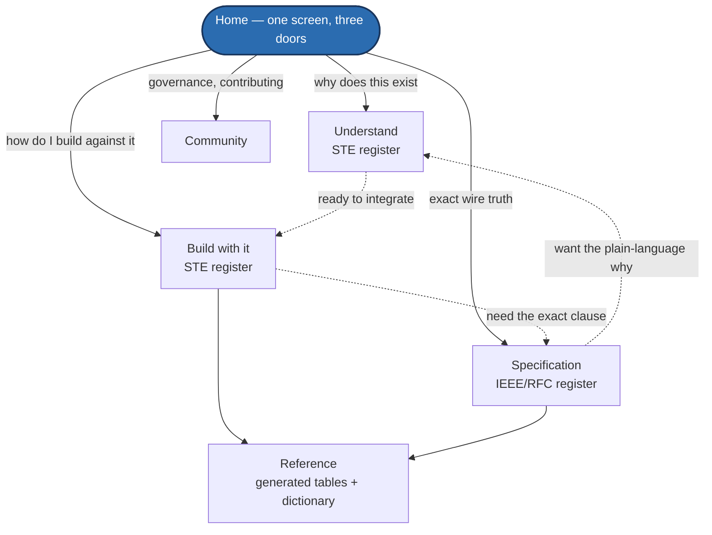

# Valence Documentation Site — Plan

*Operator brief, 2026-07-25: SPEC.md alone will not carry v1.0. Valence needs
a proper documentation site — "there's no googling how to use this until Google
starts indexing it," so the site IS the discovery mechanism. Target: the place
people land first and leave understanding.*

**Status:** the `docs-site/` MkDocs tree now exists and matches this plan's
information architecture closely (Understand/Build/Specification/Reference/
Community, generated registry tables, the dictionary). Treat this file as the
rationale record for choices already made, not an open proposal — check
`docs-site/mkdocs.yml` and `docs-site/docs/` for what actually shipped.

---

## 1. Tooling

**Recommendation: Material for MkDocs**, deployed to GitHub Pages.

| Why | Detail |
|---|---|
| Markdown-native | [SPEC.md](SPEC.md) and the [RFC queue](RFC-QUEUE.md) move in nearly as-is |
| Offline search | Built-in, client-side, no Algolia account — and search IS discovery until indexing catches up |
| Python-only | PlatformIO already ships Python; no Node dependency in a firmware repo |
| Versioning | `mike` publishes `v1.0` / `v1.1` / `latest` as separate trees — mandatory for a protocol spec people must pin against |
| Glossary | Abbreviation/glossary support auto-links dictionary terms everywhere they appear in prose |
| Theming | Custom CSS carries the "technical datasheet" aesthetic from the design artifact |

**Alternatives considered:** Astro Starlight (more visual control, Node, Pagefind
search — the pick if design outweighs toolchain simplicity); VitePress (lightest
good option); Docusaurus (heavier/React, more than needed); Sphinx (only if a
PDF spec deliverable is ever wanted — worth revisiting for industry outreach).

**Deploy:** GitHub Actions → GitHub Pages, shipped.
[`.github/workflows/docs.yml`](../.github/workflows/docs.yml) gates on
`gen_docs_tables.py --check`, `gen_spec_pages.py --check`, and
`mkdocs build --strict`, then publishes with `mike` for versioned trees. The
fuzz gate ([RFC-028](RFC-QUEUE.md#rfc-028--parser-robustness--fuzz-conformance-gate-anti-cve)) was the CI pattern this workflow copied.

## 2. Writing style — TWO registers, never blended

- **Guides, tutorials, procedures → ASD-STE100-influenced.** One idea per
  sentence. Active voice. Present tense. Instructions ≤20 words. No noun stacks
  longer than three words. Consistent terminology.
  **CRITICAL CONSTRAINT (operator):** simplification MUST NOT abstract away
  industry terms. *Quintic*, *deadman*, *token bucket*, *etag*, *catalog*,
  *jerk*, *arbiter* are precise vocabulary and stay. STE's real rule is "one
  term, one meaning, used consistently" — which PROTECTS domain words rather
  than banning them. Simplify sentence structure, never terminology.
- **Specification → IEEE / RFC normative register.** Numbered clauses, RFC 2119
  MUST/SHALL/MAY, exact cross-references, no prose ambiguity. This section is
  permitted to be dense; implementers need exactness over approachability.

Every page declares its register in front-matter so contributors know which
rules apply.

## 3. Information architecture — organized by AUDIENCE

*Solid arrows are the primary reading order from Home; dashed arrows are the
cross-links a reader takes once they hit a wall in one register and need
another (e.g. "Build" hits a wire-format question and jumps to
"Specification"). Nothing here loops — each tier is read once per visit.*

### Home
One screen: what Valence is, who it is for, three entry doors (Understand /
Build / Specification).

### Understand *(STE register — the "why" tier)*
- **How it works** — the mental model: catalog-as-datasheet, channels, the four
  classes, ground truth. Reuse the design-artifact diagrams.
- **Capabilities, and what they mean for custom hardware** — what a hub must
  provide, what is optional, how a minimal device participates fully.
- **What it replaces / what it does NOT replace** — explicit, honest, both
  columns. Names TCode's continued role as compatibility ingest.
- **Ecosystem & compatibility** — OSSM, **ossm-rs**, **fray-d lite** and peers.
  **TONE IS BINDING: these are legitimately great projects. Do not position
  Valence as a replacement or an upgrade over them.** The framing is that
  Valence adds a *unifying compatibility layer* those firmwares could adopt,
  so one app works across all of them. Any sentence that reads as "better than"
  is a defect in this section.
- **Security model & the audit** — the threat model in plain language, what is
  and is not defended, and the [RFC-028](RFC-QUEUE.md#rfc-028--parser-robustness--fuzz-conformance-gate-anti-cve) fuzz results
  stated honestly (2.29 billion executions, three memory-safety bugs found
  and fixed pre-release, including a CBOR integer-overflow OOB reachable from
  every message decoder). Publishing found-and-fixed bugs is a credibility
  asset, not a liability.
- **For everyone** — the consumer tier: what this means for someone who just
  owns a machine. No wire formats, no C++.

### Build with it *(STE register — the "how" tier)*
- Quickstart: connect a client in ~20 lines
  > DEMO-CANDIDATE: a live, runnable quickstart snippet against a real (or
  > simulated) hub, editable in-page, showing HELLO → WELCOME → first STATE
  > frame.
- Client guide per language (JS / C# / C++ / Python)
- **Plugin guide** — writing an app integration; the MFP plugin as worked example
- **Hub / firmware implementer guide** — building a conforming device
- **CLI guide** — the tooling, including the motion-vs-planner graphing CLI
- **Local testing guide** — the simulator, `valence_probe.py`, the fuzz harnesses,
  and the back-to-back-sessions-without-reboot regression pattern

### Specification *(IEEE register — normative)*
- Numbered normative clauses (the SPEC.md rewrite)
- **Registry tables — GENERATED, never hand-written** (see §4)
- Conformance: golden vectors, property sweeps, the fuzz gate
- Errata and the RFC process

### Reference
- **The Valence Dictionary** — every term, one definition, auto-linked
  site-wide via the glossary system. This is the anchor deliverable.
- Channel catalog reference · NACK/error codes · limits table (all generated)

### Community
- Contributing, the RFC process, and the **governance stance**:
  *Valence favors no firmware, no vendor, and no product. It is provided to
  the community as a tool.* State it plainly on its own page.

## 4. Generation discipline (NON-NEGOTIABLE — same disease we spent this whole project curing)

Every number that appears in the docs — frame types, CBOR keys, NACK codes,
limits, channel ids, field roles — is **generated from
[`registry.yaml`](registry/registry.yaml)** at build time, exactly as
`registry_constants.hpp` is. NEVER hand-copied.

This session found the same drift bug three separate times (a stale JS intent
schema table, a hand-rolled `EstopCause` enum, a hardcoded WebUI layout table).
A documentation site was the single most likely place for a fourth, so it got
two siblings of [`tools/gen_registry_header.py`](../tools/gen_registry_header.py):
[`docs-site/tools/gen_docs_tables.py`](../docs-site/tools/gen_docs_tables.py)
(Markdown tables) and
[`docs-site/tools/gen_spec_pages.py`](../docs-site/tools/gen_spec_pages.py)
(the Specification tier). Both gate the docs build the same way `--check`
gates firmware: `.github/workflows/docs.yml` fails before publishing on any
drift.

## 5. SEO / discoverability notes

The naming doctrine pays off here: "Valence" is zero-collision, so every page
is findable once indexed. Support it with real meta descriptions per page, a
sitemap, semantic headings, and stable URLs (versioned trees must not break
links). Publish the dictionary early — glossary pages index well and answer the
long-tail "what is a Valence <term>" queries that will be the first traffic.

## 6. Sequencing

Site scaffolding can start any time (no protocol dependency). CONTENT should
follow the v1.0 tag, because the normative section must describe what shipped,
not what was planned. Suggested order: scaffold + theme + generation pipeline →
Dictionary → Understand tier → Specification (post-tag) → Build tier → Community.
