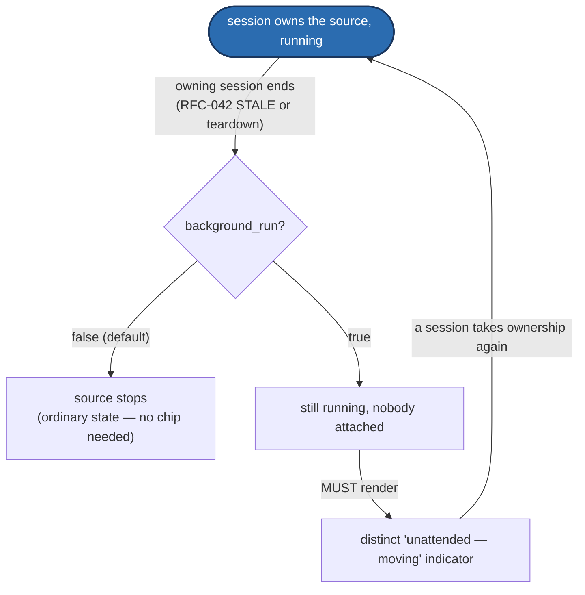

# Valence Rendering — the UI Constitution

**Protocol:** `valence/1`
**Document version:** v1.0 (public)
**Status:** Normative. Every enumerable vocabulary in this document is frozen at the v1.0 tag (§14).
**Registry of record:** [`registry/registry.yaml`](registry/registry.yaml) — every numeric id in this document is a *view* of a registry section named in its heading. **On any conflict between this document and the registry, the registry wins**, exactly as [`SPEC.md`](SPEC.md) §5.7 rules for the wire protocol.
**Normative parent:** [`SPEC.md`](SPEC.md) §19 establishes this document as the client-rendering conformance companion. Read that section first if you have not.
**Origin:** [RFC-048](RFC-QUEUE.md#rfc-048--the-rendering-constitution-catalog-vocabulary-capability-interfaces-renderer-law) (operator direction 2026-07-27), landed in full at the v1.0 tag. See [`RFC-QUEUE.md`](RFC-QUEUE.md) for problem statement, rationale, and compatibility notes.

---

## 0. Reading this document

Clause numbering is `§<section>.<subsection>`, independent of SPEC.md's own numbering. RFC 2119 keywords (MUST/SHOULD/MAY) carry their normal force. Tables are normative unless a section says otherwise. Where the staging RFC used "operator ruling" or "REQUIRED" language, this document renders it as MUST; general design description renders as SHOULD or descriptive prose.

**This document describes rendering, never wire behavior.** Every fact about what a byte *means* lives in SPEC.md and the registry; this document is exclusively about what a conformant client *does with* what it has already decoded — which controls it builds, where they go, and how they behave across screen classes. A client that never reads a word of this document still interoperates correctly (SPEC §8.9's generic-rendering checklist is the floor); a client that reads all of it renders *consistently* with every other conformant client, on every hub either has ever met.

---

## 1. Scope and the derivation chain *(normative)*

A conformant renderer builds its whole surface from one catalog by walking a single derivation chain, left to right, no step skippable and no step app-specific:

**catalog entry → category (§3) → rank (§4) → archetype (§8) → widget pattern (§10) → region (§9) → page (§11)**

Every arrow is a *rule* stated in this document, not a per-app choice. Two conformant clients fed the same catalog and told the same renderer class (§12) produce the same page tree, differing only in the class's own projection behavior (glance vs. handheld vs. full). This is the single invariant the rest of the document exists to guarantee, and it is why "Valence describes what things **are**, never how they **look**" (SPEC §1-7) survives having a rendering constitution at all: nothing here is a pixel, a color, a margin, or a font. Everything here is a *binding* — which archetype, which region, which state — expressed **behaviorally**.

*No step is skippable and none is app-specific — the same catalog fed through this
chain on any conformant renderer produces the same page tree (§11's consistency
invariant). The chain runs once per catalog/etag; it does not loop.*

> DEMO-CANDIDATE: paste a real catalog entry and watch it walk the chain live
> — category, rank, archetype, widget pattern, region — ending in the
> actual rendered control.

---

## 2. Channel taxonomy and capability interfaces *(normative)*

### 2.1 Three tiers

Every channel a hub declares is exactly one of:

| Tier | Range / test | Meaning |
|---|---|---|
| **CORE** | `0x0001`–`0x007F` | Machine-unspecific protocol machinery. A channel that assumes a motor, an actuator, or any physical capability MUST NOT be CORE — CORE is the protocol talking about itself (sessions, safety framing, pairing, discovery). |
| **STANDARD** | device-defined id, well-known shape (§2.2) | Machine-agnostic **capability** channels. Declared per capability the hub actually has, not per machine kind: a hub with a current sensor exposes `power`; one without does not. |
| **DEVICE** | everything else | Wholly catalog-described. No client should expect to recognize it by shape; the settings metamodel (SPEC §8.8) and generic rendering (SPEC §8.9) are the whole story. |

The three tiers are a **classification of intent**, not a new wire mechanism — no frame changes, no new core-channel ids. A hub is conformant at the DEVICE tier alone; STANDARD is what turns "a client that renders any hub correctly" into "a client that renders an unmet hub **well**."

### 2.2 Well-known standard channels and capability interfaces

A hub SHOULD expose the well-known channel for any capability it has, carrying at minimum the field set below (extras are legal, append-only). This is SHOULD-level for existing hubs and MUST-level for hardware-hub-profile conformance from the v1.0 tag forward.

| Capability | Well-known surface | Minimal field set | Note |
|---|---|---|---|
| Linear axis | `motion` | `{position, target, speed}` | The guaranteed minimum a client builds "a very good UI for a machine it has never met" from. Extras append-only. |
| Power metering | `power` | `{watts, …}` | |
| Usage totals | `odometer` | totals, `aspect: total` (§5.1) | |
| **Pattern generator** (capability interface) | device-named STATE/INTENT pair | `{running, select(+options), speed?, depth?, stroke?, sensation?}` | The standard role set for a hub with a built-in generator. Optional roles render only when present. |
| **Advanced generator** — the fray-d shape (capability interface) | device-named STATE/INTENT pair | master state + four modifier lanes (in-speed, out-speed, in-accel, out-accel, each `{ctrl, amplitude, step, wait, offset}`) + preset store/roster | fray-d's design is the community gold standard; standardizing its *shape* means every advanced generator in the ecosystem speaks it and every client renders it, the same way VMotion is the standard planner. |
| Thermal | `thermal` | `{temp_actual, temp_setpoint?}` | Heaters are coming. |
| Battery | `battery` | `{percent, charging}` | Portable devices. |
| **Identify** (capability interface) | `action.identify`-tagged trigger | none — blink-to-find | Every device ecosystem needs a find-me op. |

**Parked, deliberately (not part of this landing):** per-axis instancing (a multi-axis question; the `0xCDSS` channel grid has runway for it either per-domain or per-slot, both additive) and actuator-type vocabulary (vibrators etc. — the self-describing catalog already carries them generically; a well-known `vibe` capability channel is a future small RFC when a real device exists). Neither absence blocks anything in this document.

---

## 3. Categories — the WHERE axis *(normative)*

`category` (registry `ui_categories`) answers **where a catalog entry lives** in the navigation tree. It is a stable numeric id, never a display string — labels are the renderer's business and are localizable. The set is designed complete and is **frozen at the v1.0 tag**: adding a category later was ruled out ("adding categories later makes things awful") in favor of a wide-open overflow bucket (`other`) and a vendor range.

| Id | Category | Contains |
|---|---|---|
| 1 | `control` | Driving the machine now: move, pattern run/speed/depth, streams |
| 2 | `motion` | Live physical telemetry |
| 3 | `safety` | Faults, interlocks, e-stop state (the **stop affordance itself is rank-pinned**, §4 — not a menu item here) |
| 4 | `limits` | Window + ceilings |
| 5 | `library` | Stored content: presets, patterns, scripts, positions, profiles |
| 6 | `playback` | Hub-local content transport: play/pause/seek/queue |
| 7 | `auxiliary` | Secondary actuators: heat, lube, suction, inflation |
| 8 | `automation` | Routines, schedules, scenes |
| 9 | `tuning` | Engine internals, calibration |
| 10 | `hardware` | Geometry, drive config, sensors, homing |
| 11 | `network` | WiFi/BLE state, endpoints, provisioning |
| 12 | `session` | Clients, roles, ownership, pairing/trust |
| 13 | `system` | Power, thermals, memory, firmware, logs |
| 14 | `other` | The defined overflow |

**Vendor range:** `0x40`–`0x7E` is reserved for vendor/device-defined categories, mirroring the retired `setting_categories`' device-defined tail — a hub declaring one MUST supply a label.

**Graceful-extension rule (MUST):** a client MUST render any category id it does not recognize — including a gap between `14` and the vendor range, and any vendor id it has not been taught — under `other`, using the catalog-provided label. **Never dropped.** This structural valve is what makes freezing the fourteen safe: every future category, foreseen or not, is navigable on every client ever shipped.

A category MAY carry a free-text `subgroup` beneath it (today's `.group` strings become subgroups, SPEC §8.8). The category tree, in registry order, IS the navigation skeleton every renderer shares.

**Relationship to `setting_categories` (informative; corrected 2026-07-29):** retired. Phase C2 wired `ui_categories` onto catalog entries: entry key 10 now carries a `ui_categories` id — same wire key, new value vocabulary, a pre-tag restructuring the registry header permits. The five-value `setting_categories` is tombstoned in the registry (see the tombstone in [`registry/registry.yaml`](registry/registry.yaml)) and no consumer reads it; the shipped reference catalog emits `ui_categories` uniformly, and SPEC §19.1 item 23 records the wiring. An earlier revision of this paragraph deferred that wiring to "a later catalog-evolution RFC" — stale from the moment Phase C2 landed. [C-3 correction per operator ruling, 2026-07-29: ledger + shipped catalog win]

---

## 4. Ranks — the HOW MUCH axis *(normative)*

`rank` (registry `ui_ranks`) answers **how much a catalog entry matters by default**, per entry and per field. **Frozen at six values, v1.0.**

| Id | Rank | Meaning |
|---|---|---|
| 0 | `hero` | The machine's face. Surfaced by default on every class. |
| 1 | `control` | Everyday driving controls. Surfaced by default on handheld/full; one navigation step away on glance. |
| 2 | `detail` | Useful but not primary. Reachable, not surfaced. |
| 3 | `advanced` | The `advanced` bit's migration (SPEC §8.8 `setting_flags.advanced`) folded into this ladder. Hidden behind an advanced affordance by default; **never removed from the surface**. |
| 4 | `diagnostic` | Reachable on glance/handheld/full; not reachable at all only on a budget-constrained renderer that has explicitly chosen to omit it (§12). |
| 5 | `hidden` | Carried on the wire for compatibility. **Never rendered.** The honest home for an inert-but-released field. |

**Unknown-rank rule (MUST):** an unrecognized rank value renders as `detail`. A field with no rank annotation at all is likewise `detail` (undecorated legacy behavior, unchanged).

---

## 5. Value axes — aspect, scope, provenance *(normative)*

Three small, orthogonal vocabularies tag **what statistic a field is**, frozen at v1.0. Default when absent: `live` / `session` / `actual`.

### 5.1 `aspect` (registry `value_aspects`)

| Id | Aspect | Meaning |
|---|---|---|
| 0 | `live` | The value now. Default. |
| 1 | `peak` | Highest observed. |
| 2 | `min` | Lowest observed. |
| 3 | `mean` | Average observed. |
| 4 | `total` | Cumulative (an odometer figure). |
| 5 | `rate` | A derivative/frequency quantity. |

### 5.2 `scope` (registry `value_scopes`)

| Id | Scope | Meaning |
|---|---|---|
| 0 | `session` | Since this client connected. Default. |
| 1 | `lifetime` | Since the device was manufactured/last factory-reset. |
| 2 | `window` | A bounded rolling window (device-defined width). |

### 5.3 `provenance` (registry `value_provenance`)

| Id | Provenance | Meaning |
|---|---|---|
| 0 | `demand` | The raw requested value. |
| 1 | `planned` | The target the planner is currently aiming for. |
| 2 | `actual` | The measured value. Default. |

Provenance is already real on this machine's wire: demand (raw), planned (target), actual (position) are one quantity at three stages, and the motion overlay (`axis`, §8) is their companion composition.

### 5.4 Rules governing all three axes (MUST)

- **Companion composition (SHOULD).** Fields sharing a role/unit but differing in `aspect` are companions — a client SHOULD render them as one instrument (the peak-hold idiom: a live gauge with a peak marker; odometer totals grouped as one card). *That* they belong together is not the developer's choice; *how* it looks is.
- **Reset linkage.** An intent MAY declare itself the RESET for an aspect group (`meta.reset_gen`, SPEC §8.8, is the worked example). A client MUST place the reset affordance **with** the group it resets, and MUST confirm-gate it per the destructive-trigger contract (§8.7).
- **Honesty (MUST).** A client MUST NOT present a `live` value as a `peak` or vice versa. `scope` (session/lifetime/window) MUST always be displayed or unambiguously implied — a total with no visible scope is a value the reader cannot trust.

---

## 6. Units *(normative)*

`unit` (registry `unit_ids`) is a **frozen numeric companion** to the existing free-string `unit` field (SPEC §8.2). Both exist today; the numeric table is deliberately over-provisioned so that a foreseeable future actuator never needs a v1.1 vocabulary addition. Wiring `unit_ids` onto real catalog fields is next-phase work (§3's relationship note applies identically here) — this landing freezes the **table**.

| Id | Unit | Quantity |
|---|---|---|
| 0 | `mm` | length |
| 1 | `mm/s` | speed |
| 2 | `mm/s²` | acceleration |
| 3 | `mm/s³` | jerk |
| 4 | `0-1` | normalized |
| 5 | `%` | percent |
| 6 | `Hz` | frequency |
| 7 | `ms` | time (milliseconds) |
| 8 | `s` | time (seconds) |
| 9 | `V` | volts |
| 10 | `A` | amps |
| 11 | `W` | watts |
| 12 | `Wh` | watt-hours |
| 13 | `°C` | temperature |
| 14 | `count` | dimensionless count |
| 15 | `bytes` | data size |
| 16 | `dB` | decibels |
| 17 | `N` | force *(over-provisioned: force-feedback actuators)* |
| 18 | `kPa` | pressure *(over-provisioned: suction/inflation)* |
| 19 | `mL` | volume *(over-provisioned: lube dosing)* |
| 20 | `mL/min` | flow rate *(over-provisioned: lube dosing)* |
| 21 | `rpm` | rotational speed *(over-provisioned: rotary actuators)* |
| 22 | `bpm` | beats per minute *(over-provisioned: bio-sync accessories)* |

**Formatting (SHOULD):** a client SHOULD render a value with its unit's conventional suffix and a precision appropriate to the unit's own resolution (whole `count`/`bytes`, 0-2 decimals for physical quantities, percent-scaled display for `0-1` where the field's role calls for it). This is styling guidance, not a wire rule — no formatting choice here changes a byte.

**Unknown-unit rule (MUST):** a client meeting an unrecognized unit id MUST render the catalog's own label string verbatim, never a blank or a guess.

---

## 7. Action tags *(normative)*

`action_tags` names the specific verbs a client can recognize under the existing `action.<name>` field-role convention (SPEC §8.8) to upgrade a generic `trigger` (§8) into a purpose-specific rendering (icon, placement, confirm posture). An unregistered `action.<name>` suffix remains legal (SPEC §8.8's "nothing hardcoded as a requirement" doctrine is unchanged) — these are the ones a conformant client MAY special-case. **Frozen set, thirteen tags, v1.0:**

| Tag | Typical rendering |
|---|---|
| `move` | The primary positional command (usually already the `axis` archetype's own binding, not a separate trigger) |
| `safety` | A safety-adjacent action outside the law-bound `stop` archetype itself (e.g. an override/bypass toggle's companion action) |
| `home` | A homing-cycle trigger; SHOULD render with a distinct homing glyph |
| `calibrate` | A calibration-cycle trigger; commonly the entry point to a `wizard` pattern (§10) |
| `reset` | Aspect-group reset linkage (§5.4); co-located with the group it clears |
| `save` | Persist current state (settings, not a preset item) |
| `persist` | Commit a value past a reboot (distinct from `restart_required`, SPEC §8.8, which is about *when* a change takes effect, not whether it survives one) |
| `pair` | Enters a pairing ceremony affordance |
| `identify` | Blink-to-find (§2.2) — every device ecosystem needs one |
| `admin` | A generic administrative action not covered by a more specific tag |
| `reboot` | Firmware reboot; SHOULD always confirm (SPEC §9.3 `reboot_in_ms`) |
| `preset_save` | Save-to-store, part of the `generator-advanced` preset roster (§10) |
| `preset_recall` | Load-from-store, same roster |

**Unknown-tag rule (MUST):** an unrecognized `action.<name>` suffix renders as a generic `trigger`/`control` per the derivation table (§8.2) — exactly the fallback an `action.*` field already gets today.

---

## 8. Archetypes *(normative)*

An archetype is the **control style and interaction contract** a catalog field or channel is rendered with — never pixels, margins, or a specific widget library's component. Archetypes are **derived**, not carried on the wire, in the common case; an optional explicit `archetype` hint exists for overrides only, and always wins.

### 8.1 Universal interaction contract (MUST, binds every archetype)

- **Pending → echo-confirmed visualization is REQUIRED** for every archetype that writes. The four-state write-lifecycle ladder — `pending` / `overdue` / `fault` / `settled` — is **one** visual vocabulary reused by every control (§13), never color alone (a paired text reason is mandatory).
- **Role-gated or degraded controls gray, never hide**, with a stated reason — feature-mask, no-link, and unauthorized are three honestly distinct reasons, never interchangeable (SPEC §8.9 restated at the archetype level).
- **Units format per §6.**
- **Ground truth only:** an archetype MUST NOT render a value the wire never sent — no placeholder ceilings, no invented zeros.

### 8.2 Archetype derivation table (normative decision table)

Evaluated top-to-bottom; the first matching row wins.

| # | Trigger | → Archetype |
|---|---|---|
| 1 | Explicit `archetype` annotation present | that archetype (override) |
| 2 | Safety-intents `stop`/`estop` op identity | `stop` — **bound by identity, never derived from any other row** |
| 3 | Schema field, role `command.position` | `axis` |
| 4 | Two co-instanced `command.position` fields (one multi-axis capability) | `pad2d` |
| 5 | STORE-class channel + its roster STATE pair (SPEC §8.7) | `list` |
| 6 | Schema field, role `action.<name>`, no value payload | `trigger` (destructive flag ⇒ mandatory confirm, every class) |
| 7 | Writable (`setting_key` present) `bool` field | `toggle` |
| 8 | Writable u8 field + `options` | `select` |
| 9 | Writable numeric field + `min`/`max`, range wide enough for a drag gesture | `slider` |
| 10 | Writable numeric field, narrow/discrete range or `step`-dominant | `stepper` |
| 11 | Writable `str<N>` field | `text` |
| 12 | Read-only numeric field + `min`/`max` | `readout` (bar/gauge projection) |
| 13 | Read-only numeric field, no bounds | `readout` (plain numeral) |
| 14 | Read-only bool/bitfield status field | `indicator` |
| 15 | STREAM/`plan.*` time-series, or `aspect: rate` telemetry | `chart` |
| 16 | Three co-grouped numeric setting fields + explicit `color` hint | `color` |
| 17 | Field(s) representing a moment/interval + explicit `datetime` hint | `datetime` |

Rows 16-17 (and, commonly, row 4) rely on the explicit hint because automatic derivation from bare primitive fields alone is ambiguous — this is the expected, conformant path for the three newest archetypes, not a workaround.

### 8.3 Interaction primitives by renderer class (behavioral, no pixels)

| Class | Input model | Numeric (slider/stepper/axis/pad2d) | Choice (toggle/select) | Action (trigger/stop) | Text |
|---|---|---|---|---|---|
| `glance` | rotary encoder + button | turn to adjust, press to commit | turn to scroll, press to choose | press (long-press for destructive confirm) | digit/char wheel |
| `handheld` | touch | drag, commit on release | tap | tap (modal confirm for destructive) | on-screen keyboard |
| `full` | pointer + keyboard | click-drag, commit on release | click | click (modal confirm for destructive) | keyboard-typeable field |

### 8.4 Archetype directory (frozen, fifteen, v1.0)

| # | Archetype | Semantic | Fallback composition | Notes |
|---|---|---|---|---|
| 0 | `readout` | Display of a value | *(primitive)* | Bounds present ⇒ bar/gauge; a `peak`-aspect companion (§5.4) renders as a marker on the same instrument. |
| 1 | `indicator` | Status lamp | *(primitive)* | Never the sole carrier of a safety fact — color alone is never a safety story (§13). |
| 2 | `slider` | Bounded numeric intent | *(primitive)* | Commit-on-release; pre-echo value renders as a ghost/ghost-outline, never as truth. |
| 3 | `stepper` | Precision numeric | *(primitive)* | Increments in `step`-sized ticks; typeable value on handheld/full. |
| 4 | `toggle` | Boolean | *(primitive)* | |
| 5 | `select` | Enum + options | *(primitive)* | Index-aligned; index 0 is a filler label (SPEC §8.9) and MUST NOT render as actionable. |
| 6 | `trigger` | Payload-less intent (button) | *(primitive)* | `destructive` flag ⇒ mandatory confirm, every class, no exception. |
| 7 | `axis` | 1-D positional hero control | *(primitive)* | Commanded-vs-actual overlay is MANDATORY (`command.position` + `telemetry.target`/`telemetry.position`, never one alone); domain is the *reported* window. |
| 8 | `chart` | Time-series | *(primitive)* | Glance degrades to sparkline/value; missing samples render as GAPS, never zeros. |
| 9 | `list` | Roster/store items + item actions | *(primitive)* | Pending is a THIRD state, distinct from success/failure; locked-by-role is honestly distinct from empty. |
| 10 | `text` | Constrained string | *(primitive)* | Glance projects a digit/char wheel — the pairing-PIN path. |
| 11 | `stop` | The safety stop affordance | *(primitive, by law)* | Reachable at every rank on every class; never role-gated; visually distinct; never hidden, even mid-confirm-flow of another control. |
| 12 | `pad2d` | Two-axis control | `slider` + `slider` | The multi-axis runway; each axis keeps its own commanded-vs-actual overlay. |
| 13 | `color` | Chromatic actuator setpoint | `slider` + `slider` + `slider` | Lighting/glow accessories; a client with no color-picker affordance renders the three-slider fallback and is fully conformant. |
| 14 | `datetime` | Moment/interval input | `text` | Automation schedules; a client with no date-picker renders the ISO-8601 text fallback and is fully conformant. |

> DEMO-CANDIDATE: a living gallery, one tile per archetype, each showing its
> real interaction (drag, tap, confirm-gate) across all three renderer
> classes side by side.

---

## 9. Regions *(normative)*

Four abstract placement zones plus one modal layer, **frozen at five, v1.0**. Geometry, position, size, and style within a region are entirely the renderer author's craft; **what lives in each region is normative.**

| # | Region | Contents |
|---|---|---|
| 0 | `primary` | Hero-rank patterns (`axis-hero` and peers, §10). The machine's face — exactly one per axis/capability instance. |
| 1 | `persistent` | The `safety-strip` (§10): latch state, ownership, the `stop` archetype. |
| 2 | `content` | The category tree's territory: cards/panes/menu screens, canonical category order; diagnostic-rank material last or collapsed by default. |
| 3 | `utility` | Connection/session status, identity, theme — chrome about the *client*, kept out of the machine's way. |
| 4 | `overlay` | The modal layer: confirms, pairing knocks, alerts. Only ceremony/confirmation content may use it; nothing persistent lives here. |

**Placement invariants (MUST):**

- No `content` may ever obscure or displace `persistent`.
- Pending/degraded state visualization MUST NOT be suppressed by layout, on any region.
- A pattern's region assignment (§10) is part of its spec definition, never a per-app choice.
- `persistent` MUST remain visible in every navigation state of every class — on `glance` it MAY compress to the stop affordance + latch glyph, never to nothing.

---

## 10. Widget patterns *(normative)*

Proven compositions extracted from the reference client. Each recipe names its archetype composition, region, extra states beyond §8.1's universal ladder, and per-class projection. **Frozen at thirteen, v1.0**; three are REQUIRED.

| Pattern | Required? | Composition | Region | Extra states | Projection |
|---|---|---|---|---|---|
| `axis-hero` | **MUST** (handheld/full; glance: reachable via category tree) | rail + window band + command tape + live position/velocity numerals + nested `plan-view` | `primary` | commanded-vs-actual overlay always live | Command-tape domain is the *reported* window — commanding outside it is geometrically impossible. Physical-extent derivation prefers measured travel > configured max > catalog window bound. |
| `plan-view` | no | in-flight plan lane (`plan.*` roles) | nested inside `axis-hero` | visibility gated by data freshness | Collapses to zero height when idle. |
| `link-strip` | no | connection phase, rx liveness, catalog state | `utility` | safety-relevant chips pinned | Rest of the strip may scroll. |
| `safety-strip` | no (its contents are, via `stop`) | ops sorted role-EXEMPT-first; the `stop` archetype | `persistent` | sticky-visible within any overflow | |
| `settings-card` | no | a subgroup's fields via the archetype table (§8.2) | `content` | every disabled control shows WHICH gate disabled it | feature-mask / no-link / unauthorized are not interchangeable. |
| `scope` | no | multi-lane strip chart | `content` | missing samples = gaps, never zeros | Series colors stable by declaration order across reconnects; catalog bounds else honest autoscale. |
| `event-stream` | no | bounded rings of events | `content` | unknown body fields render generically as `key=value`, never dropped | Auto-scroll with user-scroll override. |
| `roster` | no | `list` + item actions | `content` | pending is a THIRD state | Locked-by-role honestly distinct from empty. |
| `protocol-pane` | no | the one deliberately device-aware diagnostic surface | `content`, `diagnostic` rank | | Wire ids visible **by design**. |
| `pattern-panel` | **MUST** (handheld/full; glance: reachable) | run/stop with live state + pattern `select` (exclusive-choice group) + knob sliders for whichever optional roles exist (§2.2) + `source.background_run` toggle co-located with the run/stop control (§10.1) | `content` (or `primary` on a generator-only device) | | The standard-generator surface. |
| `generator-advanced` | **MUST** (handheld/full; glance: reachable) | master controls + four modifier lane groups (§2.2) + preset save/recall via the store + `source.background_run` toggle co-located with the master run/stop control (§10.1) | `content` (or `primary` on an advanced-generator-only device) | | The fray-d surface. |
| `transport` | no | play/pause/seek/queue cluster | `content` | | For hubs that play content (§2.2 `playback` category). |
| `wizard` | no | stepped ceremony flow (pairing, calibration, provisioning) | `overlay` | | Glance projects it as sequential menu screens. |

How a developer *builds* each one — visuals, arrangement within its region, style — is entirely theirs; the bindings, interactions, and states are not.

### 10.1 Shared safety-relevant control: `source.background_run`

`source.background_run` (registry `field_roles`, [RFC-045](RFC-QUEUE.md#rfc-045--retire-deadman-as-safety-session-liveness-is-bookkeeping-not-motion-control)/[RFC-048](RFC-QUEUE.md#rfc-048--the-rendering-constitution-catalog-vocabulary-capability-interfaces-renderer-law) — see SPEC §11.3 and §18-21) is a bool field role marking whether an autonomous source (a pattern generator today; on-hub script/scene playback tomorrow) continues running when its owning session ends. Because it changes what "nobody is attached" means for a moving machine, it is rendered under three specific, MUST-level rules wherever it appears — which today means both REQUIRED generator patterns above:

1. **Placement (MUST).** The toggle MUST be co-located with its source's run/start control — in `pattern-panel`, next to `running`; in `generator-advanced`, next to the master run/stop. It is never a buried setting-card checkbox; the operator flips it in the same glance as starting the thing it governs.
2. **Confirm-gated enable (MUST).** Transitioning the toggle false→true is consequential and MUST be confirm-gated exactly as a `destructive`-flagged `trigger` (§8.4) — the client is asking the operator to confirm "this may keep moving after you leave."
3. **Distinct unattended indicator (SHOULD).** While a source's `background_run` reads true **and** its owning session is gone, a client SHOULD surface a distinct, unmissable indicator (an "unattended — moving" chip, not a color alone) rather than relying on the operator to infer it from generic ownership/session chrome. This state — the machine is moving with nobody attached — MUST be visible, never merely inferable.

*The loop closes only when a session actively takes ownership again (§11.4)
— the indicator does not clear on a timer, because nothing about the
machine's physical state changed on its own.*

**Rationale (informative):** a dead *stream* leaves the machine still (SPEC §11.3's SETTLE) — no switch exists for streams and none is wanted. A dead *controller* with a running generator does not leave the machine still, so continuation must be an explicit, visible choice rather than an implicit one, on both the setting itself and the state it produces.

---

## 11. Page composition rules *(normative)*

Pages are **derived from the catalog**, never designed per app.

- **One category = one page root** (§3).
- **Subgroups** (the settings metamodel's `group`, SPEC §8.8) are sections within their category's page, promoted to their own page when the class's density budget is exceeded:
  - `glance`: every subgroup is its own menu screen.
  - `handheld`: a subgroup is a card, promoted to a drill-in page past roughly eight controls.
  - `full`: a subgroup is a section; panes flow.
- **Within a section:** catalog declaration order.
- **A setpoint and its reported readout are co-located as one composite** — the echo pair (a `command.*` field and its `telemetry.*` counterpart, or a `setting_key` field and its live twin) is never split across pages or sections.
- **Tagged min/max pairs render as a single range control**, not two independent sliders.
- `glance`-class auto-paginates long sections, preserving order.

**Consistency invariant (MUST):** the same catalog yields the same page tree on every conformant client, differing only by class projection (§12).

---

## 12. Renderer classes *(normative)*

All classes render **one** category tree; they differ in *projection* and *default surfacing*, never in reachable content — an OLED remote is a full controller, not a badge. **Frozen at three, v1.0.**

| Class | Reference form | Home screen | Reachability |
|---|---|---|---|
| `glance` | OLED remote | Hero-rank content | Categories are a menu stack; everything except `diagnostic` reachable by navigation; the `stop` affordance reachable from every screen. |
| `handheld` | Phone | Hero + control surfaced | Categories as sections/tabs; `detail` one tap away. |
| `full` | Desktop | Everything visible | Categories as panes. |

**Ordering (all classes):** canonical category order from the registry (§3); within a category, catalog declaration order.

A device whose display/input budget sits between two classes adopts the nearer one. This is a deployment choice, not a fourth class.

---

## 13. Renderer conformance laws *(normative, consolidated)*

Each earned by a documented field regression in the reference client. A client claiming conformance to this document MUST:

1. Keep the `stop` archetype reachable at every rank on every class.
2. Bind safety-op discovery to spec-core channel identity — **never** to optional annotations. A hub missing a role tag MUST NOT lose its e-stop button.
3. Follow SPEC §8.9's degraded-graying rule.
4. Adopt ground truth on connect (SPEC §1.2) — never render optimistic state.
5. Use the four-state write-lifecycle ladder (`pending` / `overdue` / `fault` / `settled`, §8.1) as **one** visual vocabulary, reused by every control, never color alone (a paired text reason is mandatory), with presentation chosen to avoid layout shift.
6. Bind semantically by **role/identity only** — a conformant client never pattern-matches a channel or field *name*. Heuristics teach the guessing the registry exists to end.
7. Require **all** of a composite widget's essential bindings, or decline entirely. A partial instrument lies.
8. Visibly dim stale telemetry — freshness is part of truth.
9. Never fabricate a value the wire did not send: no placeholder ceilings, no invented zeros.
10. Key persisted client layout on stable ids, never on indices or wire vocabulary — layouts survive firmware updates.
11. Never scroll pinned chrome (safety facts) out of view.
12. Meet a minimum touch-target size and support reduced motion, as conformance floors, not nice-to-haves.
13. Never make a safety color themeable.

**The Phosphor Tier-0 renderer is the REFERENCE renderer for this section** — every law above was earned there first.

---

## 14. The Vocabulary Completeness Doctrine *(normative)*

Operator ruling, 2026-07-27: *"I want all these thought of beforehand — better to add things we don't use than need things once it's public; asking a hardware controller firmware to support one new widget type is not something I wish to do."*

Every enumerable vocabulary in this document is:

**(a) Enumerated exhaustively, pre-tag, with deliberate over-provision.** Categories (§3), ranks (§4), value axes (§5), units (§6), action tags (§7), archetypes (§8), regions (§9), widget patterns (§10), and renderer classes (§12) are each a complete, closed set as of this landing — not a starter set expected to grow piecemeal.

**(b) Frozen at the v1.0 tag.** No entry in any table above is added, removed, or renumbered without the same discipline SPEC §5.7 applies to the wire registry: released numbers are never reused or renumbered.

**(c) Armed with a defined unknown-value degradation rule.** Every section above states one explicitly (unrecognized category → `other`; unrecognized rank → `detail`; unrecognized unit → the catalog's label string; unrecognized action tag → generic trigger; unrecognized archetype hint → the derivation table as if no hint were given).

**(d) The firmware-immortality rule.** Any *post-tag* vocabulary addition MUST declare its rendering as a **composition of frozen primitives** — its fallback (§8.4 already carries this for every archetype, as data, machine-checkable) — so that a client shipped at v1.0 renders every future catalog forever, merely less richly. **UI vocabulary never obligates a firmware or client update.**

This doctrine is why a fifteenth archetype, a sixth rank, and three new capability interfaces could all land in the *same* batch as the original twelve/five/five without breaking anything already shipped: every addition arrived already wearing its fallback.

---

## See also

- [SPEC.md](SPEC.md) §19 — the normative parent that makes this document a
  conformance companion, and §8.8/§8.9 for the settings metamodel this
  document's derivation chain (§1) consumes.
- Valence Drive's CHANNEL-MAP.md — the concrete device channels a real
  renderer walks through this chain (lives in the machine repo, not here;
  see this repo's CHANNEL-GRID.md for the grid convention itself).
- [RFC-QUEUE.md](RFC-QUEUE.md#rfc-048--the-rendering-constitution-catalog-vocabulary-capability-interfaces-renderer-law) — RFC-048, this document's origin, and
  RFC-049's follow-on fixes.
