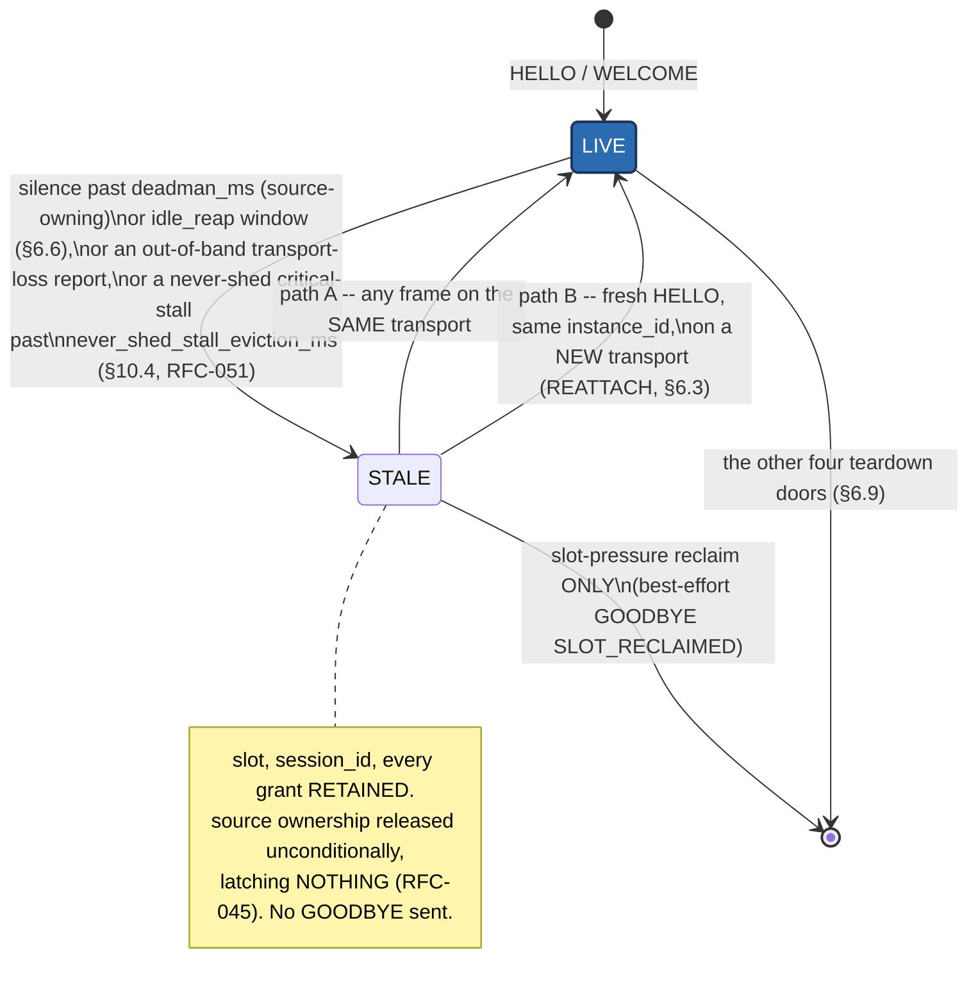
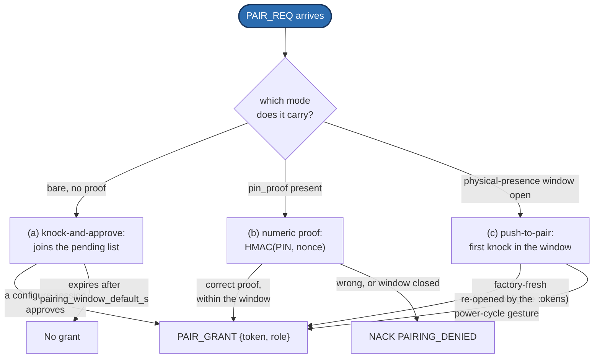
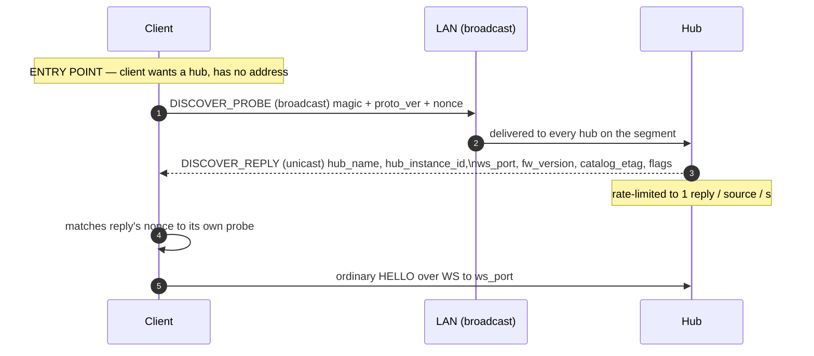

# SlopSync Protocol Specification

**Protocol:** `slopsync/1`
**Document version:** v1.0-draft (public, **not yet pinned** — see Freeze state)
**Status:** Normative in content; the numbers are NOT frozen.
**Registry of record:** [`registry/registry.yaml`](registry/registry.yaml) — Appendices A, B and G are generated *views* of it. **On any conflict between this document and the registry, the registry wins** (§5.7).
**Companion normative artifacts:** [`schema/catalog.cddl`](schema/catalog.cddl) (Appendix C), [`vectors/manifest.yaml`](vectors/manifest.yaml) (Appendix F), [`RENDERING.md`](RENDERING.md) (client-rendering conformance, §19).
**Non-normative companions:** [`RFC-QUEUE.md`](RFC-QUEUE.md) (change history and rationale), [`V1-READINESS.md`](V1-READINESS.md), [`examples/session-traces.md`](examples/session-traces.md) (Appendix E).

**FREEZE STATE — read this before building against any number here.** Clauses throughout this document and RENDERING.md bind "from the v1.0 tag forward": the never-reuse/never-renumber rule (§5.7), the conformance fixture freeze (§16), and RENDERING.md's enumerable-vocabulary freeze (§14). **That event has not occurred.** It is the **release pin** — one commit the operator locks once the protocol has been put through its paces, after which only documentation, clients, and tools move. Until the pin exists, every one of those clauses describes a future state and binds nothing: numbers, frozen fixtures, and vocabularies MAY still change, and a registry regeneration is explicitly planned to happen *at* the pin ([RFC-QUEUE.md](RFC-QUEUE.md)). Implement against this document freely — that is what it is for — but treat no number as stable yet, and pin by **commit sha**, never by this document's version string. This notice is deleted at the pin, and its deletion is the announcement.

---

## 0. Reading this document

Clause numbering is `§<section>.<subsection>`. Every section header carries `*(normative)*` or `*(informative)*`; where a section is mixed, the exception is named in its header. Numbered lists inside a normative section are normative. Tables are normative unless the section says otherwise.

**Honesty clauses** are normative statements about what this protocol does **not** protect against or does **not** guarantee. They are marked **HONESTY CLAUSE** inline and indexed in §1.5. They are requirements, not caveats: an implementation that presents a protected-sounding UI over one of them is non-conformant.

---

## 1. Introduction *(informative except §1.4 and §1.5)*

### 1.1 Purpose, scope, non-goals

SlopSync is a hub-and-spoke **device-shadow protocol**: one hub (a machine's main controller) holds the single canonical machine state; any number of clients — browser UIs, hardware remotes, mobile apps, bridges, simulators, streaming-application plugins — connect over heterogeneous transports, announce who they are and what they can do, and thereafter remain in continuous, truthful sync with that state. Clients submit **intents**; the hub applies, clamps, and echoes what was *actually applied*; every subscriber observes the same reality.

**In scope:** session establishment and identity; a self-describing channel catalog carrying enough semantics for a generic client to build its entire settings and control surface from the hub; five channel classes (state, stream, intent, event, store); per-subscriber rate grants with priorities and congestion adaptation; safety semantics (e-stop, deadman, control arbitration, stop taxonomy); a namespaced blob-transfer verb serving the catalog and device stores alike; a tiered pairing and trust model with hub authenticity; parser-totality obligations; bindings for WebSocket, ESP-NOW, BLE GATT, serial, and in-process transports; a relay role; migration from the legacy SlopDrive port-81 protocol.

**Non-goals:**

- **Cloud anything.** SlopSync is LAN/offline-first. There is no broker but the hub, no account system, no telemetry leaving the site.
- **Server-Sent Events.** SSE was evaluated as a telemetry channel (browser-native reconnect is attractive) and rejected: it is text-only (≈+33 % base64 overhead on packed samples), strictly one-way (intents would need a side channel), and its reconnect advantage evaporates once one client library implements reconnection for every consumer. The browser binding is WebSocket (§13.2).
- **Replacing TCode as an ecosystem interface.** Existing TCode text edges remain supported as compatibility ingest (§15.1).
- **Peer-to-peer sync.** Clients never talk to each other; all truth flows through the hub.
- **Being a general-purpose RPC or file-transfer protocol.** The blob verb (§8.7) exists to move a catalog and bounded device documents, not arbitrary data.

### 1.2 Design philosophy

1. **Ground truth, hub-authoritative.** The hub's state is the only state. A client never displays machine state that differs from the device's, in either direction. Connecting *adopts* device state — it never pushes defaults onto a live session. Echoes report **applied (post-clamp)** values, never requests. Optimistic client state is prohibited.
2. **Loss-tolerance by construction, tiered by class.** State frames are idempotent full snapshots — any drop is harmless because the next frame supersedes it. Sample streams are timestamped and sequenced — late data is discardable data. Only intents and timed segments demand delivery care, and each gets exactly the mechanism it needs (§9.3, §10.4).
3. **Declare, then trust.** Everything negotiable is negotiated once, at the edges of the session (handshake, subscribe, publish), and then the steady state is dumb and fast. No per-frame capability checks, no per-sample acknowledgments.
4. **The weakest transport writes the rules.** Every guarantee here is stated against unordered, lossy, 250-byte datagrams (ESP-NOW). Anything that works there works everywhere; TCP transports enjoy stronger behavior for free.
5. **Unknown means ignore.** Unknown channels, keys, frame types, roles, flags, trailing bytes: skip them, never disconnect. This single rule is why a v1 remote still works against a v4 hub.
6. **The machine owns motion processing, not the client** (§9.6). If every conforming client would otherwise have to implement a piece of kinematic work, that work belongs on the hub — written once, verifiable, identical for all clients. A client ships its content *as authored* and gets good motion.
7. **The machine owns UI description, not the client** (§8.8). A control added in firmware appears on every client's next connect, with its label, grouping, units, constraints and explanation coming from the hub. But SlopSync describes what things **are**, never how they **look**: no widget hints, no layout, no ordering metadata, no styling, ever.
8. **One surface.** SlopSync is intended to be a machine's sole application-level communication surface. On the reference device exactly two HTTP duties are permanently exempt, because SlopSync structurally cannot own them: firmware/asset **OTA** (its rights are never derivable from a SlopSync role) and the optional **served-page token sideband** (§12.8, whose entire security property is browser same-origin policy). Static asset serving is not an API and is not in scope either way.

### 1.3 Prior art and provenance

SlopSync deliberately steals from systems that survived contact with production, after a research pass confirmed none could be adopted whole (Appendix H):

- **ThingSet** — the self-describing catalog: clients discover channels, types, units, and access rights from the device itself (§8).
- **ESPHome native API** — the versioned Hello handshake with identity + entity discovery + subscription streaming (§6).
- **Micro XRCE-DDS** — the minimal transport abstraction: a binding is four operations plus declared properties (§13.1).
- **SlopDrive port-81 protocol** — the working ancestor: `cfg_gen` epochs, CLOCK t0/t1/t2 sync, batched samples, CMD/ECHO idempotency all originate there and are generalized here (§15.2).
- **MQTT retained messages** — the retained-value-on-subscribe rule (§9.1), implemented at the channel layer since no embeddable broker provides it.
- **Matter / Chromecast commissioning** — possession-is-root bootstrap and the physical-presence window (§12.3).
- **BLE Secure Simple Pairing association models** — one ceremony, several association modes chosen by joiner I/O capability (§12.3).

### 1.4 Conventions *(normative)*

The key words **MUST**, **MUST NOT**, **REQUIRED**, **SHALL**, **SHALL NOT**, **SHOULD**, **SHOULD NOT**, **MAY** are to be interpreted as in RFC 2119.

All multi-byte integers on the wire are **little-endian**. Bit 0 is the least-significant bit. Sizes are in bytes unless stated. `u8/u16/u32/i8/i16/i32/f32` denote fixed-width integers and IEEE-754 binary32. Hex literals are `0x`-prefixed. Field diagrams read left-to-right in transmission order. Where this document names a wire number in prose, it is quoting the registry (§5.7); where it names a limit by identifier (e.g. `deadman_default_ms`), the registry holds the value and Appendix G reproduces it.

Access tiers are named **watch**, **control** and **configure** throughout (§12.2). The v1-draft names *viewer*, *controller* and *admin* denote the same three wire values `0/1/2` and appear in this document only where a legacy name is being retired.

### 1.5 Index of honesty clauses *(normative)*

Each of the following is a normative limitation of `slopsync/1`. An implementation MUST NOT present a user-facing claim that contradicts one, and SHOULD surface the limitation where a user could reasonably assume otherwise.

| # | Clause | Where |
|---|---|---|
| H1 | The protocol ESTOP is a **software convenience layered above** the hardware e-stop path, never a substitute for it. | §11.2 |
| H2 | ESTOP queue preemption is a **per-hop** guarantee, not end-to-end latency: bytes already in flight ahead of it still drain first. | §11.2, §14.3 |
| H3 | The PIN pairing proof is **offline brute-forceable** by a passive observer of the exchange (4 digits = 10⁴ HMACs). It prevents casual and drive-by pairing; it is not a cryptographic access control. | §12.3 |
| H4 | v1 transports are **cleartext**. A passive LAN observer is outside the threat model; a bearer token presented in HELLO is sniffable, which is why proof presentation exists and is RECOMMENDED. | §12.1, §12.4 |
| H5 | Active LAN MITM (including a clone page proxying a PIN to the real hub) is **outside the v1 threat model**. | §12.1, §12.8 |
| H6 | The client-version change tripwire is a **tripwire, not attestation**. A deliberately malicious update lies about its version and keeps its token. | §12.6 |
| H7 | A device that never reports a `client_ver` can **never trip** the version tripwire. | §12.6 |
| H8 | The served-page token (§12.8) closes the browser-borne mass-automatable class only. A **native process on the LAN** can request it — that attacker class already defeats the cleartext ceiling (H4), so nothing is newly lost, but nothing is protected from it either. | §12.8 |
| H9 | The hub signature proves **which machine**, not that the machine is uncompromised; and a hub with no keypair answering with silence is conformant, so only a client holding a **pinned** key may read silence as failure. | §12.5 |
| H10 | Relay reliability is **hop-by-hop**. The hub knowing a frame reached the relay does not mean the client got it. | §14.2 |
| H11 | The hub's handoff sanity bound (§9.6) is **lookahead-bounded**: it can only act when a segment's successor is already scheduled, which is not guaranteed for long segments. | §9.6, §18 |
| H12 | Denial of service is out of scope. A LAN attacker can jam the radio regardless of anything this document says. | §12.1 |

> DEMO-CANDIDATE: a single searchable page, one card per honesty clause,
> linking each straight to its section — the thing a security reviewer
> actually wants before reading 1600 lines end to end.

---

## 2. Terminology, Roles, and State Machines *(normative)*

### 2.1 Glossary

- **Hub** — the single authoritative endpoint; owns machine state, the catalog, and all grants. Exactly one per machine.
- **Client** — any endpoint that establishes a session with the hub.
- **Relay** — a forwarding node between the hub and clients on transports the hub cannot reach directly (§14). A relay is not a session peer; it is invisible to the session layer except where §14 says otherwise.
- **Session** — the stateful association between one client and the hub, created by HELLO/WELCOME, destroyed by GOODBYE, eviction, reaping, or transport loss.
- **Channel** — a named, numbered, typed data flow declared in the catalog.
- **Channel class** — STATE, STREAM, INTENT, EVENT or STORE (§9). Note: "STREAM" is a channel class. Transports are described as *stream-oriented* (ordered byte pipes: TCP, serial) or *datagram-oriented* (discrete, possibly lossy/unordered: ESP-NOW, BLE notifications) — never as "stream transports", to avoid collision.
- **Grant** — the hub's applied answer to a subscription or publication request: which channel, at what rate, at what priority, with what burst. Grants are truth; requests are wishes.
- **Shadow** — the client-side replica of subscribed state, maintained exclusively from hub frames.
- **Access tier** — `watch` (0), `control` (1) or `configure` (2); §12.2.
- **Controller** — colloquially, a session holding `control` or above. Where authorization is meant precisely this document names the tier.
- **Active source** — the motion-arbitration input source currently driving motion (§11.3, §11.4).
- **Constrained client** — a client using the etag-pinned static profile (§8.5): compiled-in catalog, canned CBOR templates, no dynamic parsing.
- **Setting** — a catalog layout field carrying `setting_key` (§8.8): stored configuration, adoptable into a control. A field without `setting_key` is read-only *effective state* or telemetry and MUST NOT be written back into a setting's shadow.
- **Store** — a catalog-declared collection of opaque, slot-addressed items moved by the blob verb (§8.7).
- **Ready** — a per-session flag meaning "this client possesses the catalog it will decode with" (§6.4). Both data and intent planes are gated on it.

### 2.2 Roles and their state machines

**Client session state machine (normative):**

```
CLOSED → (transport up) → CONNECTING → (send HELLO) → HELLO_SENT
HELLO_SENT → (WELCOME) → SYNCING            # catalog possession, then readiness
HELLO_SENT → (NACK)    → CLOSED
SYNCING → (etag already matched, or catalog assembled+verified and
           CATALOG_READY sent) → READY
READY → (all subscribed STATE channels received once) → LIVE
LIVE|READY|SYNCING → (transport loss / GOODBYE / eviction) → CLOSED
any state → (send/observe ESTOP) → same state   # ESTOP is orthogonal to session state
```

A client MUST NOT act on user input that requires hub state before reaching LIVE, and MUST visually distinguish SYNCING/READY from LIVE (a UI showing stale-or-absent data as fresh violates §1.2-1).

**Hub, per session:** `ACCEPTING → VALIDATING (HELLO) → GRANTED (WELCOME sent) → READY → LIVE → CLOSED`. The hub MUST bound VALIDATING (RECOMMENDED 2 s) and drop clients that stall mid-handshake. A session that reaches GRANTED but never READY is closed at `catalog_ready_timeout_ms` (§6.4). [RFC-042](RFC-QUEUE.md#rfc-042--session-staleness-separate-the-session-ends-from-motion-stops) (§6.6) inserts a fifth, library-internal state between LIVE and CLOSED: `LIVE → (silence past its liveness window, or an out-of-band transport loss) → STALE → (any frame on its transport, or a reattaching HELLO) → LIVE`. `STALE` is never itself wire-visible; a client observes only that its own session resumed (or, once evicted under slot pressure, that it did not).

**Relay:** `IDLE → PAIRED → FORWARDING`, with the ESTOP fast-path obligation (§14.2) active in every state after PAIRED.

---

## 3. Architecture Overview *(informative)*

### 3.1 Topology and layering

```
                        ┌────────────────────────────┐
  browser UI ──WS──────►│                            │
  mobile app ──WS──────►│           HUB              │──── motion arbiter ──► motor driver
  desktop sim ─in-proc─►│  (device firmware /        │         ▲
  BLE remote ──BLE─────►│   hub role of the library) │   (sole caller — no
  TCode app ───legacy──►│                            │    SlopSync session
                        └──────────▲─────────────────┘    touches the driver)
                                   │ UART
                             ┌─────┴─────┐
                             │   RELAY   │
                             └─────▲─────┘
                                   │ ESP-NOW (250-byte datagrams)
                          remote displays, dongle clients
```

Layering, bottom-up: **transport binding** (§13: open/close/write/read + declared MTU/ordering/reliability/`max_frame`) → **framing** (§5: 8-byte header + payload, fragmentation if unavoidable) → **channel layer** (§9: class semantics per channel) → **session layer** (§6: identity, readiness, grants, liveness, reconnect) → **trust layer** (§12: tiers, pairing, authenticity).

**Normative architectural rule** (restated normatively in §11.4): SlopSync sessions terminate at the hub's session engine, which submits intents to the machine's **motion arbiter** — the only component permitted to command the motor driver. No SlopSync-originated data reaches the driver by any other path. A hub implementation that lets a session bypass its arbiter is non-conformant.

### 3.2 Worked narratives

*(Full annotated traces are in [`examples/session-traces.md`](examples/session-traces.md); Appendix E indexes them.)*

- **A browser connects:** WS upgrade with subprotocol `slopsync.v1` → HELLO (identity, token, subscription and publication wishes) → WELCOME (session id, boot id, roles, grants, catalog etag, hub identity, limits) → client's cached etag matches, so it is READY on the spot and downloads nothing → hub pushes retained STATE for every granted channel → client reaches LIVE and renders, entirely from device truth.
- **A remote nudges speed:** INTENT {channel: config-set, value: 420, intent_id: 17} → hub clamps to 400 (its ceiling), applies via the arbiter, bumps `cfg_gen` because the applied value actually changed → ECHO {intent_id: 17, applied: 400, cfg_gen} to the sender → STATE update to *every* subscriber including the sender. Every screen now shows 400. Nobody shows 420, including the remote that asked for it.
- **The wifi dies mid-stroke:** streaming client vanishes → hub deadman fires at 600 ms → the session is marked `STALE` ([RFC-042](RFC-QUEUE.md#rfc-042--session-staleness-separate-the-session-ends-from-motion-stops) — its slot, `session_id` and grants are RETAINED, not torn down) and the streaming source's ownership is released, unconditionally → the machine has no fresh command to execute and settles to rest on its own, latching nothing (§11.3/[RFC-045](RFC-QUEUE.md#rfc-045--retire-deadman-as-safety-session-liveness-is-bookkeeping-not-motion-control)) → `control-owner` updates so any authorized session may claim the source next → if the client's WiFi recovers, a fresh HELLO on the new connection REATTACHES the same session identity (§6.3) rather than starting over. Had a hub-autonomous pattern been driving instead, its `source.background_run` setting would have governed (default `false`: the generator stops; `true`: it keeps running, unowned, stoppable only by the role-exempt `stop`/`estop` ops) — either way, nothing latches, and it never depended on any client staying connected.
- **A new remote is adopted:** the remote has one button and no screen. It knocks (bare PAIR_REQ). The knock appears as protocol state on the pending-pairing channel and as an event; the operator's phone — any `configure` session, not "the WebUI" — approves it at the `control` tier; PAIR_GRANT delivers a token and the hub's public key. From then the remote can verify it is talking to *that* machine.

---

## 4. Versioning and Compatibility Model *(normative)*

### 4.1 Protocol version negotiation

HELLO carries `proto_ver` (key 1), the highest major version the client speaks. The hub replies WELCOME with the version it will serve — the highest common version ≤ its own. If none is servable: NACK `UNSUPPORTED_VERSION` and close. Within a major version all evolution is additive and governed by §4.3; there are no minor versions on the wire.

### 4.2 The four tokens

Four version-like tokens coexist. They answer different questions and MUST NOT be conflated:

| Token | Question it answers | Changes when | Carried in |
|---|---|---|---|
| `proto_ver` | "What wire grammar are we speaking?" | Spec major revision | HELLO, WELCOME |
| `catalog_etag` | "What channels/schemas/annotations does this hub expose?" | Firmware update, or any catalog content change | WELCOME, HELLO, CATALOG_READY, channel `catalog` |
| `cfg_gen` | "Which generation of *config content* is current?" | Any **effective** config change, at runtime | WELCOME, ECHO, config STATE frames, INTENT `precondition` |
| `fw_version` | "What software is this machine running?" | Hub firmware update | WELCOME `identity` (§6.3) |

Rules:

1. A `cfg_gen` bump MUST NOT change `catalog_etag`, and a catalog content change MUST change the etag (§8.3).
2. **`cfg_gen` advances if and only if at least one applied configuration value actually changed, regardless of who or what changed it.** An accepted but value-identical write still receives its post-clamp ECHO (ground truth is unaffected) but MUST NOT bump `cfg_gen` and MUST NOT trigger an on-change STATE republish. Symmetrically, a configuration change originating *on the machine* — a physical control, boot adoption, an internal recalculation — MUST bump `cfg_gen`; otherwise a client's `precondition` compare-and-set passes against config that has already moved. Both directions are required; either alone is a bug.
3. A hub whose catalog can change without reboot MUST emit an updated `catalog` STATE frame carrying the new etag, and clients MUST treat an observed etag change as a demand to re-enter SYNCING (§6.4). On hubs where a firmware update implies reboot, the new `boot_id` forces a full reconnect anyway — but the etag path MUST still be correct, because simulators and host hubs exercise it.
4. `fw_version` has exactly one wire home: WELCOME `identity` (§6.3). It MUST NOT be duplicated onto a STATE channel; two homes drift.

### 4.3 Tolerance rules

A conformant endpoint, on receiving:

- an **unknown frame type** — MUST ignore the frame (length is always in the header, so skipping is safe);
- an **unknown channel id** — MUST ignore the frame;
- an **unknown CBOR map key**, at any nesting level including scoped sub-maps — MUST ignore the pair;
- **trailing bytes** beyond a known packed layout — MUST ignore them (§5.4 append-only rule);
- an unknown **NACK/GOODBYE code** — MUST treat it as the generic code of its range (high byte);
- an unknown **field role, setting flag, category, stream kind, pairing mode bit, procedure phase, event kind, or blob namespace** — MUST fall back to the generic behavior its section defines, never reject.

Endpoints MUST NOT disconnect, NACK, or log-spam over any of the above. The *sender* of novelty carries the compatibility burden of making it ignorable.

Tolerance is not permissiveness: ignoring an unknown key is required, whereas accepting a **structurally invalid** payload is forbidden (§5.8). "I do not know what key 99 means" and "this string claims to be 2⁶⁴ bytes long" are different questions with different answers.

### 4.4 Evolution policy and reserved ranges

Additions (new frame types, keys, channels, codes, roles, categories) land in `registry.yaml` by PR and appear in the next tagged spec.

**Numbers are never reused or renumbered after a tagged release.** This rule binds from the **v1.0 tag forward**. The preceding v1-draft was a feasibility exercise and never a public release; the v1.0 base pass therefore restructured freely, retiring frame types `0x09` (CATALOG_REQ) and `0x0A` (CATALOG_CHUNK) without reallocating them — a stale draft-era peer meets an unknown type and fails loudly rather than misreading a BLOB frame (§4.3 makes "loudly" mean "ignored", which is the correct failure).

Reserved ranges: frame types `0x02` and `0x21–0x3F` spec/core, `0x40–0x7F` future spec, `0x80–0xDF` experimental, `0xE0–0xFF` reserved except `0xE5`. CBOR keys 1–63 core, 64–127 reserved, 128+ experimental. Channel ids per `channel_id_ranges`. Blob namespaces 0–127 spec, 128–255 device. Setting categories 0–127 spec, 128–255 device. Procedure phases 0–127 spec, 128–255 device.

**Experimental ranges MUST NOT appear in tagged releases.**

Breaking the wire grammar requires a `proto_ver` bump, which requires exceptional justification. The intended lifetime of `slopsync/1` is the lifetime of the hardware.

### 4.5 Every refusal is answered

**A conforming implementation never declines silently: every frame or transfer it cannot honor has a wire signal.** §6.7's SUBSCRIBE rule is the instance that was paid for in debugging time; the principle is general, and it binds clients as well as hubs. Three named applications beyond SUBSCRIBE:

1. A **client** that cannot accept a declared blob (`total_bytes` over its reassembly budget) MUST GOODBYE with `BLOB_REFUSED` (0x0503) rather than idle in a half-session (§8.4). The observed failure: a refused catalog transfer produced a session that went LIVE with no catalog, no error anywhere, and a `READY_TIMEOUT` fifteen seconds later that blamed the client. Refusal is legal; silent refusal is not.
2. A HELLO whose `token` field is **present but malformed** (wrong length or type) fails decode and MUST be answered NACK `MALFORMED` — never silently demoted to watch tier. A *tokenless* HELLO keeps its legitimate watch-tier path; only present-but-broken credentials become loud. Under enforcement, silent demotion presents as "connects, plays nothing".
3. Idle reaping (§6.6) sends GOODBYE `IDLE_REAPED` (0x010C). It is distinct from `DEADMAN_TIMEOUT` on purpose: `DEADMAN_TIMEOUT` now means ONLY a §11.3 deadman firing on a source-owning session. Reaping a dark viewer is housekeeping with zero motion consequence, and before the code existed it was reported with the motion-safety code in every log and client.

---

## 5. Wire Format *(normative)*

### 5.1 Frame header

Every SlopSync frame begins with the same 8 bytes:

```
offset  size  field     notes
0       1     type      frame type (registry `frame_types`)
1       1     flags     bit0 FRAG_START, bit1 FRAG_MORE; others zero on send, ignored on receive
2       2     channel   u16 channel id; 0x0000 for session-scoped frames
4       2     seq       u16 sequence number (§7.3); 0 where the class is unsequenced
6       2     len       u16 payload length in bytes (excluding this header)
```

One SlopSync frame maps to exactly one transport datagram/message where the binding allows (§13); `len` makes frames self-delimiting on byte-pipe bindings.

**`max_frame` is header-inclusive**: it bounds `8 + len`. Per-binding defaults are in the registry (`max_frame_ws`, `max_frame_espnow`, `max_frame_ble`, `max_frame_serial`; Appendix G). A hub advertises its own value in WELCOME `limits.max_frame` and MAY advertise less than its binding permits; it MUST NOT advertise more. A frame exceeding the negotiated maximum is answered with NACK `FRAME_TOO_LARGE` (if a session exists) and discarded.

**What `header.channel` carries, per frame type** *(normative routing — previously discoverable only by reading the reference implementation)*:

| Frame types | `header.channel` |
|---|---|
| HELLO, WELCOME, SUBSCRIBE, UNSUBSCRIBE, PUBLISH, GRANT, NACK, GOODBYE, PING, PONG, CLOCK, PROBE, PROBE_REPORT, PAIR_REQ, PAIR_GRANT, AUTH, HUB_SIG, CATALOG_READY, BLOB_REQ, ACKMASK, BEACON | `0x0000` (session-scoped). Any addressing rides the payload — NACK's `channel_id` (15), BLOB_REQ's `blob` (38) sub-map |
| STATE, STREAM, INTENT, ECHO, EVENT | the **target channel id** |
| BLOB_CHUNK | the id of the channel whose blob it carries (the `catalog` channel for namespace 0) |
| ESTOP | not applicable — the §5.5 fixed 12-byte layout has no conventional header |

INTENT and ECHO *also* carry `channel_id` (15) inside the CBOR payload; the header copy is redundant-but-authoritative routing — the two name the same channel, and the header is what routes.

### 5.2 Frame type registry

The full table lives in `registry.yaml` (`frame_types`) and is reproduced in Appendix A. Core points:

- **Control-plane** frames carry CBOR payloads (§5.3): HELLO, WELCOME, SUBSCRIBE, UNSUBSCRIBE, PUBLISH, GRANT, INTENT, ECHO, EVENT, NACK, GOODBYE, PROBE_REPORT, PAIR_REQ, PAIR_GRANT, BLOB_REQ, AUTH, HUB_SIG.
- **Data-plane** frames carry packed payloads (§5.4): STATE, STREAM.
- **Raw** frames have fixed layouts defined in their own sections: PING, PONG, CLOCK, PROBE, ACKMASK, BEACON, CATALOG_READY, BLOB_CHUNK, ESTOP.

### 5.3 Control-plane encoding: the CBOR profile

Control payloads are CBOR maps with **integer keys** from the global key registry (`cbor_keys`, Appendix B), restricted to a deterministic subset of RFC 8949:

- definite-length everything (no indefinite strings/arrays/maps);
- integers in shortest form; map keys sorted ascending by encoded bytes;
- floats as binary32 only (never binary16/64); values that are semantically integers encoded as integers, not floats;
- no tags, no bignums, no simple values other than `false`/`true`/`null`;
- **maximum nesting depth 4 per decoded document.** One structure legally exceeds this as a whole: the catalog, whose entries nest to 5 counting the outer array. §8.4 therefore defines the catalog as an outer array header followed by independently-decodable *entry documents*, each within the depth-4 cap.
- an **absent** optional key is simply not emitted. There is no "null means absent" encoding; a key that is present with value `null` is a distinct (and, unless a section says otherwise, invalid) thing.

**Scoped sub-map key conservation (normative).** Per-feature keys do NOT each take a global key. A feature takes **one** global key holding a sub-map whose interior keys come from that feature's own small space, registered separately. The registered scoped spaces at v1.0 are `limits` (22) → `welcome_limits_keys`, `probe_result` (26) → `probe_result_keys`, `identity` (37) → `identity_keys`, `blob` (38) → `blob_keys`, `trust` (39) → `trust_keys`, and `body` (40) → **the channel's own catalog `schema`**, exactly as INTENT's `value` (20) does. A sub-map's key space is local: key 1 in `blob` and key 1 in `trust` are unrelated, and neither is `proto_ver`. A new feature that wants five keys gets one global key plus a sub-key section.

**Signedness (normative).** For a value described by a catalog field, **the catalog's declared type is authoritative over the CBOR major type**. A field declared `int` whose value happens to be non-negative round-trips legally as CBOR unsigned; a decoder MUST accept either major type and interpret per the catalog. Encoders MUST NOT be required to force a negative-looking encoding to signal signedness.

*Rationale (informative):* exactly one valid encoding exists for any message, which makes golden vectors byte-exact and lets constrained clients ship **pre-encoded templates** — a canned HELLO with value bytes patched in at runtime is guaranteed to be the same bytes a full encoder would produce. A decoder MAY reject profile violations with NACK `PROFILE_VIOLATION`; it MUST NOT crash on them (§5.8).

### 5.4 Data-plane encoding: packed layouts

STATE and STREAM payloads are **packed little-endian structs**. There is no encoder: the layout *is* the catalog entry's `layout` array (§8.1) — an ordered list of fields using `packed_field_types` from the registry. Scaled integers are the norm (wire = physical × `scale`); `f32` is permitted where dynamic range demands it; `str16`/`str32`/`str64` are fixed-width, zero-padded UTF-8 (a reader stops at the first NUL or the declared width, whichever comes first).

**STREAM sample layouts MUST NOT contain string fields.** The motion hot path never pays for text.

**Append-only evolution rule:** a layout, once released, may only grow at the tail. Readers MUST parse the prefix they know and ignore trailing bytes; writers MUST NOT reorder, resize, or remove released fields. Consequence: a constrained client compiled against catalog etag *E* still reads every field it knows from a hub whose catalog moved to *E′* by appending — the etag check (§8.5) then decides *policy* (warn/degrade), not parseability. Removing or changing a field requires allocating a **new channel id** and retiring the old one, which keeps its id forever (§4.4).

**Explicit field width (forward decodability).** A layout field MAY carry `size` (catalog key 18) — the field's packed width in **bytes**, stated explicitly. Decoders MUST prefer the declared size over the type-derived width; an unknown TYPE with a declared SIZE is then a **skippable hole** rather than a decode wall. Without it, the first registry-added packed type strands every existing client at the first field that uses it: later offsets become unknowable and the entire layout tail goes dark — both shipped generic clients independently carried the identical defensive truncation, which is why this key exists. For known types the declared width MUST equal the type-derived width; conformance checks the agreement, and a mismatch is a catalog-authoring error, never a runtime override.

**STREAM bundle payload layout** (applies to every STREAM channel; the catalog defines only the per-sample struct):

```
offset  size      field
0       4         t_base     u32 hub-time µs of sample[0] (§7.2)
4       1         n          sample count, 1..32
5       1         reserved   zero on send, ignored on receive
6       2×n       t_off[n]   u16 µs offset of sample[i] from t_base
6+2n    S×n       samples    n packed sample structs of catalog-declared size S
```

A bundle MUST satisfy all of:

1. `n` in `1..bundle_max_samples` (32);
2. `t_off[0] == 0`, and `t_off` **strictly increasing** thereafter;
3. span `t_off[n-1] ≤ bundle_max_span_ms` (20 ms);
4. payload length exactly `6 + 2n + S·n`;
5. total frame ≤ the binding's `max_frame`.

A bundle violating any of these is **malformed** and MUST be rejected **whole** — never parsed part-way (§5.8). Senders SHOULD fill toward whichever cap binds first; the caps exist to bound latency, buffers, and fragmentation respectively — a bundle never fragments.

**Timestamp meaning depends on `stream_kind`** (§9.2):

- `samples` (0, the default): `t_base + t_off[i]` is the instant sample *i* **describes**. It is observational.
- `segments` (1): `t_base + t_off[i]` is the intended **execution start** of sample *i*, resolved through the §7.2 nearest-window rule. It is a schedule. A hub MUST clamp scheduling to at most `max_future_schedule_ms` (250 ms) ahead of its own current time; a sample scheduled further out is clamped, not rejected. Clients SHOULD schedule no further ahead than half that budget.

### 5.5 The ESTOP frame

The ESTOP frame is 12 bytes total and deliberately violates the normal header discipline so that it can be recognized **without deframing**:

```
E5 E5 E5 E5  |  cause:u8  origin:u8  seq:u16  |  crc32:u32
```

- `type` = `0xE5` and the three payload-leading `0xE5` bytes form the 4-byte magic `E5 E5 E5 E5` at frame start. A byte-serial scanner (serial ISR, relay hot path) matching four consecutive `0xE5` bytes MUST treat the following 8 bytes as a candidate ESTOP and validate the CRC-32 (IEEE, over the first 8 bytes) before acting. False-trigger probability with CRC: 2⁻³².
- `cause` is a `safety_causes` value (§11.1) — **one taxonomy, two wire homes**: this byte and the latched `cause` field of the `safety` STATE channel. `origin` is the access tier of the initiator. `seq` increments per **initiation event**: every repeat of one initiation carries the same `seq` (§11.2).
- End-to-end semantics — repeat-until-latched, clearing, and relay obligations — are in §11.2. This section defines only the bytes.
- `0xE5` does not collide with the CBOR profile (no simple values beyond `false`/`true`/`null` are legal, §5.3) and COBS handling on serial is specified in §13.5.

### 5.6 Fragmentation and reassembly

Fragmentation exists **only** for control-plane frames that cannot fit the binding MTU (in practice: large ECHOs and blob requests on constrained bindings). Data-plane frames MUST NOT fragment: STATE payloads fit `min_transport_payload` (242 B) by catalog design (§9.1), and STREAM bundles size themselves to the MTU (§5.4). Blob transfer is chunked at the application layer (§8.7), not fragmented; store imports larger than `max_frame` ride blob chunks, **never** fragmented INTENTs.

Fragments carry the same `type`/`channel`/`seq` with flags: first = `FRAG_START|FRAG_MORE`, middle = `FRAG_MORE`, last = neither (the reassembler knows it is mid-stream), single = `FRAG_START`. Fragment payloads carry a 2-byte prefix `frag_index:u16`. Reassembly is keyed per (session, type, seq); timeout `frag_reassembly_timeout_ms` (5 s) then discard and NACK `REASSEMBLY_TIMEOUT`; at most `frag_max_concurrent_per_session` (2) concurrent reassemblies, excess discards the oldest. Bindings whose MTU exceeds every control message never emit fragments; receivers MUST still implement reassembly, because relays may downgrade the path MTU.

A reassembler MUST refuse an over-capacity transfer **and its numbers**: declared counts and lengths from a refused transfer MUST NOT be retained or subsequently used (§5.8).

### 5.7 Registries and governance

`registry/registry.yaml` is the single source of truth for frame types, flags, CBOR keys and every scoped sub-key space, channel-id ranges, core channels, channel classes, stream kinds, access levels, priority classes, NACK/GOODBYE codes, packed field types, setting categories and flags, field roles, event kinds, safety ops and causes, admin ops, pairing modes, presentation modes, trust states, blob namespaces, log levels, procedure phases, and every numeric limit.

Appendices A, B and G are **generated views** of it. Spec text citing a number that disagrees with the registry is a spec bug; the registry wins. Allocation is by PR; the experimental ranges are the sandbox; nothing is renumbered post-tag (§4.4).

Implementations MUST NOT hand-maintain a second copy of any registry table. Where a language needs constants, they are generated from the registry.

**Scope of "the registry wins".** The registry is authoritative for **values**: numbers, names, ranges, enumerations, limits, and the semantics recorded in their notes. It is *not* authoritative for the **location of prose**: the `ref:` fields on registry entries are convenience pointers into this document and MAY lag a section renumber. Where a `ref:` points at a section whose content has moved, the section headings of this document are the authority for *where a rule is written*, and the registry remains the authority for *what the number is*. A stale `ref:` is an editorial defect, never a wire conflict. **Known instance at v1.0:** the v1.0 rewrite inserted §6.4 (readiness) and split §12.2, shifting several `ref:` targets by one subsection; §18-19 records it.

### 5.8 Parser totality and defensive decoding *(normative)*

Every conforming parser — hub **and client** — MUST map **any** byte string to accept-or-reject. Specifically:

1. **Totality.** No out-of-bounds read or write, no unbounded allocation, no unbounded recursion, no undefined behavior, for any input including adversarial input. The deterministic profile (§5.3), the depth-4 cap, and definite lengths make this achievable; this clause makes it an obligation.
2. **Length fields are never trusted past the enclosing buffer.** A declared length MUST be validated as `declared ≤ remaining`, never as `start + declared ≤ size` — the latter can overflow and pass. Registry string caps (`client_ver_max_bytes`, `desc_max_bytes`, `option_label_max_bytes`, name and kind caps) are **parse-time obligations** in structural payloads: a receiver **rejects** an over-cap string, it does not truncate and continue.
3. **Refusing a transfer refuses its numbers** (§5.6).
4. **Diagnostic strings are the sender's problem, structural strings are the receiver's.** A **sender** MUST truncate a diagnostic string (NACK `detail`) to `nack_detail_max_bytes` rather than dropping the message — an over-length detail MUST NOT cause the whole NACK to vanish. A **receiver** MUST reject an over-cap string in a *structural* payload.
5. **Client obligations are symmetric.** A hostile hub MUST NOT be able to crash a conforming client. A client that auto-connects to a discovered service is one malicious hub away from parsing hostile bytes, and the catalog — rich in variable-length strings — is the fattest client-side surface in the protocol. Every clause above binds clients exactly as it binds hubs.
6. **Encode failure is never silence.** A hub that cannot encode a mandatory response (WELCOME, ECHO) MUST close the session — GOODBYE if it can encode one, transport close otherwise. Silently dropping a mandatory response is non-conformant: the peer is left waiting on a message that will never come.
7. **Constant-time comparison** is REQUIRED for every token, proof, and signature comparison.

Conformance evidence for this section is fuzzing, not vectors (§17.4).

---

## 6. Session Layer *(normative)*

### 6.1 Identity: three numbers, three jobs

- **`instance_id`** (8 bytes, client-generated once and persisted) — *who this client durably is.* Distinguishes "the same phone reconnecting" from "a second phone". Generated randomly at first run; a client that cannot persist (incognito browser) generates per-load and simply enjoys weaker reconnect and pairing semantics.
- **`session_id`** (u32, hub-assigned, random non-zero, unique within a hub boot) — *this particular association.* Not a secret; authorization lives in tokens (§12).
- **`boot_id`** (u32, hub-generated randomly at every boot) — *which incarnation of the hub.* All hub timestamps, seqs, session ids, and idempotency state are scoped to a `boot_id`; observing a new one invalidates every cached assumption except the catalog etag, pairing tokens, and a pinned hub public key.

**A fourth, orthogonal identity primitive:** `hub_instance_id` (u64, WELCOME `identity` key 5, §6.3) is the hub's *durable* cross-boot identity — generated once and NVS-persisted, unchanged by every reboot and firmware update — as opposed to `boot_id`, which is fresh every boot by design. It carries none of `boot_id`'s fencing role (no timestamp, seq, or idempotency state is scoped to it); it exists purely so a client, or a DISCOVER_REPLY recipient (§13.8), can recognize "this exact physical hub" across time. [RFC-048](RFC-QUEUE.md#rfc-048--the-rendering-constitution-catalog-vocabulary-capability-interfaces-renderer-law).

### 6.2 HELLO (client → hub)

CBOR map. Required: `proto_ver` (1), `client_kind` (2), `client_name` (3), `instance_id` (4). Optional: `token` (5), `catalog_etag` (8) — the etag the client has cached — `subscriptions` (10) and `publishes` (11) wish-lists so simple clients complete setup in one round trip, `trust` (39), and `deadman_wish_ms` (44) — the requested deadman window (§11.3).

- `subscriptions` entries are `{channel_id, rate_hz, priority}`.
- `publishes` entries are `{channel_id, rate_hz, burst?, curve_family?}`. A c2h STREAM producer has no subscription priority; `burst` is the token-bucket capacity in samples (§10.5); `curve_family` (45) declares a segment stream's smoothness class (§9.6).
- `trust` (39) is the optional identity/authenticity sub-map. In HELLO it may carry `client_ver` (1), `client_nonce` (2, 8 bytes of client entropy), and `sig_request` (3). **A client that omits `trust` entirely is on the supported floor**: bearer token, zero crypto, the v1-draft handshake cost unchanged.

**Publication wish validation.** The hub validates each `publishes` wish against the catalog: the channel MUST exist, be class STREAM, be direction c2h, and its effective `access` MUST NOT exceed the session's granted tier. A wish that fails any check is **silently omitted** from the grants — no NACK, because an unwanted publish wish is not an error. A passing wish is granted at `min(wished rate, catalog max_rate_hz)`; a channel whose granted rate resolves to ≤ 0 is not a rate-bearing publish and is omitted. Grants are echoed in WELCOME under `granted_publishes` (36). **A session may send STREAM bundles only on channels granted here or by a later PUBLISH (§6.7).**

**Subscription wishes** are answered as grants embedded in WELCOME under `grants` (35), using the same structure GRANT uses (§10.2).

### 6.3 WELCOME (hub → client)

CBOR map: `proto_ver` (the served version), `session_id`, `boot_id`, `catalog_etag`, `cfg_gen`, `roles` (23 — the granted access tier: `watch` unless a valid token raises it), `limits` (22), `deadman_ms` (24) and `deadman_policy` (25) as applied to this session, `nonce` (29 — 8 bytes, used by a subsequent PAIR_REQ *and* by token-proof presentation), `grants` (35), optionally `granted_publishes` (36), `identity` (37), optionally `trust` (39), and optionally `ws_port` (46) and `ipv4` (47).

- `limits` (22) carries at minimum `max_frame` (1), `max_subscriptions` (2), and `retained_pending` (3) — the count of retained STATE pushes that will follow — plus `max_subscriptions_per_frame` (4), the most wishes one SUBSCRIBE or HELLO frame may carry (§6.7).
- `identity` (37) carries `product` (1), `fw_version` (2), `hub_name` (3), an optional `hub_instance_id` (5, u64, [RFC-048](RFC-QUEUE.md#rfc-048--the-rendering-constitution-catalog-vocabulary-capability-interfaces-renderer-law)) — the hub's durable cross-boot identity (§6.1), distinct from the per-boot `boot_id` — and an optional device-defined `info` map (4) whose keys the protocol never interprets. **This is the only wire home for hub identity.** A hub SHOULD carry it; clients MUST tolerate its absence per §4.3, and MUST NOT make connection or operation conditional on it. Reference-implementation status: §18-16.
- `trust` (39) in WELCOME may carry `pairing_modes` (8, a bitmask of the association modes this hub offers **right now**, re-evaluated per session so a transient window is advertised only while open) and `welcome_sig` (5) where the hub can sign without stalling (§12.5).
- **`ws_port` (46) and `ipv4` (47)** ([RFC-046](RFC-QUEUE.md#rfc-046--ble-primary-discovery-udp-probe-and-reply-and-cross-transport-migration) item 3) are the hub's own WebSocket port and IPv4 address, present on every binding — including WS itself, closing the same "what does the hub believe its own endpoint is" gap for a WS client — but load-bearing specifically over BLE: a BLE-connected client reads them to perform the §13.1/§13.4 upgrade hop to WebSocket without any out-of-band discovery. **`0` means absent** for either key (no WS listener, or no IPv4 address) — a client MUST treat `0` as "not offered right now," never as a literal port or address.
- `granted_publishes` is omitted entirely when no publish wish was granted.

WELCOME is the moment grants become truth; anything not granted here needs SUBSCRIBE or PUBLISH.

*A worked, frame-by-frame HELLO → WELCOME → readiness-gate trace, with a
diagram, lives in [examples/session-traces.md](examples/session-traces.md) E1.*

**Capability discovery is catalog introspection.** There is no capability list in WELCOME and there will not be one. A feature exists **iff its channels exist**: a hub with a current sensor advertises the power channel and a hub without one does not, and that absence *is* the answer. Ceilings and geometry are discovered by `field_roles` (§8.8), not by a parallel enumeration that can drift.

**Duplicate identity:** if a HELLO arrives bearing the `instance_id` of a live session, the hub MUST evict the old session (GOODBYE `DUPLICATE_INSTANCE` if its transport still functions) and honor the new HELLO. Half-open zombies die here. Because a successful duplicate HELLO **evicts** the incumbent, a second HELLO is never a legal way to change one's own role mid-session — that is what AUTH (§12.4) exists for.

**Transport migration ([RFC-046](RFC-QUEUE.md#rfc-046--ble-primary-discovery-udp-probe-and-reply-and-cross-transport-migration) item 4).** The duplicate-identity rule above is written for a genuine second claimant; it is silent on a client that legitimately hops transports — the case that matters is a BLE-connected client upgrading to WebSocket per §13.1/§13.4. Where a hub can identify an incoming HELLO's `instance_id` as belonging to a session it already holds, **arriving on a transport binding other than the one that session currently uses**, it SHOULD treat the new connection as a **migration** of the same session identity rather than a competing claimant: grants, `cfg_gen`, and the catalog etag are reconciled by the ordinary WELCOME flow exactly as any reconnect (§6.8) — an etag match skips catalog transfer — and the prior transport binding is simply closed, without `DUPLICATE_INSTANCE` and without running §6.9 teardown's ownership-release consequence on it. **A migration is not a session loss.** Role is re-derived from the presented token exactly as any HELLO does, so a revoked credential still downgrades correctly. This is additive, not a relaxation: a hub unable to distinguish a migration from a genuine second claimant MAY simply apply the duplicate-identity rule above, which remains fully conformant — a client that migrated and got evicted anyway just reconnects (§6.8). Where a hub implements session staleness ([RFC-042](RFC-QUEUE.md#rfc-042--session-staleness-separate-the-session-ends-from-motion-stops), §6.6), a `STALE` session's cross-transport HELLO uses this identical reattach path back to `LIVE`. Clients SHOULD keep a BLE binding known/bonded and migrate to WS whenever WELCOME's `ws_port`/`ipv4` (above) and the BLE `ws_available` advertising flag (§13.4) say a WS endpoint is reachable.

**Admission:** a hub at its client limit answers HELLO with NACK `BUSY` carrying `retry_after_ms` (31). A hub's transport-tracking capacity MUST exceed its session capacity by at least one, so that the peer which loses the admission race is still reachable to *receive* its BUSY. Advertised defaults and the conformance floor (≥ `conformance_min_clients`) are in Appendix G.

### 6.4 Readiness: the dual-plane gate *(CATALOG_READY)*

A client cannot decode a packed STATE frame without the catalog that describes its layout, and a client MUST NOT act before it has adopted the retained safety latch (§11.5-2). Both problems have one answer.

**The rule.** Every session carries a `ready` flag, initially false. While a session is not ready:

1. the hub emits **no** STATE and **no** STREAM to it — including the retained push;
2. the hub **refuses** inbound INTENTs from it with NACK `NOT_READY`. Refused, not queued: a client acting before adopting the safety latch is exactly the failure §11.5-2 forbids.

Nothing is buffered anywhere. Retained values already live once in the hub's channel table; the gate is one flag and costs no RAM, and it never blocks. Frames that are *not* gated: the session and safety planes — PING/PONG, CLOCK, GOODBYE, NACK, PAIR_*, AUTH, BLOB_*, ESTOP, and the safety-intent ops that §11.2 makes role-exempt. **You may always stop the machine, ready or not.**

**Becoming ready.**

- **Etag match is proof of possession.** A HELLO whose `catalog_etag` equals the hub's makes the session ready immediately, on the WELCOME. The common reconnect case keeps its zero-latency retained push.
- **Otherwise:** WELCOME advertises the current etag; the client fetches the catalog over BLOB namespace 0 (§8.4) — which gets the whole pipe, since no telemetry is competing — assembles it, and **verifies the SHA-256 locally**. The hash *is* the acknowledgment; there are no transfer round trips to negotiate. The client then sends **CATALOG_READY** (`0x19`, raw, c2h), payload = the 8-byte etag it now operates against. The hub sets `ready`, the retained push flows, the client reaches LIVE.
- **Loss-proofing:** CATALOG_READY is idempotent. A client re-sends it every `catalog_chunk_gap_timeout_ms` until the first retained STATE arrives. There is no handshake state machine and no hub timer for it.
- **Degraded static clients** (§8.5) send CATALOG_READY carrying their **stale** etag. Append-only layouts make their prefix-parse safe; the hub serves them and MAY record the session as degraded.

**Timeout.** A session that has not become ready within `catalog_ready_timeout_ms` (15 s) MUST be closed with GOODBYE `READY_TIMEOUT`. This exists because liveness reaping (§6.6) never fires on a client that PINGs happily forever: without this rule a half-adopted session would hold a slot indefinitely with both planes gated shut.

*Rationale (informative):* the alternatives were tried and are worse. A hub-side "defer until I have sent the whole catalog" is ambiguous — the hub knows it *sent* chunks, not that they *arrived*, which is true on TCP and false on ESP-NOW. Client-side "discard what I cannot decode" spends airtime shipping frames into a bin. The gate means undecodable state is never transmitted at all.

### 6.5 Network probe (optional, post-READY)

Grants at WELCOME are deliberately conservative defaults — a controller reconnecting mid-motion must not wait on a bandwidth measurement. A client wanting refinement runs the probe *after* going LIVE:

1. Client sends PROBE (raw, empty payload) → hub replies with a timed burst of PROBE frames (raw payload: `probe_index:u16` + padding) totaling `probe_default_bytes` over at most `probe_max_duration_ms`.
2. Client measures received bytes/span/loss and reports PROBE_REPORT (CBOR: `probe_result` (26), sub-keys `bytes_received`, `span_ms`, `loss_pct_x100`, `rtt_ms`).
3. Hub MAY raise grants accordingly, announced via unsolicited GRANT (§10.2).

The probe measures the hub→client direction. Runtime congestion adaptation (§10.3) continues regardless — the probe sets a better starting point, nothing more.

### 6.6 Liveness, deadman, and idle reaping

**Any received frame is proof of life.** A dedicated PING (raw, empty; answered by PONG echoing the payload) is sent only when a side has been otherwise silent for its interval: `ping_interval_holding_control_ms` (200 ms) while the session owns an active motion source, `ping_interval_idle_ms` (1 s) otherwise. A 240 Hz streamer therefore never sends PING and never idles out while streaming.

There are **two liveness regimes, deliberately different**:

| Regime | Applies to | Trigger | Consequence |
|---|---|---|---|
| **Deadman** (§11.3) | a session that **owns an active motion source** | silence beyond `deadman_ms` (default 600, clamp 250–5000, negotiated at WELCOME) | session marked `STALE` ([RFC-042](RFC-QUEUE.md#rfc-042--session-staleness-separate-the-session-ends-from-motion-stops) — see below), **not** torn down; ownership of the source released **unconditionally**, latching nothing ([RFC-045](RFC-QUEUE.md#rfc-045--retire-deadman-as-safety-session-liveness-is-bookkeeping-not-motion-control)) — a command-driven source has nothing left to execute and settles on its own (§11.3); a hub-autonomous source's `source.background_run` setting governs, default `false` (stops) |
| **Idle reaping** | every other session | silence beyond `idle_reap_multiplier` × `ping_interval_idle_ms` | session marked `STALE` ([RFC-042](RFC-QUEUE.md#rfc-042--session-staleness-separate-the-session-ends-from-motion-stops)), **not** torn down. **No motion consequence** — it owned nothing |

**[RFC-042](RFC-QUEUE.md#rfc-042--session-staleness-separate-the-session-ends-from-motion-stops): staleness, not termination.** Both regimes above used to tear the session down outright (GOODBYE `DEADMAN_TIMEOUT`/`IDLE_REAPED`); a hub conforming to this document instead marks the session `STALE` — a library-internal state, never itself wire-visible — and RETAINS its slot, `session_id`, subscriptions, publish grants, intent-idempotency ring, ingress rate-limiter state, and catalog readiness exactly as they were. **No GOODBYE is sent**: staleness is not an ending, and the client may never even notice. A `STALE` session resumes two ways, neither a full HELLO renegotiation:

- **Same-transport revival (path A, the dominant case):** the backgrounded-tab/locked-screen scenario this exists for does not close the underlying socket — the OS only throttles JS timers — so the very next frame the hub observes on that transport (a PING is enough) flips the session straight back to `LIVE`.
- **Transport re-establishment (path B):** if the socket genuinely died, the client opens a new one and sends a fresh HELLO. Where `handleHello`'s duplicate-`instance_id` branch (§6.3) finds the existing session for that `instance_id` is `STALE` rather than `LIVE`, the hub REATTACHES the new transport to it instead of evicting-and-recreating: same `session_id`, same grants (retained, not renegotiated from the reattaching HELLO's own wishes — resumption re-arms each subscription's first-push-after-grant treatment only, so the client's first frames back are a full resync), role re-derived from the presented token exactly as any HELLO (a revoked credential still downgrades correctly). No `BUSY` pressure is spent — this is not new capacity. A duplicate HELLO against a `LIVE` session is unchanged: that is a genuine identity conflict, not a resumption, and still evicts the incumbent.

An out-of-band transport-loss report (the transport layer telling the hub a connection is confirmed gone, e.g. a socket close callback) is a **third** staleness trigger, immediate rather than timed — the case that matters most for a genuine network blip. Unlike the two silence triggers, the transport is confirmed absent here, so the per-slot state [RFC-042](RFC-QUEUE.md#rfc-042--session-staleness-separate-the-session-ends-from-motion-stops) otherwise keeps "while the transport is still attached" (a pending pairing knock, an in-flight AUTH proof, a resumable blob-transfer cursor) is reset rather than retained — it was mid-flight against a socket that no longer exists.

**[RFC-051](RFC-QUEUE.md#rfc-051--critical-stall-parks-the-session-instead-of-evicting-it) adds a fourth staleness trigger, converging with the third.** §10.4 step 4's never-shed queue stall (`never_shed_stall_eviction_ms`, 2 s) closes and detaches the transport and runs the identical park: same reset of transport-scoped state, same slot retention. Rationale: a vanished client's link looks *congested* before it looks *gone*, so this clock used to race the transport-loss report above and always lose, tearing the session down via §6.9 before the transport layer had a chance to report the loss itself. Both triggers now produce one outcome.

**Slot pressure is the only thing that ever reclaims a `STALE` session.** A HELLO that would otherwise be refused with NACK `BUSY` (§6.3, `kHubMaxSessions` sessions already occupied — a `STALE` session still occupies its slot, at full cost) instead evicts the lowest-access-tier `STALE` session first (tie-break: longest continuously stale), sending it a best-effort GOODBYE `SLOT_RECLAIMED` before freeing its slot for real. A `LIVE` session is **never** evicted for pressure — only a genuine duplicate-`instance_id` claim ever displaces one. Staleness itself has **no independent time limit**: a hub MAY run indefinitely with slots parked `STALE`, by design (any fixed cap is just a slower deadman with the identical browser-throttling failure mode this exists to remove).

A hub SHOULD implement idle reaping (into `STALE`, per the above). Without it a watch-tier session that goes dark holds a slot until reboot, and there is no other pressure to release it.

Note the sparse-sender case this design serves on purpose: a client that emits a few timed segments per second (§9.6) holds its session open with §6.6 PINGs and never needs a protocol change to do it. Pausing playback means the segments stop while the PINGs continue: the session survives, the machine settles, and nothing about the deadman needed special-casing.



*A worked example of both reattach paths, with wire-level detail, lives in
[examples/session-traces.md](examples/session-traces.md) E2.*

### 6.7 Mid-session subscription and publication management

- **SUBSCRIBE** (`0x06`, c2h): CBOR `subscriptions` array as in HELLO; answered by GRANT per entry, or NACK carrying the offending `channel_id`. Rate or priority changes are a re-SUBSCRIBE of the same channel — the new grant replaces the old one. Subscriptions are capped per session (`max_subscriptions_per_session`, NACK `SUB_LIMIT`).

  **An unacceptable SUBSCRIBE is answered, never dropped** (§4.5). A hub that cannot process a SUBSCRIBE frame **as a whole** — undecodable, or carrying more wishes than `max_subscriptions_per_frame` (16) — MUST answer NACK `SUBSCRIBE_REJECTED` (0x0204) with the reason in `detail`; silence is non-conformant. Per-channel refusals are unchanged: an individually unacceptable wish keeps its per-wish code (`UNKNOWN_CHANNEL`, `ACCESS_DENIED`, `SUB_LIMIT`, …) while the remaining wishes grant normally. The per-frame bound is advertised in WELCOME `limits` key 4, so a client sizes its batches from the wire rather than by binary-searching a live machine. **Ruling, recorded:** mixing STATE and EVENT subscriptions in one SUBSCRIBE is **legal** and always was — the wholesale drop that motivated this rule was the then-undeclared 16-wish cap, not the mix. *Conformance:* a negative vector (17 wishes → assert the NACK) exists as test SI-21. Silence here is uniquely expensive: the session completes HELLO/WELCOME, reaches LIVE, looks healthy, and zero STATE ever arrives — it presents as a client rendering bug.
- **UNSUBSCRIBE** (`0x07`, c2h): array of `channel_id`.
- **PUBLISH** (`0x18`, c2h): CBOR `publishes` array, the c2h counterpart of SUBSCRIBE. Adds, changes or (with rate 0) drops a publication wish mid-session, validated and clamped exactly as in §6.2 and answered with `granted_publishes` results. Without it, adding one publication required a full reconnect.

This is how a UI opens a 240 Hz scope view for thirty seconds without reconnecting, and how a streaming client switches from dense samples to timed segments without dropping its session.

### 6.8 Reconnect

On transport restoration a client sends a fresh HELLO (same `instance_id`, same `token`, cached `catalog_etag`, its standing wish-lists). Then:

- **Etag matches** → ready immediately (§6.4), no catalog bytes on the wire. **Etag differs or `boot_id` changed** → full SYNCING including catalog transfer.
- **Snapshot adoption is mandatory:** the retained-STATE push *is* the resync; the client MUST discard its shadow and rebuild from it. No client-side state survives a reconnect on its own authority.
- **Idempotency reset:** intent ids are session-scoped (§9.3). Pending unacknowledged intents from the dead session are *gone* — the client MUST NOT blind-retransmit them. It reconciles by comparing its intended value against the adopted snapshot and re-issues only if still wanted and still different. This is why relative intents are forbidden (§9.3): "increment by 5" cannot be reconciled against a snapshot; "set to 405" can.
- **Grant reacquisition is not control reacquisition.** Subscriptions and publications re-grant freely. But if the disconnect triggered the deadman, the source's ownership was released (§11.3) — the returning session does NOT silently resume as active source, whether or not anything latched in the meantime; it must issue a fresh control-taking intent (§11.4). **Motion never restarts because a socket reopened.**
- **Trust is re-evaluated.** A token presented after a `client_ver` change may be admitted at `watch` with its granted tier suspended (§12.6).

### 6.9 Teardown: one path, five doors

GOODBYE (`0x11`, either direction; CBOR `code` from `nack_codes`, optional `detail`) is a courtesy, not a requirement — transports die rudely and every rule above already tolerates it.

**[RFC-042](RFC-QUEUE.md#rfc-042--session-staleness-separate-the-session-ends-from-motion-stops) narrowed which endings this section covers, and [RFC-051](RFC-QUEUE.md#rfc-051--critical-stall-parks-the-session-instead-of-evicting-it) narrowed it again.** Silence (deadman on a source-owning session, idle reaping otherwise, §6.6/§11.3), an out-of-band transport loss, and — since [RFC-051](RFC-QUEUE.md#rfc-051--critical-stall-parks-the-session-instead-of-evicting-it) — a never-shed critical-stall past `never_shed_stall_eviction_ms` (§10.4 step 4) are **not** teardown at all: all four mark the session `STALE` (library-internal state; §6.3's reattach path) and RETAIN its slot, `session_id`, and every grant. A stale session is not gone: it is resumed by any frame on its still-attached transport, or by a fresh HELLO on a new one (§6.3). Genuine teardown remains exactly five doors: voluntary GOODBYE, administrative eviction (§12.7), reuse of a session slot by a duplicate `instance_id` **belonging to a LIVE session** (§6.3 — excluding both a transport **migration** and an [RFC-042](RFC-QUEUE.md#rfc-042--session-staleness-separate-the-session-ends-from-motion-stops) reattach, neither of which is an ending), readiness timeout (§6.4), and [RFC-042](RFC-QUEUE.md#rfc-042--session-staleness-separate-the-session-ends-from-motion-stops) item 5's **slot-pressure reclaim of a `STALE` session** (best-effort GOODBYE `SLOT_RECLAIMED`, evicted only under admission pressure, lowest access tier first).

**Normative equivalence rule, restated for the current model.** Every one of the five teardown doors above, AND every [RFC-042](RFC-QUEUE.md#rfc-042--session-staleness-separate-the-session-ends-from-motion-stops) staleness transition, MUST be **behaviorally identical with respect to source ownership and safety latching**: the hub releases every source the departing (or newly-stale) session owned, **unconditionally**, and ([RFC-045](RFC-QUEUE.md#rfc-045--retire-deadman-as-safety-session-liveness-is-bookkeeping-not-motion-control)) latches nothing by virtue of that release alone — a command-driven source simply has no owner and settles per §11.3; a hub-autonomous source's continuation is governed entirely by its own `source.background_run` setting, never by an inference from the ending or staleness. An explicit `stop`/`estop` is a command, never an inference from a departed or stale session (§11.2).

**[RFC-045](RFC-QUEUE.md#rfc-045--retire-deadman-as-safety-session-liveness-is-bookkeeping-not-motion-control) retired the `cause` distinction this paragraph used to describe.** Neither staleness nor teardown latches anything any more, so there is no `deadman`/`session_loss` safety-word edge left to tell apart on a source-loss path; `safety_causes::deadman` (1) and `session_loss` (4) remain registered (a hub whose application-level `sourcePolicy()` genuinely needs a stop-on-silence edge may still produce them) but the reference hub emits neither for source loss. A hub MUST NOT report a closed browser tab, or any other departure, as a safety edge it did not actually have.

*Why this is a numbered rule (informative):* the reference implementation originally released ownership only from the deadman pump, which requires an occupied slot. GOODBYE, rude detach, both evictions and same-slot re-HELLO all reset the slot first — so a departed streamer's dead `session_id` owned the motion source **forever**, silently conflict-dropping every later client's intents and bundles until reboot. It was invisible to every test that rebooted between runs. Back-to-back sessions with no reboot in between is therefore a mandatory verification pattern for any session-lifecycle change — [RFC-042](RFC-QUEUE.md#rfc-042--session-staleness-separate-the-session-ends-from-motion-stops)'s own staleness/reattach machinery is verified the identical way (`test_slopsync_staleness`'s STALE-04).

Codes of note: `NORMAL_CLOSURE` (clean voluntary teardown, either direction), `SESSION_EVICTED`, `DUPLICATE_INSTANCE`, `READY_TIMEOUT`, `SLOT_RECLAIMED` ([RFC-042](RFC-QUEUE.md#rfc-042--session-staleness-separate-the-session-ends-from-motion-stops), §6.6), `BLOB_REFUSED` (§4.5, client-sent), `REBOOTING` (§9.3). `DEADMAN_TIMEOUT` and `IDLE_REAPED` remain registered GOODBYE codes but the reference hub no longer emits either — silence produces no GOODBYE at all (staleness is not an ending).

---

## 7. Time and Sequencing *(normative)*

### 7.1 Clock: the hub is the timebase

All protocol timestamps are **hub time**: microseconds (streams) or milliseconds (state/events) since hub boot. Clients never send their own clock in data frames; they *convert* using an offset learned from CLOCK exchanges.

CLOCK (`0x05`, raw, 13 bytes, unchanged from the port-81 ancestor): the client sends `0x05` + `t0:u32` (client µs); the hub **MUST** reply `0x05` + `t0:u32` (echo) + `t1:u32` (hub µs at receipt) + `t2:u32` (hub µs at send). The client computes `offset = ((t1 − t0) + (t2 − t3))/2` and `RTT = (t3 − t0) − (t2 − t1)`, with `t3` = client µs at reply receipt.

Answering CLOCK is a hub obligation, not an option: a hub that ignores it leaves every streaming client's timestamps uncorrected while the wire carries no signal that anything is wrong.

Clients holding stream subscriptions or publications SHOULD resync every `clock_resync_interval_s` (10 s) and on every RTT spike > 2× median; drift between resyncs is assumed linear and ignored (µs-class drift over 10 s is below sample-offset resolution).

CLOCK exchanges MUST NOT traverse buffering relays unless the relay performs timestamp correction (§14.3); a relay that cannot correct MUST drop CLOCK frames, forcing clients behind it to rely on WELCOME's coarse bootstrap (informative accuracy: ±bundle-interval).

### 7.2 Timestamp formats and wraparound

- **STREAM:** `t_base` u32 hub-µs (wraps every ~71.6 min) + per-sample u16 µs offsets. Wraparound rule: samples are always near-now; a receiver interprets `t_base` in the ±35.8 min window around its current hub-time estimate. Ancient or far-future values indicate a missed resync, not time travel — resync, don't extrapolate.
- **STATE/EVENT:** u32 hub-ms (wraps ~49.7 days) with the same nearest-window rule.
- `boot_id` (§6.1) fences all of it: a new `boot_id` voids all prior timestamps, seqs, and offsets.

**Consequence, stated because it surfaces in the trust ledger (§12.6):** the protocol's own clock is boot-relative and wrapping. A hub can populate a wall-clock field (a "first paired at" timestamp) only if the *application* has a real time source and supplies it. **A hub with a wall-clock source SHOULD populate wall-clock fields it declares** ([RFC-049](RFC-QUEUE.md#rfc-049--spec-fresh-eyes-panel-omnibus-small-normative-fixes)d); zero is the honest default where no such source exists, and will be common. The protocol never invents one — it is not audit-grade, and a client MUST NOT present it as such. A client displaying a wall-clock field SHOULD visually distinguish a populated value from zero (e.g. "unknown" rather than a literal epoch date), so an operator can tell "this hub has no clock" from "this event genuinely happened at boot."

### 7.3 Sequence numbers

`seq` is u16, **per channel per direction**, incrementing by 1, wrapping mod 2¹⁶, compared by serial arithmetic: `a` is newer than `b` iff `0 < (a − b) mod 2¹⁶ < 2¹⁵`. Class-specific rules:

- **STATE:** newest-wins by seq — a frame older than the shadow's seq is silently dropped. This, not arrival order, is what defeats reordering on datagram bindings. Gaps are meaningless (conflation is legal and expected).
- **STREAM:** bundles carry seq; consumers drop any bundle not newer than the last accepted, and MAY drop individual samples older than the newest rendered timestamp. Gap tolerance is the consumer's business — timestamps, not seqs, drive interpolation and scheduling.
- **INTENT/ECHO:** the header `seq` is used for frame-level correlation only (§16.1); intent ordering and idempotency are carried by `intent_id`.
- **EVENT:** seq present; used for duplicate suppression on at-least-once delivery paths, and referenced by `seq_of_state` (34) to name the STATE frame an edge corresponds to.

### 7.4 Time through relays

See §14.3. Summary: a relay MUST either correct timestamps for its buffering delay, or be transparent to CLOCK (zero added asymmetry), or drop CLOCK frames entirely. Exactly one of the three.

---

## 8. Catalog *(normative)*

The catalog is the hub's machine-readable self-description. It is the load-bearing artifact of the whole protocol: everything a generic client knows about a hub it learns here, and every "how does a client discover X" question in this document resolves to "the catalog says".

### 8.1 The channel entry

The catalog is an array of channel entries. The **normative encoding is CDDL-defined** in [`schema/catalog.cddl`](schema/catalog.cddl) (Appendix C); this section is its prose companion and the CDDL wins on any disagreement.

An entry carries: `id` (u16), `name`, `class` (STATE/STREAM/INTENT/EVENT/STORE), `dir` (h2c/c2h), `access` (the **floor** tier required to subscribe, or for INTENT to send), `max_rate_hz` (f32; 0.0 = on-change only), `default_priority`, and **exactly one** of:

- `layout` — an ordered array of packed fields, for STATE and STREAM;
- `schema` — a map of integer key → field, for INTENT (the fields of `value`) and EVENT (the fields of `body`);
- `store` — a store descriptor, for STORE (§8.7).

Plus these optional entry-level keys:

| Key | Meaning |
|---|---|
| `category` | `ui_categories` value (RFC-047/048, Phase C2); 1–14 registered, `0x40`–`0x7E` vendor/device-defined. Was `setting_categories` pre-Phase-C2 — same wire key, new vocabulary (pre-tag restructuring; see the registry tombstone). |
| `category_label` | REQUIRED iff `category` is in the vendor range (`0x40`–`0x7E`) |
| `replay_depth` | entries the hub MAY replay on grant — presence is **the** exception to §9.4's no-replay rule |
| `setting_channel` | the u16 INTENT channel that writes this entry's setting-annotated fields; REQUIRED iff any field carries `setting_key` |
| `stream_kind` | `stream_kinds` value; STREAM class only; **absent means `samples` (0)** |

**Encoding structure rule.** The catalog on the wire is its outer array header followed by each entry encoded as an independent, self-delimiting document. Every entry document individually satisfies the §5.3 depth-4 cap; decoders MAY — and depth-4 decoders MUST — process entries one at a time with per-entry decoder state. The etag (§8.3) is computed over exactly these concatenated bytes.

**Entry size bound.** A single encoded entry MUST NOT exceed `catalog_max_entry_bytes` (4096). A fully-annotated 50-field entry can encode to 8–10 KB, which would violate §5.8's no-unbounded-allocation rule for a per-entry decode buffer. Oversize is a **catalog-authoring error** caught by conformance tooling, not a runtime surprise: the author splits the entry across channels or trims descriptions. Total entries are bounded by `catalog_max_entries` (256), a conformance floor rather than a wire cap.

**Depth budget, stated as a design constraint.** Counting from an entry map: `entry → layout array → field map → options array` = 4, at the cap; likewise `entry → layout → field → bits` and `entry → schema → field → options`. The leaves of those containers are scalars by construction. **Any future annotation that wants a map or array *inside* a field map is therefore blocked and must ride the entry level instead.** This is a real constraint, not a formality.

### 8.2 Schema language scope

The layout/schema vocabulary is deliberately small: fixed-width numeric types and fixed-width strings (`packed_field_types`), a scale factor (wire = physical × scale), short unit strings (`mm`, `mm/s`, `mA`, `degC`, `%`, `count`, `flag`, ""), min/max, and the §8.8 annotation block. It describes *values and their meaning*, not behavior and not appearance. Nesting, variable-length fields, and conditionals are out of scope by design; a channel that seems to need them is two channels.

### 8.3 Etag computation

`catalog_etag` = the first `etag_bytes` (8) of SHA-256 over the catalog encoded in the §5.3 deterministic profile, entries sorted ascending by `id`. Deterministic encoding makes the hash reproducible from the catalog *content* alone — any implementation, any language, same bytes, same etag.

The etag covers everything in §8.1: ids, names, classes, directions, access, rates, priorities, layouts, schemas, store descriptors, and every annotation. It does **not** cover retained *values* — that is `cfg_gen`'s and seq's job.

Because the etag covers annotations, adding a tooltip changes it. That is correct and intended: a client caching by etag would otherwise render a stale label forever.

### 8.4 Transfer: the catalog is blob namespace 0

Chunked transfer is **one verb for the whole protocol** (§8.7). The catalog is simply blob namespace 0.

- **BLOB_REQ** (`0x1A`, c2h, CBOR): `blob` (38) selects what — for the catalog, `ns = 0` and no `store_id`/`slot`. An empty selection means "send everything"; `chunks` (27) at the top level makes it a **selective repair** request listing missing indices. **Grammar-level rejection ([RFC-049](RFC-QUEUE.md#rfc-049--spec-fresh-eyes-panel-omnibus-small-normative-fixes)e, stated precisely so a decoder has an actual rule to enforce rather than a state with no wire representation): a `chunks` array present but empty is MALFORMED and MUST be rejected** — an empty selection already means "send everything," so a decoder must never have to guess whether an empty `chunks` array is a degenerate repair request or a disguised full request. **A catalog-namespace (`ns = 0`) request carrying `store_id` or `slot` is likewise MALFORMED**, because the catalog is a singleton with no store or slot to select. (These replace an earlier, imprecise framing — "carrying both a full request and `chunks` is MALFORMED" — that named an illegal state with no independent encoding: "full" is *defined* as the absence of `chunks`, so there was never a distinct wire shape to reject. See §18-9.)
- **BLOB_CHUNK** (`0x1B`, h2c, raw): a fixed header naming the same identity fields as `blob_keys` (namespace, store, slot, generation, `chunk_index`, `chunk_count`, `total_bytes`), followed by up to `catalog_chunk_payload` (192) bytes of the deterministic encoding. 192 fits every binding unfragmented; WS MAY carry multiple chunks back-to-back.
- The receiver reassembles by index, requests missing indices after `catalog_chunk_gap_timeout_ms` (500 ms, SHOULD), and abandons after `frag_reassembly_timeout_ms` (5 s) total — then either retries from scratch or falls back to the static profile (§8.5). `total_bytes` lets a receiver size or refuse a transfer **before** assembling it (§5.8-1). A receiver that refuses — declared size over its reassembly budget — MUST say so: GOODBYE `BLOB_REFUSED` (§4.5), never a half-session idling toward `READY_TIMEOUT`; hubs SHOULD log the declared size alongside it.
- **A hub MAY pace chunk emission, and MUST respect transport backpressure while doing so.** §13.1 defines a transport refusal as "not accepted right now; the caller decides retry vs drop" — for BLOB_CHUNK the hub **MUST retry**, resuming at the refused index, and MUST NOT treat the refusal as an error (no NACK, no teardown). A hub that instead emits every chunk in one synchronous burst and discards refusals silently truncates any blob longer than the binding's egress queue; that is non-conformant, and it fails invisibly because the sender sees a completed loop. Correspondingly, a **receiver MUST NOT assume a transfer arrives in one delivery**: it is bounded by `catalog_chunk_gap_timeout_ms` between chunks and `frag_reassembly_timeout_ms` overall, and by nothing else. **The backpressure decision is table-driven** ([RFC-050](RFC-QUEUE.md#rfc-050--blob-transfer-backpressure--completion-acknowledgment), reapplying §10.4's pattern to this gap): pacing granularity itself stays a hub policy and is not on the wire, but the *response* to a binding's own §13.1 congestion signal is normative, not a hub-invented policy:

  | # | Binding congestion signal (§10.3) | Decision |
  |---|---|---|
  | 1 | clear, or in-flight chunks < `blob_chunks_in_flight` | **Send** the next chunk |
  | 2 | congested, in-flight chunks = `blob_chunks_in_flight` | **Hold** emission at the current index |
  | 3 | congested → recovered (§10.3 thresholds) before the row-4 abort fires | **Resume** emission from the held index |
  | 4 | congested, **sustained > 5 s** (§10.3's own sustained-congestion window) | **Abort** the transfer: one NACK `BUSY` carrying `retry_after_ms`, per the existing "one NACK answers one BLOB_REQ" rule below — never a NACK per chunk |

  `blob_chunks_in_flight` (registry `limits`, default 4) is the concrete, binding-independent number the panel's "what IS the signal" finding asked for: a hub MAY advertise less, MUST NOT advertise more, and a chunk the receiver has not yet acknowledged by reassembly progress counts against it. This closes the gap between an advisory "MAY pace" and an implementer actually knowing what to code against.

  ```mermaid
  flowchart TD
      Start([next chunk to emit]):::start
      Start --> Check{binding congestion\nsignal, §10.3}
      Check -->|"clear, or in-flight <\nblob_chunks_in_flight"| Send[Send the chunk]
      Check -->|"congested,\nin-flight = limit"| Hold[Hold at current index]
      Send -->|"more chunks remain"| Check
      Hold -->|"congestion clears\nbefore 5 s"| Resume[Resume from held index]
      Resume --> Check
      Hold -->|"sustained > 5 s\n(§10.3 window)"| Abort["Abort: one NACK BUSY\n+ retry_after_ms"]

      classDef start fill:#2b6cb0,stroke:#1a365d,color:#fff,stroke-width:2px
  ```

  *The `Send ⟲ Check` loop is the ordinary case — most transfers never touch
  `Hold`. `Abort` fires once per stalled transfer, never once per chunk.*
- **BLOB_DONE (`0x20`) is the transfer's positive completion signal**, generalizing CATALOG_READY's pattern (§6.4) rather than adding a second concept: the **receiver** of a transfer — the client for the common hub→client case, the hub for a client→hub STORE import (§8.7) — MUST send BLOB_DONE once reassembly concludes, carrying the same identity fields as `blob_keys` (namespace, store_id, slot, generation) plus `status` (0 verified-complete after a local hash check succeeds, 1 hash-mismatch, 2 aborted — e.g. by row 4 above, or by the receiver's own `frag_reassembly_timeout_ms` giving up). It is idempotent, exactly like CATALOG_READY: safe to re-send on a duplicate delivery or a retried reassembly. **The sender treats a nonzero `status` per its own retry policy** — BLOB_DONE reports an outcome, it does not itself request a retry; a sender wanting one re-issues the transfer as a fresh BLOB_REQ. A receiver that never verifies (a static client, or one that trusts transport-level integrity) MAY omit BLOB_DONE; nothing upstream of the catalog namespace blocks on it, so its absence degrades observability, not correctness.
- A hub bounds concurrent transfers by its RAM; beyond that, BLOB_REQ gets NACK `BUSY`. **A `blob.ns` value outside the registered `blob_namespaces` table (and outside the device-defined 128–255 range) MUST be rejected with NACK `INVALID_NAMESPACE`** ([RFC-049](RFC-QUEUE.md#rfc-049--spec-fresh-eyes-panel-omnibus-small-normative-fixes)e) — a namespace that does not exist at all is a different failure from a store or slot that does not exist *within* a namespace that does, and a client needs to tell them apart to know whether retrying with a different `store_id`/`slot` could ever succeed. A request naming a store or slot that does not exist within a valid namespace gets NACK `CHUNK_UNAVAILABLE`, unchanged. **One NACK answers one BLOB_REQ**, whether the request was refused up front, a resumed transfer became unservable partway (the addressed item was deleted, resized, or its `generation` moved), or the sender aborted it per row 4 above — never one per bad index and never one per chunk.
- The hub MUST gate BLOB_REQ on the declaring entry's `access` exactly as it gates SUBSCRIBE.

**Only the catalog namespace has a readiness concept** (§6.4). You cannot decode STATE without the catalog; nothing gates on a preset.

### 8.5 The static-client profile (etag-pinned)

A constrained client MAY ship with a **compiled-in catalog** and pre-encoded CBOR templates instead of a CBOR stack. Requirements:

- It sends its compiled-in etag in HELLO. If the hub's etag matches: full speed ahead, ready immediately.
- On mismatch it MUST choose a **declared** behavior: **(a)** proceed **degraded** — the §5.4 append-only rule guarantees its known prefix of every layout still parses; it MUST suppress any *control* function whose schema it cannot re-verify; or **(b)** refuse with a user-visible "update me" indication. **Silent full operation on a mismatched etag is non-conformant.**
- A degraded client sends CATALOG_READY with its stale etag (§6.4).
- The hub treats static clients identically to dynamic ones; the profile is client-internal except for the etag check. NACK `ETAG_MISMATCH` exists for hubs configured to refuse degraded operation outright — a hub policy, not the default.

### 8.6 Catalog invariance and mid-session change

The catalog is **client-invariant**: every session sees the same entries and the same etag. Access control acts at SUBSCRIBE/PUBLISH/INTENT/BLOB_REQ time (NACK `ACCESS_DENIED`), **never** by filtering the catalog. Per-client catalogs would fracture etag caching and static profiles, and would make a generic renderer's "gray, never hide" rule (§8.9) impossible to honor.

**Settings are fixed per firmware.** The set of channels and fields is enumerated at connect and is never created or destroyed at runtime. A change is a catalog change, which changes the etag, which is already the resync trigger. Mid-session catalog change is signaled by the `catalog` channel's STATE update (§4.2-3); clients re-enter SYNCING.

### 8.7 STORE channels and the blob verb

A **STORE**-class catalog entry declares a collection of slot-addressed items: `{store_id, kind, capacity, per_item_max, name_max}`. `kind` is a namespaced string (e.g. `"pattern.frayd"`, `"trust.ledger"`). Presets, saved positions, limit profiles, recordings and the trust ledger are all the same machinery.

- **Why an ordinary catalog entry:** a parallel top-level array would break the catalog root shape, the id sort, the etag computation and the per-entry depth rules — all four.
- **The dynamic half is a separate tiny STATE channel** carrying `{generation, count, capacity}`, on-change and retained. A generation bump means "re-enumerate". This keeps the catalog invariant per firmware (§8.6) while the roster changes freely. Every store in the protocol is this pair of entries.
- **Items** are `{slot, name, kind, payload}` and move over BLOB_REQ/BLOB_CHUNK with `ns = 1 (store)`, `store_id` selecting the store and `slot` the item.
- **`payload` is OPAQUE.** The protocol layer never decodes it, and §5.8's depth and allocation budget explicitly does not extend inside it. A client that decodes a preset has stepped above the protocol boundary.
- **CRUD rides INTENT** on a device-declared channel: `save` (the hub captures **current live state** by default; a client MAY supply a `payload`, which is an *import*), `load` (the hub applies; the resulting truth arrives via the normal STATE broadcasts — ground truth, no special echo), `delete`, `rename`. The hub validates `kind` and size on import and NACKs `INVALID_VALUE`; it never inspects the payload.
- **Caps are hub-declared with generous spec floors:** `capacity ≥ preset_capacity_min` (32) as a conformance floor, `per_item_max` defaulting to `preset_item_max_bytes` (4096). Small hubs declare less and the catalog says so.

**The one carve-out.** The store whose `kind` is `"trust.ledger"` has a **registered item grammar** (`trust_ledger_keys`, §12.6). Presets are device content and are genuinely opaque; the trust ledger is *protocol* content whose fields this document names, which every `configure` client must render and act on, and where "revoke device 3" has to mean the same thing on every hub. The store *machinery* is reused verbatim — chunking, repair, generation, caps, all free — and only this one store's payload grammar is agreed centrally. Opacity is the default and stays the default.

### 8.8 The settings metamodel *(the annotation block)*

Every layout and schema field MAY carry an annotation block. **All of it is optional and all of it is ignorable**: a client that reads none of it behaves exactly as a v1-draft client did. A client that reads it can build its entire settings and control surface from the hub — a control added in firmware populates on every client's next connect, with its label, grouping, units, constraints and explanation coming from the machine rather than from each client developer's guesswork.

| Annotation | Applies to | Meaning |
|---|---|---|
| `setting_key` | layout fields | the CBOR key in the entry's `setting_channel` that **writes** this field. **Present = this field is a setting (stored config): adopt it into a control. Absent = read-only** (effective state or telemetry): display it, and **never** write it back into a setting's shadow |
| `default` | both | the factory value, same type as the field |
| `options` | both | labels for a single-select; **the wire value is the array index** |
| `group` | both | a free-form card heading within the category tab |
| `desc` | both | user-facing description, ≤ `desc_max_bytes` (128). Flash-resident on the hub, travels once, etag-cached |
| `role` | both | a `field_roles` string — see below |
| `step` | both | range granularity hint |
| `flags` | both | `setting_flags` bitmask: `advanced`, `restart_required`, `secret` |
| `access` | **schema fields only** | per-**op** minimum tier; overrides the entry's `access` floor upward or downward |
| `option_access` | **schema fields only** | per-**option** minimum tier, index-aligned with `options` |

**`setting_key` presence is the stored-vs-effective distinction**, and it needs no separate flag. A machine's stroke window may lawfully report a *stored* configured value on the write plane and a different *effective* value on the state plane — on an unhomed machine, for example, stored `[5, 495]` and effective `[0, max_rail]` are both true. A client that adopts the effective value into the stored control stomps operator input; the presence test is what tells it not to.

**`access` and `option_access` are schema-field annotations only.** A layout field is the **read** side — a STATE snapshot value — and *all* write authorization flows through the paired INTENT channel named by `setting_channel` + `setting_key`. A client needing per-option gating resolves that join (which it must do anyway to encode a write) and reads `option_access` on the schema field there. This also keeps the field map inside the depth-4 cap, which is already at its limit.

`option_access` exists because an op-style INTENT carries its verb as one **enum-valued field** — the safety-intents channel does exactly this — and per-*field* access cannot vary across the values of one field. Without it, the role-exempt safety ops (§11.2) would force their whole channel down to `watch` access, and a generic renderer would then offer hold/pause/takeover to every watcher, discovering otherwise only by NACK. That violates gray-never-hide.

**Field roles** are the semantic vocabulary that lets a client find a thing on *any* hub without hardcoding a channel number: `limit.user.speed`, `limit.input.jerk`, `window.min`, `telemetry.position`, `identity.name`, `meta.enabled_mask`, `meta.reset_gen`, and so on (registry `field_roles`). Two conventions rather than entries: `<role>.peak` is the peak companion of any telemetry role, and `action.<name>` marks a schema field as a **verb** rather than a value (§9.3).

`role` is a **string**, not a number, because `action.<name>` carries a device-chosen suffix no integer enum could express. Unregistered roles are legal. **Nothing is hardcoded as a requirement; roles are hardcoded as opportunities.** A client that recognizes a registered role MAY upgrade to a bespoke widget; a client that does not MUST fall back to generic rendering. Fallback is mandatory, upgrades are optional, an unknown role is never an error.

Three role families were registered by the first generic clients, which found the holes by refusing to guess:

- **`command.<quantity>`** names a value-bearing INTENT field whose value **is** the setpoint; `command.position` (a commanded absolute target position, in the channel's own unit) is the first member. It is deliberately distinct from `action.*`, which marks **verbs**: tagging a move's `position` field as an action would tell every generic client to draw a button where a positional control belongs. A command role generally pairs with a `telemetry.*` counterpart.
- **`telemetry.target`** is the position the machine is currently *commanded* to, as opposed to `telemetry.position`, where it measurably is. Lag is deliberately **not** a role: it is `target − position`, computed client-side — registering a third field for a subtraction would invite two sources of truth for one number.
- **`plan.*`** names motion-plan telemetry, the segment in flight: `plan.start`, `plan.end`, `plan.current`, `plan.velocity`, `plan.elapsed`, `plan.duration`, `plan.style`. The inclusion test is "would a *different* machine's motion planner have this concept?" — the same test that keeps device internals out of `pattern.*`.

**Role cardinality.** A registered role SHOULD appear on at most one field per catalog. A client that meets duplicates binds the **first in catalog order** — a deterministic, conformant tiebreak rather than a client-local guess.

**Categories** organize the surface. Entry-level `category` carries a `ui_categories` id (RFC-047/048, Phase C2; the fourteen-value navigation vocabulary of RENDERING.md §3, replacing the retired `setting_categories`): ids 1–14 are spec-registered with a canonical registry order so placement, iconography and translation are consistent across every hub a client ever meets; `0x40`–`0x7E` are device-defined, MUST carry `category_label`, and render as additional tabs after the spec set. **A category spans channels** — two channels in the same category merge into one tab, which is the answer to a category outgrowing one 242-byte snapshot (about 58 f32 or 115 u16 fields, inclusive of mask bytes).

**Dynamic enablement.** "Grayed out right now" depends on live machine state and therefore cannot live in static metadata at all. A settings STATE channel carries one or more `bitfield8` fields tagged `meta.enabled_mask`; bit *i* gates the *i*-th setting-annotated field of that layout. On-change, retained, conflated — every client grays from the same ground truth.

**Secrets (normative).** A `secret`-flagged field's value **NEVER** appears in STATE. The snapshot carries only a set/unset presence bit. Writes ride the paired INTENT normally, and ECHO confirms application **without echoing the value**. A WiFi password must never ride a retained snapshot that open-access `watch` sessions receive. A secret *string* SHOULD be `str16` or write-only with a presence bit: a `secret str32` burns 13 % of a snapshot to communicate one bit.

**Validation is hub-side.** `min`/`max`/`step`/width are UI hints; the hub is the referee and NACKs `INVALID_VALUE`. There is **no regex requirement on clients** — an optional pattern hint MAY be included and MAY be ignored. A constrained client must never need a regex engine to render a settings page.

**Applied values stay inside advertised ranges.** An ECHO `applied` value, and the value of any `setting_key`-bearing field, MUST lie within that field's declared `min`/`max`. A hub whose internal clamp can exceed its advertised range MUST widen the advertised range, not lie past it — generic renderers depend on it. Read-only *effective* fields lawfully exceed a paired setting's range and declare their own display bounds; that is not a violation, it is the stored-vs-effective distinction doing its job.

### 8.9 Normative rendering checklist *(what a compliant client library means)*

This is spec text, not wire. A client claiming generic-settings support MUST:

1. build tabs from the spec categories present, in registry order, then device categories by id using their `category_label`;
2. build cards from `group` strings in authoring order; ungrouped fields go to a default card;
3. choose the widget from **type + constraints, never from a hint** — there is no widget field, deliberately: `bool`/u8→toggle, u8 + `options`→select, `bitfield8`→checkbox group, numeric + min/max→slider or numeric entry, `str<N>`→text, **no `setting_key`→read-only display with unit**;
4. order presentation as **authoring order**: tabs in registry order then device ids; within a tab, channels ascending by id and fields in layout order. No ordering metadata is carried on the wire;
5. render a disabled field **gray, never hidden**;
6. surface `desc` through a help affordance appropriate to the form factor;
7. show writes as **pending until ECHO**, and display **applied** values only (§1.2-1 restated for settings);
8. render an unknown role, flag, category, or annotation key **generically** — fallback is mandatory.

A phone renders a range as a slider, a remote as a click-wheel value, a plugin side panel as a numeric box. Same bytes, three honest UIs.

**Index 0 of an op table is never an operation.** For a `schema` select field carrying an `action.*` role, wire value 0 is NOT an operation unless the governing op table registers an op at 0 — registry op tables number from 1, so index 0 exists only to keep `options` array-index-aligned and carries a filler label. Clients MUST NOT render index 0 as an actionable choice. Gating index 0 with `option_access` at a high tier remains RECOMMENDED defense-in-depth, but cannot be the whole answer: `AccessLevel` tops out at `configure`, which real admin sessions actually hold, so there is no "level nobody holds" to gate with — the rendering rule is what closes it.

---

## 9. Channel Classes *(normative)*

### 9.1 STATE — the shadow

STATE channels carry **idempotent full snapshots** of a coherent group of fields.

- **Full-snapshot rule:** every STATE frame contains the complete current value of its channel. There are no deltas in `slopsync/1` — a delta would make frame loss corrupting, destroying the property the whole design leans on.
- **MTU rule:** a STATE payload MUST fit `min_transport_payload` (242 B) unfragmented. This is a *catalog design constraint*: a state group that does not fit is split into multiple channels at catalog-design time (and, if they are settings, given the same `category` so they render as one tab — §8.8). Conformance tooling SHOULD flag violations mechanically, since layout size is statically known.
- **Retained value:** the hub keeps the latest value of every STATE channel and MUST push it immediately upon grant — connect, re-subscribe, reconnect — subject only to the readiness gate (§6.4). This is the device-shadow primitive; it is what "page load adopts device state" compiles to.
- **Conflation:** the hub maintains at most a depth-1 queue per (channel, subscriber) — a newer snapshot replaces a queued unsent one. Subscribers therefore see the freshest state their link can carry, never a backlog. Newest-wins by seq on receive (§7.3).
- **Rate:** `granted_rate_hz` is a *ceiling* on push frequency. On-change channels (rate 0) push at most once per change, conflated. Periodic channels push at `min(grant, change rate)`.
- **Bitfields:** flag-word channels use `bitfield8` fields with catalog-enumerated bit meanings. A latched safety word is still a full snapshot like everything else.
- **First push after a grant is never shed** (§10.4). A subscriber's very first snapshot is what takes it from READY to LIVE; shedding it would strand the session.

### 9.2 STREAM — the data plane

STREAM channels carry timestamped sample bundles (§5.4) in either direction: telemetry h2c, motion input c2h.

- **`stream_kind` says what a sample IS**, and everything else follows from it:
  - **`samples` (0, default)** — dense points reporting a value **at an instant**. A dropped sample is recoverable by interpolation from its neighbors. Decimable.
  - **`segments` (1)** — each sample **commands a time extent**: it carries its own duration and is not a point on a continuous curve. A dropped segment is a permanently lost **command**, not a recoverable interpolation gap. **Not decimable** (§10.4).
  This is an explicit registered property, not an inference. An earlier heuristic classified segment channels by looking for a time unit in the layout — but `unit` is a free-form string, so two conforming hubs could disagree (`ms` vs `msec` vs `millis`) and therefore **shed differently under identical congestion**, which is exactly the divergence §10.4 exists to eliminate.
- **Ordering:** guaranteed only on ordered bindings. On datagram bindings the consumer rules of §7.3 — drop-not-newer, timestamp-driven consumption — are the whole contract. STREAM consumers MUST be written against the weakest line of the §13.1 matrix.
- **No per-sample acknowledgments**, in either direction. At 333 Hz an ACK would be a storm; §9.3 explains why motion *input* correctness does not need one.
- **Grants bound sample rate, not frame rate.** A 240 Hz grant delivered as ~48 fps × 5-sample bundles is conformant and expected. (At 240 Hz five samples span 16.7 ms; a sixth would exceed the 20 ms span cap — the caps interlock.)
- **Inbound (c2h) ingress validation.** A hub accepts a bundle only on a channel the sending session was granted as a publication (§6.2, §6.7). A bundle on an unknown, ungranted, wrong-class, or wrong-direction channel is **silently dropped and counted**. Before acting on an accepted bundle the hub MUST re-validate the §5.4 caps against its **own** catalog; a bundle violating any cap is dropped **whole**, never parsed part-way. A bundle from a session that is not yet ready (§6.4) is likewise dropped and counted.
- **Two sanctioned NACK carve-outs.** STREAM is otherwise never NACKed, but silence is a bad answer to a client that is structurally broken rather than merely fast:
  1. **`RATE_LIMITED`** for sustained ingress overage (§10.5), throttled;
  2. **`SOURCE_CONFLICT`** on the first bundle dropped because another **live** session owns the source (§11.4), throttled the same way, once per (session, source). Without it, a producer whose source is owned by someone else is silently dead: every bundle dropped, zero wire signal. Producers SHOULD also subscribe the `control-owner` channel for the full picture.

### 9.3 INTENT / ECHO — the control plane

INTENT is the only way a client changes anything. CBOR: `channel_id` (15) naming an INTENT-class channel, `intent_id` (18), `value` (20) per the channel's `schema`, optional `precondition` (30), optional `takeover` (32).

- **ECHO is mandatory and truthful.** The hub replies ECHO `{intent_id, applied (19), cfg_gen}` — or NACK. `applied` carries the **post-clamp values actually in effect**, which MAY differ from what was requested. The client's shadow updates from ECHO and the ensuing STATE broadcast, **never from its own request**. All *other* subscribers learn of the change via STATE; ECHO goes only to the sender. **ECHO is key-complete over what was applied:** `applied` carries every key from the intent's `value` map that the hub applied; a key **absent** from the ECHO means NOT applied, and the client MUST fall back to reported truth (the ensuing STATE) for it. This is what makes "silently accepted" and "silently ignored" distinguishable on every hub.
- **Idempotency:** `intent_id` is session-scoped, client-assigned, monotonically increasing. The hub keeps a ring of the last `idempotency_ring_depth` (32) `id → ECHO` pairs per session; a duplicate id re-emits the stored ECHO and MUST NOT re-apply. The ring dies with the session (§6.8) — which is safe *because*:
- **Absolute values only.** Intent schemas MUST express target state ("set speed 400"), never operations on current state ("add 20"). A client wanting an increment computes the absolute target from its shadow and MAY guard against races with `precondition` = expected `cfg_gen`; mismatch → NACK `CONFLICT`, client re-reads and retries. This one rule is what makes the reconnect story (§6.8) sound and two-operator racing merely annoying instead of corrupting.
- **Rate limiting:** hub-enforced per session, `intent_ingress_default_per_s` (50) by default; excess → NACK `RATE_LIMITED`. Generous for UIs, hostile to accidental loops. **Role-exempt safety ops are rate-limited too** (§11.2).
- **Streams are not intents.** High-rate motion *input* rides STREAM and is never echoed per-sample. Its observable truth is the position telemetry the hub publishes — you see what the machine actually did, which is the only truth that matters. Only discrete state changes ride INTENT.
- **Actions.** A schema field whose `role` is `action.<name>` is a **verb**, not a value: `action.home`, `action.reset_stats`. ECHO echoes the op. Two rules make an action observable rather than private to its sender:
  1. a resettable counter group's twin STATE channel carries a field tagged `meta.reset_gen`, incremented on every applied reset, so **all** subscribers observe the reset;
  2. **classification:** an action that restores *configuration* values bumps `cfg_gen` **and** `reset_gen`; an action that only clears *counters* bumps `reset_gen` alone.
- **Procedures.** A long-running guarded operation — a multi-step device programming sequence, a verified write-then-readback — cannot be expressed by intent-and-echo alone, because its real result arrives later. It is not a new frame type; it is a **documented catalog pattern**:
  - start it with an action intent; ECHO means **accepted**, not complete;
  - progress and outcome ride a twin STATE channel carrying `{procedure, phase, progress, result}`, where `phase` is a `procedure_phases` value (`idle`/`running`/`succeeded`/`failed`/`aborted` registered; 128+ device-defined intermediate steps that a client renders as `running` if it does not recognize them). Full snapshots make it reconnect-safe by construction;
  - completion also emits an EVENT;
  - **one procedure STATE channel per concurrently-runnable procedure** — full-snapshot semantics can represent exactly one;
  - **reboot-commit:** where accepting the intent commits by rebooting, the ECHO's `applied` map carries `reboot_in_ms` (43); the hub then GOODBYEs every session with `REBOOTING` before going down, and the changed `boot_id` tells returning clients what happened.

### 9.4 EVENT — edges, not levels

EVENT channels carry discrete occurrences. CBOR: `event_kind` (33), `timestamp` (21), optional `seq_of_state` (34), and `body` (40) — a sub-map whose integer keys come from **the channel's own catalog `schema`**, exactly as INTENT's `value` does.

The `body` sub-map is what makes device-authored EVENT channels possible at all. With kind-specific fields at the top level, every device wanting an event channel would have needed a registry PR to name its own fields — the precise coupling the self-describing catalog exists to prevent. `event_kind` and `seq_of_state` stay at the top level because they are protocol framing, not payload.

- **Best-effort.** Events are conflated and bounded like everything else and are **NOT replayed on reconnect** — *except* where a channel's catalog entry declares a `replay_depth`, in which case the hub MAY replay up to that many entries from its ring tail when the channel is granted. The log channel (§16.2) is the sanctioned use; the exception exists so "what went wrong just before I connected" is answerable without making every grant a burst.
- **The event/state duality rule (safety-critical).** Any event a client could not afford to have missed MUST have a **latched STATE twin**: the event says "this just happened", the state says "this is (still) true". E-stop is the canonical pair — the safety-events channel for the edge, the `safety` channel for the latch. A reconnecting client adopts the latch and needs no history. **No safety behavior may depend on EVENT delivery.** Events are UX (toasts, logs, timelines); states are truth.
- **Edges are emitted on transitions only.** A repeated ESTOP frame re-broadcasts the STATE — that is §11.2's only loss-recovery mechanism and it must keep working — but it does **not** re-emit the edge. An edge that did not happen is a lie.
- **Overflow:** per-subscriber event queues are bounded (`event_queue_depth_per_subscriber`, 16); overflow drops **oldest** and increments a visible `events_dropped` counter on the hub-status channel. There is exactly one home for that counter; a per-channel duplicate would drift.

### 9.5 STORE — collections

STORE-class entries declare blob stores; their semantics are §8.7. A STORE entry carries no layout and no schema, is never subscribed, and never emits frames: its dynamic half is an ordinary STATE channel and its items move over the blob verb.

### 9.6 The motion input surface *(normative)*

This section states, as protocol obligation, where kinematic work lives. It exists because the natural pull when a client sends bad motion is to make the client smarter — and for an ecosystem protocol that is a trap. Every kinematic rule pushed into clients is re-implemented subtly differently by every integrator, is unverifiable by the device, and is a reason not to adopt the protocol at all. It also cannot be right in general: a client cannot know the hub's planner shape, its live limit set, or its stroke window, and all three change at runtime.

1. **The motion input surface is CLOSED and small.** A hub accepts motion in exactly three modes: **native samples** (a `samples`-kind STREAM of dense points), **native segments** (a `segments`-kind STREAM of timed `{target, duration, end_velocity}` commands), and **TCode passthrough** (§15.1). Everything a client does is adapting *its* source material into one of those three. Adding a fourth mode is a deliberate specification act, not something that accretes.
2. **Write-once rule.** If **every** conforming client would otherwise have to implement a given piece of kinematic work, that work belongs on the machine — written once, verifiable, identical for all clients. A client SHALL be able to send its content **as authored** within one of the three modes and receive good motion, with no feasibility analysis of its own.
3. **No per-client case logic on the motion plane.** A hub MUST NOT branch on **client identity** when planning or executing motion. If a hub appears to need such a branch, this specification is underspecified and the fix is a rule here, not a device-side special case. *Scope:* authorization is identity-branching by definition and is the named carve-out — tiers, the trust ledger and the served-page sideband are authorization. The **motion plane** stays identity-blind.
4. **Client-side feasibility adaptation is always OPTIONAL** — quality of implementation, never required for correctness. **No conformance test may demand it.**
5. **Carry intent, not pre-chewed motion.** Wire design prefers the sender's authored `{target, duration, end_velocity}` over a pre-rendered approximation. A hub can always degrade intent; it can never recover information the client threw away.

**Limits discovery is for display and optional pre-adaptation.** A hub SHOULD tag its kinematic ceilings and window bounds with `field_roles` (`limit.*`, `window.*`) so a client can find them on *any* hub without hardcoding a channel number. But the normative word for a client acting on them is **MAY, never SHOULD**: a client MUST NOT be required to reason about feasibility in order to produce good motion. Limits are shown to the operator; the machine's job is to play back whatever it is fed as well as it possibly can.

Note in particular that knowing `vmax/amax/jmax` is **not sufficient** to predict feasibility, because peak-versus-mean depends on the shape the hub plans. A minimum-jerk quintic over a chord `d` in time `T` peaks at `1.875·d/T` in velocity — a client applying the naive `d/T ≤ vmax` test concludes a stroke is fine when the profile actually needs 1.875× that. This is precisely why clause 4 exists and why clause 2 puts the work on the hub.

**Curve family declaration (segment streams).** A segment-class publish MAY declare a `curve_family` (key 45; registry `curve_families`: 0 `unspecified`, 1 `c1_cubic`, 2 `c2_quintic`, 3 `step`) on its `publishes`/`granted_publishes` entry map. The declaration rides HELLO **and** PUBLISH, so a sender switching interpolators mid-session renegotiates without dropping the stream. It exists because `{target, duration, end_velocity}` uniquely determines a cubic — a segment stream is a *complete* encoding of the sender's curve — but only if both ends agree on the smoothness class: a C2 quintic cannot reproduce a C1 cubic across a knot, because the script's acceleration genuinely steps there, and smoothing that corner erases something the author put there on purpose. The grant echo carries the **EFFECTIVE** family — the declaration after the machine's own curve policy — and MAY additionally carry `requested_curve_family` (48), the original wish echoed verbatim, so a client can see the honored-vs-downgraded fact directly instead of inferring it from what it remembers sending ([RFC-049](RFC-QUEUE.md#rfc-049--spec-fresh-eyes-panel-omnibus-small-normative-fixes)b; implementation: Phase D). The machine override outranks the declaration; `unspecified` MUST behave exactly as pre-declaration behavior, so the key is purely additive; an **unknown** family value is treated as `unspecified`, never parroted back. **No clamping semantics are implied by the family** — overshoot, feasibility and window legality stay the machine's existing machinery. **`step` (3) is `status: reserved`** ([RFC-049](RFC-QUEUE.md#rfc-049--spec-fresh-eyes-panel-omnibus-small-normative-fixes)a): the number is allocated and never renumbered, but no reference engine has a step renderer, so it is declarable and not yet actionable — §18-20's honesty note is now stated machine-checkably by the registry's `status` field, not only in prose.

**The client onramp ([RFC-044](RFC-QUEUE.md#rfc-044--client-onramp-doctrine-tcode-passthrough-as-a-client-side-adapter), corrected 2026-07-27).** The onramp is ordered by how little an *existing* ecosystem client must change to reach a SlopSync hub at all, and its easiest rung is a **CLIENT-SIDE adapter, not a hub-side mode**. **TCode passthrough** means a client that already generates TCode pipes it through a small local shim — a reference implementation ships as a SlopDeck kernel module, with a C# helper planned for MFP-class apps — that translates the client's own TCode into native segments (or samples) locally, before anything reaches the wire. **The hub never parses TCode and no SlopSync channel carries it.** From the hub's side the adapted traffic is ordinary native motion, so the gain — a session's identity, deadman bookkeeping, source ownership and the safety taxonomy — comes for free with zero protocol surface. This is unrelated to §15.1's legacy text-edge synthetic-session mechanism, which stays the only place a hub itself ever sees TCode bytes, and only because those bytes arrive over a transport (serial, BLE-NUS) that was never a SlopSync frame to begin with. **Native segments** is the next rung, trading a small format change for `{target, duration, end_velocity}`'s deadline-honoring precision. **Native samples** is the dense-streaming rung a client graduates to only when it wants that. The strategy this encodes: SlopSync is meant to win by being the easiest protocol in the room to adopt, never by requiring a client to rewrite its motion pipeline before it is allowed to connect. A hub MUST NOT require a client to skip a rung to participate at all.

**Machine-side handoff sanity.** A hub that accepts an end-velocity with a scheduled successor SHOULD bound it against **both** adjoining chords, not just the current one: a pathological handoff is typically sane relative to its own span and absurd relative to the next. The reference bound is `|end_vel| ≤ k · min(|chord_in|, |chord_out|)` with `k = segment_handoff_k` (registry `limits`, 1.5 — the shape-preserving value, [RFC-049](RFC-QUEUE.md#rfc-049--spec-fresh-eyes-panel-omnibus-small-normative-fixes)c), where `chord_in` is measured from the machine's **actual** position rather than the sender's geometry. Pinning `k` in the registry, rather than leaving it reference-implementation-only, is what lets a second implementation match the reference's handoff shape without reverse-engineering it. Every bounded handoff SHOULD be surfaced — a counter, a log line, and an EVENT — so a client can *see* its content being reshaped. **HONESTY CLAUSE (H11):** this guard is lookahead-bounded. It can only act when the successor is already scheduled, i.e. when the current segment is shorter than the client's scheduling lookahead; a segment with no successor in hand is accepted unchanged, deliberately, because guessing a chord the hub does not have would trim well-behaved senders. The hub's own legality checks remain the backstop. A hub-side per-source scheduling-depth backstop that does not depend on client lookahead discipline is a named future direction ([RFC-049](RFC-QUEUE.md#rfc-049--spec-fresh-eyes-panel-omnibus-small-normative-fixes)c), not yet specified. See §18.

---

## 10. QoS, Flow Control, Congestion *(normative)*

### 10.1 Priorities and the never-shed set

Subscriptions carry a priority class (`priority_classes`): `background(0)` sheds first, then `normal(1)`, then `elevated(2)`. Class `critical(3)` is the **never-shed set**: INTENT, ECHO, ESTOP, NACK, GRANT, GOODBYE, and any channel the catalog marks critical (at minimum `safety`, `safety-events` and `control-owner`). Never-shed traffic is tiny by design; §10.4 defines what happens when even that cannot drain.

### 10.2 The grant model

A grant is `{channel_id, granted_rate_hz (14), priority (13)}` for subscriptions and `{channel_id, granted_rate_hz, burst (42)}` for publications — the hub's **applied** answer, communicated in WELCOME (batch, keys 35 / 36) or in GRANT frames. Rules:

- The hub MUST echo **granted** values, and MUST NOT silently deliver less than it granted for longer than a congestion transient — that is what re-granting is for. Wishes are clamped by catalog `max_rate_hz`, session tier, hub capacity, and link estimate.
- **Unsolicited GRANT** (same frame, hub-initiated) re-states current grants whenever the hub changes them: a new high-priority client joined and the pie re-split; the probe justified a raise; sustained congestion forced a cut. Clients MUST comply immediately and SHOULD reflect grant changes in their UI — a scope view showing 60 Hz when granted 20 is lying, and §1.2-1 applies to meta-state too.
- A PUBLISH (§6.7) is answered with a GRANT carrying `granted_publishes` **even when nothing was granted**; an empty result is the answer, not silence.
- Grant changes never apply to the never-shed set; its rate is intrinsic.

### 10.3 Congestion signals are per-binding

The hub detects congestion with the signal native to each binding (declared in the §13.1 matrix): TCP-backed bindings use **per-client egress queue watermarks**; ESP-NOW uses **ACK-bitmask loss rate** (§13.3); BLE uses notification-queue depth. Thresholds: sustained > 50 % watermark or > 10 % loss over 1 s ⇒ congested; < 20 % / < 2 % for 5 s ⇒ recovered. On congestion: shed per §10.4; if sustained > 5 s, re-grant downward (§10.2) so that the advertised truth matches the throughput.

Congestion is expressed to the shedding table as a per-subscriber **congestion level**: `0` = clear, `1` = congested, `≥ 2` = severe.

### 10.4 The shedding table *(normative)*

Two conforming hubs under identical load must shed identically, or a client can predict neither. The table below is the reference behavior and is normative. It is evaluated per (subscriber, channel), in the order the rows are written — the **first** matching row wins.

| # | Condition | Decision |
|---|---|---|
| 1 | congestion level 0 | **Send** |
| 2 | priority `critical` | **Send** (all levels, all classes) |
| 3 | first push since this grant | **Send** (§9.1 — never strand a session mid-adoption) |
| 4 | `segments`-kind STREAM, level 1 | **Send** |
| 5 | `segments`-kind STREAM, level ≥ 2, priority `elevated` | **Send** |
| 6 | `segments`-kind STREAM, level ≥ 2, priority `background` or `normal` | **Drop whole source** |
| 7 | level 1, `background`, STREAM | Decimate 4× |
| 8 | level 1, `background`, STATE | Conflate hard |
| 9 | level 1, `background`, other classes | **Send** |
| 10 | level 1, `normal`, STREAM | Decimate 2× |
| 11 | level 1, `normal`, other classes | **Send** |
| 12 | level 1, `elevated` | **Send** |
| 13 | level ≥ 2, `background` | Drop |
| 14 | level ≥ 2, `normal` | Decimate 4× |
| 15 | level ≥ 2, `elevated` | Decimate 2× |

Decision meanings: **Decimate** thins a sample stream, always **newest-biased** — preserve the most recent samples, drop the older ones. **Conflate hard** stretches a periodic STATE channel toward on-change-only; depth-1 queues already conflate, this makes it aggressive. **Drop** discards. **Bounded EVENT queues** drop *oldest* with the visible counter (§9.4) independently of this table.

> DEMO-CANDIDATE: a live congestion-level slider driving this exact table
> against a real subscription mix, showing which row fires and why a
> `segments`-kind stream never decimates while a `samples`-kind one does.

A hub MUST NOT **delay-and-burst**. A stale motion sample is worse than a missing one: timestamps make dropped samples recoverable by interpolation, whereas stale delivery is a lie.

**The segment exception (rows 4–6) is the one place that rationale does not hold.** "Dropped samples are recoverable by interpolation" is true for dense position samples and **false** for timed segments — a shed segment is a permanently lost command. Segment-class channels therefore shed **whole-source or not at all**; they are never decimated. A hub determines segment class from the catalog's `stream_kind` (§9.2), never from a heuristic.

**Slow-consumer stall: park, not kill ([RFC-051](RFC-QUEUE.md#rfc-051--critical-stall-parks-the-session-instead-of-evicting-it)).** If the *never-shed* queue itself cannot drain for `never_shed_stall_eviction_ms` (2 s), the link is broken, not necessarily the session: the hub closes and detaches the transport and marks the session `STALE` — the identical §6.6 staleness transition a confirmed transport-loss report already produces, not the §6.9 teardown. A vanished client's link reads as *congested* before it reads as *gone*, so without this the never-shed clock always won the race against transport-loss detection and destroyed a session that a reconnect would otherwise have resumed. The hub's own self-protection is unchanged — the wedged link is still closed on this same 2 s clock — and a parked session yields only under §6.6's slot-pressure reclaim, same as any other stale one. `SESSION_EVICTED` no longer fires from this path (§12.7).

**ESTOP is exempt from even that queue.** It is written ahead of every queue at the binding layer (§11.2) and is 12 bytes — a link that cannot carry 12 bytes is a dead link, and parking a dead link is not a safety event, because the latch (§11.2) does not depend on any one subscriber observing it.

### 10.5 Ingress rate limiting

The hub bounds client→hub traffic. Intents are limited per §9.3. STREAM input is limited per grant.

**STREAM-ingress enforcement is on samples per second, not bundles per second** (a bundle batches up to 32 samples). The hub meters each granted publication with a per-session **token bucket**: refill rate = the granted sample rate, capacity = `burst` if the wish asked for one, otherwise the granted rate (one second of headroom, the same shape as the intent limiter). Each accepted bundle consumes `n` tokens. A bundle that would overdraw is dropped **whole**, and the session is sent NACK `RATE_LIMITED` carrying the offending `channel_id` — throttled to `stream_ingress_overage_nack_per_s` (5) per session, because it is back-pressure feedback, not a per-drop echo. Later legal-rate bundles on the same channel continue to be delivered. Persistent overage escalates through the same never-shed stall path as any other session — since [RFC-051](RFC-QUEUE.md#rfc-051--critical-stall-parks-the-session-instead-of-evicting-it), a park rather than an eviction.

**`burst` is clamped and echoed like every other wish**, into `[granted_rate, granted_rate × max_burst_multiple]` with `max_burst_multiple` = 4. It exists because making the granted rate double as bucket depth forced a genuinely sparse-but-bursty sender — a few segments per second with a 25/s peak — to declare a rate it did not want, misrepresenting itself to admission control just to buy headroom. An **unbounded** client-declared burst would reintroduce the very flood the bucket exists to stop, hence the clamp.

A misbehaving client cannot starve the machine's real-time core by flooding its comms core.

### 10.6 Broadcast media

On broadcast bindings, one transmission serves all peers, so per-subscriber rate limiting is physically meaningless downstream of the radio. Rule: the effective channel rate on a broadcast segment is the **highest grant among its subscribers**. Per-subscriber grants remain meaningful hub-side — they still drive what the hub *offers* the segment — and on unicast bindings. Relays MAY further decimate per §14.1.

---

## 11. Safety *(normative)*

### 11.1 The stop taxonomy and the safety snapshot

Four distinct levels, all latched or gated in the `safety` STATE channel, all initiable via the `safety-intents` INTENT channel:

| Level | Meaning | Motion behavior | Clears by |
|---|---|---|---|
| **ESTOP** | Emergency stop, latched | Immediate driver-level stop; motion prohibited while latched | Explicit authorized clear (§11.2) |
| **STOP** | Controlled stop | Decelerate to zero at configured decel; source deactivated | Any new accepted motion intent from an authorized source |
| **HOLD** | Position hold | Decelerate, then actively hold position; source suspended | RESUME by an authorized session |
| **PAUSE** | Generator pause | The hub-autonomous generator suspends at a safe phase; position parked | RESUME |

**The hub latches all four levels.** Delegate/application acceptance is what triggers the latch; a hub whose application does not implement a level MUST NACK `UNSUPPORTED_OP` and latch **nothing**. That is discoverable and honest — without it, a generic client could not know whether sending HOLD to an arbitrary hub did anything at all.

The `safety` snapshot carries: the active level bits, `cause` (a `safety_causes` value: `user`/`deadman`/`fault`/`relay`/`session_loss`), the initiating `origin` tier, the owning `session_id` where applicable, `estop_seq`, and an appended **modes** bitfield carrying `manual_override` and `bypass_limits`.

**Override and bypass are safety-domain state.** They are written by `safety-intents` ops (`override_on`/`override_off`/`bypass_on`/`bypass_off`, all `control`) and read from the safety snapshot. They typically render near a machine's manual controls, but they are safety state and other surfaces need them; putting them anywhere else would have made "what is currently bypassed" a per-UI secret. A per-move bypass flag on a motion intent, where a hub offers one, is a separate and unaffected thing.

They are latched **modes**, not stop edges, and deliberately have no event kind: giving them one would imply an operator action that a hub-side reconciliation (an e-stop dropping override as a side effect) did not have.

### 11.2 ESTOP end-to-end

- **Initiation:** any endpoint, any tier, any session state — including *no* session (a paired relay may originate). **Safety outranks authorization by design: you may always stop the machine; you may not always start it.**
- **Two initiation paths, one behavior:**
  1. the raw **ESTOP frame** (§5.5) — the deframed-path and relay guarantee, recognizable by a byte scanner without a session;
  2. the **`estop` op** on the `safety-intents` channel — the trivially-implementable client path. A hub MUST treat it **exactly as a valid ESTOP frame**: same latch, `cause = user`, same publish, same edge event. Implementations SHOULD dispatch it through the same function as the frame path, so that "exactly as" is true by construction rather than by a parallel implementation.
  Without path 2, a client's red button silently degrades to a decel-stop — a ground-truth violation on a machine where the difference matters.
- **Latch is the acknowledgment.** The initiator MUST repeat its ESTOP every `estop_repeat_interval_ms` (50 ms), up to `estop_repeat_max` (20), until it observes `safety` STATE with the ESTOP bit latched and `estop_seq ≥ ` its sent seq — or exhausts retries and surfaces a **loud local failure**. There is no ESTOP-ACK frame; the observable latch is the only acknowledgment that means anything. All repeats of one initiation carry the same `estop_seq` (§5.5).
- **Hub obligations:** on first valid ESTOP (CRC-checked), stop motion via the driver's e-stop path **before** any protocol bookkeeping; latch; publish `safety` STATE at critical priority to all subscribers; emit the `estop_latched` edge on the safety-events channel.
- **Relay obligation:** forward ESTOP ahead of all buffered traffic, immediately, on all attached segments (§14.2) — including *upstream* if relay-originated.
- **HONESTY CLAUSE (H2) — preemption scope.** "Jumps the queue" is a **per-hop** guarantee: each hop's transmit queue admits ESTOP at the front. It is not magic end-to-end latency — TCP bytes already in flight ahead of it still drain first. Worst-case added latency per binding is declared in §13.1.
- **HONESTY CLAUSE (H1).** The **hardware** e-stop path remains the guarantee of last resort. SlopSync's ESTOP is a software convenience layered above it and MUST NOT be presented to a user as a substitute for it.
- **Clearing:** the `estop_clear` op requires `control`; the hub MUST refuse with `CLEAR_REFUSED` unless (a) the latched cause is resolved (deadman: the lost source is confirmed detached or re-owned; fault: the fault flag is gone), (b) motion is at zero velocity, and (c) no other stop level is pending escalation. **Clearing never restarts motion** — it only re-arms the ability to start. The `estop_cleared` edge says the latch is gone, never that the machine moved.
- **A hub MUST NOT let a catalog authoring error widen safety authorization.** The `control` floor on `estop_clear` (and on any op whose effect is to re-arm motion) is a hub obligation independent of what the hub's own catalog declares about it. The catalog is the *discovery* surface for per-op access; it is not the only enforcement point for the ops that can start a machine moving again.

### 11.3 Deadman

The deadman binds to the **active motion source**, not to sessions in general (§6.6 gives the other regime).

- Every session that owns an active source has a deadman window: `deadman_ms`, default 600, clamped to `[deadman_min_ms, deadman_max_ms]` = 250–5000, negotiated at WELCOME. Silence beyond the window — no frame of any kind, §6.6 — fires the deadman.
- **The window is negotiable.** HELLO MAY carry `deadman_wish_ms` (44). The hub clamps the wish into `[deadman_min_ms, deadman_max_ms]` — a hub MAY clamp tighter — and the APPLIED value is echoed on WELCOME `deadman_ms` (24), which was already the echo: post-clamp ground truth, zero new response plumbing. It exists because browsers throttle background-tab timers: a client that *knows* its liveness cadence is coarse could not previously ask for a window it can actually honor, and either hacked around eviction or flooded PINGs.
- **[RFC-045](RFC-QUEUE.md#rfc-045--retire-deadman-as-safety-session-liveness-is-bookkeeping-not-motion-control): the deadman is liveness bookkeeping. It forces no stop, on any source class.** The session that owned the source is torn down exactly as any other teardown (§6.9) and the source's ownership is released, unconditionally, so another authorized session may claim it — but *what happens to motion* is decided per source class, never by the deadman itself:
  - **Command-driven sources** (a motion stream, a manual jog, a live remote) latch **nothing**: no STOP, no safety-word bit, no `cause=deadman` entry in the `safety` snapshot. The machine only ever moves because something commanded it (§9.6's closed motion surface: every mode is either a continuously-fed stream or an individually time-bounded segment), so a silent source has nothing left to execute — the last accepted command already runs out and the machine settles to rest with no further input required. A silent client is, by construction, not commanding motion; forcing a STOP on top of that converts an unremarkable absence of new commands into a manufactured, operator-visible safety edge for a machine that was never out of control.
  - **Hub-autonomous sources** (a pattern generator running on the hub, or any future on-hub script/scene player) are the one real exception, because for these "the client that pressed start went quiet" genuinely does not imply "motion should stop" — the generator runs *on the hub*. Behavior here is an explicit, catalog-declared per-source setting carrying the registered field role **`source.background_run`** (bool, [RFC-048](RFC-QUEUE.md#rfc-048--the-rendering-constitution-catalog-vocabulary-capability-interfaces-renderer-law); registry `field_roles` — promoted from this RFC's original unregistered `on_disconnect: stop | continue` framing so a generic client can find the control on *any* hub without hardcoding its channel, the same upgrade `command.*` and `plan.*` already got). Rendered through the ordinary settings metamodel (§8.8) — this remains device-declared data, not a new protocol frame. **`false` is the default** (conservative, hub-flippable): the generator stops. `true` leaves the generator running in the background, unowned, reachable at any moment by the role-exempt `stop`/`estop` ops (§11.2) from **any** connected session including a bare `watch` viewer. **Phase D correction:** an earlier draft of this text said the `false` case latches STOP with `cause = deadman`. It does not, and MUST NOT: the library stays generic here exactly as it does for a command-driven source — `Hub::releaseSessionSources()` only ever calls `onSourceOwnership(source, 0, reason)`, latching nothing, for every source class alike. Whether and how to stop calling into the generator is entirely the FIRMWARE DELEGATE's decision inside that one hook, symmetric with a command-driven source settling with no safety edge: an autonomous generator that stops being driven is, in the same sense, "already stopped" — manufacturing a safety-word edge for it would be the identical mistake §11.3's own "why this changed" note already rejects for streams. A hub wanting an operator-visible edge for this case MAY still publish one through its own STATE/EVENT surface; the protocol does not manufacture it. Streaming sources are explicitly out of scope for this role — a dead stream leaves the machine still by construction (SETTLE, above), so no switch exists or is wanted for them; continuation only ever needs an explicit, visible choice where a live source keeps generating its own motion. Rendering rules (placement, confirm-gating, the unattended-and-moving indicator) are normative in [`RENDERING.md`](RENDERING.md) §10.1. The recourse for autonomous motion was never "wait for its owner" — it was always "anyone in the room can stop it."
  - Ownership release is **unconditional** either way (§11.4) — that half of the deadman's job is unchanged.
- **Legacy edges get synthetic sessions with equivalent timeouts** (§15.1). There is **no unmonitored path to motion** — releasing ownership on silence, unconditionally, is what makes that true; forcing a stop was never required to make it true.

*Why this changed (informative).* An earlier design forced a STOP latch on every command-driven deadman fire. Under a clocked interpolator that had a real job: a starved generator could plausibly keep commanding motion on its own. Under an intent-based planner — one command produces one bounded plan, and execution never invents motion between commands (§9.6) — that hazard does not exist: a plan that runs out of fresh input already settles to rest by construction, so the forced latch only ever converted a graceful settle into a spurious, operator-visible STOP edge (auto-cleared the moment a resuming stream's first bundle landed) on a machine that had never actually left the operator's control. Treating the window as a hard safety deadline was also never physically honest: browsers throttle a backgrounded tab's timers to roughly one callback per **minute**, so no value legal under the 250–5000 ms clamp could survive a locked screen, and a value fast enough to matter as a safety limit is far too fast to avoid punishing an operator who merely alt-tabbed. The deadman keeps its liveness job — slot/ownership bookkeeping, `control-owner` accuracy — and sheds the safety job it was never actually doing for command-driven sources.

### 11.4 Control arbitration

A machine's arbiter assigns priorities *between source types*. SlopSync adds the layer an arbiter cannot provide: arbitration *within* a type.

- **The sole-caller rule is a protocol obligation.** SlopSync sessions submit intents to the machine's motion arbiter, which is the only component permitted to command the driver. A hub that lets any session reach the driver by another path is non-conformant.
- **Exclusive ownership.** Each source has at most one owning session at a time, published in the `control-owner` STATE channel. The first authorized session to activate a source owns it; a second session's activating intent gets NACK `SOURCE_CONFLICT`.
- **STREAM channels mapped to a source** participate on the same machinery: the **first accepted bundle** acquires the source, each subsequent accepted bundle refreshes the deadman window (§6.6: any received frame is proof of life), and a bundle from a non-owner while the source is owned is dropped — with the §9.2 `SOURCE_CONFLICT` signal so the producer is not left guessing. Data-plane bundles carry no takeover flag; a would-be taker acquires through an intent.
- **TAKEOVER:** re-issuing the activating intent with `takeover: true` (32) transfers ownership if the requester's tier ≥ the owner's. The hub emits a takeover EVENT and a `control-owner` STATE update; the dispossessed session's UI MUST reflect loss of control immediately — it is subscribed to the same channel as everyone else, so this requires no message addressed to it. Takeover *between* source types remains the arbiter's existing priority logic, unchanged.
- **Release** happens on every teardown path identically (§6.9), on deadman fire, and on an explicit release intent. **Post-deadman reacquisition requires a fresh activating intent** (§6.8) — never a silent resume.
- **Tiers gate the door.** Activating any source requires `control`. A `watch` session cannot own a source, full stop — but it can still stop the machine (§11.2).

### 11.5 Invariants under partial failure

Whatever dies — a client, a relay, a transport, the network — all of the following MUST hold:

1. Motion driven by a vanished command-driven source runs out of fresh commands and settles to rest on its own within its deadman window ([RFC-045](RFC-QUEUE.md#rfc-045--retire-deadman-as-safety-session-liveness-is-bookkeeping-not-motion-control)) — no protocol-forced stop is needed for this to hold, because §9.6's closed motion surface bounds every mode a source can use.
2. The ESTOP latch, once set, survives every reconnect and is adopted by every arriving client **before it can act** — retained STATE plus the readiness gate (§6.4) plus the LIVE gate (§2.2) together guarantee this, which is why the readiness gate covers the intent plane and not only the data plane.
3. A relay's death makes its clients *silent*, which triggers the same deadman path as client death. The hub cannot distinguish them and does not need to.
4. No failure mode results in a client displaying motion as stopped while the machine moves, because displays render only adopted hub state and go visibly stale when the link dies.
5. Every session-end path releases ownership identically (§6.9), so no departed session can hold a source hostage.

---

## 12. Security and Trust *(normative except §12.10)*

### 12.1 Threat model

On this product category, **unauthorized control is a physical-safety issue**, and privacy of presence and telemetry is a real secondary concern. Additionally, a protocol that becomes ubiquitous across many machines becomes a worthwhile malicious target in **both** directions: a hub parses HELLO, INTENT and bundles from untrusted clients, and a **client** parses WELCOME, catalog and STATE from a possibly-untrusted hub.

**In scope:** an untrusted device on the same LAN or radio range attempting control; a well-meaning but wrong client (a stale app) issuing bad intents; accidental cross-machine control (two hubs in range); a malicious peer in either role attempting to crash the other through malformed bytes (§5.8); mass-automatable browser-borne attacks against a machine-hosted UI (§12.8).

**Out of scope for v1:**

- **HONESTY CLAUSE (H5):** an active LAN MITM with packet-injection tooling. This explicitly includes clone-page attacks that proxy a PIN to the real hub.
- **HONESTY CLAUSE (H4):** a passive LAN observer capturing cleartext. v1 transports are cleartext; the plugs this document does provide (proof presentation, §12.4; hub signature designed to work without secrecy, §12.5) narrow the consequences but do not move the boundary.
- Physical access to the machine.
- **HONESTY CLAUSE (H12):** denial of service. A LAN attacker can jam the radio regardless of anything specified here.
- Individually-targeted attacks by a native process already resident on the LAN (§12.8).

The ruling that shapes every choice below: **optimize against automatable mass vectors; accept the ceiling on individually-targeted LAN-resident attackers.**

**Deployment commandment (normative):** the SlopSync port MUST NOT be exposed to the wider internet. LAN-first is a security property of this design, not an accident of it.

### 12.2 Access tiers

Three tiers, wire values `0/1/2`:

| Value | Name | Grants |
|---|---|---|
| 0 | **watch** | connect, browse the catalog, subscribe to `watch`-access channels. Open by default: watching requires no ceremony |
| 1 | **control** | everything watch does, plus intents on `control` channels and **STREAM publishing** — a motion producer is a controller |
| 2 | **configure** | everything control does, plus configuration and the administration surface (§12.7) |

Composition rules that hold across the whole document:

- **Safety `stop` and `estop` are role-EXEMPT** (§11.2): any session including `watch` may send them. Watch-tier stop spam is a **named, bounded, accepted** risk — exempt ops are still §9.3 rate-limited, and the person standing in the room being able to stop the machine outranks the nuisance.
- **OTA rights are NEVER derivable from any tier.** Firmware update lives on its own credential plane; a `configure`-tier compromise cannot flash firmware.
- **Serial and in-process transports are implicitly `configure`** — possession of the cable or the process is the credential (§12.9).
- Hubs MAY offer a lock-down setting in which even `watch` requires a token, for shared-space deployments.

A tier shortfall is answered with NACK `NOT_CONTROLLER` where `control` was required and `ACCESS_DENIED` otherwise.

### 12.3 Pairing: one ceremony, three association modes

Everything above `watch` requires a **token** bound to the client's `instance_id`. There is **zero or one PIN** on a hub, never per-tier secrets, and **role is an attribute of the GRANT, never of the ceremony** — all three modes end in PAIR_GRANT `{token, role}`.

A hub advertises the modes it currently offers as a bitmask in WELCOME `trust.pairing_modes` (8), **re-evaluated per session**, so a transient window is advertised only while it is genuinely open. The field is omitted when no mode is on offer.

**(a) Knock-and-approve — PRIMARY and capability-agnostic.**
A bare PAIR_REQ carrying no proof joins a **bounded pending list** (`pairing_pending_max`, 4 — bounded because it is the one unauthenticated queue a stranger can fill). The list is exposed as ordinary protocol state: a `pending-pairing` STATE channel with an EVENT twin. Any **`configure` session** — a phone, a CLI, another machine, a web UI — approves `{instance_id, role}` or denies it, via the administration channel (§12.7). Unanswered knocks expire after `pairing_window_default_s` (120).
The joiner needs **one button and no display**. The trusted surface is *a tier, not an app*: nothing anywhere may special-case "the web UI approves". This mode is RECOMMENDED partly because its approval surface shows the knocker's identity on hardware the attacker does not control.
The hub does not answer the knocker with any frame; the answer is the grant, when and if it comes.

**(b) Numeric proof — self-service, for keyboard-bearing joiners when no `configure` session exists.**
The operator puts the hub in pairing mode, which opens a `pairing_window_default_s` window and displays a `pairing_pin_digits` (4) PIN on a trusted surface. The joiner sends PAIR_REQ carrying `pin_proof` (28) = HMAC-SHA256(key = the PIN as ASCII, message = the 8-byte `nonce` from its WELCOME), truncated to 16 bytes. A correct proof within the window yields PAIR_GRANT; a wrong proof or a closed window yields NACK `PAIRING_DENIED`, and `auth_attempts_max` (3, [RFC-049](RFC-QUEUE.md#rfc-049--spec-fresh-eyes-panel-omnibus-small-normative-fixes)g — the same registry constant §12.4's AUTH frame uses, deliberately not a second invented number) consecutive failures close the window. Proof comparison MUST be constant-time (§5.8-7).
The PIN itself never crosses the wire and the nonce binds the proof to this session, so it cannot be replayed across sessions.
**HONESTY CLAUSE (H3):** four digits is 10⁴ offline HMACs. A passive observer of the exchange can brute-force the PIN. This robustly prevents casual and drive-by pairing — the v1 bar — and it is **not** a cryptographic access control. A PAKE (SPAKE2-class) is the reserved v2 upgrade; it is not in v1 because browser crypto APIs have no PAKE and mandating one would exile the browser client.

**(c) Push-to-pair — bootstrap and potato fallback.**
A **physical-presence proof** opens a short **single-grant** window: the first knock is granted without approval, and the window then closes. The specification requires the *proof*, not a GPIO — **the minimum hardware is none, because the power cord is the button:**

- *Factory-fresh* (zero `configure` tokens exist): no gesture is needed. The hub boots claimable and the first knock gets **`configure`**. Whoever unboxed and powered it possesses it.
- *Re-opening later:* the **power-cycle gesture** — `pairing_gesture_boot_count` (3, [RFC-049](RFC-QUEUE.md#rfc-049--spec-fresh-eyes-panel-omnibus-small-normative-fixes)g) consecutive boots each with uptime below `pairing_gesture_max_uptime_ms` (10000) arms the window on the next boot. A boot counter in non-volatile storage is the whole mechanism, and it cannot collide with a live session, because any power loss has already stopped motion and forced a re-home.
- A hub with a real button MAY bind it as the pairing control: a UX upgrade, never a requirement. A hub with indicator hardware SHOULD show a pairing state on it; window state is in any case observable in-band by any `watch` session.
- **Factory reset (wiping the token store) MUST be a deliberately harder gesture** than opening pairing — a longer sequence, or the physically-attached console, which is implicitly `configure` anyway.

**Grant rule: if zero `configure` tokens exist, the window grants `configure` — physical possession is root.** Thereafter it grants the hub's configured default (`control`), and knock-and-approve does the rest.



*Only one ceremony exists; the three boxes at the top are association
**modes** into it, not three protocols. Every path converges on the same
PAIR_GRANT shape — role is an attribute of the grant, never of the mode that
produced it.*

**Token use.** The token is presented in every HELLO (key 5, or as a proof — §12.4); the hub validates it against its store (`instance_id ↔ token ↔ role`) and sets `roles` in WELCOME. Tokens survive hub reboots and firmware updates.

**`configure` is obtainable by ceremony.** The v1-draft sentence "admin is granted only via the hub's own UI" is **struck**. It was circular (it made the web UI the root of trust because it was the web UI) and it left no bootstrap story for a headless machine. The consequence is deliberate and must be understood: the administration surface, including session eviction and pairing approval, is **reachable through pairing**. A `configure` session may grant up to its own tier, `configure` included — conventional administrator behavior; the audit trail is the paired-device roster (§12.6), not a hard ceiling that would make the first administrator unable to make a second.

### 12.4 Token presentation modes

**HONESTY CLAUSE (H4):** v1 transports are cleartext, so a raw bearer token in HELLO is sniffable by a passive LAN observer. §12.1 excludes that attacker, but the plug is near-free, so both modes exist and the hub accepts both.

| Mode | Mechanism | Cost | Status |
|---|---|---|---|
| **bearer** (0) | the raw 16-byte token in HELLO | one memcpy, zero crypto, one round trip | **LEGAL, DEFAULT, and the floor.** A coin-cell client does exactly this |
| **proof** (1) | `HMAC-SHA256(key = token, message = the WELCOME nonce)` truncated to 16 bytes, presented in an **AUTH** frame (`0x1C`) after WELCOME | one extra round trip per connect | **RECOMMENDED** for anything that already has SHA-256 — browsers, C#, every modern MCU; i.e. everyone but coin cells |

In proof mode the token itself never crosses the wire: a sniffer captures a one-time proof, not the credential. The session sits at `watch` between WELCOME and a successful AUTH, which is the correct posture for a client that has not yet proved anything; the hub re-issues `roles` (23) on success and NACKs `UNAUTHORIZED` on failure. A session may present at most `auth_attempts_max` (3) failed proofs before the hub stops answering and closes it — mirroring the PIN window's three-strike rule rather than inventing a second number. The proof is 16 bytes, so this limit is not what makes guessing infeasible; it is what stops an unauthenticated peer spending the hub's HMAC budget in a loop.

**AUTH exists because the session grammar has no other way to raise a role mid-session.** A second HELLO would self-evict the client via §6.3's duplicate-instance rule. AUTH is deliberately **not** gated on readiness (§6.4) — a client must be able to authenticate before it has finished adopting a catalog.

The roster records which mode a device uses, so security posture is visible: posture an operator cannot see is posture an operator cannot fix.

*Rejected, recorded so it is not re-proposed:* "reuse the previous session's nonce to skip the round trip" is replay-unsafe. The rotation point is undefined, honest retransmits are indistinguishable from replays on lossy bindings, and §6.3 makes a successful replay **evict the real client**. Proof mode costs one extra round trip. That is the honest price.

### 12.5 Hub authenticity

A token store trusts a *device identity* forever regardless of the code behind it, and nothing in a cleartext protocol distinguishes the real hub from an evil twin replaying its identity strings. The primitive that fixes this:

- A hub MAY generate a **P-256 keypair at first boot** and persist it. The public key's fingerprint is the machine's durable identity. P-256 is chosen because browser crypto can verify it — the browser participates.
- **PAIR_GRANT delivers the public key** (`trust.hub_pubkey` (4), SEC1-compressed, 33 bytes). Trust is anchored **at the pairing ceremony**, the moment physical presence or operator approval was established: trust-on-first-use at a verified moment, not at an arbitrary one.
- **Signature material (exactly these 16 bytes, in this order):** `client_nonce` (8 bytes, verbatim from HELLO `trust.client_nonce`) ‖ `session_id` (u32, **little-endian**) ‖ `boot_id` (u32, **little-endian**). The signature is deterministic ECDSA-P256 (RFC 6979), carried in `trust.welcome_sig` (5).
  The **client nonce is load-bearing**: without client entropy the signature would be replayable from a single captured handshake and an evil twin would pass verification. A hub MUST NOT sign a session that supplied no `client_nonce`.
- **Signing is on request.** A client asks with `trust.sig_request` (3). Absent or false means no signature and no cost, which is what keeps constrained handshakes instant.
- **Two delivery points, one meaning.** A hub that can sign without stalling puts `welcome_sig` **inline in WELCOME**. A hub that cannot sends **HUB_SIG** (`0x1D`, h2c) once its low-priority worker has produced the signature; the payload is the `trust` sub-map carrying `welcome_sig` and nothing else, so the decode surface is one already-covered sub-map. The signed material and the client handling are identical either way; a client accepts whichever arrives first and ignores a second.
  *Why deferral exists (informative):* software ECDSA on a controller without an ECC accelerator is roughly 30–80 ms in one uninterruptible call. A hub signing inline would stall its own tick for many periods — starving state pacing, deadman detection, and any motion drain sharing that task — **for every connecting client**.
- **A clone machine copies every identity string and fails the signature.** A client that verifies and gets a mismatch MUST surface "not your machine" and MUST withhold intents.
- **HONESTY CLAUSE (H9).** A hub with no keypair sends no signature, and **silence is a conformant answer**. Only a client that has **pinned** a key — which it can only have received from that machine's own PAIR_GRANT — is entitled to read silence as failure, and only after `hub_sig_timeout_ms` (3 s; generous on purpose, because the hub is allowed to be busy). A client with no pinned key never applies the timeout: it has nothing to verify against. Clients paired by physical ceremony MAY skip verification entirely. And note what the signature proves: **which machine**, not that the machine is uncompromised.

### 12.6 The trust ledger and the change tripwire

The hub's record of who is paired is a **blob store** (§8.7) whose `kind` is `"trust.ledger"`, declared by a spec-core STORE entry with a companion roster STATE channel. It is a store rather than a packed roster because a ledger entry does not fit a 242-byte snapshot at useful capacity. Its `access` is `configure`: **the paired-device list is not open reading.**

Each item is a CBOR map from the registered `trust_ledger_keys` grammar (§8.7's one carve-out): `instance_id`, `kind`, `name`, `version`, `first_seen`, `last_seen`, `role`, `state`, `presentation_mode`, `pairing_mode`. The whole encoded ledger is bounded by `trust_ledger_max_bytes` (1900) and `paired_devices_max` (8) items.

- **Revocation is an absence, not a state.** A revoked device has no entry. Something on the authorization list that is not authorized is a footgun.
- **`first_seen` / `last_seen` are wall-clock seconds or zero.** Per §7.2 the protocol's only clock is boot-relative and wrapping; a hub can fill these only if the application has a real time source, and **SHOULD** when one is available ([RFC-049](RFC-QUEUE.md#rfc-049--spec-fresh-eyes-panel-omnibus-small-normative-fixes)d) — an operator's "when did this device pair" question deserves a real answer wherever the hub can give one. **Zero is the honest default where no clock exists and will be common.** The protocol never invents a timestamp, and neither field is audit-grade even when populated (H7): a `configure` client rendering the trust ledger SHOULD show a populated timestamp distinctly from zero, rather than rendering zero as an epoch date that reads as a real event.
- **`pairing_mode` records which ceremony granted the role**, so a `configure` grant issued through a push-to-pair window is visible as exactly that. That audit trail is what this design uses *instead of* a hard tier ceiling.

**The client-change tripwire.** HELLO may carry `trust.client_ver` (1), a version string bounded by `client_ver_max_bytes` (24). When the observed version differs from the version recorded at the last approval, the ledger entry's `state` drops from `trusted` to **`recognized_pending`**: the session is admitted at **`watch`**, its granted tier is **suspended (not revoked)**, and a re-approval is surfaced to `configure` sessions through the pending-pairing surface. Re-approval and knock approval are deliberately the **same op** — both are the decision "this identity may do this" — so they cannot drift apart. Default policy: `watch` auto-re-keeps; `control` and `configure` require re-approval; hub-configurable.

- **HONESTY CLAUSE (H6):** the version is **self-reported**. This is a **tripwire, not attestation**: it catches an honest update and nothing else. A deliberately malicious update lies about its version and keeps its token. The real bounds on a hostile client are tier scoping, instant revocation, roster visibility, and the role-exempt safety ops. **A UI MUST NOT imply this is attestation.**
- **HONESTY CLAUSE (H7):** a device that reports **no** version can never trip the wire. This is a real gap, stated rather than hidden.

**The symmetric signal.** A change in the hub's own `fw_version` (§6.3) SHOULD be surfaced by clients ("this machine updated to X.Y.Z"), and clients MAY gate `configure`-tier actions on user acknowledgment afterwards. Hub code changes only through the OTA plane, which is outside SlopSync trust by §12.2 — so a `configure`-tier compromise cannot flash firmware. A hostile hub's ceiling against a conforming client is **well-formed lies**, which is exactly the bound §5.8-5 sets and the reason it is symmetric.

### 12.7 The administration surface

Eviction, pairing approval, re-approval and revocation are **one channel, not three**: they are all "an authorized operator changing who may do what", so they share one access floor (`configure`), one rate limiter, one idempotency ring, and one place a generic renderer looks. Ops: `evict`, `pair_approve`, `pair_deny`, `revoke` (registry `session_admin_ops`).

- **`evict`** GOODBYEs the named session with `SESSION_EVICTED` and runs the **full §6.9 teardown** (a genuine ending — `evict` is never a staleness transition, even against a session that happens to be `STALE` already) — the evicted session's source ownership is released exactly as if it had crashed (§11.3: unconditional release, no forced stop for a command-driven source, the `source.background_run` setting for an autonomous one), because "no unmonitored path to motion" does not get an exception for administrative actions. Evicting one's own session is legal and is just a rude GOODBYE to oneself.
- **`pair_deny`** on a `recognized_pending` device is a **revoke** in effect: deny means no, and leaving a suspended entry in the ledger after an operator said no would be a lie the roster tells forever.
- **`revoke`** takes effect at the next HELLO. An already-live session keeps the tier it was admitted with until it reconnects; use `evict` to end it now. This is stated because "revoke" reading as "and also kick" is a reasonable assumption and a wrong one.

There is also a **session roster** STATE channel: a generation, a count, and fixed-size slots `{session_id, role, flags, name}` with `name` as `str16`. Roster names are truncated to 16 bytes; the full name rides the session-events channel while the session lives. The roster exists partly *because* join events are never replayed (§9.4) — without it, a late joiner could never learn the names of sessions that joined before it did.

Note a representation detail that surprises implementers: packed layouts have no 64-bit integer type, so an 8-byte `instance_id` in a packed slot is carried as **two `u32` fields** (low half, high half), not one field. Where a document says "instance_id u64" in a packed context, this is what it means.

### 12.8 The served-page token sideband *(optional)*

A machine that serves its own web UI over HTTP may treat that page as trusted by default, through a **browser-enforced one-time token** rather than a forgeable header:

- The served page performs a **same-origin** request to a token endpoint. The hub mints a single-use token (short TTL, rate-limited, **minted on request — never templated into a static asset**), and the page presents it in HELLO for the **`control`** tier. **Never `configure`.**
- **The boundary is the browser's same-origin policy.** The endpoint sets no cross-origin headers, so any cross-origin page — a clone UI, a malvertising LAN scan, the mass-automatable vector — can *send* the request but cannot *read* the answer. Manufactured tokens fail the single-use server mint. A token stolen in the gap makes the real page's HELLO fail **loudly** (a visible race, never a silent compromise). Where an `Origin` header is present it MAY be used as a second independent filter — it is free.
- **This is a sideband, not a second plane, and NOT a connection prerequisite.** With the endpoint absent, disabled, or failed, the page is an **ordinary client**: `watch` by default and `control`/`configure` through any §12.3 association mode, with its token persisted against its `instance_id` like anyone else's. Since `configure` **always** pairs, a web UI exercises the normal ceremony regardless. The sideband removes ceremony for one tier on the machine's **own** page; it grants no capability that pairing cannot, and **clients MUST implement the pairing path irrespective of it.** A hub with no web UI never implements it and loses nothing; no non-web client ever needs it to connect.
- **HONESTY CLAUSE (H8):** a **native** process already on the LAN can request the endpoint directly. That attacker class already defeats the cleartext ceiling (H4), so nothing is newly lost — but nothing is protected from it either. The mechanism fully closes the browser-borne class and is capped at `control`, toggleable off for shared spaces.
- **HONESTY CLAUSE (H5) restated here because this is where users assume otherwise:** a clone page that proxies a PIN to the real hub is active MITM and is out of scope. Knock-and-approve (§12.3a) is the recommended ceremony partly because its approval surface shows the knocker's identity on hardware the attacker does not control.

### 12.9 Per-transport mapping

- **WebSocket:** plain `ws://` on LAN by default. Hubs MAY offer `wss://` with a self-signed certificate; browser trust UX for self-signed LAN certificates is hostile, which is why TLS is optional rather than baseline.
- **BLE:** transports SHOULD use LE Secure Connections pairing/bonding where the client stack allows; the token layer applies identically above it.
- **ESP-NOW:** the pairing ceremony doubles as key distribution — PAIR_GRANT MAY carry segment keys enabling the radio's native encryption, and relays store them as clients store tokens. Unencrypted operation remains permitted for `watch`-class traffic.
- **Serial / in-process:** physically-attached transports are implicitly `configure`-capable, because possession of the cable or the process **is** the credential. Hubs MAY still require pairing on serial.

### 12.10 Future work *(informative)*

Hooks already present for v2+: `token` is a `bstr` with room for signed or expiring tokens; PAIR_* and the `trust` sub-map are extensible CBOR with room for a PAKE replacing the HMAC-PIN and for per-session channel encryption keys; the NACK auth range has space. Nothing anticipated for v2 security should require a wire-grammar break. The named residual holes, chosen with eyes open, are H3, H4, H5 and H8.

---

## 13. Transport Bindings *(normative)*

### 13.1 The binding contract

A binding implements four operations — `open`, `close`, `write(frame)`, `read → frame` — and declares its properties. SlopSync above the binding line is transport-blind. The matrix every implementation codes against:

| Binding | `max_frame` (header-incl.) | Payload MTU | Ordered | Reliable | Congestion signal | ESTOP preempt point | Worst-case added ESTOP delay* |
|---|---|---|---|---|---|---|---|
| WebSocket | 512 | 504 | yes | yes (TCP) | egress queue watermark | front of egress queue | in-flight TCP bytes |
| ESP-NOW | **250** | **242** | **no** | **no** | ACK-bitmask loss % | front of radio queue | one airtime slot (~1 ms) |
| BLE GATT | 244 (ATT_MTU 247 − 3) | 236 | notifications: yes | no (notify) / yes (write-rsp) | notify queue depth | front of notify queue | one connection interval |
| Serial (COBS) | 512 | 504 | yes | yes† | TX buffer watermark | byte-level injection | one frame length |
| In-process | configurable (default 250) | configurable | configurable | configurable | simulated | simulated | simulated |

\* added by the binding, beyond queue-front admission — see §11.2's honesty clause H2. † USB CDC; raw UART is reliable in practice, CRC-carrying frames (ESTOP) self-protect, and the STATE/STREAM classes tolerate loss by design.

The ESP-NOW line is the **normative floor**: `min_transport_payload` = 242 comes directly from it, every mandatory control message and every STATE payload MUST fit it (§9.1), and anything relying on more is a per-binding luxury. A hub MAY advertise a smaller `max_frame` than its binding permits; it MUST NOT advertise a larger one.

**Conformance profiles ([RFC-043](RFC-QUEUE.md#rfc-043--transport-conformance-profiles-which-bindings-a-hub-must-offer)).** Which bindings a hub MUST offer depends on what it is:

- **Base profile** (simulators, hosted hubs, relays, in-process test hubs): any **single** binding conforms. A hub with no radio at all — a desktop simulator talking only in-process, a hub behind an existing gateway — is a fully legitimate SlopSync citizen.
- **Hardware hub profile** (an embedded hub on radio-bearing silicon — every known target is ESP32-class WiFi+BLE): **BLE GATT is MUST**, the conformance floor, because it is the infrastructure-free path — no router, no credentials, phone-direct control and discovery, and the future WiFi-provisioning admin channel all want it. **WebSocket is SHOULD**, the preferred high-throughput path (dense streams, fat catalogs, multiple clients) and expected on all ESP32-class hardware. **ESP-NOW** is the supported ESP32-peer/remote binding: deliberately trivial to enable, not itself conformance-relevant.
- **Serving a UI is a capability, never a conformance requirement.** A hub with no web assets to serve is fully conformant, and a client MUST NOT assume the hub it is talking to serves one.
- **Clients SHOULD auto-upgrade BLE→WS** whenever both ends can: BLE is how a client *finds and provisions* a machine, WS is how it *streams* to one (§6.3's transport migration carries the session across the hop).

All of the above is availability policy, stated so a client knows what to expect from an arbitrary hardware hub — it changes no wire format.

### 13.2 WebSocket

Subprotocol **`slopsync.v1`** in the upgrade handshake — this is version negotiation for free, and it lets a legacy protocol coexist on a different path or subprotocol during migration. **The server MUST perform RFC 6455 subprotocol selection and echo `slopsync.v1` in the upgrade response.** Strict clients hard-fail without the echo — two independent WS server libraries had to be patched to comply, which is why this is a sentence rather than an assumption. One SlopSync frame = one WS **binary** message; no batching at the WS layer, since bundles already amortize. Text messages on a `slopsync.v1` socket are a protocol error (close 1002). The server is the hub. RECOMMENDED endpoint: `/slopsync` on the primary HTTP port.

### 13.3 ESP-NOW

Datagram binding: 250-byte payload − 8-byte header = 242. Unicast per peer where peers are few; broadcast segments follow §10.6.

Reliability layer: every data frame carries its header seq; receivers emit a batched **ACKMASK** frame (`0x16`, raw, channel 0) every 10 ms — payload `base_seq:u16, mask:u32` — acknowledging seqs `base..base+31`. Senders use the resulting loss rate as the §10.3 congestion signal. There is **no retransmission of STATE or STREAM** (those classes do not need it); control-plane frames use stop-and-wait retransmit (3×, 100 ms) keyed on the ACK mask. Discovery and pairing broadcast: §13.7.

### 13.4 BLE GATT

A NUS-shaped service (one write characteristic c→h, one notify characteristic h→c) carrying SlopSync frames as characteristic values, each ≤ ATT_MTU − 3.

**Identity is pinned, not per-implementation ([RFC-046](RFC-QUEUE.md#rfc-046--ble-primary-discovery-udp-probe-and-reply-and-cross-transport-migration) item 1).** Every conformant BLE hub advertises the **same** GATT service, so a client scans for exactly one thing: service UUID `534C4F50-5359-4E43-8000-000000000001` (`ble_identity.service_uuid`; the first three groups spell `SLOP`/`SY`/`NC` in ASCII, deliberately, so the UUID is greppable and mnemonic rather than an opaque v4), write characteristic (c2h) `...-8000-000000000002`, notify characteristic (h2c) `...-8000-000000000003`. This is the phone-facing twin of the ESP-NOW `BEACON` frame's own per-binding discovery (§13.7).

**Advertising payload ([RFC-046](RFC-QUEUE.md#rfc-046--ble-primary-discovery-udp-probe-and-reply-and-cross-transport-migration) item 2).** Within the legacy ≤ 31-byte advertising budget: the service UUID and a shortened hub name. The fuller name and one flags byte (`ble_adv_flags`) ride the **scan response** instead (active scan required to read it) — the advertisement's own budget (service UUID + shortened name = 27 B) has no room left for a 5 B Manufacturer-Specific-Data record alongside them: bit0 `pairing_window_open` (a §12.3 association window is open right now — same meaning as the BEACON frame's pairing-open flag), bit1 `ws_available` (the hub currently has a live IP and a listening WebSocket port — [RFC-043](RFC-QUEUE.md#rfc-043--transport-conformance-profiles-which-bindings-a-hub-must-offer)'s signal that a connected client SHOULD auto-upgrade to WS, §6.3). Bits 2–7 are reserved and MUST be zero. The endpoint itself — which port, which address — is not squeezed into this byte; it rides WELCOME's `ws_port`/`ipv4` (§6.3) once the client has connected and can spend CBOR map keys on it.

Clients SHOULD negotiate MTU ≥ 250 and enable data-length extension **before catalog transfer**; below that the binding declares its real MTU and the 242-byte STATE-fit rule still governs catalog *design*, while control frames fragment per §5.6 and data frames are sized to the declared MTU at grant time by bundling less. A client stuck at the legacy 23-byte MTU cannot carry a full STATE frame at all and pays a long one-time catalog transfer (visibly SYNCING) or ships the §8.5 static profile. Static-profile clients are the expected BLE norm.

### 13.5 Serial

Byte pipe → **COBS** framing, delimiter `0x00`: encode each SlopSync frame with COBS and append `0x00`.

ESTOP scanning: the §5.5 magic is matched on the **decoded** stream; additionally, because COBS never produces `0x00` inside a frame and re-synchronizes at every delimiter, a receiver in an unsynced or corrupt state MUST still run the four-`0xE5` scanner on **raw** bytes between delimiters. `0xE5` survives COBS encoding unchanged when no zero bytes occur in the window, and the CRC validates any candidate either way.

### 13.6 In-process (the conformance binding)

The in-process binding connects hub and client roles inside one process (desktop simulator, unit tests). It is a **first-class conformance instrument** and therefore MUST support: configurable MTU (down to 242 and below), injected loss/reorder/duplication rates, injected latency and jitter, and a **deterministic mode** (seeded fault schedule plus injected clock) in which a run is bit-reproducible. The behavioral tests of §17.3 run against it; an implementation without fault injection cannot claim conformance testing.

### 13.7 Discovery

- **mDNS/DNS-SD (WS clients):** service `_slopsync._tcp`; TXT records `v=1`, `name=<hub name>`, `etag=<hex>`, `pairing=<open|closed>`. Browsers cannot mDNS-browse; a hub-served web UI connects to its own origin, so mDNS serves native applications and simulators. A manually-entered address MUST always work — discovery is a convenience, never a requirement. **Discovery doctrine ([RFC-046](RFC-QUEUE.md#rfc-046--ble-primary-discovery-udp-probe-and-reply-and-cross-transport-migration) item 6): mDNS is a free SHOULD for the one audience that can use nothing else** (browsers resolving a `.local` name) — it is not the primary WS-side path; §13.8's UDP probe is.
- **BLE:** advertising payload and identity are pinned in §13.4. BLE advertisement is the **primary** discovery path in general: it is physically present, needs no network, and works before the hub is even provisioned onto a WiFi network at all.
- **ESP-NOW:** the hub or its relay broadcasts a **BEACON** frame (`0x17`, raw, channel 0; payload: `boot_id`, catalog etag, pairing-open flag) every 500 ms **only while a pairing window is open**. New peers respond to beacons, then run PAIR_REQ over unicast. Outside the window, peers must already know the segment from a previous pairing.

**Discovery is an untrusted input.** A client that auto-connects to a discovered service is one malicious hub away from parsing hostile bytes; §5.8-5 and §12.5 are what bound the consequences.

### 13.8 UDP discovery *([RFC-046](RFC-QUEUE.md#rfc-046--ble-primary-discovery-udp-probe-and-reply-and-cross-transport-migration) item 5)*

A minimal broadcast probe/reply pair, and the **canonical WS-side discovery path for a LAN client without BLE** (a desktop shell, a streaming-application plugin, Intiface) — plain UDP sockets both ends, immune to the multicast/mesh-AP/Android failure modes that make mDNS unreliable in real homes, and simple enough to retire a hand-rolled DNS-SD query.

- **Port and magic** are registry-pinned (`udp_discovery`): port `21328` (`0x5350`, ASCII `SP` for "SlopSync Probe"), magic bytes `53 4C 4F 50` (ASCII `SLOP`) opening every probe and reply, mirroring the ESTOP frame's own magic-byte convention (§5.5).
- **DISCOVER_PROBE** (`0x1E`, raw, c2h): a client **broadcasts** `magic(4B) + proto_ver:u8 + nonce:u32` (client entropy, echoed in the reply so a client running several probes at once can match them).
- **DISCOVER_REPLY** (`0x1F`, raw, h2c): the hub **unicasts** back to the probe's source address: `magic(4B) + nonce:u32` (echoed) `+ hub_name:str32 + hub_instance_id:u64` (the hub's durable cross-boot identity, §6.1/§6.3 — distinguishing two hubs sharing a name **across reboots**, which a per-boot value cannot do) `+ proto_ver:u8 + ws_port:u16 + fw_version:str16 + catalog_etag:8B + flags:u8` (bit0 `pairing_window_open`, the same philosophy as the ESP-NOW BEACON payload, plus the endpoint a BEACON has no room for). `str16`/`str32` are the fixed-width zero-padded field types of §5.4/[RFC-026](RFC-QUEUE.md#rfc-026--strings-on-the-wire-operator-ordered). **[RFC-048](RFC-QUEUE.md#rfc-048--the-rendering-constitution-catalog-vocabulary-capability-interfaces-renderer-law) correction (operator veto of an [RFC-046](RFC-QUEUE.md#rfc-046--ble-primary-discovery-udp-probe-and-reply-and-cross-transport-migration) decision, at landing):** this field originally carried the hub's `boot_id` (u32); [RFC-046](RFC-QUEUE.md#rfc-046--ble-primary-discovery-udp-probe-and-reply-and-cross-transport-migration)'s own entry flagged that choice for veto because a boot-scoped id cannot deduplicate two hubs sharing a name across a reboot, which is this field's entire job. The reply's total payload grows from 72 to 76 bytes (the four-byte `u32`→`u64` widening); no other field moves. This layout landed with zero implementations, so the correction is free.
- **Read-only identity, no control surface.** A probe cannot command anything, and a reply discloses nothing a passive observer of a normal WELCOME could not already learn. Replies are rate-limited to `udp_discovery.reply_rate_limit_per_source_s` (1) **per source address**, so a probe storm cannot load the hub — the same posture as the BEACON frame's own broadcast cadence.
- A manually-entered address MUST still always work; this, like every discovery mechanism, is a convenience.



*A probe storm from one source only ever gets one reply per second — the
loop that would otherwise exist (retry until an answer arrives) is a client
policy, not a protocol requirement, because a manually-entered address is
always an equally valid entry point.*

**Discovery doctrine, restated for this binding:** BLE advertisement remains primary where BLE is available at all (§13.7); the UDP probe is the WS-side discovery a LAN client without BLE should use in preference to mDNS.

---

## 14. Relay Role *(normative)*

### 14.1 Forwarding

A relay bridges the hub's reachable transports to segments it cannot reach. Rules:

- A relay forwards **frames, not sessions**: it does not parse control-plane CBOR, does not hold grants, and is invisible to the session layer except as specified here. Clients behind a relay hold ordinary sessions with the hub.
- **Priority-aware buffering:** a relay MUST maintain at least two queues per direction — critical (the never-shed set plus the ESTOP fast path) and everything else — and MUST apply §10.4-style shedding when its downstream is slower than its upstream, **including the segment exception**: it decimates `samples`-kind streams and conflates STATE by replacing queued frames for the same channel with newer ones, but it MUST NOT decimate a `segments`-kind stream. A relay that blindly FIFOs is non-conformant: it converts congestion into latency, which for motion data is the worst outcome (§9.2).
- A relay MAY further decimate below granted rates when its segment demands it; the hub's congestion machinery observes the resulting loss and re-grants honestly (§10.3), so the system converges without the relay speaking the grant protocol.

### 14.2 ACK aggregation and the ESTOP fast path

- **Reliability is hop-by-hop.** The relay acknowledges what it receives from its segment and takes responsibility for upstream delivery, and vice versa. There are no end-to-end transport acknowledgments across a relay.
  **HONESTY CLAUSE (H10), stated plainly:** the hub knowing a frame reached the relay does **not** mean the client got it. This is safe because no protocol correctness depends on transport delivery — STATE re-pushes, STREAM tolerates loss, and the only end-to-end confirmations that exist are protocol-level: **INTENT ⇒ ECHO** and **ESTOP ⇒ observed latch**.
- **ESTOP fast path:** on matching the four-`0xE5` magic with a raw scanner — no deframing, no queueing — a relay MUST transmit the frame onward on **all** attached segments ahead of every queued frame, then resume normal operation. CRC validation MAY be deferred to endpoints when the relay's budget is tight: forwarding a corrupt candidate costs 12 bytes; dropping a real one costs much more.

### 14.3 Timestamp correction and limits

A relay that buffers — adds more than 1 ms of asymmetric delay — MUST satisfy **exactly one** of:

**(a) correct** — stamp arrival and, on transmit, rewrite STREAM `t_base` by its holding time;
**(b) be CLOCK-transparent** — forward CLOCK frames with strict priority, under 1 ms of added delay;
**(c) drop CLOCK frames entirely** (§7.1), degrading its clients to WELCOME-bootstrap accuracy.

Silent uncorrected buffering of CLOCK is non-conformant. Note that (a) matters doubly for `segments`-kind streams, where `t_base` is a **schedule**, not an observation (§5.4): an uncorrected relay does not merely blur a graph, it moves commands in time.

**The relay ESTOP latency budget ([RFC-049](RFC-QUEUE.md#rfc-049--spec-fresh-eyes-panel-omnibus-small-normative-fixes)f).** A relay MUST forward an ESTOP-class frame ahead of every buffered frame on all attached segments (§14.2) and MUST add no more than **one binding-native frame-transmission time** in doing so. Composed with H2's per-hop accounting, the end-to-end ESTOP guarantee across a single relay is the binding's own worst-case added latency (§13.1) **plus exactly one relay-hop budget** — never an unbounded function of the relay's queue depth. This is the same H2/§13.1-style worst-case accounting the transport matrix already states, extended one hop further.

**Relays MUST NOT chain — one relay hop maximum in v1 — and the reason is architectural, not arbitrary ([RFC-049](RFC-QUEUE.md#rfc-049--spec-fresh-eyes-panel-omnibus-small-normative-fixes)f).** The ESTOP budget above and §13.1's worst-case-added-latency accounting are bounded specifically *because* there is exactly one hop to bound: a chain of relays would compound that worst case with no ceiling the spec states — two 250 ms buffering relays in series could turn a binding's 50 ms guarantee into 550+ ms and nothing here would call it non-conformant. v1 also defines no routing or loop-protection protocol a relay could use to discover, bound, or refuse a chain it finds itself part of; chaining without that missing machinery is unsafe, not merely unspecified. Multi-hop is a v2 problem nobody currently has, and it gets its own RFC precisely when a real topology needs the routing and multi-hop latency accounting this one lacks — not because chaining is conceptually forbidden.

---

## 15. Legacy Interop *(normative rules, informative mapping)*

### 15.1 Text-protocol edges as synthetic sessions *(normative)*

A hub MAY continue to accept legacy text-protocol ingest (TCode over serial, BLE-NUS, a raw-text socket, an outbound bridge client, a radio dongle chain). Where it does, **the hub MUST wrap each active legacy edge in a synthetic session**: an internal session object with its own `client_kind`, capability scoped to that edge's arbiter source only, ownership per §11.4, and a deadman equal to the edge's stream-quiet timeout (hub-configurable within §11.3's clamp).

Effect: legacy clients appear in the session roster, their motion obeys the same deadman, ownership and safety rules as native sessions, and there is **no unmonitored path to motion**. They receive no SlopSync frames; the synthesis is entirely hub-side bookkeeping.

TCode passthrough is one of the three sanctioned motion input modes (§9.6-1), named there so it is understood as a planned part of a closed surface rather than a future fourth mode.

### 15.2 Predecessor-protocol migration *(informative)*

The reference implementation's legacy binary UI protocol is SlopSync's direct ancestor; every concept maps:

| Legacy | SlopSync successor |
|---|---|
| HELLO `{proto_ver, cfg_gen}` | HELLO/WELCOME (§6.2–6.3) — adds identity, tiers, grants, etag, `boot_id`, readiness |
| Telemetry frame: fixed header + n samples | STREAM bundle (§5.4) on a catalog-declared channel; flag bits become `safety` and status STATE channels |
| Periodic status frame | `hub-status` STATE plus power/link STATE channels |
| CLOCK t0/t1/t2 | CLOCK (§7.1) — byte-identical exchange, new frame type id |
| Interpolator/stats frames | device-defined STATE channels |
| Anomaly event ring | an EVENT channel plus a latched summary STATE channel (§9.4 duality) |
| Command frame + id + JSON | INTENT channels (§9.3) — ids become `intent_id`, JSON becomes schema'd CBOR, op codes become channel ids |
| Echo frame `{id, ok, cfg_gen, JSON}` | ECHO `{intent_id, applied, cfg_gen}` — same idempotency ring semantics, now specified |
| Full-snapshot config fetch | retained STATE push (§9.1) — the resync *is* the connect path now |
| `cfg_gen` threading | unchanged in meaning; formalized in §4.2 and tightened in both directions |
| per-client 32-deep idempotency ring | unchanged; normative in §9.3 |
| HTTP diagnostic endpoints (log, capabilities, clients, settings) | in-band: the log EVENT channel (§16.2), WELCOME `identity` (§6.3), the roster and admin channels (§12.7), and the settings metamodel (§8.8) |

Cutover: a hub serves both protocols during migration on different endpoints or subprotocols; the legacy plane is retired when nothing speaks it. No flag day.

---

## 16. Errors and Diagnostics *(normative)*

### 16.1 NACK and GOODBYE

NACK (CBOR): `code` (16) from the registry's ranged taxonomy, optional `channel_id` (15), `intent_id` (18), `intent_seq` (41), `detail` (17), and `retry_after_ms` (31) with BUSY.

- **Ranges:** `0x00xx` protocol, `0x01xx` session/auth, `0x02xx` subscription/QoS, `0x03xx` intent, **`0x04xx` safety refusals**, `0x05xx` transfer. UIs SHOULD render `0x04xx` distinctly: a refusal because the machine is e-stopped is user-meaningful, not an "error".
- **Unknown code → treat as its range generic** (§4.3).
- **`intent_seq` correlates a NACK to the frame that provoked it.** Hubs SHOULD populate it whenever a specific inbound frame provoked the NACK; clients MUST tolerate its absence. Without it, a client with two intents in flight **on the same channel** cannot tell which one was refused, and must guess.
- **`detail` is diagnostic, never required for machine handling.** A sender truncates it to `nack_detail_max_bytes` (48); an over-length detail MUST NOT cause the NACK itself to vanish (§5.8-4).
- **NACK never closes the session by itself; GOODBYE does.**

**GOODBYE draws its `code` from the same `nack_codes` table.** A separate code space was considered and rejected: §4.3's unknown-code handling is a *range* fallback, and two overlapping spaces would make the range of an unknown code ambiguous, so a forward-compatible receiver could not classify it. Codes usable as a GOODBYE reason are marked as such in the registry: `NORMAL_CLOSURE`, `SESSION_EVICTED`, `DUPLICATE_INSTANCE`, `READY_TIMEOUT`, `SLOT_RECLAIMED` ([RFC-042](RFC-QUEUE.md#rfc-042--session-staleness-separate-the-session-ends-from-motion-stops), §6.6), `REBOOTING`, `UNAUTHORIZED`, and the client-sent `BLOB_REFUSED` (§4.5). `DEADMAN_TIMEOUT` and `IDLE_REAPED` remain registered but, since [RFC-042](RFC-QUEUE.md#rfc-042--session-staleness-separate-the-session-ends-from-motion-stops), silence produces no GOODBYE at all (a session goes `STALE`, not gone) — a hub/policy combination that still wants to terminate outright on silence remains free to emit them.

### 16.2 Observability

The hub exposes its own health as ordinary channels, dogfooding the protocol:

- **`hub-status`** — heap, uptime, per-binding client counts, `events_dropped`, shed and eviction counters. It carries **no firmware version**: identity has exactly one home (§4.2-4, §6.3).
- **`session-roster`** and the session-events channel — §12.7.
- **The log channel** — a spec-core EVENT channel carrying `{level, tag, hub-ms, message}` in its `body` sub-map, with `level` from the registry's `log_levels`. Bounded drop-oldest with the §9.4 visible counter, `background` priority, `watch` access. It declares a `replay_depth` (default `log_replay_depth_default`, 32), which is the **named exception** to §9.4's no-replay rule: on grant the hub MAY replay its ring tail, so "what went wrong just before I connected" is answerable. A hub whose logging back-end drops records *before* they become wire events SHOULD report that loss as a field on the next published entry rather than inventing a second event kind — there is one home for drop counters.
  Where a hub previously demoted its serial console on first diagnostic HTTP fetch, that handoff re-binds to the **first log-channel grant**.

Diagnostic verbosity beyond these channels is hub-implementation territory.

---

## 17. Conformance *(normative)*

### 17.1 Profiles

| Profile | MUST implement | MAY omit |
|---|---|---|
| **hub** | everything not explicitly optional; ≥ `conformance_min_clients` concurrent sessions; all five channel classes it declares; retained STATE; the readiness gate; grants and the §10.4 shedding table; §11 complete; §6.9 teardown equivalence; at least one §12.3 association mode; on radio-bearing silicon, BLE GATT is MUST (§13.1's hardware-hub profile, [RFC-043](RFC-QUEUE.md#rfc-043--transport-conformance-profiles-which-bindings-a-hub-must-offer)) | probe; TLS; bindings its hardware lacks (a base-profile hub — sim, host, relay — needs only one); hub signing (§12.5); stores (§8.7) if it declares none |
| **client-watch** | HELLO/WELCOME, catalog possession (dynamic or static) and CATALOG_READY, STATE adoption, seq rules, SYNCING/READY/LIVE distinction, ESTOP *send* | intents, streams, probe, crypto |
| **client-control** | client-watch, plus INTENT/ECHO with idempotent reconcile and the absolute-value rule, pairing, deadman-aware liveness, §11.4 ownership behavior | probe, hub-signature verification |
| **client-configure** | client-control, plus the §12.7 administration surface and the §8.9 rendering checklist | stores it does not use |
| **constrained-client** | the §8.5 static profile including declared mismatch behavior, prefix parsing, canned-template correctness, CATALOG_READY with a stale etag | dynamic catalog, general CBOR decode, all crypto |
| **relay** | §14 complete: dual-queue forwarding, the segment exception, ESTOP fast path, one of the §14.3 timestamp rules | everything session-layer |

Every profile, without exception, MUST satisfy §5.8 (parser totality). A client is not exempt because it is "only" a client.

### 17.2 Golden vectors

Byte-exact vectors live in [`vectors/`](vectors/) (manifest plus generated bytes). Determinism requirements this places on implementations: an implementation MUST accept an **injected clock**, an **injected RNG** (session ids, boot ids, nonces, tokens) and an **injected crypto delegate** (HMAC, signing, verification, constant-time compare); the deterministic CBOR profile (§5.3) does the rest. A vector is: fixed inputs → exact expected bytes (encode direction) and exact expected decoded model plus actions (decode direction). Implementations MUST pass every vector for their profile.

**Fixture freeze.** The conformance mini-catalog and every hand-derived golden byte array are **frozen at the v1.0 tag**. Its pinned values are: encoded length **775 bytes**, `catalog_etag` **`F4 A2 8F BB 58 CE D1 6A`** (chunked at 192 bytes → 5 chunks of 192/192/192/192/7). The v1-draft pins (733 bytes, `21 CB 26 C9 4F B3 88 B5`) are superseded; they moved by exactly one deliberate content change — the appended safety `modes` bitfield of §11.1 — and by nothing else. From the v1.0 tag forward, changing a frozen fixture is a protocol break, not a refactor.

### 17.3 Behavioral checklists

Beyond byte vectors, per-profile behavioral tests run against the in-process binding (§13.6) with fault injection: the reconnect-reconcile flow (§6.8); newest-wins under reorder (§7.3); readiness gating of **both** planes and the READY timeout (§6.4); retained-push-then-LIVE gating (§2.2); duplicate-intent re-echo (§9.3); `cfg_gen` non-advance on a value-identical write and advance on a machine-originated change (§4.2); shed-order correctness including the segment exception (§10.4); deadman policies per source type (§11.3); **teardown equivalence across all six session-end paths, back-to-back with no restart in between** (§6.9); takeover flows (§11.4); ESTOP repeat-until-latch under 30 % loss (§11.2); role-exempt safety ops from a `watch` session (§11.2); static-profile degraded mode (§8.5).

The traces in Appendix E double as the narrative form of this checklist: every step cites the normative rule it exercises, and **a step with no rule to cite is a spec bug**.

### 17.4 Fuzzing *(the totality gate)*

Golden vectors prove correctness. **Fuzzing proves totality**, and §5.8 is not testable any other way.

A conformance suite ships a **structure-aware fuzz corpus**: valid vectors per frame type plus mutations, run under a coverage-guided fuzzer with address and undefined-behavior sanitizers, against the decode surfaces of **both** roles. The release gate for a reference implementation is a stated CPU-hour budget with **zero crashes and zero sanitizer findings**.

Two lessons from building this gate, recorded because they generalize:

1. **A length check must be written as `declared ≤ remaining`, never as `start + declared ≤ size`.** The latter overflows and passes. The bug it produced was reachable from every message decoder *and from the skip path for unknown keys* — that is, from the exact bytes a forward-compatible decoder is required by §4.3 not to understand.
2. **An intra-object overflow is invisible to a heap sanitizer.** A write that spills from one array into the next member of the same struct reports nothing; only a write long enough to leave the whole enclosing object is caught. One such bug survived a multi-million-execution campaign and was found by reading the code. **Never conclude "the fuzzer would have caught it"** for a bug between two arrays of one object.

Honest scope: a decoder fuzz gate proves decoder totality. It does not drive hub and client through stateful protocol sequences, does not exercise transport adapters, and says nothing about semantic correctness — that is what §17.2 and §17.3 are for.

---

## 18. Known Limitations at v1.0 *(normative in the sense that they MUST NOT be denied)*

These are real, found during implementation, and stated so nobody rediscovers them as surprises. Each is either accepted for v1.0 or has a named future path.

1. **Handoff-guard coverage is lookahead-bounded** (H11, §9.6). The hub's end-velocity bound needs the *next* segment already scheduled. A client's scheduling lookahead therefore sets the coverage: the bound can act only while the current segment is shorter than that lookahead. It correlates usefully with the pathology it targets — an oversized spline tangent implies a steep chord, and a steep chord over bounded displacement implies a short segment — but that is a correlation, not a guarantee. Long segments are not bounded. Raising a client's lookahead is the direct widener; the hub's own legality checks are the backstop.
2. **The catalog has no vocabulary for labeling EVENT kinds.** A channel's `schema` names its `body` fields, but `event_kind` values themselves are unlabeled: a generic client can render an anomaly event's *fields* and cannot render its *name*. Spec-core channels' kinds are registered, so only device-authored channels are affected. The fix is an additive entry-level annotation and is deliberately deferred rather than guessed at.
3. **No safety-EVENT kind exists for the override/bypass modes** (§11.1). This is by decision, not omission: they are latched modes, not stop edges, and an edge kind would imply an operator action that hub-side reconciliation did not have. If a mode edge is genuinely wanted it is an additive kind.
4. **Reboot-commit is specified but unproven.** `reboot_in_ms` and the `REBOOTING` GOODBYE code are allocated and normatively described (§9.3), but no reference implementation emits them yet. Treat as a specified extension point, not as field-tested behavior.
5. **The reference shedding implementation exercises only the STATE rows.** The §10.4 table is normative in full, but the reference hub currently applies it to STATE pushes only; the STREAM decimation rows and the segment-class rows are specified and unit-tested rather than field-exercised. Implementers writing a STREAM-shedding hub are the first users of those rows.
6. **Event replay is catalog-gated but single-ring in the reference hub.** A device declaring `replay_depth` on an EVENT channel other than the log channel gets no replay from the reference implementation unless it wires its own ring. The rule (§9.4) is general; the reference coverage is not.
7. **The frozen conformance mini-catalog carries no §8.8 annotations and no safety INTENT channel.** Consequently the golden vectors do **not** cover per-op `access`, `option_access`, the role exemption, or any settings-metamodel annotation. Those are covered by behavioral tests and device catalogs only. Extending fixture coverage is a v1.1 candidate and would, by construction, move the frozen pins — which is why it was not done at the tag.
8. **Blob namespace validity is now specified ([RFC-049](RFC-QUEUE.md#rfc-049--spec-fresh-eyes-panel-omnibus-small-normative-fixes)e), still not shipped.** §8.4 specifies NACK `INVALID_NAMESPACE` for a `blob.ns` value outside every registered/device-defined namespace, distinct from `CHUNK_UNAVAILABLE` for a valid namespace's missing store/slot. Phase D landed (RFC-042 staleness, RFC-045 hub behavior, `source.background_run`) without this item: the reference hub still answers an unregistered `ns` with `CHUNK_UNAVAILABLE` — observably safe, but not the specified code. Implementation: open, no phase currently owns it.
9. **The grammar-level MALFORMED rule is now stated precisely ([RFC-049](RFC-QUEUE.md#rfc-049--spec-fresh-eyes-panel-omnibus-small-normative-fixes)e), and the reference hub was already compliant.** The earlier "a full BLOB_REQ carrying `chunks` is malformed" framing named a state with no independent wire representation — "full" is *derived* from the absence of `chunks`, so that exact combination could never be encoded, and no decoder could reject it. §8.4 now states the two rules that ARE representable and MUST be enforced: an **empty** `chunks` array is MALFORMED, and a catalog-namespace (`ns = 0`) request carrying `store_id` or `slot` is MALFORMED. `decodeBlobReq` (`blob_req.hpp`) already rejected both shapes as `DecodeError::Malformed` before RFC-049 restated the rule precisely — its own header comment cites the older RFC-022.6, not RFC-049. Nothing to implement here; recorded so the tightened wording is not mistaken for unshipped work.
10. **Packed layouts have no 64-bit integer type.** An 8-byte identifier in a packed slot is two `u32` fields (§12.7). Documentation that says "u64" in a packed context means exactly that.
11. **Crypto is a seam, not a battery.** A conforming library MAY ship with stub sign/verify. Hub signing (§12.5) and therefore evil-twin detection exist only where the application injects a real implementation; a client MUST treat an absent signature per H9 and MUST NOT assume the capability is present because the protocol defines it.
12. **The trust ledger has no wall clock** (H7, §7.2). `first_seen`/`last_seen` are frequently zero, and a device that never reports a version can never trip the tripwire.
13. **Cleartext transport bounds everything** (H4). Every trust mechanism here is designed to be useful without confidentiality — which is why the hub signature works without secrecy and why proof presentation exists — but the ceiling is "honest LAN" until a secure transport lands in v2.
14. **One relay hop only** (§14.3).
15. **Preset/store device backends are optional and largely unimplemented.** The blob verb, the STORE class and the trust-ledger store are specified and implemented; general device preset stores are a specified mechanism with no reference device backend yet.
16. **WELCOME `identity` (37) is live for `product`/`fw_version`/`hub_name`; the `info` sub-map is not.** [RFC-016](RFC-QUEUE.md#rfc-016--in-band-hub-identity-capabilities--catalog-introspection)(a) landed: the reference codec encodes the identity sub-map and the reference hub populates `product` and `fw_version`, so "what firmware is this machine running" now HAS an in-band answer at its one wire home (§4.2-4, §6.3). The device-defined `info` sub-map (sub-key 4) remains unimplemented — decoders skip it per §4.3. A client MUST still tolerate a hub with no identity at all; §6.3's tolerance rule is unchanged.
17. **The `session-roster` channel is allocated and described but not built.** No reference catalog builder declares it, so the roster snapshot of §12.7 — and with it the "a late joiner learns existing sessions' names" property that offsets §9.4's no-replay rule — is specification, not shipped behavior. The session-events channel and the administration ops around it are implemented; the roster STATE they complement is not.
18. **Action-intent resets have vocabulary but no reference verb.** `action.<name>` and `meta.reset_gen` are registered and specified (§9.3); no reference hub exposes a reset as an INTENT yet, so the observable-reset rule is untested in the field.
19. **Registry `ref:` fields lag this document's numbering.** Inserting §6.4 (readiness) and splitting §12.2 into §12.3–§12.5 shifted several pointers: entries citing §6.4/§6.5/§6.6/§6.8 mean §6.5/§6.6/§6.7/§6.9, and entries citing §12.2 for pairing, token presentation or signing mean §12.3, §12.4 and §12.5 respectively. Values are unaffected (§5.7). Correcting the `ref:` strings requires regenerating the constants header, so it is a follow-up commit rather than part of this document.
20. **`curve_family` `step` (3) is declarable but has no reference renderer.** The registry now says so machine-checkably: `status: reserved` ([RFC-049](RFC-QUEUE.md#rfc-049--spec-fresh-eyes-panel-omnibus-small-normative-fixes)a) — the number is allocated and never renumbered, but the reference engine has no step renderer yet, so a `step` declaration currently renders as quintic, and the reference delegate's grant echo therefore reports `c2_quintic` for a `step` wish even under a follow-client policy: the echo is what the machine will *do* (§9.6's effective-family rule applied all the way down), never a claim about a renderer that does not exist. `requested_curve_family` (48, [RFC-049](RFC-QUEUE.md#rfc-049--spec-fresh-eyes-panel-omnibus-small-normative-fixes)b) makes that gap directly visible once a hub emits it: a client sees `requested=step, effective=c2_quintic` as two present keys, not an inference. When a step renderer lands, only the delegate's mapping changes, `status` flips to `active`, and declaring clients see the echo flip to `step`.
21. **The `source.background_run` per-source setting ([RFC-045](RFC-QUEUE.md#rfc-045--retire-deadman-as-safety-session-liveness-is-bookkeeping-not-motion-control), formally registered by [RFC-048](RFC-QUEUE.md#rfc-048--the-rendering-constitution-catalog-vocabulary-capability-interfaces-renderer-law)) is now shipped.** The reference firmware exposes it as an ordinary `pattern-state` (0x1200) settings-metamodel field, defaulting `false` (the pattern generator stops when its owning session's source ownership is released, unless a later session re-activates it) — persisted to NVS like the device's other settings. A client MUST still not assume every hub has adopted it; the setting's *presence*, per the settings metamodel, is how a client tells whether a given hub has.
22. **BLE GATT, UDP discovery, and BLE→WS cross-transport migration are shipped and live-verified.** [RFC-043](RFC-QUEUE.md#rfc-043--transport-conformance-profiles-which-bindings-a-hub-must-offer)/046 pin the BLE identity, advertising payload, `ws_port`/`ipv4` WELCOME keys, and the UDP probe/reply. Both landed in Phase E (`src/comms/SlopSyncBleTransport.*`, `src/comms/SlopSyncUdpDiscovery.*`) and are live on the deployed reference hub: a live UDP probe/reply exchange confirmed unicast, broadcast, and the 1-reply-per-source-per-second rate limit against the real device, and a live BLE scan confirmed the advertised name, service UUID, and primary/scan-response payload split, exactly as designed. The live-GATT-session and migration residuals BOTH cleared 2026-07-28: a Tauri 2 Android client held a live GATT session with full control against the reference hub, then performed the §6.3 BLE→WS mid-session upgrade handoff — one `instance_id`, session preserved across bindings [operator-verified 2026-07-28]. One residual remains real: generic control-frame fragmentation over a small (unnegotiated) BLE ATT MTU is unimplemented — a control frame that still does not fit after MTU negotiation simply fails to send rather than being split. The WS→BLE direction of migration remains unexercised (no known client wants it; the rule is direction-agnostic by construction).
23. **RENDERING.md's vocabulary is now wired onto the reference catalog; no reference client yet renders from it.** [RFC-048](RFC-QUEUE.md#rfc-048--the-rendering-constitution-catalog-vocabulary-capability-interfaces-renderer-law) landed the spec/registry text, and Phase C2 wired it onto the device catalog: entry-level `rank` (key 16), field-level `rank`/`aspect`/`scope`/`provenance`/`unit_id` (keys 19-23), and `category` (key 10, repurposed to carry the `ui_categories` vocab) are all present in `include/comms/SlopSyncCatalog.h` — `catalog_lint` counts 113 desc / 44 role annotations across it. Still true: no reference client builds pages from the full category-rank-archetype-widget-pattern derivation chain (`webui/src` decodes `category`/`categoryLabel` and stops there — no archetype, widget-pattern, or region consumption). Treat the client-rendering half as a specified extension point — the Completeness Doctrine's fallback rule (RENDERING.md §14d) is exactly what guarantees this can land in a later client without breaking anything shipped today.
24. **Blob backpressure is shipped as of fw 2.1.81 ([RFC-050](RFC-QUEUE.md#rfc-050--blob-transfer-backpressure--completion-acknowledgment)); completion signaling is not.** §8.4's backpressure table and `blob_chunks_in_flight` replace the earlier advisory "a hub MAY pace... MUST respect backpressure" wording the spec fresh-eyes panel found gave no binding-independent signal to code against; BLOB_DONE (`0x20`) replaces "the sender just stops and hopes" with a positive, idempotent completion signal. The hold-not-drop half landed in the HEAP RELIEF pass: `SlopSyncAsyncWsTransport::write()` gates `BLOB_CHUNK` on `limits::blob_chunks_in_flight` (4) via the same queue-depth check the STATE/STREAM shed-early path already used, holding rather than arming the control-stall timer — live-verified on-device, the catalog BLOB transfer (129/129 chunks) completes cleanly under load that used to close the session. Still not shipped: the hub does not abort a sustained-congestion transfer with NACK `BUSY`, and no reference client or hub emits BLOB_DONE — do not infer either from the backpressure fix above.

---

## 19. Rendering *(normative)*

### 19.1 The rendering constitution

How a conformant client turns a hub's catalog into an actual user interface — categories, ranks, archetypes, widget patterns, regions, page composition, and the renderer conformance laws — is specified in full in [`RENDERING.md`](RENDERING.md), the normative companion to this document ([RFC-048](RFC-QUEUE.md#rfc-048--the-rendering-constitution-catalog-vocabulary-capability-interfaces-renderer-law)). RENDERING.md is normative in the sense §8.8/§8.9 already are: a client claiming conformance to it MUST follow its MUST clauses exactly as it must follow this document's, and its enumerable vocabularies are frozen at the v1.0 tag under the same no-reuse/no-renumber discipline §5.7 applies to the wire registry.

This section states only what belongs in SPEC proper — channel-level semantics — and stops there by design: **SlopSync describes what things *are*, never how they *look*** (§1-7) is unchanged. No widget hint, layout rule, color, or pixel is ever wire-visible; RENDERING.md's entire vocabulary is either registry-numbered metadata (categories, ranks, units, ...) or purely client-side derivation and behavior. Nothing in RENDERING.md is wired onto a real catalog entry as of this landing — §18-23 records that plainly.

### 19.2 The three-tier channel taxonomy

Every channel a hub declares is exactly one of:

- **CORE** (`0x0001`–`0x007F`) — machine-unspecific protocol machinery. A channel that assumes a motor, an actuator, or any physical capability MUST NOT be CORE.
- **STANDARD** — machine-agnostic **capability** channels, declared per capability the hub actually has rather than per machine kind. A hub SHOULD expose the well-known channel for any capability it has (an axis's `motion`, a metered `power`, usage `odometer`, and the two standardized generator **capability interfaces** — a built-in pattern generator's role set, and the fray-d-shaped advanced-generator surface) carrying at minimum the field set RENDERING.md §2.2 names for that capability. This is SHOULD-level for existing hubs, MUST-level for hardware-hub-profile conformance from the v1.0 tag forward.
- **DEVICE** — everything else, wholly catalog-described, exactly as today.

The taxonomy is a classification of intent, not a new wire mechanism: **no frame changes, no core-channel changes.** It answers "does a client that has never met this hub still render a *good* instrument for a capability it has," which pure catalog description (§8) cannot guarantee on its own — two axis-bearing hubs may otherwise expose their position, target and speed under names, groupings and units a generic client cannot correlate.

**Capability discovery is unaffected.** A STANDARD channel is discovered exactly like any other: its presence in the catalog *is* the capability advertisement (§6.3's "capability discovery is catalog introspection" is unchanged). STANDARD is a naming and minimum-field-set convention layered on top, never a new discovery mechanism.

Full capability-interface field tables, the derivation chain, and every rendering rule built on top of this taxonomy are [RENDERING.md](RENDERING.md) §2-14.

---

# Appendices

## Appendix A — Frame type table *(normative, generated view of `registry.yaml` `frame_types`)*

| Type | Name | Dir | Plane | Defined in |
|---|---|---|---|---|
| 0x00 | HELLO | c→h | control | §6.2 |
| 0x01 | WELCOME | h→c | control | §6.3 |
| 0x03 | PING | any | raw | §6.6 |
| 0x04 | PONG | any | raw | §6.6 |
| 0x05 | CLOCK | any | raw | §7.1 |
| 0x06 | SUBSCRIBE | c→h | control | §6.7 |
| 0x07 | UNSUBSCRIBE | c→h | control | §6.7 |
| 0x08 | GRANT | h→c | control | §10.2 |
| 0x0B | STATE | h→c | data | §9.1 |
| 0x0C | STREAM | any | data | §9.2 |
| 0x0D | INTENT | c→h | control | §9.3 |
| 0x0E | ECHO | h→c | control | §9.3 |
| 0x0F | EVENT | h→c | control | §9.4 |
| 0x10 | NACK | h→c | control | §16.1 |
| 0x11 | GOODBYE | any | control | §6.9 |
| 0x12 | PROBE | any | raw | §6.5 |
| 0x13 | PROBE_REPORT | c→h | control | §6.5 |
| 0x14 | PAIR_REQ | c→h | control | §12.3 |
| 0x15 | PAIR_GRANT | h→c | control | §12.3 |
| 0x16 | ACKMASK | any | raw | §13.3 |
| 0x17 | BEACON | h→c | raw | §13.7 |
| 0x18 | PUBLISH | c→h | control | §6.7 |
| 0x19 | CATALOG_READY | c→h | raw | §6.4 |
| 0x1A | BLOB_REQ | c→h | control | §8.4, §8.7 |
| 0x1B | BLOB_CHUNK | h→c | raw | §8.4, §8.7 |
| 0x1C | AUTH | c→h | control | §12.4 |
| 0x1D | HUB_SIG | h→c | control | §12.5 |
| 0x1E | DISCOVER_PROBE | c→h | raw | §13.8 |
| 0x1F | DISCOVER_REPLY | h→c | raw | §13.8 |
| 0x20 | BLOB_DONE | any | raw | §8.4 |
| 0xE5 | ESTOP | any | raw | §5.5, §11.2 |

**Burned, never to be reallocated:** `0x09` (was CATALOG_REQ) and `0x0A` (was CATALOG_CHUNK), superseded by BLOB_REQ/BLOB_CHUNK when chunked transfer was generalized into a namespaced verb (§8.4). They stay burned so that a stale v1-draft peer meets an *unknown* type and is ignored per §4.3, rather than silently misreading a blob frame.

**Reserved:** `0x02` and `0x21–0x3F` spec/core (31 slots free); `0x40–0x7F` future spec; `0x80–0xDF` experimental (never in tagged releases); `0xE0–0xFF` reserved except `0xE5`.

**Header flags:** bit0 `FRAG_START`, bit1 `FRAG_MORE` (§5.6). Other bits are zero on send and ignored on receive.

*Note on the "Defined in" column:* it cites **this document's** v1.0 section numbers. The registry's own `ref:` fields still carry the v1-draft numbering for several entries and are one subsection out in §6 and §12 (§5.7, §18-19). The frame numbers themselves — the only thing that is normative here — are identical in both.

## Appendix B — CBOR key registry *(normative, generated view of `registry.yaml`)*

**Global keys.** Range 1–63 core, 64–127 reserved, 128+ experimental. A key means the same thing in every message that uses it.

| # | Name | Type | # | Name | Type |
|---|---|---|---|---|---|
| 1 | `proto_ver` | uint | 23 | `roles` | uint |
| 2 | `client_kind` | tstr | 24 | `deadman_ms` | uint |
| 3 | `client_name` | tstr | 25 | `deadman_policy` | uint |
| 4 | `instance_id` | bstr | 26 | `probe_result` | map |
| 5 | `token` | bstr | 27 | `chunks` | array |
| 6 | `session_id` | uint | 28 | `pin_proof` | bstr |
| 7 | `boot_id` | uint | 29 | `nonce` | bstr |
| 8 | `catalog_etag` | bstr | 30 | `precondition` | uint |
| 9 | `cfg_gen` | uint | 31 | `retry_after_ms` | uint |
| 10 | `subscriptions` | array | 32 | `takeover` | bool |
| 11 | `publishes` | array | 33 | `event_kind` | uint |
| 12 | `rate_hz` | float | 34 | `seq_of_state` | uint |
| 13 | `priority` | uint | 35 | `grants` | array |
| 14 | `granted_rate_hz` | float | 36 | `granted_publishes` | array |
| 15 | `channel_id` | uint | 37 | `identity` | map |
| 16 | `code` | uint | 38 | `blob` | map |
| 17 | `detail` | tstr | 39 | `trust` | map |
| 18 | `intent_id` | uint | 40 | `body` | map |
| 19 | `applied` | map | 41 | `intent_seq` | uint |
| 20 | `value` | any | 42 | `burst` | float |
| 21 | `timestamp` | uint | 43 | `reboot_in_ms` | uint |
| 22 | `limits` | map | 44 | `deadman_wish_ms` | uint |
| | | | 45 | `curve_family` | uint |
| | | | 46 | `ws_port` | uint |
| | | | 47 | `ipv4` | uint |
| | | | 48 | `requested_curve_family` | uint |
| | | | | *49–63 free* | |

**Scoped sub-map key spaces (§5.3).** Each is local to its own map: key 1 of `blob` and key 1 of `trust` are unrelated, and neither is `proto_ver`.

| Parent | Sub-keys |
|---|---|
| `limits` (22) | 1 `max_frame`, 2 `max_subscriptions`, 3 `retained_pending`, 4 `max_subscriptions_per_frame` |
| `probe_result` (26) | 1 `bytes_received`, 2 `span_ms`, 3 `loss_pct_x100`, 4 `rtt_ms` |
| `identity` (37) | 1 `product`, 2 `fw_version`, 3 `hub_name`, 4 `info` (device-defined map) |
| `blob` (38) | 1 `ns`, 2 `store_id`, 3 `slot`, 4 `generation`, 5 `name`, 6 `kind`, 7 `payload`, 8 `chunk_index`, 9 `chunk_count`, 10 `total_bytes` |
| `trust` (39) | 1 `client_ver`, 2 `client_nonce`, 3 `sig_request`, 4 `hub_pubkey`, 5 `welcome_sig`, 6 `token_proof`, 7 `presentation_mode`, 8 `pairing_modes` |
| `body` (40) | **the channel's own catalog `schema` keys** — not a registry space (§9.4) |
| store item payloads | **opaque** — the protocol never decodes them (§8.7), except the trust ledger's registered `trust_ledger_keys` grammar (§12.6) |

## Appendix C — Catalog schema *(normative)*

The catalog's CDDL definition lives in [`schema/catalog.cddl`](schema/catalog.cddl). It is the normative encoding of §8.1 and §8.8, and it wins on any disagreement with the prose there. The etag (§8.3) is computed over a catalog valid against it.

## Appendix D — Worked catalog sketch *(informative)*

> ### ⚠ EXAMPLE ONLY — NEVER ALLOCATE THESE IDS
>
> Every channel id below is drawn from the **reserved** range `0x8000–0xFFFF` (§4.4), which no conforming hub may allocate. They exist to make the shape of a device catalog legible and **cannot** be mistaken for, or collide with, any real allocation.
>
> This is deliberate. An earlier draft sketched device channels using ids inside the real device-defined range; a hub had already spent one of those ids on something else, and the sketch — despite carrying a disclaimer — read like an assignment and misled an implementation once. **The shipped hub's catalog is self-describing and authoritative. It is the only source of a channel id.**

A plausible motion machine, sketched to show how the classes and annotations compose:

| Example id | Name | Class | Dir | Access | Notes |
|---|---|---|---|---|---|
| 0xEE00 | position | STREAM (`samples`) | h→c | watch | sample `{planned, asked, achieved}` as scaled u16; the "asked vs did" triplet in one frame, one seq, one timestamp |
| 0xEE01 | motion-input | STREAM (`samples`) | c→h | control | dense target points; wire velocity feeds the planner's feedforward |
| 0xEE02 | motion-segment | STREAM (`segments`) | c→h | control | timed `{target, duration, end_velocity}`; **non-decimable** (§10.4); `t_base+t_off` is a schedule (§5.4) |
| 0xEE03 | machine-config | STATE | h→c | watch | window min/max and the user/input ceilings, `setting_key`-annotated against 0xEE04, role-tagged `limit.*`/`window.*`, plus a `meta.enabled_mask` |
| 0xEE04 | config-set | INTENT | c→h | control | the paired writer named by 0xEE03's `setting_channel` |
| 0xEE05 | motion-status | STATE | h→c | watch | homed/homing/running/paused bits — no `setting_key`, so read-only by construction |
| 0xEE06 | plan-strip | STATE | h→c | watch | the planner's current segment; `elevated` priority, high rate |
| 0xEE07 | pattern-config | STATE | h→c | watch | a `u8 + options` single-select plus its parameters; the mask genuinely drops when unhomed |
| 0xEE08 | pattern-control | INTENT | c→h | control | select/configure/run/stop — activates a hub-autonomous source (§11.3) |
| 0xEE09 | move | INTENT | c→h | control | manual point move — activates an initiator-bound source |
| 0xEE0A | home | INTENT | c→h | control | `action.home`, plus bench ops under safety review |
| 0xEE0B | motion-anomaly | EVENT | h→c | watch | device-authored kinds; fields ride `body` with **no registry change** (§9.4) |
| 0xEE0C | motion-diag | STATE | h→c | watch | per-kind counters and a `meta.reset_gen` (§9.3) |
| 0xEE0D | power | STATE | h→c | watch | bus voltage/current/temperature; **absent entirely** on a machine without the sensor — that absence *is* the capability answer (§6.3) |
| 0xEE0E | link-status | STATE | h→c | watch | signal, addresses as `str16`/`str32` (§5.4) |
| 0xEE0F | presets | STORE | — | control | `kind: "example.pattern"`, with a companion roster STATE channel (§8.7) |

Plus the spec-core channels, which **are** real allocations and are listed in `registry.yaml` `core_channels`: `catalog`, `session-roster`, `safety`, `control-owner`, `safety-intents`, `hub-status`, `session-events`, `log`, `session-admin`, `pending-pairing`, `pairing-events`, `paired-devices`, `paired-devices-roster`, `safety-events`.

Every STATE layout above fits 242 bytes by inspection; conformance tooling re-checks mechanically (§9.1).

## Appendix E — Worked traces *(informative)*

Annotated end-to-end session traces live in [`examples/session-traces.md`](examples/session-traces.md), and use the same reserved example ids as Appendix D:

- **E1** — cold connect (browser, dynamic catalog, readiness gate, retained push);
- **E2** — reconnect mid-motion (etag skip, reconcile-don't-retransmit, no silent control resume);
- **E3** — controller takeover (two remotes, one machine);
- **E4** — ESTOP over a lossy relay (repeat-until-latch, fast path);
- **E5** — constrained client joins (static profile, etag mismatch, degraded mode).

Per §17.3 these are executable narratives: every step cites the normative rule it exercises, and a step with no rule to cite is a spec bug.

## Appendix F — Golden vector index *(normative as to coverage)*

The vector manifest and generation plan live in [`vectors/manifest.yaml`](vectors/manifest.yaml); the frozen fixture catalog is [`vectors/fixtures/mini-catalog.yaml`](vectors/fixtures/mini-catalog.yaml), mirroring the normative code fixture. Byte-exact vector files are generated with the injected clock, RNG and crypto delegate mandated by §17.2 and land beside the manifest. The manifest is normative as to *what* is covered; the generated bytes are normative once tagged. Fixture pins at v1.0: **775 bytes**, etag **`F4 A2 8F BB 58 CE D1 6A`** (§17.2).

The fixture's coverage gaps at v1.0 are stated in §18-7 rather than implied by silence.

## Appendix G — Limits and defaults *(normative, generated view of `registry.yaml` `limits`)*

| Identifier | Value | Where used |
|---|---|---|
| `header_bytes` | 8 | §5.1 |
| `min_transport_payload` | 242 | §9.1, §13.1 |
| `catalog_chunk_payload` | 192 | §8.4 |
| `blob_chunks_in_flight` | 4 | §8.4 |
| `bundle_max_samples` | 32 | §5.4 |
| `bundle_max_span_ms` | 20 | §5.4 |
| `seq_width_bits` / `seq_newer_window` | 16 / 32768 | §7.3 |
| `frag_reassembly_timeout_ms` | 5000 | §5.6, §8.4 |
| `frag_max_concurrent_per_session` | 2 | §5.6 |
| `idempotency_ring_depth` | 32 | §9.3 |
| `intent_ingress_default_per_s` | 50 | §9.3, §10.5 |
| `stream_ingress_overage_nack_per_s` | 5 | §10.5 |
| `event_queue_depth_per_subscriber` | 16 | §9.4 |
| `never_shed_stall_eviction_ms` | 2000 | §10.4 |
| `catalog_chunk_gap_timeout_ms` | 500 (SHOULD) | §6.4, §8.4 |
| `busy_retry_after_default_ms` | 2000 | §6.3 |
| `ping_interval_holding_control_ms` / `ping_interval_idle_ms` | 200 / 1000 | §6.6 |
| `deadman_default_ms` / `deadman_min_ms` / `deadman_max_ms` | 600 / 250 / 5000 | §11.3 |
| `idle_reap_multiplier` | 3 | §6.6 |
| `catalog_ready_timeout_ms` | 15000 | §6.4 |
| `max_future_schedule_ms` | 250 | §5.4 |
| `max_burst_multiple` | 4 | §10.5 |
| `segment_handoff_k` | 1.5 | §9.6 |
| `pairing_window_default_s` | 120 | §12.3 |
| `pairing_pin_digits` | 4 | §12.3 |
| `pairing_gesture_boot_count` | 3 | §12.3 |
| `pairing_gesture_max_uptime_ms` | 10000 | §12.3 |
| `pairing_pending_max` | 4 | §12.3 |
| `token_bytes` | 16 | §12.3 |
| `auth_attempts_max` | 3 | §12.4 |
| `hub_sig_timeout_ms` | 3000 | §12.5 |
| `paired_devices_max` | 8 | §12.6 |
| `trust_ledger_max_bytes` | 1900 | §12.6 |
| `client_ver_max_bytes` | 24 | §12.6 |
| `trust_ledger_name_max_bytes` / `trust_ledger_kind_max_bytes` | 16 / 16 | §12.6 |
| `instance_id_bytes` / `etag_bytes` | 8 / 8 | §6.1, §8.3 |
| `estop_repeat_interval_ms` / `estop_repeat_max` | 50 / 20 | §11.2 |
| `clock_resync_interval_s` | 10 | §7.1 |
| `probe_default_bytes` / `probe_max_duration_ms` | 8192 / 1500 | §6.5 |
| `catalog_max_entries` | 256 | §8.1 |
| `catalog_max_entry_bytes` | 4096 | §8.1 |
| `max_subscriptions_per_session` | 64 | §6.7 |
| `max_subscriptions_per_frame` | 16 | §6.3, §6.7 |
| `desc_max_bytes` | 128 | §8.8 |
| `option_label_max_bytes` | 24 | §8.8 |
| `nack_detail_max_bytes` | 48 | §16.1 |
| `preset_capacity_min` / `preset_item_max_bytes` | 32 / 4096 | §8.7 |
| `log_replay_depth_default` | 32 | §16.2 |
| `max_frame_ws` / `max_frame_espnow` / `max_frame_ble` / `max_frame_serial` | 512 / 250 / 244 / 512 | §5.1, §13.1 |
| `conformance_min_clients` | 4 | §6.3, §17.1 |
| `default_max_clients_ws` / `_espnow` / `_ble` / `_serial` | 8 / 4 / 1 / 1 | §6.3 |
| `ws_subprotocol` | `slopsync.v1` | §13.2 |
| `mdns_service` | `_slopsync._tcp` | §13.7 |

## Appendix H — Design rationale and rejected alternatives *(informative)*

**Stacks evaluated and not adopted.**

- **On-device MQTT broker:** available brokers ignore retained messages and wills and offer QoS 0 only — the device-shadow primitive would be rebuilt application-side anyway; transports are TCP-shaped; licensing was hostile. The glue equaled this document's hard parts with none of its fit.
- **zenoh-pico:** runs on the target but peer-unicast nodes do not route (no hub role on-device); no datagram-radio or browser-server transport; custom-transport API unresolved upstream.
- **MQTT-SN:** the gateway side has no MCU implementation, and reference gateways are host programs that themselves need an upstream broker.
- **Micro XRCE-DDS:** the Agent (the hub role) is host-only. Its transport abstraction was adopted (§13.1); the stack was not.
- **ThingSet:** the best conceptual match, but the node library is RTOS-bound, the radio binding is unlisted, and subscription-rate negotiation does not exist. Its self-describing data model was adopted in spirit (§8).
- **Matter:** ~1.5 MB flash and ~195 KB RAM before application logic; a cluster model aimed at smart-home semantics; commissioning UX wrong for this product. Its *commissioning* semantics were adopted (§12.3c).

**Design decisions.**

- **Why not SSE for telemetry:** §1.1.
- **Why not deltas on STATE:** loss becomes corruption; §9.1.
- **Why not per-sample ACKs on motion input:** an ACK storm at 333 Hz, and the observable applied position is the meaningful confirmation anyway; §9.3.
- **Why hybrid CBOR + packed structs:** exactly-one-encoding CBOR gives byte-exact vectors and canned templates for constrained clients; packed structs give a zero-cost hot path at 240–333 Hz. Pure CBOR taxes the hot path; pure protobuf taxes every client with a codegen toolchain and varint decode.
- **Why a pairing baseline rather than open or TLS-everywhere:** an open LAN made tier grants fiction on a product where unauthorized control is a safety issue; TLS costs tens of KB of RAM per session and has hostile self-signed-certificate UX on a LAN. HMAC-PIN plus knock-and-approve is the cheapest mechanism that makes "control" mean something (H3 bounds the claim).
- **Why the deadman forces no stop for a command-driven source, but defaults to `stop` for an autonomous one ([RFC-045](RFC-QUEUE.md#rfc-045--retire-deadman-as-safety-session-liveness-is-bookkeeping-not-motion-control)):** a command-driven source only ever moves because something told it to, so a silent one has nothing left to execute and settles on its own — forcing a latch on top of that manufactures a safety edge on a machine that was never out of control, and no value legal under the 250–5000 ms clamp survives a browser's background-tab timer throttle (~1 callback/minute) anyway, so treating the window as a hard safety deadline was never honest. A hub-autonomous generator is the different case: it is not a client's puppet, so its starter vanishing is not evidence it should stop — the conservative default is still `stop`, flippable per source to `continue` where a self-driving session surviving its starter's disconnect is wanted. §11.3.
- **Why the readiness gate rather than buffering:** a hub knows it *sent* chunks, not that they *arrived* — true on TCP, false on a radio. And shipping undecodable frames into a client's bin wastes airtime. The gate is one flag and zero RAM. §6.4.
- **Why one code space for NACK and GOODBYE:** §4.3's unknown-code fallback is range-based, and two overlapping spaces make an unknown code unclassifiable. §16.1.
- **Why `role` is a string and `category` is a number:** action roles carry a device-chosen suffix that no integer enum can express, while categories need a canonical cross-hub order that only a registered enum gives. §8.8.
- **Why `option_access` is schema-only:** a layout field is the read side; all write authorization flows through the paired INTENT channel. It also keeps the field map inside the depth-4 cap, which is already at its limit. §8.8.
- **Why stores are catalog entries rather than a parallel array:** a second top-level array would break the catalog root shape, the id sort, the etag computation and the per-entry depth rules — all four. §8.7.
- **Why the trust ledger is a store and not a packed roster:** a ledger entry does not fit a 242-byte snapshot at useful capacity; measurement put it at 2–7 entries depending on field set. §12.6.
- **Why signing is deferrable:** a software ECDSA on an accelerator-less controller is one uninterruptible tens-of-milliseconds call, and doing it inline would stall the hub's own tick for every connecting client. §12.5.
- **Why proof mode costs a round trip:** the shortcut that would have saved it (reusing the previous session's nonce) is replay-unsafe, and a successful replay *evicts the real client*. §12.4.
- **Why segments are non-decimable:** shedding's whole justification is that a dropped sample is recoverable by interpolation. For a timed command that is simply false. §10.4.
- **Why `stream_kind` is registered rather than inferred:** the inference available was a free-form unit string, so two conforming hubs could shed differently under identical load. §9.2.

## Appendix I — Design-review gap closure map *(informative, audit artifact)*

Findings from the pre-specification adversarial design review and from implementation, mapped to their resolving sections.

| Finding | Resolution |
|---|---|
| G1 idempotency vs reconnect | §9.3 session-scoped ids + §6.8 reconcile-don't-retransmit + absolute-values rule |
| G2 stable client identity | §6.1 `instance_id` |
| G3 grant-reacquisition race | §6.8 + §11.4 (no silent control resume post-deadman) |
| G4 mid-session subscriptions | §6.7 SUBSCRIBE/UNSUBSCRIBE, and PUBLISH for the c2h side |
| G5 snapshot vs delta vs MTU | §9.1 full-snapshot + the 242 B fit rule |
| G6 STATE ordering on unordered transports | §7.3 per-channel seq, newest-wins |
| G7 retained-value rule | §9.1 retained push; §6.3 |
| G8 event/state duality | §9.4 duality rule; the safety edge channel is its literal instance |
| V1 three version tokens | §4.2, now four, scoped rather than unified |
| V2 packed-struct evolution vs pinned clients | §5.4 append-only + prefix parsing; §8.5 |
| V3 catalog client-invariance | §8.6 |
| Q1 re-grant signaling | §10.2 unsolicited GRANT |
| Q2 probe delays connect | §6.5 optional, post-READY |
| Q3 congestion signal per binding | §10.3 + §13.1 matrix |
| Q4 broadcast vs per-subscriber rates | §10.6 highest-grant rule |
| Q5 never-shed overflow | §10.4 bounded queues + slow-consumer park |
| Q6 shed semantics per class | §10.4 normative table |
| S1 ESTOP clear authorization | §11.2 clearing rules + `CLEAR_REFUSED` + the catalog-error clause |
| S2 ESTOP over lossy links | §11.2 repeat-until-latch; §14.2 fast path |
| S3 preemption honesty | §11.2 H2 + §13.1 delay column |
| S4 deadman scope | §11.3 source-bound; §6.6 the second regime |
| S5 hold-vs-stop taxonomy | §11.1 four levels, hub-latched |
| S6 same-source contention | §11.4 exclusive ownership + TAKEOVER |
| S7 grants vs open LAN | §12.3 pairing baseline |
| S8 legacy edges bypass deadman | §15.1 synthetic sessions |
| T1 relay ACK semantics | §14.2 hop-by-hop, H10 |
| T2 STREAM degradation matrix | §13.1 + §9.2 weakest-binding rule |
| T3 catalog transfer repair | §8.4 selective repair + timeout + fallback |
| T4 constrained clients and CBOR | §8.5 static profile + §5.3 canned templates |
| T5 serial framing + ESTOP scan | §13.5 COBS + scanner rule |
| T6 SSE | §1.1 non-goal |
| T7 WS binding details | §13.2 |
| T8 clock through relays | §7.4 + §14.3 a/b/c rule |
| T9 sim binding teeth | §13.6 fault injection + deterministic mode |
| T10 pairing ceremonies per transport | §12.3, §12.9 |
| T11 admission control | §6.3 BUSY + retry_after + the capacity-exceeds-sessions rule |
| X1 which classes ECHO | §9.3 |
| X2 config write races | §9.3 `precondition` CAS |
| X3 liveness definition | §6.6 any-frame liveness |
| X4 vectors vs nondeterminism | §17.2 injected clock/RNG/crypto |
| X5 STREAM terminology collision | §2.1 stream-/datagram-oriented wording |
| **F1** NACK uncorrelatable to a pipelined intent | §16.1 `intent_seq` |
| **F2** `cfg_gen` bumped on no-op writes; never bumped machine-side | §4.2-2, both directions |
| **F3** sketch ids mistaken for allocations | Appendix D reserved-range banner |
| **F4** ownership leaked on five of six teardown paths | §6.9 equivalence rule |
| **F5** motion producers flying blind on limits | §8.8 field roles, framed MAY by §9.6-4 |
| **F6** feasibility unpredictable from limits alone | §9.6, work placed on the hub |
| **F7** STATE arriving before its decoder ring | §6.4 readiness gate |
| **F8** identity and capabilities only over HTTP | §6.3 `identity`; capabilities = catalog introspection |
| **F9** device log only over HTTP | §16.2 log channel + replay exception |
| **F10** no session roster, no eviction verb | §12.7 |
| **F11** silent ownership conflict for a c2h producer | §9.2 `SOURCE_CONFLICT` carve-out |
| **F12** rate doubling as burst depth | §10.5 `burst` |
| **F13** segment scheduling by folklore | §5.4 `max_future_schedule_ms` |
| **F14** shedding divergence between conforming hubs | §10.4 normative table |
| **F15** idle sessions holding slots forever | §6.6 idle reaping |
| **F16** HOLD/PAUSE latched by nobody in particular | §11.1 hub latches all four |
| **F17** unclear whether a watcher may stop the machine | §11.2 role-exempt `stop`/`estop` |
| **F18** override/bypass with no in-band home | §11.1 safety-domain modes |
| **F19** no way to see the machine's name | §5.4 `str<N>` + §6.3 `identity` |
| **F20** pairing assumed a keyboard and a trusted display | §12.3 three association modes |
| **F21** decoder crashes reachable from unknown-key skip paths | §5.8, §17.4 |
| **F22** no way to tell the real hub from a clone | §12.5 |
| **F23** paired identity trusted forever regardless of code | §12.6 tripwire (bounded by H6/H7) |
| **F24** bearer token sniffable on cleartext | §12.4 proof mode |

## Appendix J — What changed since v1-draft *(informative)*

For implementers of the draft. This is a summary; the reasoning lives in [`RFC-QUEUE.md`](RFC-QUEUE.md).

**Wire changes (breaking, permitted because the draft was never public):**

- CATALOG_REQ `0x09` / CATALOG_CHUNK `0x0A` **retired and burned**; chunked transfer generalized into BLOB_REQ `0x1A` / BLOB_CHUNK `0x1B` with the catalog as **namespace 0** (§8.4, §8.7).
- New frames: PUBLISH `0x18`, CATALOG_READY `0x19`, AUTH `0x1C`, HUB_SIG `0x1D`.
- New global CBOR keys 37–43: `identity`, `blob`, `trust`, `body`, `intent_seq`, `burst`, `reboot_in_ms` — plus five scoped sub-key spaces, under the conservation rule of §5.3.
- **EVENT kind-specific fields moved into `body` (40)**, keyed by the channel's own catalog schema.
- New channel class **STORE (4)**; new packed field types **`str16`/`str32`/`str64`** (8/9/10); new catalog entry keys `category`, `category_label`, `replay_depth`, `setting_channel`, `stream_kind`, `store`; the whole §8.8 annotation block on layout and schema fields, including schema-field `access` and `option_access`.
- Spec-core channels added: `log`, `session-admin`, `pending-pairing`, `pairing-events`, `paired-devices`, `paired-devices-roster`, `safety-events`. `session-roster` remains allocated and specified only — no reference catalog builder declares it (§18 item 17).
- New NACK/GOODBYE codes `DEADMAN_TIMEOUT`, `REBOOTING`, `READY_TIMEOUT`, `NOT_READY`; new safety cause `session_loss`; new safety ops `estop`, `override_on/off`, `bypass_on/off`.
- Per-binding `max_frame` defaults registered (the registry previously had none, so every binding invented one).

**Renames with unchanged wire values:** access tiers `viewer/controller/admin` → **`watch`/`control`/`configure`** (0/1/2).

**Behavioral changes:**

- The **dual-plane readiness gate** (§6.4) — a session receives no data and may send no intents until it demonstrably holds the catalog.
- `cfg_gen` advances **iff an applied value actually changed**, in both directions (§4.2-2).
- **Teardown equivalence** across all six session-end paths (§6.9). At this base rewrite, `session_loss` was still distinguished from `deadman` as a latch cause; [RFC-045](RFC-QUEUE.md#rfc-045--retire-deadman-as-safety-session-liveness-is-bookkeeping-not-motion-control) later retired that distinction entirely for source-loss (§6.9, §11.3) — neither cause latches anything on the reference hub today.
- **Blob transfer is paced and backpressure-respecting** (§8.4): a refused write is retried at the same index rather than dropped, and a hub bounds how many chunks one transfer emits per service tick. Found in the field — the device catalog delivered 47 of 57 chunks against a 32-deep TX queue because the transfer discarded transport refusals.
- Idle reaping promoted from MAY to SHOULD with a registered multiplier (§6.6).
- The §10.4 shedding table is normative, with the **segment exception**.
- Safety: the hub latches all four levels; `stop`/`estop` are role-exempt; override/bypass join the safety snapshot.
- **§12.2's "admin only via the hub's own UI" is struck** — `configure` is obtainable by ceremony, which makes the administration surface pairing-reachable by design.
- Segment scheduling semantics for `t_base` (§5.4) and `max_future_schedule_ms`.
- Parser totality (§5.8) and the fuzz gate (§17.4) became conformance obligations for **both** roles.

**Rejected, numbers retained:** a separate stored-vs-effective field flag, and a reserved `machine-limits` channel id — both **superseded by the §8.8 mechanism**, where `setting_key` presence answers the first and `field_roles` answers the second, so the registry never grows two ways to express one thing.

**Fixture re-freeze:** the conformance mini-catalog is now **775 bytes** with etag **`F4 A2 8F BB 58 CE D1 6A`** (was 733 / `21 CB 26 C9 4F B3 88 B5`), re-frozen at this tag (§17.2).

---

*End of SPEC.md — `slopsync/1`, document version v1.0.*
