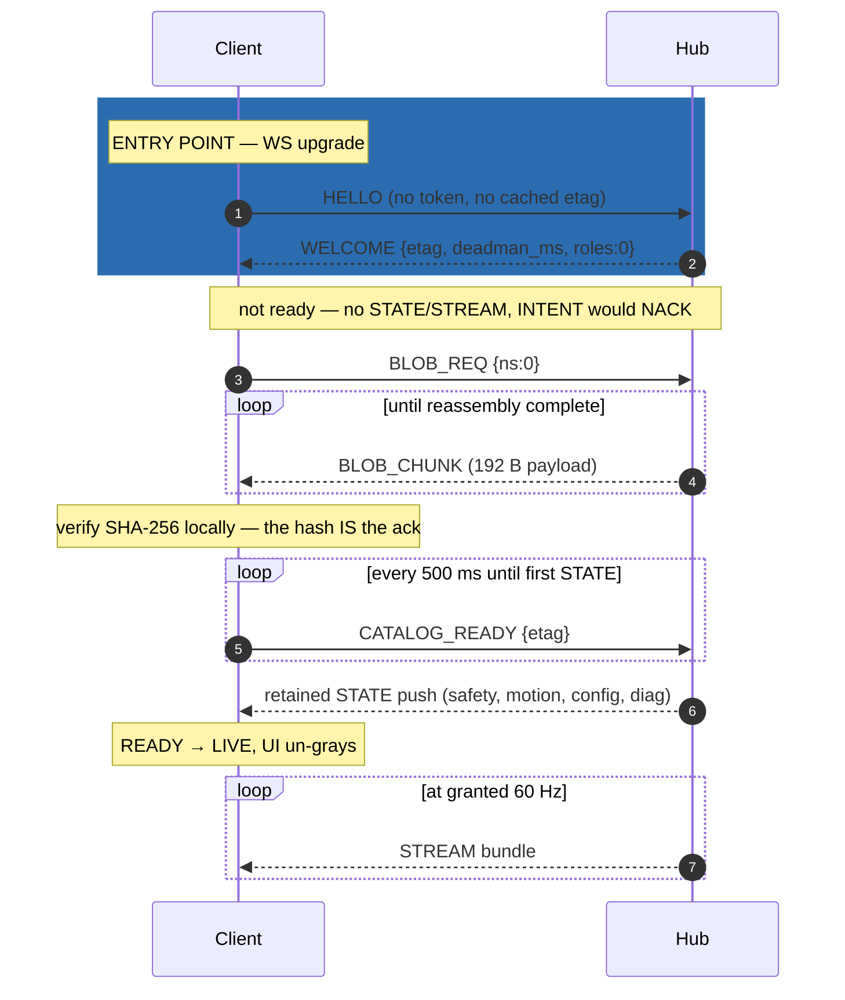
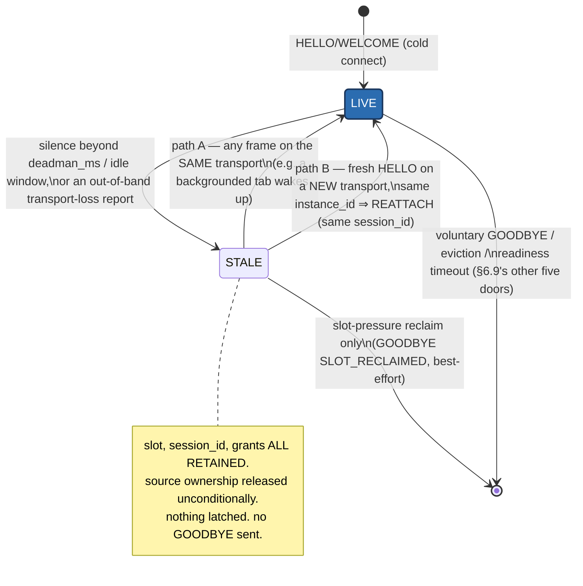
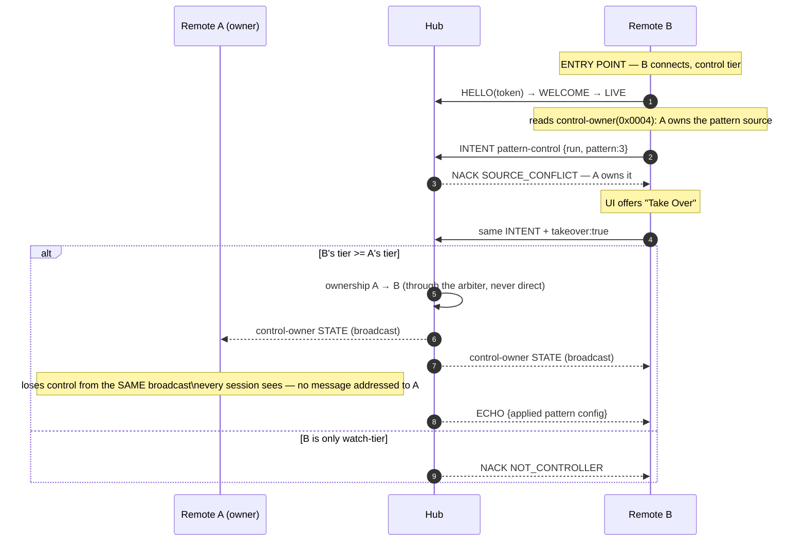
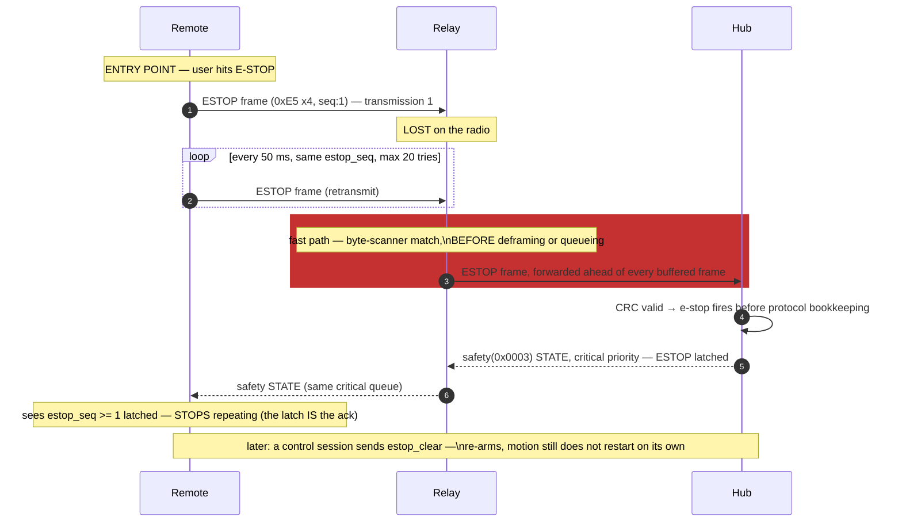

# Valence Worked Session Traces *(informative — [SPEC.md](../SPEC.md) Appendix E)*

Five end-to-end narratives. Every step cites the normative rule it exercises — **a step
that needs a rule this spec doesn't state is a spec bug** ([SPEC §17.3](../SPEC.md#173-behavioral-checklists)).
Frame notation: `TYPE(channel, seq){fields}`; CBOR shown as `{key:value}` with registry
key names.

> ### ⚠ EXAMPLE ONLY — NEVER ALLOCATE THESE IDS
>
> Device-channel ids below (`0xEE00+`) are the same fictitious ids as SPEC Appendix D,
> drawn from the **reserved** range `0x8000–0xFFFF` (SPEC §4.4) that no conforming hub
> may allocate. They cannot collide with, or be mistaken for, a real assignment — which
> is the whole point: an earlier draft's sketch ids reused real device allocations and
> misled an implementation once ([RFC-004](../RFC-QUEUE.md#rfc-004--appendix-d-sketch-collides-with-real-device-allocations)).
>
> **Spec-core ids (`0x0001–0x007F`) in these traces are real** and are used correctly:
> `0x0003` safety, `0x0004` control-owner, `0x0005` safety-intents, `0x0007`
> session-events, `0x000E` safety-events. Current device ids live in
> Valence Drive's CHANNEL-MAP.md (the machine repo, not here).

---

## E1 — Cold connect: browser client, dynamic catalog, readiness gate

Preconditions: hub LIVE with one pattern running; the client has no cached etag.

| # | Dir | Frame / action | Rule |
|---|-----|----------------|------|
| 1 | c→h | WS upgrade, subprotocol `valence.v1` | §13.2 |
| 2 | c→h | HELLO{proto_ver:1, client_kind:"webui", client_name:"desk", instance_id, subscriptions:[{0x0003,0,3},{0xEE00,60,2},{0xEE05,0,1},{0xEE03,0,1},{0xEE0C,2,1}]} — no token: `watch` | §6.2 |
| 3 | h→c | WELCOME{session_id, boot_id, catalog_etag, cfg_gen, roles:0, limits, deadman_ms:600, deadman_policy, nonce, grants, identity} | §6.3, §10.2 |
| 4 | c | etag unknown ⇒ session is **NOT ready**: the hub sends no STATE, no STREAM, and would NACK `NOT_READY` on any intent | §6.4 |
| 5 | c→h | BLOB_REQ{blob:{ns:0}} — full catalog, namespace 0 | §8.4 |
| 6 | h→c | BLOB_CHUNK ×N (192-B chunk payloads; WS may batch legally). Nothing else competes for the pipe, because the data plane is gated | §8.4, §6.4 |
| 7 | c | reassemble; verify SHA-256 over the exact deterministic bytes; cache. **The hash IS the acknowledgment** — no negotiation round trip | §8.3, §6.4 |
| 8 | c→h | CATALOG_READY(payload = the 8-byte etag it now operates against); re-sent every 500 ms until the first STATE arrives | §6.4 |
| 9 | h→c | retained STATE push: safety(0x0003), motion-status(0xEE05), machine-config(0xEE03), motion-diag(0xEE0C) — full snapshots, current seq | §9.1, §6.3 |
| 10 | c | all granted STATE received once ⇒ READY→LIVE; UI un-grays | §2.2 |
| 11 | h→c | STREAM(0xEE00) bundles begin at the granted 60 Hz (decimated hub-side from 240) | §9.2 |
| 12 | c | user drags a speed slider → **no local state change**; `watch` tier ⇒ the control renders locked, from `roles:0` at step 3 and the field's `access` in the catalog | §1.2-1, §8.9, §12.2 |

*Everything above the "not ready" note is the [HELLO → WELCOME handshake](../SPEC.md#62-hello-client--hub);
everything from `BLOB_REQ` through the SHA-256 check is [catalog transfer](../SPEC.md#84-transfer-the-catalog-is-blob-namespace-0)
— the only backpressure-relevant point in this trace, since nothing else competes for
the pipe while the session is gated not-ready.*

Notes: the pattern that was running is *visible immediately* at step 9 — the client
adopted a live session without touching it. No frame in this trace pushed a default to
the hub. Had the client's cached etag matched at step 2, steps 4–8 would have vanished
entirely and step 9 would have followed WELCOME directly (§6.4).

---

## E2 — Reconnect mid-motion: staleness, reattach, no silent control resume

*(RFC-042/RFC-045 shape — a session goes `STALE`, not away, and silence never
latches a safety edge. See [SPEC §6.6](../SPEC.md#66-liveness-deadman-and-idle-reaping).)*

Preconditions: a paired controller phone (token held) was publishing motion-input
(0xEE01) as the active streaming source; the network blips for 3 s.

| # | Dir | Frame / action | Rule |
|---|-----|----------------|------|
| 1 | — | last frame from phone at t=0; deadman window 600 ms | §6.6, §11.3 |
| 2 | hub | t=600 ms: deadman fires. Session marked **`STALE`** (library-internal, not wire-visible) — slot, `session_id`, grants all RETAINED; ownership of the source released **unconditionally**, latching **nothing** (RFC-045): the command-driven source has nothing left to execute and settles on its own | §6.6, §11.3 |
| 3 | h→* | control-owner(0x0004) STATE broadcasts the release to remaining subscribers. **No** safety edge fires — nothing was latched, so there is no edge to report | §9.1, §11.4 |
| 4 | c→h | t=3 s: transport restores → HELLO{same instance_id, token, cached catalog_etag, standing wish-lists} | §6.8 |
| 5 | h | `instance_id` matches a session the hub still holds, and it is `STALE` not gone ⇒ **REATTACH** (path B): SAME `session_id`, grants retained (not renegotiated from this HELLO's wishes), role re-derived from the presented token | §6.3, §6.6 |
| 6 | h→c | WELCOME{**same** session_id, same boot_id, same etag, roles re-derived, …} | §6.3, §12.3 |
| 7 | c | etag matches cache ⇒ **ready immediately, zero catalog bytes on the wire** | §6.4, §6.8 |
| 8 | h→c | retained STATE push — reattach re-arms each subscription's first-push treatment, so this is a full resync. Safety shows no latch: nothing was ever forced | §9.1, §6.6 |
| 9 | c | the client had a pending unacknowledged intent (set-speed 380) from before the blip. It does **not** retransmit; it compares desire (380) against the adopted config (360) — still wanted ⇒ fresh INTENT{intent_id:1 in the resumed session, value:380} | §6.8, §9.3 |
| 10 | h→c | ECHO{intent_id:1, applied:380, cfg_gen+1}; STATE broadcast to all. `cfg_gen` moved because the applied value actually changed | §9.3, §4.2-2 |
| 11 | c | user taps "resume stream" → ownership was released at step 2 (not merely paused), so this is a fresh activating intent for the streaming source ⇒ granted, ownership reassigned | §6.8, §11.4 |
| 12 | c→h | STREAM(0xEE01) resumes | §9.2 |

*Marked start: `LIVE`, the state every session reaches once. The only two loops in
this machine are `LIVE ⇄ STALE` (repeats indefinitely — there is no cap on how long a
session may sit `STALE`) and the reclaim edge, which fires only under slot pressure,
never on a timer.*

The load-bearing negatives: no session loss on silence (step 2 — `STALE`, not
teardown), no safety latch or edge on source loss (RFC-045), no intent replay (step 9),
no motion on socket restore (step 11 still required a human-initiated activating
intent), no catalog bytes (step 7). Note also what step 10 would *not* have done: had
the adopted value already been 380, the ECHO would still be sent and `cfg_gen` would
**not** move.

---

## E3 — Controller takeover: two remotes, one machine

Preconditions: remote A (paired, `control`) owns the pattern source, pattern running.
Remote B (paired, `control`) connects.

| # | Dir | Frame / action | Rule |
|---|-----|----------------|------|
| 1 | B→h | HELLO(token) → WELCOME{roles:1} → SYNCING → READY → LIVE; control-owner(0x0004) snapshot shows the pattern source owned by session A | §6.3, §6.4, §11.4 |
| 2 | B→h | INTENT on pattern-control(0xEE08): {value:{run, pattern:3}} | §9.3 |
| 3 | h→B | NACK{code:SOURCE_CONFLICT(0x0403), channel_id:0xEE08, intent_id, intent_seq} — A owns it | §11.4, §16.1 |
| 4 | B | UI renders "controlled by A" (it knows the owner from 0x0004) and offers Take Over | §11.4 |
| 5 | B→h | same INTENT + takeover:true(32); B's tier (1) ≥ A's tier (1) ⇒ transfer | §11.4 |
| 6 | h | ownership: A→B; the pattern is reconfigured through the arbiter, never directly | §11.4, §3.1 |
| 7 | h→* | control-owner STATE + takeover EVENT on session-events(0x0007) broadcast | §11.4, §9.4 |
| 8 | A | A's UI (subscribed to 0x0004 like everyone) immediately shows control lost — not via any message addressed to A, just the same broadcast truth | §1.2-1, §11.4 |
| 9 | h→B | ECHO{applied pattern config} | §9.3 |

Had B been `watch` at step 5: NACK `NOT_CONTROLLER`(0x0102). Takeover cannot outrank a
tier (§11.4, §12.2). But B could still have sent `stop` or `estop` on 0x0005 at any
point, from `watch`, because those two ops are role-exempt (§11.2).

---

## E4 — ESTOP over a lossy relay: repeat-until-latch, fast path

Preconditions: a remote behind a relay (datagram radio, 30 % loss today); machine moving.

| # | Dir | Frame / action | Rule |
|---|-----|----------------|------|
| 1 | remote | user hits E-STOP → sends the ESTOP frame `E5E5E5E5, cause:0(user), origin:1, seq:1, crc` — no tier check, no session requirement | §5.5, §11.2 |
| 2 | remote | starts the repeat timer: retransmit every 50 ms until the latch is observed (max 20). Every repeat carries the **same** `estop_seq` | §11.2, §5.5 |
| 3 | radio | transmission 1 lost. t=50 ms: transmission 2 reaches the relay | §11.2 (this is *why* repeat exists) |
| 4 | relay | the raw byte scanner matches 4×0xE5 **before any deframing or queueing**; forwards on ALL attached segments ahead of every buffered frame; CRC check deferred | §14.2, §5.5 |
| 5 | hub | validates CRC → the driver's e-stop path fires **before protocol bookkeeping**; motion stops; ESTOP latched, `estop_seq := 1` | §11.2, §11.4 |
| 6 | h→* | safety(0x0003) STATE at critical priority: ESTOP bit + cause + seq; `estop_latched` edge on safety-events(0x000E); both traverse the relay's critical queue | §11.2, §10.1, §14.1 |
| 7 | remote | t≈120 ms: observes safety STATE with ESTOP latched and `estop_seq ≥ 1` ⇒ **stops repeating**; UI shows the latched state | §11.2 (the latch is the ACK) |
| 8 | any | later: a `control` session sends `estop_clear` on 0x0005 → the hub verifies cause resolved, zero velocity, nothing pending ⇒ clears the latch and emits `estop_cleared`. **Motion still does not start** — clearing only re-arms | §11.2 |
| 9 | — | had all 20 repeats died (relay dead): the remote surfaces a loud local failure at t≈1 s. The machine-side guarantee is then the deadman on whatever source was streaming, and the **hardware** e-stop path — which Valence never claimed to replace | §11.2 H1/H2, §11.5 |

*The loop is the whole safety argument made visible: it runs until the STATE echo
proves the latch happened, not for a fixed count success case (the max-20 abort is the
failure branch, step 9).*

A client with no byte-scanner path (a browser) reaches the same latch by sending the
`estop` op on 0x0005 instead: the hub treats it as a valid 0xE5 frame, and the red
button does not silently degrade to a decel-stop (§11.2).

---

## E5 — Constrained client joins: static profile, degraded mode

Preconditions: a constrained remote with a compiled-in catalog at etag E1, canned CBOR
templates, and no CBOR parser beyond template patching and prefix struct reads. The hub
was updated last week: its catalog is now etag E2 (one field *appended* to
motion-status, one new channel).

| # | Dir | Frame / action | Rule |
|---|-----|----------------|------|
| 1 | c→h | HELLO from a template: patches instance_id / token / etag(E1) value bytes into pre-encoded bytes — legal because deterministic encoding admits exactly one form. No `trust` map at all: bearer token, zero crypto | §5.3, §8.5, §12.4 |
| 2 | h→c | WELCOME{catalog_etag:E2, …} — the hub treats static clients identically | §8.5, §6.3 |
| 3 | c | etag mismatch E1≠E2 ⇒ declared behavior: **degraded mode** (this device chose (a)) | §8.5 |
| 4 | c→h | CATALOG_READY carrying its **stale** etag E1. The hub sets ready, MAY record the session as degraded, and serves it | §6.4 |
| 5 | c→h | canned SUBSCRIBE to position(0xEE00), safety(0x0003), power(0xEE0D) | §6.7 |
| 6 | h→c | retained STATE: the motion-status payload is now one byte longer than the compiled struct → the client parses its known prefix and ignores the tail — nothing breaks | §5.4 append-only, §4.3 |
| 7 | c | degraded-mode obligation: control functions whose schema it cannot re-verify are suppressed — its speed knob grays out; display functions continue; an "update me" glyph appears | §8.5 |
| 8 | c | position STREAM renders at the granted 30 Hz; the safety bit drives the red indicator | §9.2, §9.1 |
| 9 | — | silent full operation on a mismatched etag would have been **non-conformant**; both legal behaviors ((a) shown here, (b) refuse loudly) were available | §8.5 |

The quiet miracle in step 6 is the whole point of §5.4: a firmware update shipped, the
remote predates it, and the failure mode is a grayed knob — not a bricked remote, not a
parse crash, not silent wrongness. And note step 1's omission: everything in §12.4 and
§12.5 is optional, so this device's mandatory floor is unchanged from the draft.

> DEMO-CANDIDATE: a two-pane live view — a real device catalog on the left, a
> pinned older etag on the right — highlighting which fields the stale side
> grays out under §8.5's degraded-mode rule.

---

## See also

- [SPEC.md](../SPEC.md) — the normative rules every step above cites.
- Valence Drive's CHANNEL-MAP.md — current (post-Phase-C4) device channel ids,
  for anyone tempted to reuse a number from this file's fictitious `0xEE00+`
  range (lives in the machine repo, not here).
- [RENDERING.md](../RENDERING.md) — how a generic client turns the STATE these traces
  push into an actual on-screen control.
